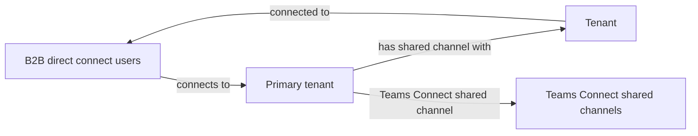
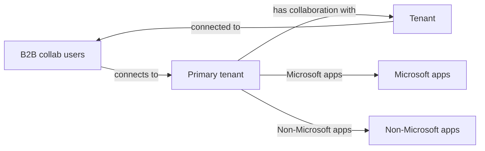

## Here's the primary constraint with using B2B direct connect across multiple tenants:

- Currently, B2B direct connect works only with Teams Connect shared channels.

### Diagram 1: B2B Direct Connect Users Workflow

For more information, see B2B direct connect overview.

## B2B collaboration

To enable users across tenants to collaborate, you can use Microsoft Entra B2B collaboration. B2B collaboration is a feature within External Identities that lets you invite guest users to collaborate with your organization. Once the external user has redeemed their invitation or completed sign-up, they're represented in your tenant as a user object. With B2B collaboration, you can securely share your company's applications and services with external users, while maintaining control over your own corporate data.

### Here are the primary constraints with using B2B collaboration across multiple tenants:

- Administrators must invite users using the B2B invitation process or build an onboarding experience using the B2B collaboration invitation manager.
- Administrators might have to synchronize users using custom scripts.
- Depending on automatic redemption settings, users might need to accept a consent prompt and follow a redemption process in each tenant.
- By default, users are of type external guest, which has different permissions than external member and might not be the desired user experience.

### Diagram 2: B2B Collaboration Users Workflow

