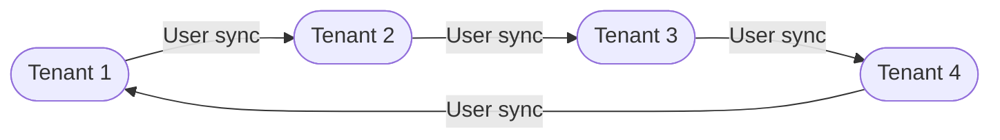

## Cross-tenant synchronization is one way.

An internal member user can be synchronized into multiple tenants as an external user. When the topology shows a synchronization going in both directions, it's a distinct set of users in each direction and each arrow is a separate configuration.

## Collaborate across business units (full-mesh)

In this scenario, the organization has designated different tenants for each business unit. The business units work closely together, in particular using Microsoft Teams. As a result, each tenant has chosen to provision all users across the four tenants in the organization. As new users join the company or leave, the provisioning service takes care of creating and deleting users. The organization has also configured a multitenant organization that includes all four tenants. Now when users need to collaborate in Teams, they're able to easily find users across the company and start chats and meetings with those users.

(Note: The actual names of the tenants were replaced with "Tenant 1", "Tenant 2", etc., to maintain the structure without using specific logos or company names. The arrows in the Mermaid diagram represent user synchronization between different tenants.)