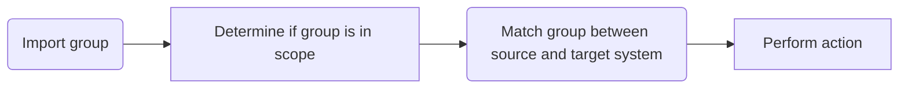

## Troubleshooting Tips

- The provisioning service might not be able to match a user in the source system uniquely with a user in the target. Resolve this problem by ensuring that the matching attribute is unique.
- Make sure that the target system supports filtering on the attribute that's defined as the matching attribute.

## Step 5: Perform action

Finally, the provisioning service takes an action, such as creating, updating, deleting, or skipping the user.

Here's an example of what you might see after the successful on-demand provisioning of a user:

### View details

The View details section displays the attributes that were modified in the target system. This display represents the final output of the provisioning service activity and the attributes that were exported. If this step fails, the attributes displayed represent the attributes that the provisioning service attempted to modify.

### Troubleshooting tips

- Failures for exporting changes can vary greatly. Check the documentation for provisioning logs for common failures.
- On-demand provisioning says the group or user can't be provisioned because they're not assigned to the application. There's a replication delay of up to a few.