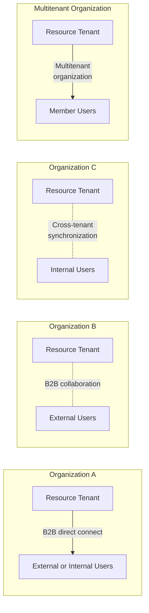

## B2B direct connect (Org-to-org external or internal)

## B2B collaboration (Org-to-org external or internal)

## Cross-tenant synchronization (Org internal)

## Multitenant organization (Org internal)

| Trust level                | B2B direct connect                                                                                                 | B2B collaboration                                                                                           | Cross-tenant synchronization                                                                                                              | Multitenant organization                                                                                     |
|----------------------------|--------------------------------------------------------------------------------------------------------------------|-------------------------------------------------------------------------------------------------------------|------------------------------------------------------------------------------------------------------------------------------------------|-------------------------------------------------------------------------------------------------------------|
| **Trust level**            | Mid trust. B2B direct connect users are less easy to track, mandating a certain level of trust with the external organization.                  | Low to mid trust. User objects can be tracked easily and managed with granular controls.                    | High trust. All tenants are part of the same organization, and users are typically granted member access to all apps/resources.          | High trust. All tenants are part of the same organization, and users are typically granted member access to all apps/resources.         |
| **Effect on users**        | Users access the resource tenant using the credentials for their home tenant. User objects aren't created in the resource tenant.              | External users are added to a tenant as B2B collaboration users.                                            | Within the same organization, users are synchronized from their home tenant to the resource tenant as B2B collaboration users.          | Within the same multitenant organization, B2B collaboration users, particularly member users, benefit from enhanced, seamless collaboration across Microsoft 365. |
| **User type**              | B2B direct connect user - N/A                                                                                                                 | B2B collaboration user - External member - External guest (default)                                         | B2B collaboration user - External member (default) - External guest                                                                        | B2B collaboration user - External member (default) - External guest                                             |

### The following diagram shows how B2B direct connect, B2B collaboration, and cross-tenant synchronization capabilities could be used together.

(Note: The mermaid diagram is an interpretation and may slightly differ visually from the original diagram.)