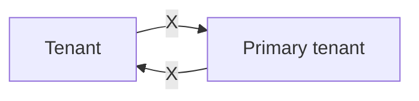
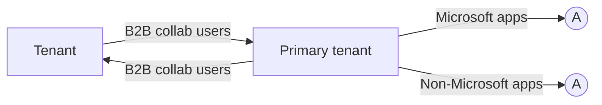
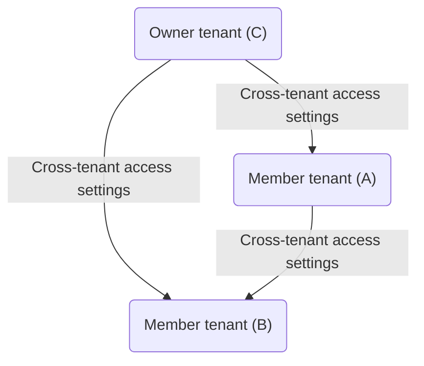
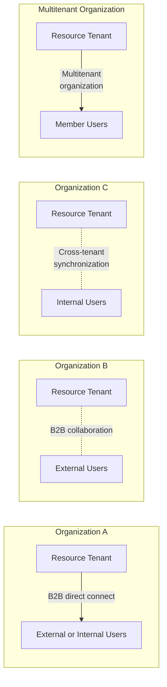
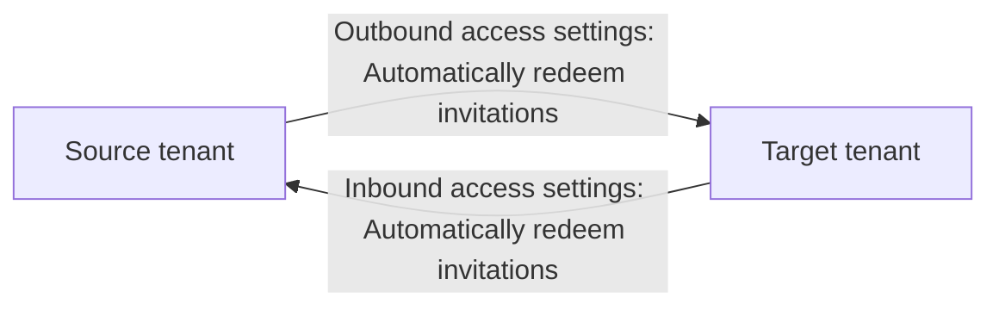

## Multitenant organizations documentation

A multitenant organization is an organization that has more than one instance of Microsoft Entra ID. Describes ways that users can have a seamless experience accessing resources and collaborating across multiple tenants.

### About multitenant organizations

#### OVERVIEW

- Multitenant organization capabilities
- Compare multitenant capabilities

### Configure a multitenant organization

#### OVERVIEW

- What is a multitenant organization?

#### HOW-TO GUIDE

- Microsoft 365 admin center
- PowerShell or Microsoft Graph API

### Configure cross-tenant synchronization

#### OVERVIEW

- What is cross-tenant synchronization?

#### HOW-TO GUIDE

- Microsoft Entra admin center
- PowerShell or Microsoft Graph API

## Collaborate in Microsoft 365

### CONCEPT

- Identity provisioning for Microsoft 365
- Microsoft 365 multitenant people search
- Plan for multitenant organizations in Microsoft 365

## Multitenant organization capabilities in Microsoft Entra ID

Article · 04/23/2024

This article provides an overview of the multitenant organization scenario and the related capabilities in Microsoft Entra ID.

### What is a tenant?

A tenant is an instance of Microsoft Entra ID in which information about a single organization resides including organizational objects such as users, groups, and devices and also application registrations, such as Microsoft 365 and third-party applications. A tenant also contains access and compliance policies for resources, such as applications registered in the directory. The primary functions served by a tenant include identity authentication as well as resource access management.

From a Microsoft Entra perspective, a tenant forms an identity and access management scope. For example, a tenant administrator makes an application available to some or all the users in the tenant and enforces access policies on that application for users in that tenant. In addition, a tenant contains organizational branding data that drives end-user experiences, such as the organizations email domains and SharePoint URLs used by employees in that organization. From a Microsoft 365 perspective, a tenant forms the default collaboration and licensing boundary. For example, users in Microsoft Teams or Microsoft Outlook can easily find and collaborate with other users in their tenant, but don't have the ability to find or see users in other tenants.

Tenants contain privileged organizational data and are securely isolated from other tenants. In addition, tenants can be configured to have data persisted and processed in a specific region or cloud, which enables organizations to use tenants as a mechanism to meet data residency and handling compliance requirements.

### What is a multitenant organization?

A multitenant organization is an organization that has more than one instance of Microsoft Entra ID. Here are the primary reasons why an organization might have multiple tenants:

- Conglomerates: Organizations with multiple subsidiaries or business units that operate independently.

## Mergers and acquisitions
- Organizations that merge or acquire companies.

## Divestiture activity
- In a divestiture, one organization splits off part of its business to form a new organization or sell it to an existing organization.

## Multiple clouds
- Organizations that have compliance or regulatory needs to exist in multiple cloud environments.

## Multiple geographical boundaries
- Organizations that operate in multiple geographic locations with various residency regulations.

## Test or staging tenants
- Organizations that need multiple tenants for testing or staging purposes before deploying more broadly to primary tenants.

## Department or employee-created tenants
- Organizations where departments or employees have created tenants for development, testing, or separate control.

## Multitenant challenges

Your organization may have recently acquired a new company, merged with another company, or restructured based on newly formed business units. If you have disparate identity management systems, it might be challenging for users in different tenants to access resources and collaborate.

The following diagram shows how users in other tenants might not be able to access applications across tenants in your organization.



As your organization evolves, your IT team must adapt to meet the changing needs. This often includes integrating with an existing tenant or forming a new one. Regardless of how the identity infrastructure is managed, it's critical that users have a seamless experience accessing resources and collaborating. Today, you may be using custom scripts or on-premises solutions to bring the tenants together to provide a seamless experience across tenants.

## B2B direct connect

To enable users across tenants to collaborate in Teams Connect shared channels, you can use Microsoft Entra B2B direct connect. B2B direct connect is a feature of External Identities that lets you set up a mutual trust relationship with another Microsoft Entra organization for seamless collaboration in Teams. When the trust is established, the B2B direct connect user has single sign-on access using credentials from their home tenant.

## B2B direct connect constraints

Here's the primary constraint with using B2B direct connect across multiple tenants:

- Currently, B2B direct connect works only with Teams Connect shared channels.


For more information, see [B2B direct connect overview](link url).

## B2B collaboration

To enable users across tenants to collaborate, you can use [Microsoft Entra B2B collaboration](link url). B2B collaboration is a feature within External Identities that lets you invite guest users to collaborate with your organization. Once the external user has redeemed their invitation or completed sign-up, they're represented in your tenant as a user object. With B2B collaboration, you can securely share your company's applications and services with external users, while maintaining control over your own corporate data.

Here are the primary constraints with using B2B collaboration across multiple tenants:

- Administrators must invite users using the B2B invitation process or build an onboarding experience using the [B2B collaboration invitation manager](link url).
- Administrators might have to synchronize users using custom scripts.
- Depending on automatic redemption settings, users might need to accept a consent prompt and follow a redemption process in each tenant.
- By default, users are of type external guest, which has different permissions than external member and might not be the desired user experience.


### App sharing with B2B collaboration



## Cross-tenant synchronization

If you want users to have a more seamless collaboration experience across tenants, you can use cross-tenant synchronization. Cross-tenant synchronization is a one-way synchronization service in Microsoft Entra ID that automates creating, updating, and deleting B2B collaboration users across tenants in an organization. Cross-tenant synchronization builds on the B2B collaboration functionality and utilizes existing B2B cross-tenant access settings. Users are represented in the target tenant as a B2B collaboration user object.

### Here are the primary benefits with using cross-tenant synchronization:

- Automatically create B2B collaboration users within your organization and provide them access to the applications they need, without creating and maintaining custom scripts.
- Improve the user experience and ensure that users can access resources, without receiving an invitation email and having to accept a consent prompt in each tenant.
- Automatically update users and remove them when they leave the organization.

### Here are the primary constraints with using cross-tenant synchronization across multiple tenants:

- Doesn't enhance the current Teams or Microsoft 365 experiences. Synchronized users will have the same cross-tenant Teams and Microsoft 365 experiences available to any other B2B collaboration user.
- Doesn't synchronize groups, devices, or contacts.

```mermaid
flowchart LR
    A[Source tenant] -->|Cross-tenant sync| B[Target tenant]
    B --> C{Cross-tenant sync}
    C -->|B2B collab users\n(External members)| A
    B -->|Microsoft apps| D[Microsoft apps]
    B -->|Non-Microsoft apps| E[Non-Microsoft apps]
```

For more information, see [What is cross-tenant synchronization?](#).

## Multitenant organization

Multitenant organization is a feature in Microsoft Entra ID and Microsoft 365 that enables you to form a tenant group within your organization. Each pair of tenants in the group is governed by cross-tenant access settings that you can use to configure B2B or cross-tenant synchronization.

Here are the primary benefits of a multitenant organization:

- Differentiate in-organization and out-of-organization external users
- Improved collaborative experience in new Microsoft Teams
- Improved people search experience across tenants


For more information, see What is a multitenant organization in Microsoft Entra ID?.

## Compare multitenant capabilities

Depending on the needs of your organization, you can use any combination of B2B direct connect, B2B collaboration, cross-tenant synchronization, and multitenant organization capabilities. B2B direct connect and B2B collaboration are independent capabilities, while cross-tenant synchronization and multitenant organization capabilities are independent of each other, though both rely on underlying B2B collaboration.

The following table compares the capabilities of each feature. For more information about different external identity scenarios, see Comparing External Identities feature sets.

## B2B direct connect (Org-to-org external or internal)

### Purpose

- Users can access Teams Connect shared channels hosted in external tenants.

### Value

- Enables external collaboration within Teams Connect shared channels only.
- More convenient for administrators because they don't have to manage B2B users.

### Primary administrator workflow

- Configure cross-tenant access to provide external users inbound access to tenant the credentials for their home tenant.

## B2B collaboration (Org-to-org external or internal)

### Purpose

- Users can access apps/resources hosted in external tenants, usually with limited guest privileges.
- Depending on automatic redemption settings, users might need to accept a consent prompt in each tenant.

### Value

- Enables external collaboration.
- More control and monitoring for administrators by managing the B2B collaboration users.
- Administrators can limit the access that these external users have to their apps/resources.

### Primary administrator workflow

- Add external users to resource tenant by using the B2B invitation process or build your own onboarding experience using the B2B collaboration.

## Cross-tenant synchronization (Org internal)

### Purpose

- Users can seamlessly access apps/resources across the same organization, even if they're hosted in different tenants.

### Value

- Enables collaboration across organizational tenants.
- Administrators don't have to manually invite and synchronize users between tenants to ensure continuous access to apps/resources within the organization.

### Primary administrator workflow

- Configure the cross-tenant synchronization engine to synchronize users between multiple tenants as B2B collaboration users.

## Multitenant organization (Org internal)

### Purpose

- Users can more seamlessly collaborate across a multitenant organization in new Teams and people search.

### Value

- Enables collaboration across organizational tenants.
- Administrators continue to have full configuration ability via cross-tenant access settings.
- Optional cross-tenant access templates allow pre-configuration of cross-tenant access settings.

### Primary administrator workflow

- Create a multitenant organization, add (invite) tenants, join a multitenant organization.
- Leverage existing B2B collaboration users or use cross-tenant synchronization to.

## B2B direct connect (Org-to-org external or internal)

## B2B collaboration (Org-to-org external or internal)

## Cross-tenant synchronization (Org internal)

## Multitenant organization (Org internal)

| Trust level                | B2B direct connect                                                                                                 | B2B collaboration                                                                                           | Cross-tenant synchronization                                                                                                              | Multitenant organization                                                                                     |
|----------------------------|--------------------------------------------------------------------------------------------------------------------|-------------------------------------------------------------------------------------------------------------|------------------------------------------------------------------------------------------------------------------------------------------|-------------------------------------------------------------------------------------------------------------|
| **Trust level**            | Mid trust. B2B direct connect users are less easy to track, mandating a certain level of trust with the external organization.                  | Low to mid trust. User objects can be tracked easily and managed with granular controls.                    | High trust. All tenants are part of the same organization, and users are typically granted member access to all apps/resources.          | High trust. All tenants are part of the same organization, and users are typically granted member access to all apps/resources.         |
| **Effect on users**        | Users access the resource tenant using the credentials for their home tenant. User objects aren't created in the resource tenant.              | External users are added to a tenant as B2B collaboration users.                                            | Within the same organization, users are synchronized from their home tenant to the resource tenant as B2B collaboration users.          | Within the same multitenant organization, B2B collaboration users, particularly member users, benefit from enhanced, seamless collaboration across Microsoft 365. |
| **User type**              | B2B direct connect user - N/A                                                                                                                 | B2B collaboration user - External member - External guest (default)                                         | B2B collaboration user - External member (default) - External guest                                                                        | B2B collaboration user - External member (default) - External guest                                             |

### The following diagram shows how B2B direct connect, B2B collaboration, and cross-tenant synchronization capabilities could be used together.



(Note: The mermaid diagram is an interpretation and may slightly differ visually from the original diagram.)

## Org-to-org external
### Org internal

- **B2B collaboration**
  - Adatum Corporation (External collaborator)
  - B2B collab users (External members)
- **B2B collaboration**
  - B2B collab users (External guests)

- **Cross-tenant sync (Primary tenant)**
  - Contoso
  - Fabrikam (Acquired)

- **B2B direct connect**
  - B2B direct connect users
  - Trey Research (External collaborator)

## Terminology

To better understand multitenant organization scenario related Microsoft Entra capabilities, you can refer back to the following list of terms.

### Expand table

| Term           | Definition                                                                                     |
|----------------|------------------------------------------------------------------------------------------------|
| tenant         | An instance of Microsoft Entra ID.                                                             |
| organization   | The top level of a business hierarchy.                                                         |
| multitenant organization | An organization that has more than one instance of Microsoft Entra ID, as well as a capability to group those instances in Microsoft Entra ID. |
| creator tenant | The tenant that created the multitenant organization.                                          |
| owner tenant   | A tenant with the owner role. Initially, the creator tenant.                                   |
| added tenant   | A tenant that was added by an owner tenant.                                                    |
| joiner tenant  | A tenant that is joining the multitenant organization.                                         |
| join request   | A joiner or added tenant submits a join request to join the multitenant organization.          |
| pending tenant | A tenant that was added by an owner but that hasn't yet joined.                                |
| active tenant  | A tenant that created or joined the multitenant organization.                                  |

## Terms and Definitions

| Term                         | Definition                                                                                                 |
|------------------------------|------------------------------------------------------------------------------------------------------------|
| member tenant                | A tenant with the member role. Most joiner tenants start as members.                                       |
| multitenant organization tenant | An active tenant of the multitenant organization, not pending.                                             |
| cross-tenant synchronization | A one-way synchronization service in Microsoft Entra ID that automates creating, updating, and deleting B2B collaboration users across tenants in an organization. |
| cross-tenant access settings | Settings to manage collaboration for specific Microsoft Entra organizations.                                |
| cross-tenant access settings template | An optional template to preconfigure cross-tenant access settings that are applied to any partner tenant newly joining the multitenant organization. |
| organizational settings      | Cross-tenant access settings for specific Microsoft Entra organizations.                                    |
| configuration                | An application and underlying service principal in Microsoft Entra ID that includes the settings (such as target tenant, user scope, and attribute mappings) needed for cross-tenant synchronization. |
| provisioning                 | The process of automatically creating or synchronizing objects across a boundary.                           |
| automatic redemption         | A B2B setting to automatically redeem invitations so newly created users don't receive an invitation email or have to accept a consent prompt when added to a target tenant. |

## Next steps

- What is a multitenant organization in Microsoft Entra ID?
- What is cross-tenant synchronization?

## What is a multitenant organization in Microsoft Entra ID?

Article · 04/24/2024

Multitenant organization is a feature in Microsoft Entra ID and Microsoft 365 that enables you to form a tenant group within your organization. Each pair of tenants in the group is governed by cross-tenant access settings that you can use to configure B2B or cross-tenant synchronization.

## Why use multitenant organization?

Here are the primary goals of multitenant organization:

- Define a group of tenants belonging to your organization
- Collaborate across your tenants in new Microsoft Teams
- Enable search and discovery of user profiles across your tenants through Microsoft 365 people search

## Who should use it?

Organizations that own multiple Microsoft Entra tenants and want to streamline intra-organization cross-tenant collaboration in Microsoft 365.

The multitenant organization capability is built on the assumption of reciprocal provisioning of B2B member users across multitenant organization tenants.

As such, the multitenant organization capability assumes the simultaneous use of Microsoft Entra cross-tenant synchronization or an alternative bulk provisioning engine for external identities.

## Benefits

Here are the primary benefits of a multitenant organization:

- Differentiate in-organization and out-of-organization external users

In Microsoft Entra ID, external users originating from within a multitenant organization can be differentiated from external users originating from outside the multitenant organization. This differentiation facilitates the application of different policies for in-organization and out-of-organization external users.

## Improved collaborative experience in Microsoft Teams

In new Microsoft Teams, multitenant organization users can expect an improved collaborative experience across tenants with chat, calling, and meeting start notifications from all connected tenants across the multitenant organization. Tenant switching is more seamless and faster.

## Improved people search experience across tenants

Across Microsoft 365 services, the multitenant organization people search experience is a collaboration feature that enables search and discovery of people across multiple tenants. Once enabled, users are able to search and discover synced user profiles in a tenant's global address list and view their corresponding people cards.

## How does a multitenant organization work?

The multitenant organization capability enables you to form a tenant group within your organization. The following list describes the basic lifecycle of a multitenant organization.

- Define a multitenant organization

  One tenant administrator defines a multitenant organization as a grouping of tenants. The grouping of tenants isn't reciprocal until each listed tenant takes action to join the multitenant organization. The objective is a reciprocal agreement between all listed tenants.

- Join a multitenant organization

  Tenant administrators of listed tenants take action to join the multitenant organization. After joining, the multitenant organization relationship is reciprocal between each and every tenant that joined the multitenant organization.

- Leave a multitenant organization

  Tenant administrators of listed tenants can leave a multitenant organization at any time. While a tenant administrator who defined the multitenant organization can add and remove listed tenants they don't control the other tenants.

## A multitenant organization is established as a collaboration of equals

Each tenant administrator stays in control of their tenant and their membership in the multitenant organization.

## Cross-tenant access settings

Administrators staying in control of their resources is a guiding principle for multitenant organization collaboration. Cross-tenant access settings are required for each tenant-to-tenant relationship. Tenant administrators explicitly configure, as needed, the following policies:

- Cross-tenant access partner configurations
  For more information, see Configure cross-tenant access settings for B2B collaboration and crossTenantAccessPolicyConfigurationPartner resource type.
- Cross-tenant access identity synchronization
  For more information, see Configure cross-tenant synchronization and crossTenantIdentitySyncPolicyPartner resource type.

## Multitenant organization example

The following diagram shows three tenants A, B, and C that form a multitenant organization.

```mermaid
graph TD;
  C[Owner tenant (C)] -->|Cross-tenant access settings| A[Member tenant (A)];
  C -->|Cross-tenant access settings| B[Member tenant (B)];
  A -->|Cross-tenant access settings| B;
```

[//]: # (Diagram description: The diagram depicts an organization structure consisting of three entities. There's an 'Owner tenant (C)' represented by a blue diamond shape at the top, which has bidirectional arrows labeled 'Cross-tenant access settings' connecting to two entities at the bottom. These entities at the bottom are 'Member tenant (A)' represented by a purple diamond shape on the left and 'Member tenant (B)' represented by a green diamond shape on the right. There's also a bidirectional arrow labeled 'Cross-tenant access settings' connecting Member tenant (A) and Member tenant (B), indicating a network of shared settings and collaboration.)


## Tenant Description

| Tenant | Description |
| ------ | ----------- |
| A      | Administrators see a multitenant organization consisting of A, B, C. They also see cross-tenant access settings for B and C. |
| B      | Administrators see a multitenant organization consisting of A, B, C. They also see cross-tenant access settings for A and C. |
| C      | Administrators see a multitenant organization consisting of A, B, C. They also see cross-tenant access settings for A and B. |

## Templates for cross-tenant access settings

To ease the setup of homogenous cross-tenant access settings applied to partner tenants in the multitenant organization, the administrator of each multitenant organization tenant can configure optional cross-tenant access settings templates dedicated to the multitenant organization. These templates can be used to preconfigure cross-tenant access settings that are applied to any partner tenant newly joining the multitenant organization.

## Tenant role and state

To facilitate the management of a multitenant organization, any given multitenant organization tenant has an associated role and state.

| Tenant role | Description |
| ----------- | ----------- |
| Owner       | One tenant creates the multitenant organization. The multitenant organization creating tenant receives the role of owner. The privilege of the owner tenant is to add tenants into a pending state as well as to remove tenants from the multitenant organization. Also, an owner tenant can change the role of other multitenant organization tenants. |
| Member      | Following the addition of pending tenants to the multitenant organization, pending tenants need to join the multitenant organization to turn their state from pending to active. Joined tenants typically start in the member role. Any member tenant has the privilege to leave the multitenant organization. |

## Tenant state

### Description

#### Pending
A pending tenant has yet to join a multitenant organization. While listed in an administrator's view of the multitenant organization, a pending tenant isn't yet part of the multitenant organization, and as such is hidden from an end user's view of a multitenant organization.

#### Active
Following the addition of pending tenants to the multitenant organization, pending tenants need to join the multitenant organization to turn their state from pending to active. Joined tenants typically start in the member role. Any member tenant has the privilege to leave the multitenant organization.

## Constraints

The multitenant organization capability has been designed with the following constraints:

- Any given tenant can only create or join a single multitenant organization.
- Any multitenant organization must have at least one active owner tenant.
- Each active tenant must have cross-tenant access settings for all active tenants.
- Any active tenant may leave a multitenant organization by removing themselves from it.
- A multitenant organization is deleted when the only remaining active (owner) tenant leaves.

## Limits

| Resource | Limit | Notes |
|----------|-------|-------|
| Maximum number of active tenants, including the owner tenant | 100 | The owner tenant can add more than 100 pending tenants, but they won't be able to join the multitenant organization if the limit is exceeded. This limit is applied at the time a pending tenant joins a multitenant organization. This limit is specific to the number of tenants in a multitenant organization. It does not apply to cross-tenant synchronization by itself. To increase this limit, submit a support request in the Microsoft Entra or Microsoft 365 admin center. In the Microsoft Graph APIs, the default limit of 100 tenants is only enforced at the time of joining. In Microsoft 365 admin center, the default limit is enforced at multitenant organization creation time and at time of joining. |

## External user segmentation

By defining a multitenant organization, as well as pivoting on the Microsoft Entra user property of userType, external identities are segmented as follows:

- External members originating from within a multitenant organization
- External guests originating from within a multitenant organization
- External members originating from outside of your organization
- External guests originating from outside of your organization

This segmentation of external users, due to the definition of a multitenant organization, enables administrators to better differentiate in-organization from out-of-organization external users.

External members originating from within a multitenant organization are called multitenant organization members.

Multitenant collaboration capabilities in Microsoft 365 aim to provide a seamless collaboration experience across tenant boundaries when collaborating with multitenant organization member users.

## Choosing between Microsoft 365 admin center and cross-tenant synchronization

- If you haven't previously used Microsoft Entra cross-tenant synchronization, and you intend to establish a [collaborating user set topology](https://link/to/collaborating_user_set_topology) where the same set of users is shared to all multitenant organization tenants, you might want to use the Microsoft 365 admin center share users functionality.
- If you're already using Microsoft Entra cross-tenant synchronization, for various multi-hub multi-spoke topologies, you don't need to use the Microsoft 365 admin center share users functionality. Instead, you might want to continue using your existing Microsoft Entra cross-tenant synchronization jobs.

## Get started

Here are the basic steps to get started using multitenant organization.

### Step 1: Plan your deployment

For more information, see [Plan for multitenant organizations in Microsoft 365](https://link/to/plan_for_multitenant_organizations_in_microsoft_365).

## Step 2: Create your multitenant organization

Create your multitenant organization using Microsoft 365 admin center, Microsoft Graph PowerShell, or Microsoft Graph API:
- First tenant, soon-to-be owner tenant, creates a multitenant organization.
- Owner tenant adds one or more joiner tenants.

## Step 3: Join a multitenant organization

Join a multitenant organization using Microsoft 365 admin center or Microsoft Graph PowerShell, or Microsoft Graph API:
- Joiner tenants submit a join request to join the multitenant organization of owner tenant.
- To allow for asynchronous processing, wait up to 2 hours.

Your multitenant organization is formed.

## Step 4: Synchronize users

Depending on your use case, you may want to synchronize users using one of the following methods:
- Synchronize users in multitenant organizations in Microsoft 365
- Configure cross-tenant synchronization
- Configure cross-tenant synchronization using PowerShell or Microsoft Graph API
- Your alternative bulk provisioning engine

## License requirements

The multitenant organization capability requires Microsoft Entra ID P1 licenses. Only one Microsoft Entra ID P1 license is required per employee per multitenant organization.
Also, you must have at least one Microsoft Entra ID P1 license per tenant. To find the right license for your requirements, see Compare generally available features of Microsoft Entra ID []().

## Next steps

- Plan for multitenant organizations in Microsoft 365
- What is cross-tenant synchronization?

## What is cross-tenant synchronization?

Cross-tenant synchronization automates creating, updating, and deleting Microsoft Entra B2B collaboration users across tenants in an organization. It enables users to access applications and collaborate across tenants, while still allowing the organization to evolve.

Here are the primary goals of cross-tenant synchronization:

- Seamless collaboration for a multitenant organization
- Automate lifecycle management of B2B collaboration users in a multitenant organization
- Automatically remove B2B accounts when a user leaves the organization

## Why use cross-tenant synchronization?

Cross-tenant synchronization automates creating, updating, and deleting B2B collaboration users. Users created with cross-tenant synchronization are able to access both Microsoft applications (such as Teams and SharePoint) and non-Microsoft applications (such as ServiceNow, Adobe, and many more), regardless of which tenant the apps are integrated with. These users continue to benefit from the security capabilities in Microsoft Entra ID, such as Microsoft Entra Conditional Access and cross-tenant access settings, and can be governed through features such as Microsoft Entra entitlement management.

## Who should use?

- Organizations that own multiple Microsoft Entra tenants and want to streamline intra-organization cross-tenant application access.
- Cross-tenant synchronization is not currently suitable for use across organizational boundaries.

## Benefits

With cross-tenant synchronization, you can do the following:

- Automatically create B2B collaboration users within your organization and provide them access to the applications they need, without creating and maintaining custom scripts.
- Improve the user experience and ensure that users can access resources, without receiving an invitation email and having to accept a consent prompt in each tenant.
- Automatically update users and remove them when they leave the organization.

## Teams and Microsoft 365

Users created by cross-tenant synchronization will have the same experience when accessing Microsoft Teams and other Microsoft 365 services as B2B collaboration users created through a manual invitation. If your organization uses shared channels, please see the known issues document for additional details. Over time, the `member` userType will be used by the various Microsoft 365 services to provide differentiated end user experiences for users in a multitenant organization.


## Properties

When you configure cross-tenant synchronization, you define a trust relationship between a source tenant and a target tenant. Cross-tenant synchronization has the following properties:

- Based on the Microsoft Entra provisioning engine.
- Is a push process from the source tenant, not a pull process from the target tenant.
- Supports pushing only internal members from the source tenant. It doesn't support syncing external users from the source tenant.
- Users in scope for synchronization are configured in the source tenant.
- Attribute mapping is configured in the source tenant.
- Extension attributes are supported.
- Target tenant administrators can stop a synchronization at any time.

The following table shows the parts of cross-tenant synchronization and which tenant they're configured.

| Tenant        | Cross-tenant access settings | Automatic redemption | Sync settings configuration | Users in scope |
|---------------|-----------------------------|----------------------|-----------------------------|----------------|
| Source tenant | ✓                           | ✓                    | ✓                           | ✓              |
| Target tenant | ✓                           | ✓                    |                             |                |

## Cross-tenant synchronization setting

The cross-tenant synchronization setting is an inbound only organizational setting to allow the administrator of a source tenant to synchronize users into a target tenant. This setting is a check box with the name Allow users sync into this tenant that is specified in the target tenant. This setting doesn't impact B2B invitations created through other processes such as manual invitation or Microsoft Entra entitlement management.

## Inbound access settings - Contoso

### B2B collaboration
### B2B direct connect
### Trust settings
### Cross-tenant sync

Enabling this will allow the admin of the specified (source) tenant to sync objects into this (target) tenant. Disabling this will block admins of the source tenant from syncing objects into the target tenant but will not remove currently synced objects. We recommend that this setting should only be used between tenants that are part of the same organization.

- [ ] Allow users sync into this tenant

[Save](#) [Discard](#)

To configure this setting using Microsoft Graph, see the [Update crossTenantIdentitySyncPolicyPartner API](#). For more information, see [Configure cross-tenant synchronization](#).

## Automatic redemption setting

The automatic redemption setting is an inbound and outbound organizational trust setting to automatically redeem invitations so users don't have to accept the consent prompt the first time they access the resource/target tenant. This setting is a checkbox with the following name:

- Automatically redeem invitations with the tenant `<tenant>`

### Automatic redemption

- [ ] Check this setting if you want to automatically redeem invitations. If so, users from the specified tenant won't have to accept the consent prompt the first time they access this tenant using cross-tenant synchronization, B2B collaboration, or B2B direct connect. This setting will only suppress the consent prompt if the specified tenant checks this setting for outbound access as well. [Learn more](#)

- [x] Automatically redeem invitations with the tenant fc19f6b2-c752-43d3-a1aa-c75e9a85a7dc.

[Save](#) [Discard](#)

## Compare setting for different scenarios

The automatic redemption setting applies to cross-tenant synchronization, B2B collaboration, and B2B direct connect in the following situations:

## When users are created in a target tenant using cross-tenant synchronization.
- When users are added to a resource tenant using B2B collaboration.
- When users access resources in a resource tenant using B2B direct connect.

### The following table shows how this setting compares when enabled for these scenarios:

| Item                                 | Cross-tenant synchronization | B2B collaboration | B2B direct connect |
|--------------------------------------|------------------------------|-------------------|--------------------|
| Automatic redemption setting         | Required                     | Optional          | Optional           |
| Users receive a B2B collaboration invitation email | No                           | No                | N/A                |
| Users must accept a consent prompt   | No                           | No                | No                 |
| Users receive a B2B collaboration notification email | No                         | Yes               | N/A                |

This setting doesn't impact application consent experiences. For more information, see [Consent experience for applications in Microsoft Entra ID](https://docs.microsoft.com/en-us/azure/active-directory/develop/). This setting isn't supported for organizations across different Microsoft cloud environments, such as Azure commercial and Azure Government.

### When is consent prompt suppressed?

The automatic redemption setting will only suppress the consent prompt and invitation email if both the home/source tenant (outbound) and resource/target tenant (inbound) checks this setting.



### The following table shows the consent prompt behavior for source tenant users when the automatic redemption setting is checked for different cross-tenant access setting combinations.

(Additional table content is not visible in the image provided)

## Consent prompt behavior for source tenant users

| Home/source tenant | Resource/target tenant | Consent prompt behavior for source tenant users |
|--------------------|------------------------|-----------------------------------------------|
| Outbound           | Inbound                | Suppressed                                    |
| Outbound           | Inbound                | Not suppressed                                |
| Inbound            | Outbound               | Not suppressed                                |
| Inbound            | Outbound               | Not suppressed                                |

To configure this setting using Microsoft Graph, see the Update crossTenantAccessPolicyConfigurationPartner API. For more information, see Configure cross-tenant synchronization.

## How do users know what tenants they belong to?

For cross-tenant synchronization, users don't receive an email or have to accept a consent prompt. If users want to see what tenants they belong to, they can open their My Account page and select Organizations. In the Microsoft Entra admin center, users can open their Portal settings, view their Directories + subscriptions, and switch directories.

For more information, including privacy information, see Leave an organization as an external user.

## Get started

Here are the basic steps to get started using cross-tenant synchronization.

## Step 1: Define how to structure the tenants in your organization

Cross-tenant synchronization provides a flexible solution to enable collaboration, but every organization is different. For example, you might have a central tenant, satellite tenants, or sort of a mesh of tenants. Cross-tenant synchronization supports any of these topologies. For more information, see Topologies for cross-tenant synchronization.


## Step 2: Enable cross-tenant synchronization in the target tenants

In the target tenant where users are created, navigate to the Cross-tenant access settings page. Here you enable cross-tenant synchronization and the B2B automatic redemption settings by selecting the respective check boxes. For more information, see Configure cross-tenant synchronization.

### Target tenant
### Inbound access settings

- [x] Allow users sync into this tenant
- [x] Automatically redeem invitations

## Step 3: Enable cross-tenant synchronization in the source tenants

In any source tenant, navigate to the Cross-tenant access settings page and enable the B2B automatic redemption feature. Next, you use the Cross-tenant synchronization page to set up a cross-tenant synchronization job and specify:

- Which users you want to synchronize
- What attributes you want to include
- Any transformations

For anyone that has used Microsoft Entra ID to provision identities into a SaaS application, this experience will be familiar. Once you have synchronization configured,

