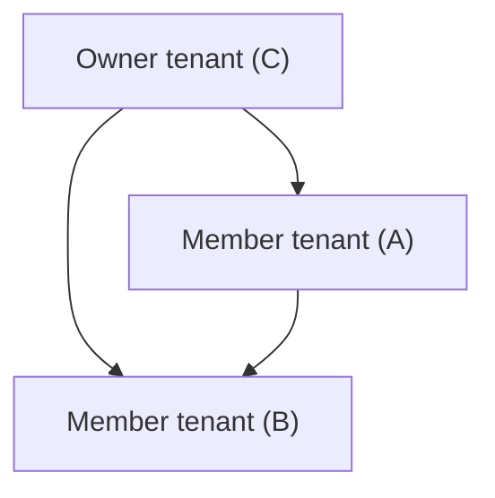

# Multitenant organization

Multitenant organization is a feature in Microsoft Entra ID and Microsoft 365 that enables you to form a tenant group within your organization. Each pair of tenants in the group is governed by cross-tenant access settings that you can use to configure B2B or cross-tenant synchronization.

Here are the primary benefits of a multitenant organization:

· Differentiate in-organization and out-of-organization external users

· Improved collaborative experience in new Microsoft Teams

· Improved people search experience across tenants

<figure>
Diagram showing three tenants. The top tenant is labeled "Owner tenant (C)," and it's connected to two "Member tenants (A and B)" through cross-tenant access settings.
</figure>

For more information, see What is a multitenant organization in Microsoft Entra ID?.

# Compare multitenant capabilities

Depending on the needs of your organization, you can use any combination of B2B direct connect, B2B collaboration, cross-tenant synchronization, and multitenant organization capabilities. B2B direct connect and B2B collaboration are independent capabilities, while cross-tenant synchronization and multitenant organization capabilities are independent of each other, though both rely on underlying B2B collaboration.

The following table compares the capabilities of each feature. For more information about different external identity scenarios, see Comparing External Identities feature sets.