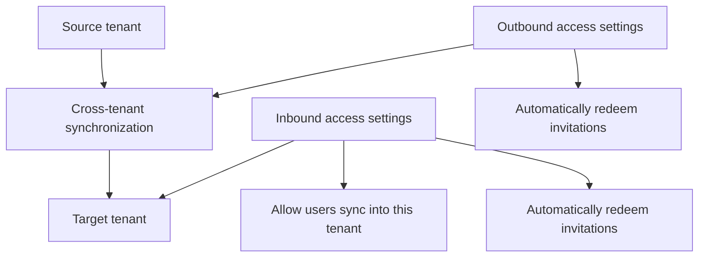

you can start testing with a few users and make sure they're created with all the attributes that you need. When testing is complete, you can quickly add additional users to synchronize and roll out across your organization. For more information, see Configure cross-tenant synchronization.

Cross-tenant synchronization illustration showing the source tenant and target tenant with selected settings for allowing user sync and auto-redeeming invitations.

# License requirements

In the source tenant: Using this feature requires Microsoft Entra ID P1 licenses. Each user who is synchronized with cross-tenant synchronization must have a P1 license in their home/source tenant. To find the right license for your requirements, see Compare generally available features of Microsoft Entra ID.

In the target tenant: Cross-tenant sync relies on the Microsoft Entra External ID billing model. To understand the external identities licensing model, see MAU billing model for Microsoft Entra External ID. You will also need at least one Microsoft Entra ID P1 license in the target tenant to enable auto-redemption.

# Frequently asked questions

# Clouds

Which clouds can cross-tenant synchronization be used in?

- Cross-tenant synchronization is supported within the commercial cloud and Azure Government.
- Cross-tenant synchronization isn't supported within the Microsoft Azure operated by 21Vianet cloud.
- Synchronization is only supported between two tenants in the same cloud.
- Cross-cloud (such as public cloud to Azure Government) isn't currently supported.

# Existing B2B users

Will cross-tenant synchronization manage existing B2B users?