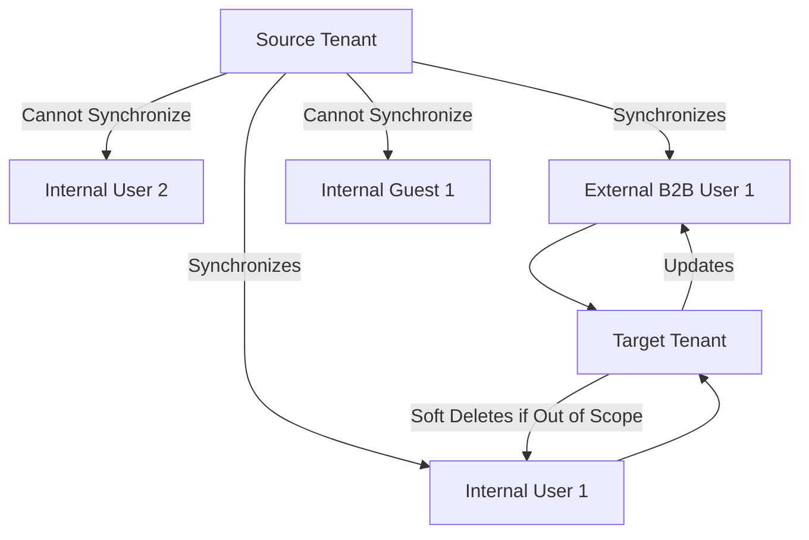

. Yes. Cross-tenant synchronization uses an internal attribute called the alternativeSecurityIdentifier to uniquely match an internal user in the source tenant with an external / B2B user in the target tenant. Cross-tenant synchronization can update existing B2B users, ensuring that each user has only one account.

· Cross-tenant synchronization cannot match an internal user in the source tenant with an internal user in the target tenant (both type member and type guest).

# Synchronization frequency

How often does cross-tenant synchronization run?

· The sync interval is currently fixed to start at 40-minute intervals. Sync duration varies based on the number of in-scope users. The initial sync cycle is likely to take significantly longer than the following incremental sync cycles.

# Scope

How do I control what is synchronized into the target tenant?

· In the source tenant, you can control which users are provisioned with the configuration or attribute-based filters. You can also control what attributes on the user object are synchronized. For more information, see Scoping users or groups to be provisioned with scoping filters.

If a user is removed from the scope of sync in a source tenant, will cross-tenant synchronization soft delete them in the target?

· Yes. If a user is removed from the scope of sync in a source tenant, cross-tenant synchronization will soft delete them in the target tenant.

# Object types

What object types can be synchronized?

· Microsoft Entra users can be synchronized between tenants. (Groups, devices, and contacts aren't currently supported.)

What user types can be synchronized?

· Internal members can be synchronized from source tenants. Internal guests can't be synchronized from source tenants.
 
· Users can be synchronized to target tenants as external members (default) or external guests.

**Figure 1:**
Diagram showing the synchronization process between tenants.

