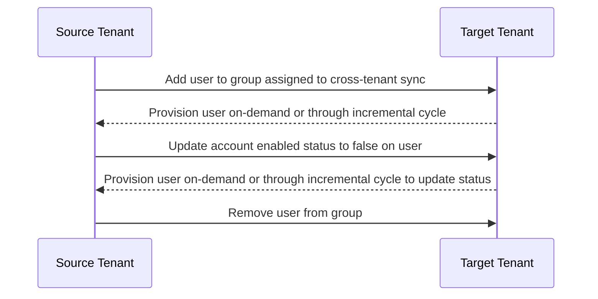

<!-- PageHeader="Integration" -->

What federation options are supported for users in the target tenant back to the source tenant?

· For each internal user in the source tenant, cross-tenant synchronization creates a federated external user (commonly used in B2B) in the target. It supports syncing internal users. This includes internal users federated to other identity systems using domain federation (such as Active Directory Federation Services). It doesn't support syncing external users.

Does cross-tenant synchronization use System for Cross-Domain Identity Management (SCIM)?

· No. Currently, Microsoft Entra ID supports a SCIM client, but not a SCIM server. For more information, see SCIM synchronization with Microsoft Entra ID.

# Deprovisioning

Does cross-tenant synchronization support deprovisioning users?

· Yes, when the below actions occur in the source tenant, the user will be soft deleted in the target tenant.

o Delete the user in the source tenant
o Unassign the user from the cross-tenant synchronization configuration
o Remove the user from a group that is assigned to the cross-tenant synchronization configuration
o An attribute on the user changes such that they do not meet the scoping filter conditions defined on the cross-tenant synchronization configuration anymore

· If the user is blocked from sign-in in the source tenant (accountEnabled = false) they will be blocked from sign-in in the target. This is not a deletion, but an updated to the accountEnabled property.

· Users are not soft deleted from the target tenant in this scenario:

1. Add a user to a group and assign it to the cross-tenant synchronization configuration in the source tenant.
2. Provision the user on-demand or through the incremental cycle.
3. Update the account enabled status to false on the user in the source tenant.
4. Provision the user on-demand or through the incremental cycle. The account enabled status is changed to false in the target tenant.
5. Remove the user from the group in the source tenant.

