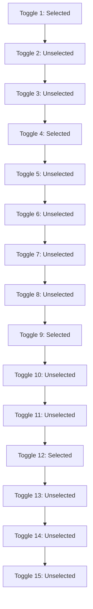

* If you followed the correct sequence to create a multitenant organization and add a tenant to the multitenant organization, and the added tenant's join request keeps failing, submit a support request in the Microsoft Entra or Microsoft 365 admin center.

# Microsoft apps

* In SharePoint OneDrive, the promotion of B2B guests to B2B members might not happen automatically. If faced with a user type mismatch between Microsoft Entra ID and SharePoint OneDrive, try Set-SPUser [-SyncFromAD].

* In SharePoint OneDrive user interfaces, when sharing a file with People in Fabrikam, the current user interfaces might be counterintuitive, because B2B members in Fabrikam from Contoso count towards People in Fabrikam.

* In Microsoft Forms, B2B member users might not be able to access forms.

* In Microsoft Power BI, B2B member users are not yet supported. B2B guest users can continue to access Power BI dashboards.

* In Microsoft Power Apps, Microsoft Dynamics 365, and related workloads, B2B member users may have restricted functionality. For more information, see Invite users with Microsoft Entra B2B collaboration.

## B2B users or B2B members

* The promotion of B2B guests to B2B members represents a strategic decision by multitenant organizations to consider B2B members as trusted users of the organization. Review the default permissions for B2B members.

* To promote B2B guests to B2B members, a source tenant administrator can amend the attribute mappings, or a target tenant administrator can change the userType if the property is not recurringly synchronized.

* As your organization rolls out the multitenant organization functionality including provisioning of B2B users across multitenant organization tenants, you might want to provision some users as B2B guests, while provision others users as B2B members. To achieve this, you might want to establish two Microsoft Entra cross-tenant synchronization configurations in the source tenant, one with userType attribute mappings configured to B2B guest, and another with userType attribute mappings configured to B2B member, each with Apply this mapping set to

**Description of Illustration:** This section appears to display various toggle switches, each with either a 'selected' or 'unselected' state, suggesting different configuration options for synchronization settings.

