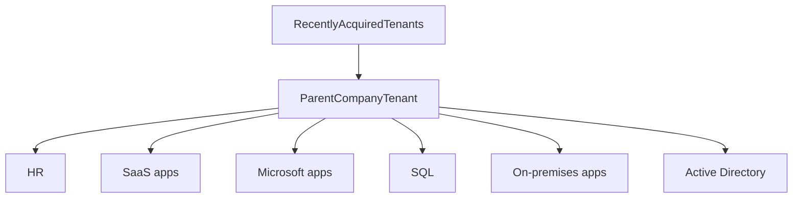

that contain business critical data. The following diagram shows recently acquired tenants on the left and their users being provisioned into the parent company's tenant, which grants users access to the necessary resources.

# Separate collaboration and resource tenants (user hub)

As organizations scale their usage of Azure, they often create dedicated tenants for managing critical Azure resources. Meanwhile, they rely on a central hub tenant for user provisioning. This model empowers administrators in the hub tenant to establish central security and governance policies while granting development teams greater autonomy and agility to deploy required Azure resources. Cross-tenant synchronization supports this topology by enabling administrators to provision a subset of users into the spoke tenants and manage the lifecycle of those users.