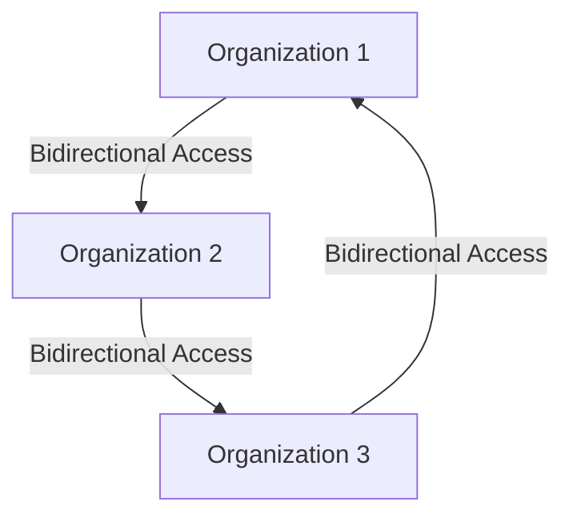

<figure>
    Diagram showing three interconnected organizations, each represented by a stylized pyramid icon. The top left organization is associated with a purple-and-blue hexagonal icon, a blue flag icon, and a small cluster of squares icon. The top right organization is associated with the same purple-and-blue hexagonal icon, an "AWS" logo, and a "Salesforce" logo. The bottom center organization is associated with the same purple-and-blue hexagonal icon and the "Salesforce" logo. Solid arrows connect each organization to the others, indicating a bidirectional resource and access flow between them.
</figure>

# Just-in-time

While the scenarios discussed so far cover collaboration within an organization, there are cases where cross-organization collaboration is vital. This could be in the context of joint ventures or organizations of independent legal entities. By employing connected organizations and entitlement management, you can define policies for accessing resources across connected organizations and enable users to request access to the resources they need.

# Joint ventures

Consider Contoso and Litware, separate organizations engaged in a multi-year joint venture. They need to collaborate closely. Administrators at Contoso have defined access packages containing the resources required by Litware users. When a new Litware employee needs access to Contoso's resources, they can request access to the access package. Upon approval, they are provisioned with the necessary resources. Access can be time-limited and subject to periodic review to ensure compliance with Contoso's governance requirements.

The following diagram shows how two organizations can just-in-time collaborate by using connected organizations and entitlement management.