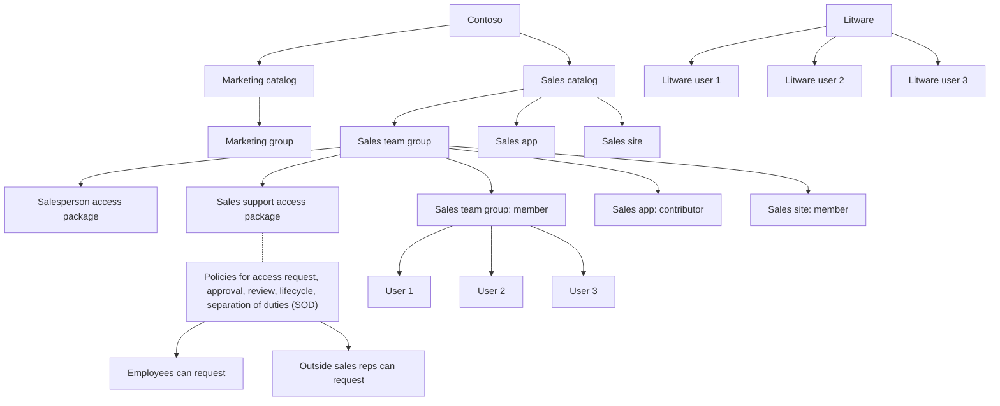

| | ||
| Litware | Litware | Litware |
| - | - | - |
| user 1 | user 2 | user 3 |

<figure>
"Contoso: The image depicts Contoso's organizational resources divided into two main catalogs: Marketing catalog and Sales catalog. The Marketing catalog includes a Marketing group and a Sales team group, which in turn includes a Sales team group, a Sales app, and a Sales site. Accessibility packages like Salesperson access package and Sales support access package are shown. Various roles and permissions such as group member, app contributor, and site member are denoted with tags like '✅' and '❌'. It also includes policies for access request, approval, review, lifecycle, and separation of duties (SOD). Users 1, 2, and 3 are shown to have different levels of access based on their roles. Outside sales reps can request access through predefined packages. Connected organization Litware shows Litware user 1, Litware user 2, and Litware user 3."

</figure>

# Next steps

· What is cross-tenant synchronization? 

· Configure cross-tenant synchronization

# Feedback

Was this page helpful?

Yes

No

Provide product feedback | Get help at Microsoft Q&A