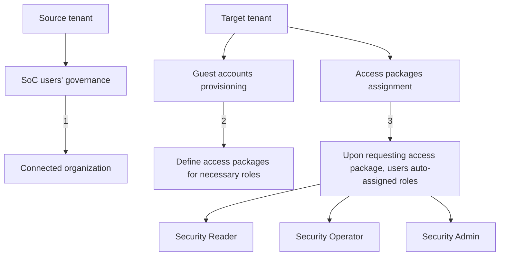

<figure>

Text description of the figure: 

In the provided image, there is an illustration describing the topology setup between a source tenant and a target tenant.

- The left side, labeled "Source tenant," shows "SoC users' governance" with a blue background labeled "1."
- The right side, labeled "Target tenant," is divided into two parts:
  - "Guest accounts provisioning": Labeled "2", showing the setup to establish a connected organization.
  - "Access packages assignment": Labeled "3", detailing that the users from the source tenant can request access packages, and they will be auto-assigned to specific roles (Security Reader, Security Operator, Security Admin).

MermaidJS diagram for the figure:

</figure>

Steps to configure topology 2

1. In the target tenant, add the source tenant as a connected organization.

This setting allows the target tenant administrator to make access packages available to the source tenant.

2. In the target tenant, create an access package that provides the Security Reader, Security Administrator, and Security Operator roles.

3. Users from the source tenant can now request access packages in the target tenant.

Once you have completed the setup, SOC users can navigate to myaccess.microsoft.com to request time-limited access to the necessary roles in each tenant.

# Topologies compared

In both topologies, the target tenant can control what resources users have access to. This can be accomplished using a mix of cross-tenant access policies, conditional access, and assignment of apps and roles to users. They differ in who configures and initiates provisioning. In topology 1, the source tenant configures provisioning and pushes users into the target tenants. In topology 2, the target tenant defines which users are eligible to access their tenant.

If a user needs access to several tenants at one time, topology 1 makes it easy for them to request access to an access package in one tenant and automatically get provisioned into several tenants. If the target tenant wants to ensure full control over who is