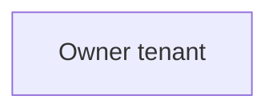

<figure>
Description: An icon and text labeled "Member tenant".

- For license information, see License requirements.
- Security Administrator role to configure cross-tenant access settings and templates for the multitenant organization.
- Global Administrator role to consent to required permissions.

</figure>

# Step 1: Sign in to the owner tenant

<figure>
Description: An icon and text labeled "Owner tenant".

PowerShell

1. Start PowerShell.

2. If necessary, install the Microsoft Graph PowerShell SDK.

3. Get the tenant ID of the owner and member tenants and initialize variables.

PowerShell

$OwnerTenantId = "<OwnerTenantId>" $MemberTenantIdB = "<MemberTenantIdB>" $MemberTenantIdA = "<MemberTenantIdA>"

4. Use the Connect-MgGraph command to sign in to the owner tenant and consent to the following required permissions.

- MultiTenantOrganization.ReadWrite.All
- Policy.Read.All
- Policy.ReadWrite.CrossTenantAccess
- Application.ReadWrite.All
- Directory.ReadWrite.All

PowerShell

Connect -MgGraph -TenantId $OwnerTenantId -Scopes "MultiTenantOrganization.ReadWrite.All", "Policy.Read.All", "Policy.ReadWrite.CrossTenantAccess", "Application.ReadWrite.All", "Directory.ReadWrite.All"

</figure>