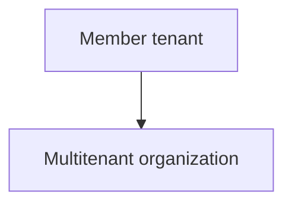

1. Start PowerShell.

2. Use the Connect-MgGraph command to sign in to the member tenant and consent to the following required permissions.

- MultiTenantOrganization.ReadWrite.All
- Policy.Read.All
- Policy.ReadWrite.CrossTenantAccess
- Application.ReadWrite.All
- Directory.ReadWrite.All

PowerShell

    Connect-MgGraph -TenantId $MemberTenantIdB -Scopes "MultiTenantOrganization.ReadWrite.All","Policy.Read.All","Policy.ReadWrite.CrossTenantAccess","Application.ReadWrite.All","Directory.ReadWrite.All"

# Step 7: Join the multitenant organization

Member tenant

PowerShell

1. In the member tenant, use the Update-MgBetaTenantRelationshipMultiTenantOrganizationJoinRequest command to join the multitenant organization.

PowerShell

    Update-MgBetaTenantRelationshipMultiTenantOrganizationJoinRequest -AddedByTenantId $OwnerTenantId | Format-List

2. Use the Get-MgBetaTenantRelationshipMultiTenantOrganizationJoinRequest command to verify the join.