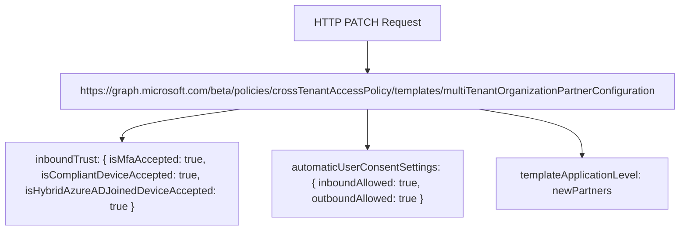

{
"inboundTrust": {
"isMfaAccepted": true,
"isCompliantDeviceAccepted": true,
"isHybridAzureADJoinedDeviceAccepted": true
},
"automaticUserConsentSettings": {
"inboundAllowed": true,
"outboundAllowed": true
},
"templateApplicationLevel": "newPartners,existingPartners"
}

# Disable the template for existing partners

To apply this template only to new multitenant organization members and exclude existing partners, set the templateApplicationLevel parameter to new partners only.

Request

*The HTTP PATCH request to disable the template for existing partners*

# Disable the template completely

To disable the template completely, set the templateApplicationLevel parameter to null.

Request

HTTP