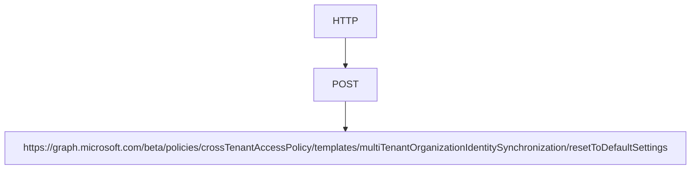

PATCH

https://graph.microsoft.com/beta/policies/crossTenantAccessPolicy/templates/ multiTenantOrganizationIdentitySynchronization

{ "userSyncInbound": { "isSyncAllowed": true }, "templateApplicationLevel": "" }

# Reset the template

To reset the template to its default state (decline inbound synchronization), use the multiTenantOrganizationIdentitySyncPolicyTemplate: resetToDefaultSettings API.

# Request

**[Figure: A table with HTTP request information]**

# Next steps

- Configure cross-tenant synchronization