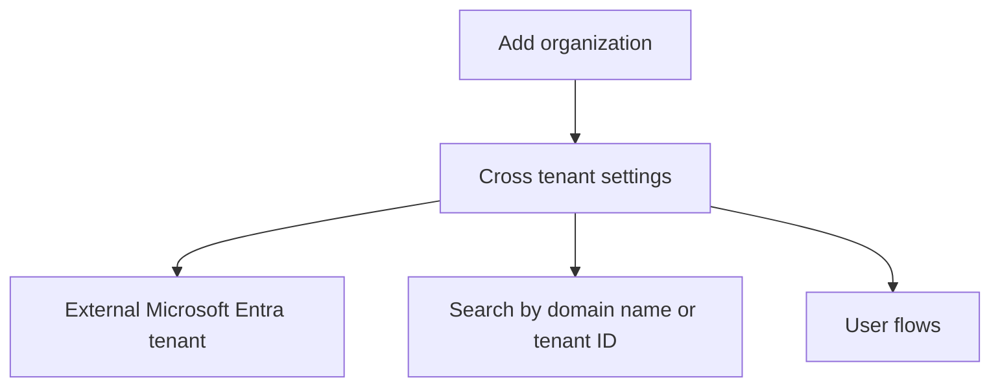
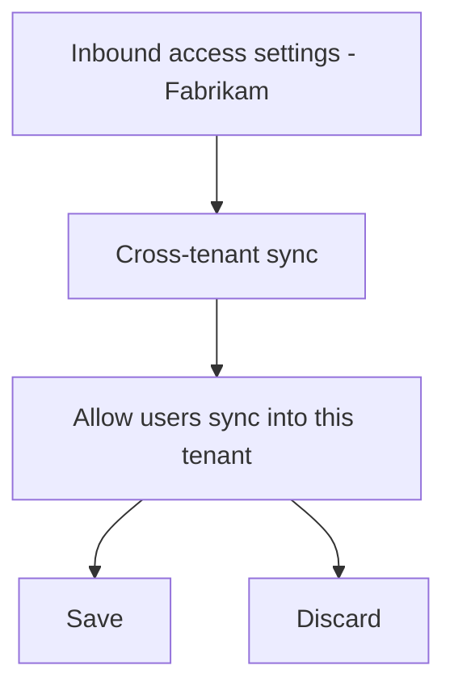

X

Home > Inbound access settings - Contoso > External Identities

[Figure 1: Screenshot of the External Identities | Cross-tenant access settings page in Microsoft Entra ID for workforce. The page provides options to add an organization, configure cross-tenant settings, and search for tenant IDs or domain names.]

5. Under Inbound access of the added organization, select Inherited from default.

6. Select the Cross-tenant sync tab.

7. Check the Allow users sync into this tenant check box.

[Figure 2: Screenshot showing the Inbound access settings page for Fabrikam. The Cross-tenant sync tab is selected, and the option to Allow users sync into this tenant is enabled.]

8. Select Save.

9. If you see an Enable cross-tenant sync and auto-redemption dialog box asking if you want to enable auto-redemption, select Yes.

Selecting Yes will automatically redeem invitations in the target tenant.
