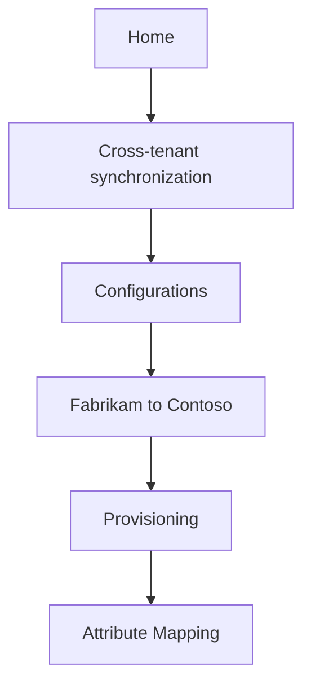
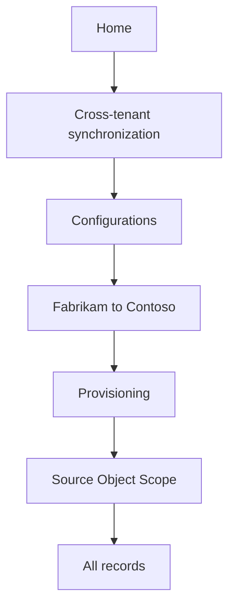

Home > Cross-tenant synchronization | Configurations > Fabrikam to Contoso
===

Fabrikam to Contoso | Provisioning
===
 ✅
X

Fabrikam - Microsoft Entra ID

«

Save ✅ Discard

1 Overview

V Admin Credentials

Provision on demand

Manage

1 Mappings

Users and groups

Provisioning

Mappings Mappings allow you to define how data should flow between Microsoft Entra ID and Azure Active Directory (target tenant).

Expression builder

Activity - Audit logs

Provisioning logs ❌ Restore default mappings

Insights

Troubleshooting + Support v Settings

| Name | Enabled |
| - | - |
| Provision Microsoft Entra ID Users | Yes |

New support request

Provisioning Status
 ✅
+

On

Off

## 2\. Select Provision Microsoft Entra ID Users to open the Attribute Mapping page.

<figure>
Home > Cross-tenant synchronization | Configurations > Fabrikam to Contoso | Provisioning > Attribute Mapping .. > ✅ Save ✅ Discard Name Provision Microsoft Entra ID Users Enabled Yes No Source Object User Source Object Scope All records Source Object User Target Object Actions ✅ Create ✅ Update + ✅ Delete
</figure>

## 3\. Under Source Object Scope, select All records.

<figure>
Home > Cross-tenant synchronization | Configurations > Fabrikam to Contoso | Provisioning > Attribute Mapping .. > ✅ Save ✅ Discard Name Provision Microsoft Entra ID Users Enabled Yes No Source Object User Source Object Scope All records Source Object User Target Object Actions ✅ Create ✅ Update + ✅ Delete
</figure>

4\. On the Source Object Scope page, select Add scoping filter.

5\. Add any scoping filters to define which users are in scope for provisioning.  
✅ ❌ ❌