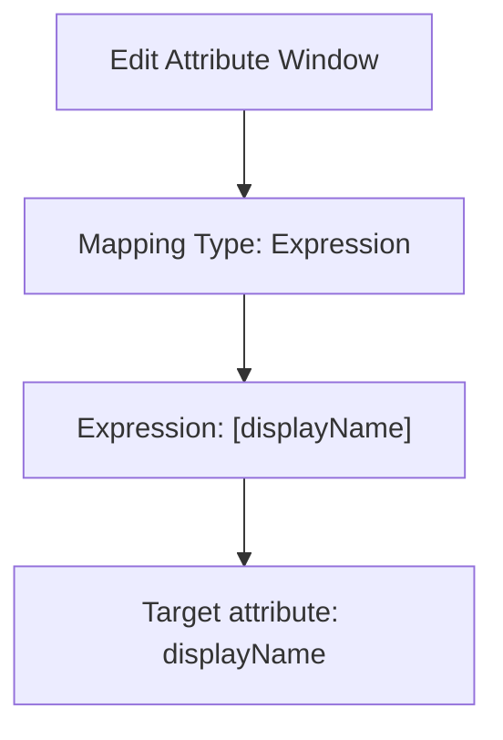

7. Set the Mapping type to Expression.

8. In the Expression box, enter the transformation expression. For example with the display name, you can do the following:

· Flip the first name and last name and add a comma in between.

· Add the domain name in parentheses at the end of the display name.

For examples, see Reference for writing expressions for attribute mappings in Microsoft Entra ID.
 
<figure>
Text Description: "Edit Attribute" window in Microsoft Entra. It depicts configurations for cross-tenant synchronization from Fabrikam to Contoso. The Mapping type is set to Expression. The user enters a transformation expression in the Expression box. The "displayName" is used as a target attribute.
</figure>

Tip

You can map directory extensions by updating the schema of the cross-tenant synchronization. For more information, see Map directory extensions in cross-tenant synchronization.

Step 10: Specify additional provisioning settings

<figure>
Text Description: Source tenant icon.
</figure>