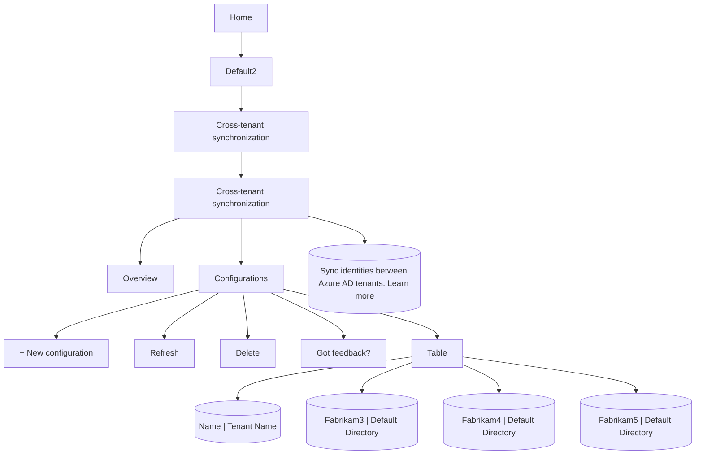

This setting also applies to B2B collaboration and B2B direct connect, so if you set External user leave settings to No, B2B collaboration users and B2B direct connect users can't leave your organization themselves. For more information, see Leave an organization as an external user.

Troubleshooting tips
===

## Delete a configuration

Follows these steps to delete a configuration on the Configurations page.

1. In the source tenant, browse to Identity > External Identities > Cross-tenant synchronization.

2. On the Configurations page, add a check mark next to the configuration you want to delete.

3. Select Delete and then OK to delete the configuration.

[Figure: The Configurations page, showing options to create, refresh, and delete configurations. A list of configurations with names and tenant names is displayed, with one configuration selected.]

Symptom - Test connection fails with AzureDirectoryB2BManagementPolicyCheckFailure

When configuring cross-tenant synchronization in the source tenant and you test the connection, it fails with the following error message:

You appear to have entered invalid credentials. Please confirm you are using the correct information for an administrative account.