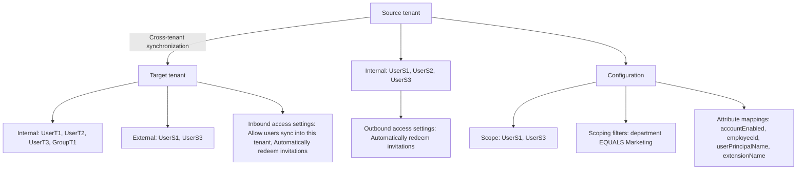

# Configure cross-tenant synchronization using PowerShell or Microsoft Graph API

Article · 04/23/2024

This article describes the key steps to configure cross-tenant synchronization using Microsoft Graph PowerShell or Microsoft Graph API. When configured, Microsoft Entra ID automatically provisions and de-provisions B2B users in your target tenant. For detailed steps using the Microsoft Entra admin center, see Configure cross-tenant synchronization.

The diagram shows the following elements:

- **Source tenant**:
  - Internal Users: UserS1, UserS2, UserS3
  - Outbound access settings: Automatically redeem invitations
  - Configuration: 
    - Scope: UserS1, UserS3
    - Scoping filters: department EQUALS Marketing
    - Attribute mappings:
      - accountEnabled
      - employeeld
      - userPrincipalName
      - extensionName
- **Cross-tenant synchronization**

- **Target tenant**:
  - Internal Users: UserT1, UserT2, UserT3, GroupT1
  - External Users: UserS1, UserS3
  - Inbound access settings:
    - Allow users sync into this tenant
    - Automatically redeem invitations

# Prerequisites

Source tenant

- Microsoft Entra ID P1 or P2 license. For more information, see License requirements.
- Security Administrator role to configure cross-tenant access settings.
- Hybrid Identity Administrator role to configure cross-tenant synchronization.