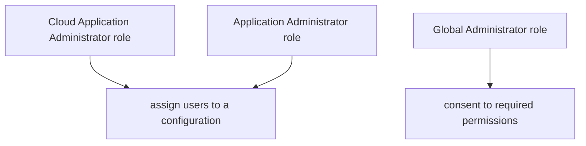
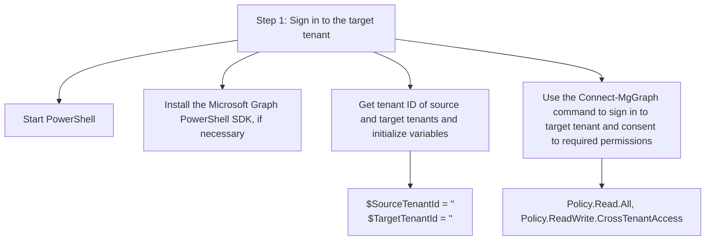

· Cloud Application Administrator or Application Administrator role to assign users to a configuration and to delete a configuration.

· Global Administrator role to consent to required permissions.

_Figure 1: Image showing target tenant permissions and administrator roles._



Target tenant

· Microsoft Entra ID P1 or P2 license. For more information, see License requirements.

· Security Administrator role to configure cross-tenant access settings.

· Global Administrator role to consent to required permissions.

# Step 1: Sign in to the target tenant

_Figure 2: Illustration showing PowerShell steps to sign in to the target tenant._



PowerShell

1. Start PowerShell.

2. If necessary, install the Microsoft Graph PowerShell SDK.

3. Get the tenant ID of the source and target tenants and initialize variables.

PowerShell

```powershell
$SourceTenantId = "<SourceTenantId>"
$TargetTenantId = "<TargetTenantId>"
```

4. Use the Connect-MgGraph command to sign in to the target tenant and consent to the following required permissions.

- Policy.Read.All
- Policy.ReadWrite.CrossTenantAccess

PowerShell

```powershell
Connect-MgGraph -TenantId $TargetTenantId -Scopes "Policy.Read.All","Policy.ReadWrite.CrossTenantAccess"
```