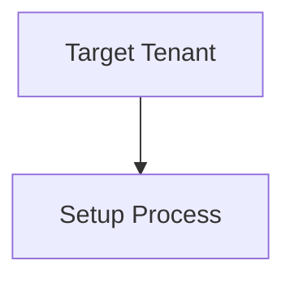
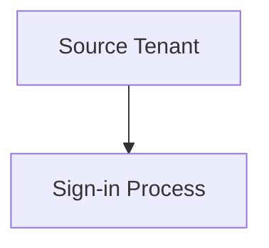

<!-- PageHeader="IsSyncAllowed" -->

IsSyncAllowed
-------------
True

Step 3: Automatically redeem invitations in the target tenant
===

Target tenant

PowerShell

1\. In the target tenant, use the Update-MgPolicyCrossTenantAccessPolicyPartner command to automatically redeem invitations and suppress consent prompts for inbound access.

PowerShell

$AutomaticUserConsentSettings = @{ "InboundAllowed"="True"

} Update-MgPolicyCrossTenantAccessPolicyPartner -CrossTenantAccessPolicyConfigurationPartnerTenantId $SourceTenantId -AutomaticUserConsentSettings $AutomaticUserConsentSettings

## Step 4: Sign in to the source tenant

Source tenant

PowerShell

1\. Start an instance of PowerShell.

2\. Get the tenant ID of the source and target tenants and initialize variables.