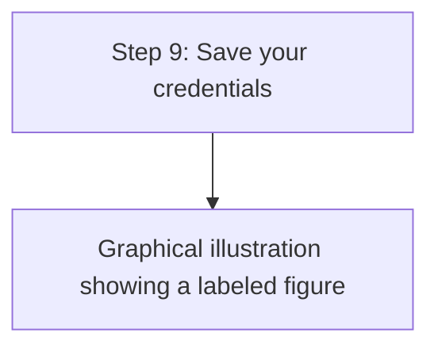

A template has pre-configured synchronization settings.

2. In the source tenant, use the New-MgServicePrincipalSynchronizationJob command to create a provisioning job based on a template.

PowerShell

New-MgServicePrincipalSynchronizationJob -ServicePrincipalId $ServicePrincipalId -TemplateId "Azure2Azure" | Format-List

# Output

Id : < JobId> Schedule :

Microsoft. Graph. PowerShell.Models.MicrosoftGraphSynchronizationSche dule

Schema

Microsoft. Graph. PowerShell. Models. MicrosoftGraphSynchronizationSche ma

Status .. Microsoft. Graph. PowerShell.Models.MicrosoftGraphSynchronizationStat us SynchronizationJobSettings : {AzureIngestionAttributeOptimization, LookaheadQueryEnabled} TemplateId : Azure2Azure AdditionalProperties : {[@odata.context, https://graph.microsoft.com/v1.0/$metadata#servicePrincipals('<Serv icePrincipalId>')/synchro

nization/jobs/$entity]}

3. Initialize a variable for the job ID.

PowerShell

$JobId = "<JobId>"

# Step 9: Save your credentials

The figure shows a graphical illustration depicted under the Step 9 header with the title "Save your credentials". 

Source tenant

PowerShell