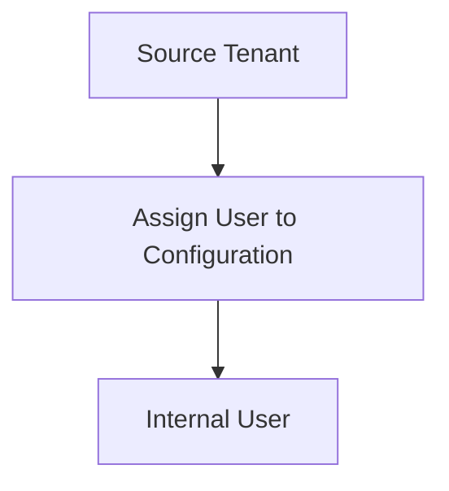

1. In the source tenant, use the Invoke-MgGraphRequest command to save your credentials.

*Description: A PowerShell snippet illustrating how to invoke the MgGraphRequest command with parameters to save credentials in the source tenant.* 

PowerShell

$Params = @{  
"value" = @(  
@{  
"key" = "AuthenticationType"  
"value" = "SyncPolicy"  
}  
@{  
"key" = "CompanyId"  
"value" = $TargetTenantId  
}  
)  
}  
Invoke-MgGraphRequest -Method PUT -Uri "https://graph.microsoft.com/v1.0/servicePrincipals/$ServicePrincipalId/synchronization/secrets" -Body $Params

Step 10: Assign a user to the configuration
===

*Description: An illustrative diagram or image representing the assignment of a user to the configuration.*

Source tenant

For cross-tenant synchronization to work, at least one internal user must be assigned to the configuration.

PowerShell

1. In the source tenant, use the New-MgServicePrincipalAppRoleAssignedTo command to assign an internal user to the configuration.

PowerShell

$Params = @{  
PrincipalId = "<PrincipalId>"  
ResourceId = $ServicePrincipalId  
AppRoleId = $AppRoleId  
}

