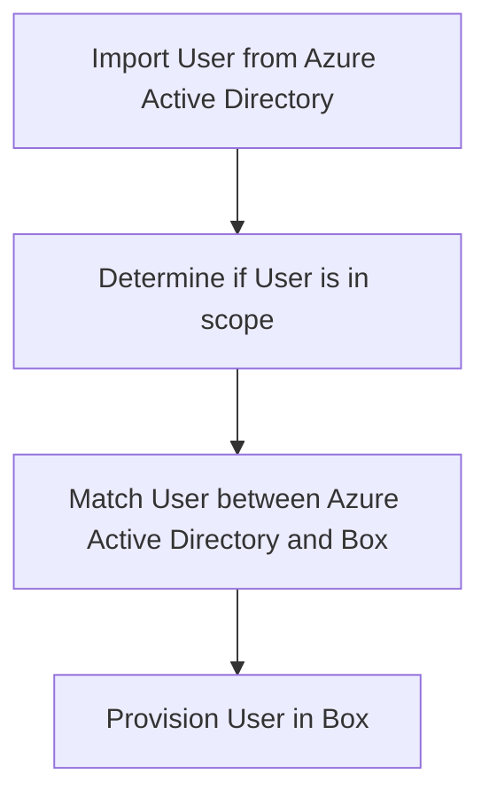

o Import the object.
 ❌
o Match the object between source and target.
 ❌
o Determine if the object is in scope.
 ❌
o Evaluate the object before synchronization.
 ❌
o Provision the object (create, update, delete, or disable).
 ❌

**Figure 1**: Steps for importing, matching, determining the scope, evaluating, and provisioning an object. This figure includes the following steps:
1. Import User from Azure Active Directory 
2. Determine if User is in scope 
3. Match User between Azure Active Directory and Box
4. Provision User in Box

EntryExportAdd Result: Success Description: User "cheryl@f128.info" was created in Box ReportableIdentifier: "cheryl@f128.info"

- Troubleshooting & Recommendations: If there was an error, this tab provides the error code and reason.

- Modified Properties: If there were changes, this tab shows the old value and the new value.

- Summary: Provides an overview of what happened and identifiers for the object in the source and target systems.