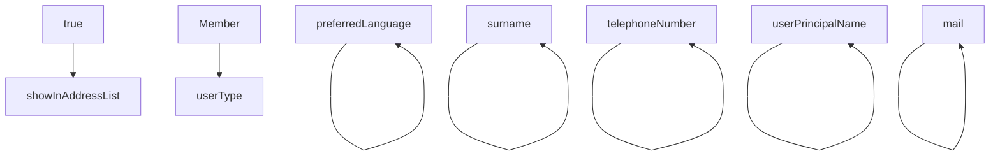

Home > Cross-tenant synchronization | Configurations > Fabrikam to Contoso
===

Fabrikam to Contoso | Provisioning
===

X
 ✅
Fabrikam - Microsoft Entra ID

«

Save ✅ Discard

1 Overview

V Admin Credentials

Provision on demand

Manage

1 Mappings

Users and groups

Provisioning

Expression builder

Mappings

Mappings allow you to define how data should flow between Microsoft Entra ID and Azure Active Directory (target tenant).

| Name | Enabled |
| - | - |
| Provision Microsoft Entra ID Users | Yes |
 ❌
Restore default mappings

Provisioning logs

Insights

Troubleshooting + Support

v Settings

Activity - Audit logs

New support request

Provisioning Status
 ✅
+

On Off

## 5\. Select Provision Microsoft Entra ID Users to open the Attribute Mapping page.

6\. Scroll to the bottom of the page and select Add new mapping.

<figure>

Description: Screenshot of the Attribute Mapping configuration page, showing various mappings between attributes of Microsoft Entra ID and Azure Active Directory. There is a highlighted "Add New Mapping" button at the bottom left.

</figure>

7\. In the Source attribute drop-down list, select a source attribute.
    
If you created a directory extension in the source tenant, select the directory extension.

| preferredLanguage | preferredLanguage | Delete |
| - | - | - |
| surname | surname | Delete |
| telephoneNumber | telephoneNumber | Delete |
| userPrincipalName | userPrincipalName | Delete |
| true | showInAddressList | Delete |
| mail | mail | Delete |
| Member | userType | Delete |
✅ ❌ ❌