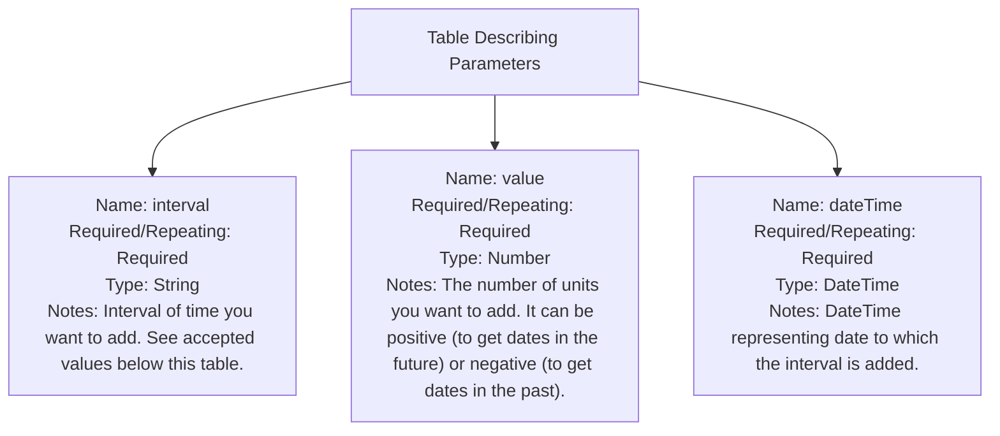

<!-- PageHeader="Function: DateAdd(interval, value, dateTime)" -->

Function: `DateAdd(interval, value, dateTime)`

Description:

Returns a date/time string representing a date to which a specified time interval has been added. The returned date is in the format: M/d/yyyy h:mm:ss tt.

Parameters:

**Table Describing Parameters:**
| Name     | Required/Repeating | Type     | Notes                                                                 |
|----------|---------------------|----------|-----------------------------------------------------------------------|
| interval | Required            | String   | Interval of time you want to add. See accepted values below this table.|
| value    | Required            | Number   | The number of units you want to add. It can be positive (to get dates in the future) or negative (to get dates in the past).|
| dateTime | Required            | DateTime | DateTime representing date to which the interval is added.             |

**Table Schema Visualization:**


When passing a date string as input, use `CDate` function to wrap the datetime string. To get system time in UTC, use the `Now` function.

The interval string must have one of the following values:

- yyyy Year
- m Month
- d Day
- ww Week
- h Hour
- n Minute
- s Second

Example 1: Generate a date value based on incoming StatusHireDate from Workday
```text
DateAdd("d", 7, CDate([StatusHireDate]))
```

<!-- PageFooter="Expand table" -->