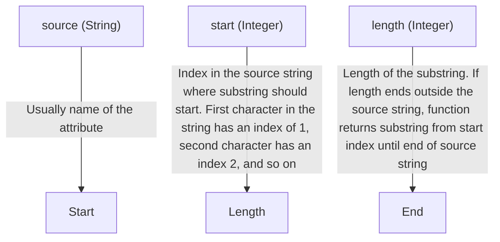
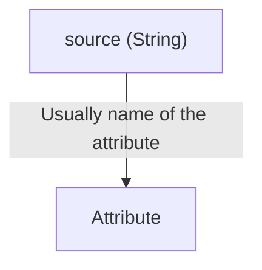
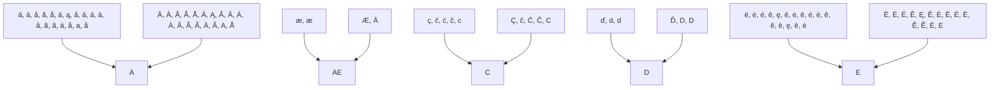

| Name Required/ Repeating | Type | Notes |
| - | - | - |
| source Required | String | Usually name of the attribute. |
| start Required | Integer | Index in the source string where substring should start. First character in the string has an index of 1, second character has an index 2, and so on. |
| length Required | Integer | Length of the substring. If length ends outside the source string, function returns substring from start index until end of source string. |

# NormalizeDiacritics

Function: NormalizeDiacritics(source)

Description: Requires one string argument. Returns the string, but with any diacritical characters replaced with equivalent nondiacritical characters. Typically used to convert first names and last names containing diacritical characters (accent marks) into legal values that can be used in various user identifiers such as user principal names, SAM account names, and email addresses.

Parameters:

| Name | Required/ Repeating | Type | Notes |
| - | - | - | - |
| source | Required | String | Usually a first name or last name attribute. |

| Character with Diacritic | Normalized character | Character with Diacritic | Normalized character |
| - | - | - | - |
| ä, à, â, ã, å, á, ą, ă, ā, á, à, â, ã, ã, ä, å, a, å | a | Ä, À, Â, Ã, Å, Á, Ą, Ă, Ā, Á, À, Â, Ã, Ã, Ä, Ã, A, Å | A |
| æ, æ | ae | Æ, Ā | AE |
| ç, č, ć, č, c | c | Ç, č, Ć, Č, C | C |
| ď, d, d | d | Ď, D, D | D |
| ë, è, é, ê, ę, ě, ė, ē, é, è, ê, ẽ, ē, e̱, ē, é | e | Ë, È, É, Ê, Ę, Ě, Ė, Ē, É, È, Ê, Ẽ, È, E | E

