Multitenant organizations documentation
===

A multitenant organization is an organization that has more than one instance of Microsoft Entra ID. Describes ways that users can have a seamless experience accessing resources and collaborating across multiple tenants.

# About multitenant organizations

OVERVIEW

Multitenant organization capabilities

Compare multitenant capabilities

Configure a multitenant organization

OVERVIEW

What is a multitenant organization?
✅
HOW-TO GUIDE

Microsoft 365 admin center

PowerShell or Microsoft Graph API

Configure cross-tenant synchronization

OVERVIEW

What is cross-tenant synchronization?
✅
HOW-TO GUIDE

Microsoft Entra admin center

PowerShell or Microsoft Graph API
✅

Collaborate in Microsoft 365


### CONCEPT

- Identity provisioning for Microsoft 365
- Microsoft 365 multitenant people search
- Plan for multitenant organizations in Microsoft 365

Multitenant organization capabilities in Microsoft Entra ID
===

Article · 04/23/2024

This article provides an overview of the multitenant organization scenario and the related capabilities in Microsoft Entra ID.

# What is a tenant?

A tenant is an instance of Microsoft Entra ID in which information about a single organization resides including organizational objects such as users, groups, and devices and also application registrations, such as Microsoft 365 and third-party applications. A tenant also contains access and compliance policies for resources, such as applications registered in the directory. The primary functions served by a tenant include identity authentication as well as resource access management.

From a Microsoft Entra perspective, a tenant forms an identity and access management scope. For example, a tenant administrator makes an application available to some or all the users in the tenant and enforces access policies on that application for users in that tenant. In addition, a tenant contains organizational branding data that drives end-user experiences, such as the organizations email domains and SharePoint URLs used by employees in that organization. From a Microsoft 365 perspective, a tenant forms the default collaboration and licensing boundary. For example, users in Microsoft Teams or Microsoft Outlook can easily find and collaborate with other users in their tenant, but don't have the ability to find or see users in other tenants.

Tenants contain privileged organizational data and are securely isolated from other tenants. In addition, tenants can be configured to have data persisted and processed in a specific region or cloud, which enables organizations to use tenants as a mechanism to meet data residency and handling compliance requirements.

# What is a multitenant organization?

A multitenant organization is an organization that has more than one instance of Microsoft Entra ID. Here are the primary reasons why an organization might have multiple tenants:

- Conglomerates: Organizations with multiple subsidiaries or business units that operate independently.

· Mergers and acquisitions: Organizations that merge or acquire companies.

· Divestiture activity: In a divestiture, one organization splits off part of its business to form a new organization or sell it to an existing organization.

· Multiple clouds: Organizations that have compliance or regulatory needs to exist in multiple cloud environments.

· Multiple geographical boundaries: Organizations that operate in multiple geographic locations with various residency regulations.

· Test or staging tenants: Organizations that need multiple tenants for testing or staging purposes before deploying more broadly to primary tenants.

· Department or employee-created tenants: Organizations where departments or employees have created tenants for development, testing, or separate control.

# Multitenant challenges

Your organization may have recently acquired a new company, merged with another company, or restructured based on newly formed business units. If you have disparate identity management systems, it might be challenging for users in different tenants to access resources and collaborate.

The following diagram shows how users in other tenants might not be able to access applications across tenants in your organization.

[Figure content: A diagram showing three tenants with X marks between them, indicating that users across these tenants might not be able to access resources and collaborate.]

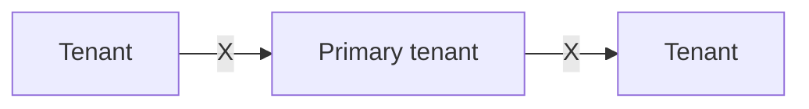

As your organization evolves, your IT team must adapt to meet the changing needs. This often includes integrating with an existing tenant or forming a new one. Regardless of how the identity infrastructure is managed, it's critical that users have a seamless experience accessing resources and collaborating. Today, you may be using custom scripts or on-premises solutions to bring the tenants together to provide a seamless experience across tenants.

## B2B direct connect

To enable users across tenants to collaborate in Teams Connect shared channels, you can use Microsoft Entra B2B direct connect. B2B direct connect is a feature of External Identities that lets you set up a mutual trust relationship with another Microsoft Entra organization for seamless collaboration in Teams. When the trust is established, the B2B direct connect user has single sign-on access using credentials from their home tenant.

Here's the primary constraint with using B2B direct connect across multiple tenants:

- Currently, B2B direct connect works only with Teams Connect shared channels.

B2B direct connect users -> Tenant -> Primary tenant -> Teams Connect shared channels -> Tenant -> B2B direct connect users

For more information, see B2B direct connect overview.

# B2B collaboration

To enable users across tenants to collaborate, you can use Microsoft Entra B2B collaboration. B2B collaboration is a feature within External Identities that lets you invite guest users to collaborate with your organization. Once the external user has redeemed their invitation or completed sign-up, they're represented in your tenant as a user object. With B2B collaboration, you can securely share your company's applications and services with external users, while maintaining control over your own corporate data.

Here are the primary constraints with using B2B collaboration across multiple tenants:

- Administrators must invite users using the B2B invitation process or build an onboarding experience using the B2B collaboration invitation manager.
- Administrators might have to synchronize users using custom scripts.
- Depending on automatic redemption settings, users might need to accept a consent prompt and follow a redemption process in each tenant.
- By default, users are of type external guest, which has different permissions than external member and might not be the desired user experience.

B2B collab users -> Tenant -> (Microsoft apps, Non-Microsoft apps) -> Primary tenant -> B2B collab users

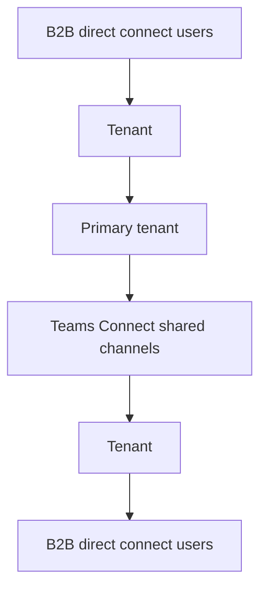

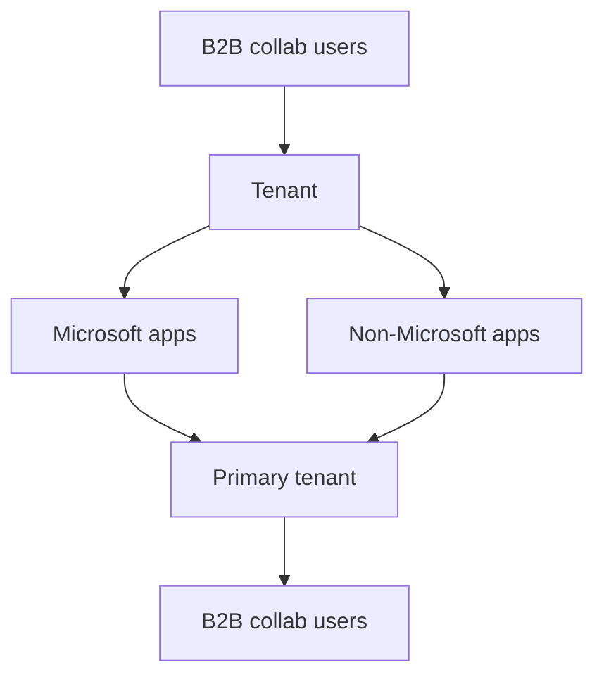


For more information, see [B2B collaboration overview](#).

Cross-tenant synchronization
===

If you want users to have a more seamless collaboration experience across tenants, you can use cross-tenant synchronization. Cross-tenant synchronization is a one-way synchronization service in Microsoft Entra ID that automates creating, updating, and deleting B2B collaboration users across tenants in an organization. Cross-tenant synchronization builds on the B2B collaboration functionality and utilizes existing B2B cross-tenant access settings. Users are represented in the target tenant as a B2B collaboration user object.

Here are the primary benefits with using cross-tenant synchronization:

· Automatically create B2B collaboration users within your organization and provide them access to the applications they need, without creating and maintaining custom scripts.

· Improve the user experience and ensure that users can access resources, without receiving an invitation email and having to accept a consent prompt in each tenant.

· Automatically update users and remove them when they leave the organization.

Here are the primary constraints with using cross-tenant synchronization across multiple tenants:

· Doesn't enhance the current Teams or Microsoft 365 experiences. Synchronized users will have the same cross-tenant Teams and Microsoft 365 experiences available to any other B2B collaboration user.

· Doesn't synchronize groups, devices, or contacts.


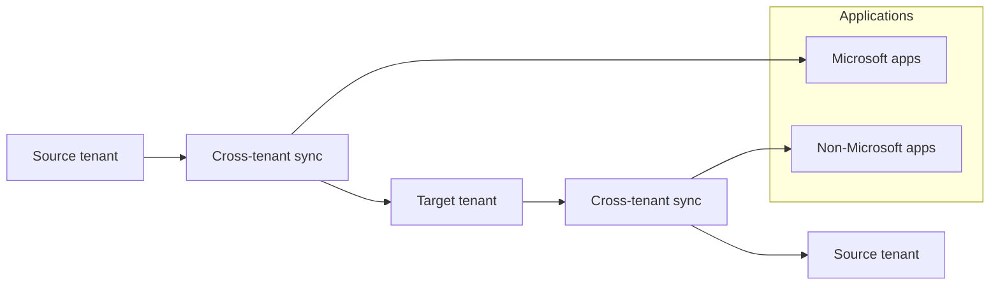

For more information, see [What is cross-tenant synchronization](#).

# Multitenant organization

Multitenant organization is a feature in Microsoft Entra ID and Microsoft 365 that enables you to form a tenant group within your organization. Each pair of tenants in the group is governed by cross-tenant access settings that you can use to configure B2B or cross-tenant synchronization.

Here are the primary benefits of a multitenant organization:

· Differentiate in-organization and out-of-organization external users

· Improved collaborative experience in new Microsoft Teams

· Improved people search experience across tenants

<figure>
Diagram showing three tenants. The top tenant is labeled "Owner tenant (C)," and it's connected to two "Member tenants (A and B)" through cross-tenant access settings.
</figure>

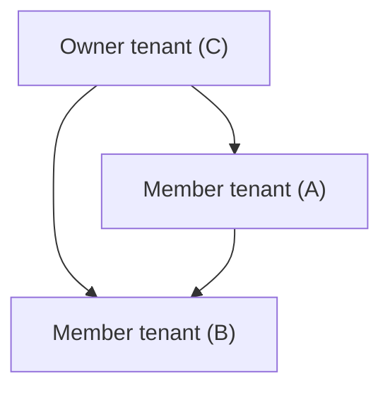

For more information, see What is a multitenant organization in Microsoft Entra ID?.

# Compare multitenant capabilities

Depending on the needs of your organization, you can use any combination of B2B direct connect, B2B collaboration, cross-tenant synchronization, and multitenant organization capabilities. B2B direct connect and B2B collaboration are independent capabilities, while cross-tenant synchronization and multitenant organization capabilities are independent of each other, though both rely on underlying B2B collaboration.

The following table compares the capabilities of each feature. For more information about different external identity scenarios, see Comparing External Identities feature sets.

| | B2B direct connect (Org-to-org external or internal) | B2B collaboration (Org-to-org external or internal) | Cross-tenant synchronization (Org internal) | Multitenant organization (Org internal) |
| - | - | - | - | - |
| Purpose | Users can access Teams Connect shared channels hosted in external tenants. | Users can access apps/resources hosted in external tenants, usually with limited guest privileges. Depending on automatic redemption settings, users might need to accept a consent prompt in each tenant. | Users can seamlessly access apps/resources across the same organization, even if they're hosted in different tenants. | Users can more seamlessly collaborate across a multitenant organization in new Teams and people search. |
| Value | Enables external collaboration within Teams Connect shared channels only. More convenient for administrators because they don't have to manage B2B users. | Enables external collaboration. More control and monitoring for administrators by managing the B2B collaboration users. Administrators can limit the access that these external users have to their apps/resources. | Enables collaboration across organizational tenants. Administrators don't have to manually invite and synchronize users between tenants to ensure continuous access to apps/resources within the organization. | Enables collaboration across organizational tenants. Administrators continue to have full configuration ability via cross-tenant access settings. Optional cross-tenant access templates allow pre-configuration of cross-tenant access settings. |
| Primary administrator workflow | Configure cross-tenant access to provide external users inbound access to tenant the credentials for their home tenant. | Add external users to resource tenant by using the B2B invitation process or build your own onboarding experience using the B2B collaboration | Configure the cross-tenant synchronization engine to synchronize users between multiple tenants as B2B collaboration users. | Create a multitenant organization, add (invite) tenants, join a multitenant organization. Leverage existing B2B collaboration users or use cross-tenant synchronization to |

| | B2B direct connect (Org-to-org external or internal) | B2B collaboration (Org-to-org external or internal) | Cross-tenant synchronization (Org internal) | Multitenant organization (Org internal) |
| - | - | - | - | - |
| | | invitation manager. | | provision B2B collaboration users. |
| Trust level | Mid trust. B2B direct connect users are less easy to track, mandating a certain level of trust with the external organization. | Low to mid trust. User objects can be tracked easily and managed with granular controls. | High trust. All tenants are part of the same organization, and users are typically granted member access to all apps/resources. | High trust. All tenants are part of the same organization, and users are typically granted member access to all apps/resources. |
| Effect on users | Users access the resource tenant using the credentials for their home tenant. User objects aren't created in the resource tenant. | External users are added to a tenant as B2B collaboration users. | Within the same organization, users are synchronized from their home tenant to the resource tenant as B2B collaboration users. | Within the same multitenant organization, B2B collaboration users, particularly member users, benefit from enhanced, seamless collaboration across Microsoft 365. |
| User type | B2B direct connect user - N/A | B2B collaboration user | B2B collaboration user | B2B collaboration user |
||| - External member ❌ | - External member (default) - External guest ❌ ❌ | - External member (default) ❌ |
||| - External guest (default) ❌ || - External guest |

The following diagram shows how B2B direct connect, B2B collaboration, and cross-tenant synchronization capabilities could be used together.

**Figure Description:** Diagram illustrating the integration of B2B direct connect, B2B collaboration, and cross-tenant synchronization.

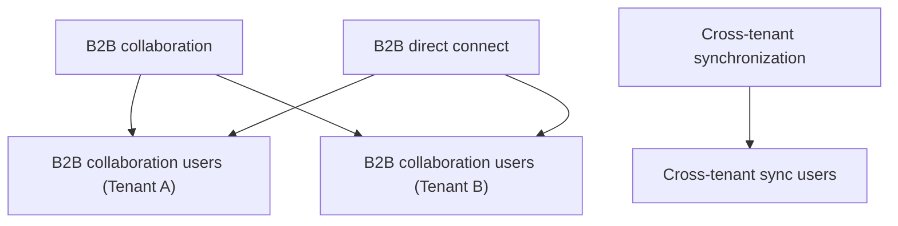

<!-- PageHeader="Org-to-org external" -->

<figure>
Org internal B2B collaboration Adatum Corporation (External collaborator) B2B collab users (External members) B2B collab users (External guests) Fabrikam (Acquired) Cross-tenant sync Contoso (Primary tenant) B2B direct connect B2B direct connect users Trey Research + (External collaborator)
</figure>

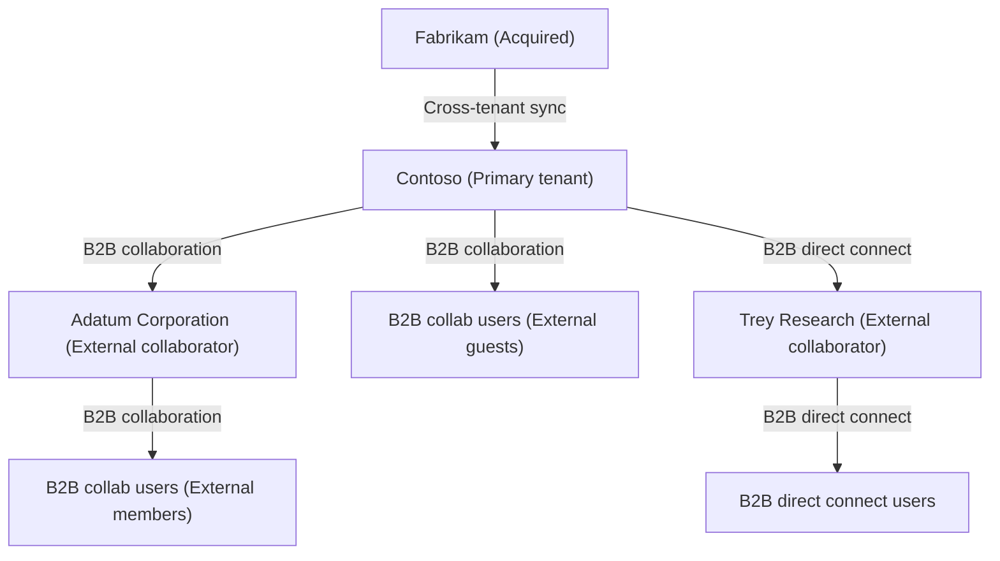

# Terminology

To better understand multitenant organization scenario related Microsoft Entra capabilities, you can refer back to the following list of terms.

[] Expand table

| Term | Definition |
| - | - |
| tenant | An instance of Microsoft Entra ID. |
| organization | The top level of a business hierarchy. |
| multitenant organization | An organization that has more than one instance of Microsoft Entra ID, as well as a capability to group those instances in Microsoft Entra ID. |
| creator tenant | The tenant that created the multitenant organization. |
| owner tenant | A tenant with the owner role. Initially, the creator tenant. |
| added tenant | A tenant that was added by an owner tenant. |
| joiner tenant | A tenant that is joining the multitenant organization. |
| join request | A joiner or added tenant submits a join request to join the multitenant organization. |
| pending tenant | A tenant that was added by an owner but that hasn't yet joined. |
| active tenant | A tenant that created or joined the multitenant organization. |

| Term | Definition |
| - | - |
| member tenant | A tenant with the member role. Most joiner tenants start as members. |
| multitenant organization tenant | An active tenant of the multitenant organization, not pending. |
| cross-tenant synchronization | A one-way synchronization service in Microsoft Entra ID that automates creating, updating, and deleting B2B collaboration users across tenants in an organization. |
| cross-tenant access settings | Settings to manage collaboration for specific Microsoft Entra organizations. |
| cross-tenant access settings template | An optional template to preconfigure cross-tenant access settings that are applied to any partner tenant newly joining the multitenant organization. |
| organizational settings | Cross-tenant access settings for specific Microsoft Entra organizations. |
| configuration | An application and underlying service principal in Microsoft Entra ID that includes the settings (such as target tenant, user scope, and attribute mappings) needed for cross-tenant synchronization. |
| provisioning | The process of automatically creating or synchronizing objects across a boundary. |
| automatic redemption | A B2B setting to automatically redeem invitations so newly created users don't receive an invitation email or have to accept a consent prompt when added to a target tenant. |

# Next steps

- What is a multitenant organization in Microsoft Entra ID?
- What is cross-tenant synchronization?

What is a multitenant organization in Microsoft Entra ID?
===

Article · 04/24/2024

Multitenant organization is a feature in Microsoft Entra ID and Microsoft 365 that enables you to form a tenant group within your organization. Each pair of tenants in the group is governed by cross-tenant access settings that you can use to configure B2B or cross-tenant synchronization.


# Why use multitenant organization?

Here are the primary goals of multitenant organization:

- Define a group of tenants belonging to your organization
- Collaborate across your tenants in new Microsoft Teams
- Enable search and discovery of user profiles across your tenants through Microsoft 365 people search


# Who should use it?

Organizations that own multiple Microsoft Entra tenants and want to streamline intra-organization cross-tenant collaboration in Microsoft 365.

The multitenant organization capability is built on the assumption of reciprocal provisioning of B2B member users across multitenant organization tenants.

As such, the multitenant organization capability assumes the simultaneous use of Microsoft Entra cross-tenant synchronization or an alternative bulk provisioning engine for external identities.


# Benefits

Here are the primary benefits of a multitenant organization:

- Differentiate in-organization and out-of-organization external users

In Microsoft Entra ID, external users originating from within a multitenant organization can be differentiated from external users originating from outside the multitenant organization. This differentiation facilitates the application of different policies for in-organization and out-of-organization external users.

# · Improved collaborative experience in Microsoft Teams

In new Microsoft Teams, multitenant organization users can expect an improved collaborative experience across tenants with chat, calling, and meeting start notifications from all connected tenants across the multitenant organization. Tenant switching is more seamless and faster. For more information, see Announcing more seamless collaboration in Microsoft Teams for multitenant organizations and Microsoft Teams: Advantages of the new architecture.

· Improved people search experience across tenants

Across Microsoft 365 services, the multitenant organization people search experience is a collaboration feature that enables search and discovery of people across multiple tenants. Once enabled, users are able to search and discover synced user profiles in a tenant's global address list and view their corresponding people cards. For more information, see Microsoft 365 multitenant organization people search.

# How does a multitenant organization work?

The multitenant organization capability enables you to form a tenant group within your organization. The following list describes the basic lifecycle of a multitenant organization.

· Define a multitenant organization

One tenant administrator defines a multitenant organization as a grouping of tenants. The grouping of tenants isn't reciprocal until each listed tenant takes action to join the multitenant organization. The objective is a reciprocal agreement between all listed tenants.

· Join a multitenant organization

Tenant administrators of listed tenants take action to join the multitenant organization. After joining, the multitenant organization relationship is reciprocal between each and every tenant that joined the multitenant organization.

· Leave a multitenant organization

Tenant administrators of listed tenants can leave a multitenant organization at any time. While a tenant administrator who defined the multitenant organization can add and remove listed tenants they don't control the other tenants.

A multitenant organization is established as a collaboration of equals. Each tenant administrator stays in control of their tenant and their membership in the multitenant organization.

# Cross-tenant access settings

Administrators staying in control of their resources is a guiding principle for multitenant organization collaboration. Cross-tenant access settings are required for each tenant-to-tenant relationship. Tenant administrators explicitly configure, as needed, the following policies:

- Cross-tenant access partner configurations

For more information, see Configure cross-tenant access settings for B2B collaboration and crossTenantAccessPolicyConfigurationPartner resource type.

- Cross-tenant access identity synchronization

For more information, see Configure cross-tenant synchronization and crossTenantIdentitySyncPolicyPartner resource type.

# Multitenant organization example

The following diagram shows three tenants A, B, and C that form a multitenant organization.

The diagram describes three nodes:
1. Owner tenant (C)
2. Member tenant (A)
3. Member tenant (B)

Each node represents a tenant and has lines indicating cross-tenant access settings among them.


| Tenant | Description |
| - | - |
| A | Administrators see a multitenant organization consisting of A, B, C. They also see cross-tenant access settings for B and C. |
| B | Administrators see a multitenant organization consisting of A, B, C. They also see cross-tenant access settings for A and C. |
| C | Administrators see a multitenant organization consisting of A, B, C. They also see cross-tenant access settings for A and B. |

# Templates for cross-tenant access settings

To ease the setup of homogenous cross-tenant access settings applied to partner tenants in the multitenant organization, the administrator of each multitenant organization tenant can configure optional cross-tenant access settings templates dedicated to the multitenant organization. These templates can be used to preconfigure cross-tenant access settings that are applied to any partner tenant newly joining the multitenant organization.

# Tenant role and state

To facilitate the management of a multitenant organization, any given multitenant organization tenant has an associated role and state.


| Tenant role | Description |
| - | - |
| Owner | One tenant creates the multitenant organization. The multitenant organization creating tenant receives the role of owner. The privilege of the owner tenant is to add tenants into a pending state as well as to remove tenants from the multitenant organization. Also, an owner tenant can change the role of other multitenant organization tenants. |
| Member | Following the addition of pending tenants to the multitenant organization, pending tenants need to join the multitenant organization to turn their state from pending to active. Joined tenants typically start in the member role. Any member tenant has the privilege to leave the multitenant organization. |


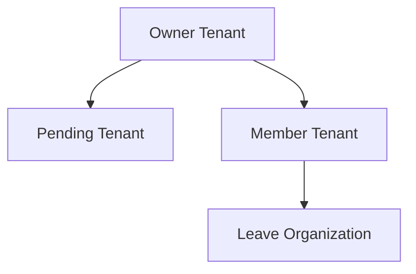

|||
| - | - |
| Tenant state | Description |
| Pending | A pending tenant has yet to join a multitenant organization. While listed in an administrator's view of the multitenant organization, a pending tenant isn't yet part of the multitenant organization, and as such is hidden from an end user's view of a multitenant organization. |
| Active | Following the addition of pending tenants to the multitenant organization, pending tenants need to join the multitenant organization to turn their state from pending to active. Joined tenants typically start in the member role. Any member tenant has the privilege to leave the multitenant organization. |

# Constraints

The multitenant organization capability has been designed with the following constraints:  

- Any given tenant can only create or join a single multitenant organization.  
- Any multitenant organization must have at least one active owner tenant.  
- Each active tenant must have cross-tenant access settings for all active tenants.  
- Any active tenant may leave a multitenant organization by removing themselves from it.  
- A multitenant organization is deleted when the only remaining active (owner) tenant leaves.  

# Limits


| Resource | Limit | Notes |
| - | - | - |
| Maximum number of active tenants, including the owner tenant | 100 | The owner tenant can add more than 100 pending tenants, but they won't be able to join the multitenant organization if the limit is exceeded. This limit is applied at the time a pending tenant joins a multitenant organization. This limit is specific to the number of tenants in a multitenant organization. It does not apply to cross-tenant synchronization by itself. To increase this limit, submit a support request in the Microsoft Entra or Microsoft 365 admin center. In the Microsoft Graph APIs, the default limit of 100 tenants is only enforced at the time of joining. In Microsoft 365 admin center, the default limit is enforced at multitenant organization creation time and at time of joining. |

# External user segmentation

By defining a multitenant organization, as well as pivoting on the Microsoft Entra user property of userType, external identities are segmented as follows:

- External members originating from within a multitenant organization
- External guests originating from within a multitenant organization
- External members originating from outside of your organization
- External guests originating from outside of your organization

This segmentation of external users, due to the definition of a multitenant organization, enables administrators to better differentiate in-organization from out-of-organization external users.

External members originating from within a multitenant organization are called multitenant organization members.

Multitenant collaboration capabilities in Microsoft 365 aim to provide a seamless collaboration experience across tenant boundaries when collaborating with multitenant organization member users.


# Choosing between Microsoft 365 admin center and cross-tenant synchronization

- If you haven't previously used Microsoft Entra cross-tenant synchronization, and you intend to establish a collaborating user set topology where the same set of users is shared to all multitenant organization tenants, you might want to use the Microsoft 365 admin center share users functionality.

- If you're already using Microsoft Entra cross-tenant synchronization, for various multi-hub multi-spoke topologies, you don't need to use the Microsoft 365 admin center share users functionality. Instead, you might want to continue using your existing Microsoft Entra cross-tenant synchronization jobs.


# Get started

Here are the basic steps to get started using multitenant organization.

# Step 1: Plan your deployment

For more information, see Plan for multitenant organizations in Microsoft 365.

# Step 2: Create your multitenant organization

Create your multitenant organization using Microsoft 365 admin center, Microsoft Graph PowerShell, or Microsoft Graph API:

· First tenant, soon-to-be owner tenant, creates a multitenant organization.

· Owner tenant adds one or more joiner tenants.


## Step 3: Join a multitenant organization

Join a multitenant organization using Microsoft 365 admin center or Microsoft Graph PowerShell, or Microsoft Graph API:

· Joiner tenants submit a join request to join the multitenant organization of owner tenant.

· To allow for asynchronous processing, wait up to 2 hours.

Your multitenant organization is formed.


# Step 4: Synchronize users

Depending on your use case, you may want to synchronize users using one of the following methods:

· Synchronize users in multitenant organizations in Microsoft 365

· Configure cross-tenant synchronization

· Configure cross-tenant synchronization using PowerShell or Microsoft Graph API

· Your alternative bulk provisioning engine


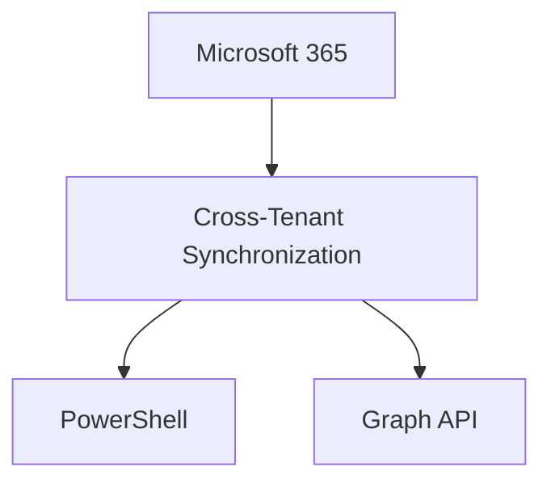

# License requirements

The multitenant organization capability requires Microsoft Entra ID P1 licenses. Only one Microsoft Entra ID P1 license is required per employee per multitenant organization. Also, you must have at least one Microsoft Entra ID P1 license per tenant. To find the right license for your requirements, see Compare generally available features of Microsoft Entra ID.

# Next steps

· Plan for multitenant organizations in Microsoft 365

· What is cross-tenant synchronization?

What is cross-tenant synchronization?
===

Article · 01/03/2024

Cross-tenant synchronization automates creating, updating, and deleting Microsoft Entra B2B collaboration users across tenants in an organization. It enables users to access applications and collaborate across tenants, while still allowing the organization to evolve.

Here are the primary goals of cross-tenant synchronization:

- Seamless collaboration for a multitenant organization
- Automate lifecycle management of B2B collaboration users in a multitenant organization
- Automatically remove B2B accounts when a user leaves the organization


# Why use cross-tenant synchronization?

Cross-tenant synchronization automates creating, updating, and deleting B2B collaboration users. Users created with cross-tenant synchronization are able to access both Microsoft applications (such as Teams and SharePoint) and non-Microsoft applications (such as ServiceNow, Adobe, and many more), regardless of which tenant the apps are integrated with. These users continue to benefit from the security capabilities in Microsoft Entra ID, such as Microsoft Entra Conditional Access and cross-tenant access settings, and can be governed through features such as Microsoft Entra entitlement management.

The following diagram shows how you can use cross-tenant synchronization to enable users to access applications across tenants in your organization.


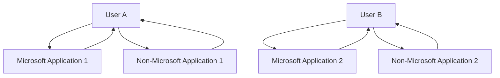


<figure>

The illustration depicts the cross-tenant synchronization process among multiple Microsoft Entra tenants. It includes the following tenants: Fabrikam Mexico, Fabrikam US, Contoso. The illustration shows internal and external users, as well as the integration with Microsoft and non-Microsoft apps.

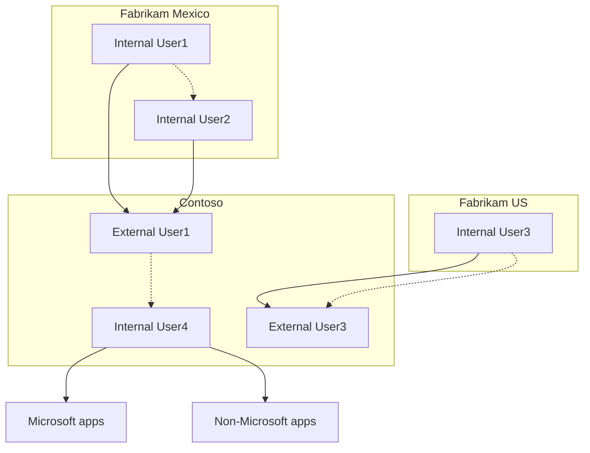

</figure>

# Who should use?

- Organizations that own multiple Microsoft Entra tenants and want to streamline intra-organization cross-tenant application access.
- Cross-tenant synchronization is not currently suitable for use across organizational boundaries.

# Benefits

With cross-tenant synchronization, you can do the following:

- Automatically create B2B collaboration users within your organization and provide them access to the applications they need, without creating and maintaining custom scripts.
- Improve the user experience and ensure that users can access resources, without receiving an invitation email and having to accept a consent prompt in each tenant.
- Automatically update users and remove them when they leave the organization.

# Teams and Microsoft 365

Users created by cross-tenant synchronization will have the same experience when accessing Microsoft Teams and other Microsoft 365 services as B2B collaboration users created through a manual invitation. If your organization uses shared channels, please see the known issues document for additional details. Over time, the member userType will be used by the various Microsoft 365 services to provide differentiated end user experiences for users in a multitenant organization.

# Properties

When you configure cross-tenant synchronization, you define a trust relationship between a source tenant and a target tenant. Cross-tenant synchronization has the following properties:

- Based on the Microsoft Entra provisioning engine.
- Is a push process from the source tenant, not a pull process from the target tenant.
- Supports pushing only internal members from the source tenant. It doesn't support syncing external users from the source tenant.
- Users in scope for synchronization are configured in the source tenant.
- Attribute mapping is configured in the source tenant.
- Extension attributes are supported.
- Target tenant administrators can stop a synchronization at any time.

The following table shows the parts of cross-tenant synchronization and which tenant they're configured.

![Description: A table listing the parts of cross-tenant synchronization and their configuration in source and target tenants]

| Tenant        | Cross-tenant access settings | Automatic redemption | Sync settings configuration | Users in scope |
|---------------|------------------------------|-----------------------|----------------------------|----------------|
| Source tenant |                              | ✅            | ✅                 | ✅     |
| Target tenant | ✅                   | ✅            |                            |                |

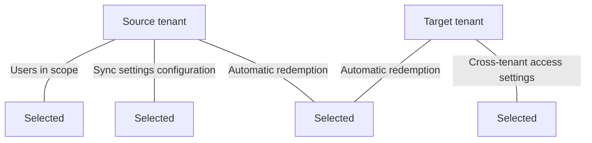

# Cross-tenant synchronization setting

The cross-tenant synchronization setting is an inbound only organizational setting to allow the administrator of a source tenant to synchronize users into a target tenant. This setting is a check box with the name Allow users sync into this tenant that is specified in the target tenant. This setting doesn't impact B2B invitations created through other processes such as manual invitation or Microsoft Entra entitlement management.

Home > Contoso | External Identities > External Identities | Cross-tenant access settings > Inbound access settings - Contoso ===

X ✅ B2B collaboration B2B direct connect Trust settings Cross-tenant sync

Enabling this will allow the admin of the specified (source) tenant to sync objects into this (target) tenant.

Disabling this will block admins of the source tenant from syncing objects into the target tenant but will not remove currently synced objects. We recommend that this setting should only be used between tenants that are part of the same organization. ✅ V Allow users sync into this tenant

Save

Discard

To configure this setting using Microsoft Graph, see the Update crossTenantIdentitySyncPolicyPartner API. For more information, see Configure cross- tenant synchronization.

## Automatic redemption setting

The automatic redemption setting is an inbound and outbound organizational trust setting to automatically redeem invitations so users don't have to accept the consent prompt the first time they access the resource/target tenant. This setting is a check box with the following name:

- Automatically redeem invitations with the tenant <tenant>

<figure>
[Figure depicting the automatic redemption setting. A checkbox is used to enable or disable the automatic redemption of invitations. The checkbox is labeled "Automatically redeem invitations with the tenant fc19f6b2-c752-43d3-a1aa-c75e9a85a7dc."]
</figure>

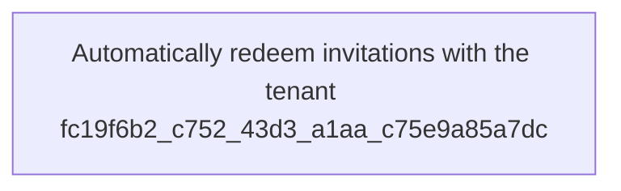

### Compare setting for different scenarios

The automatic redemption setting applies to cross-tenant synchronization, B2B collaboration, and B2B direct connect in the following situations:

\+ ❌

· When users are created in a target tenant using cross-tenant synchronization.
· When users are added to a resource tenant using B2B collaboration.
· When users access resources in a resource tenant using B2B direct connect.

The following table shows how this setting compares when enabled for these scenarios:

| Item | Cross-tenant synchronization | B2B collaboration | B2B direct connect |
| - | - | - | - |
| Automatic redemption setting | Required | Optional | Optional |
| Users receive a B2B collaboration invitation email | No | No | N/A |
| Users must accept a consent prompt | No | No | No |
| Users receive a B2B collaboration notification email | No | Yes | N/A |

This setting doesn't impact application consent experiences. For more information, see Consent experience for applications in Microsoft Entra ID. This setting isn't supported for organizations across different Microsoft cloud environments, such as Azure commercial and Azure Government.

# When is consent prompt suppressed?

The automatic redemption setting will only suppress the consent prompt and invitation email if both the home/source tenant (outbound) and resource/target tenant (inbound) checks this setting.

Figure description: 
Source tenant → Target tenant
Outbound access settings
:checked: > Automatically redeem invitations
Inbound access settings
:checked: > Automatically redeem invitations

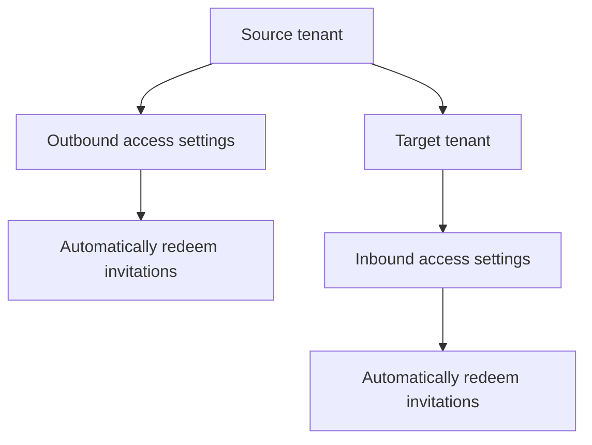

The following table shows the consent prompt behavior for source tenant users when the automatic redemption setting is checked for different cross-tenant access setting combinations.

Home/source tenant

Resource/target tenant

Consent prompt behavior for source tenant users

| Outbound | Inbound | |
| - | - | - |
| ✅ V | ✅ > | Suppressed |
| ✅ V | ❌ | Not suppressed |
| ❌ | ✅ | Not suppressed |
| ❌ | ❌ | Not suppressed |
| Inbound | Outbound | |
| ✅ V | ✅ > | Not suppressed |
| ✅ V | ❌ | Not suppressed |
| ❌ | ✅ | Not suppressed |
| ❌ | ❌ | Not suppressed |

To configure this setting using Microsoft Graph, see the Update crossTenantAccessPolicyConfigurationPartner API. For more information, see Configure cross-tenant synchronization.

# How do users know what tenants they belong to?

For cross-tenant synchronization, users don't receive an email or have to accept a consent prompt. If users want to see what tenants they belong to, they can open their My Account page and select Organizations. In the Microsoft Entra admin center, users can open their Portal settings, view their Directories + subscriptions, and switch directories.

For more information, including privacy information, see Leave an organization as an external user.

# Get started

Here are the basic steps to get started using cross-tenant synchronization.

# Step 1: Define how to structure the tenants in your organization

Cross-tenant synchronization provides a flexible solution to enable collaboration, but every organization is different. For example, you might have a central tenant, satellite tenants, or sort of a mesh of tenants. Cross-tenant synchronization supports any of these topologies. For more information, see Topologies for cross-tenant synchronization.

A diagram illustrating possible tenant structures.

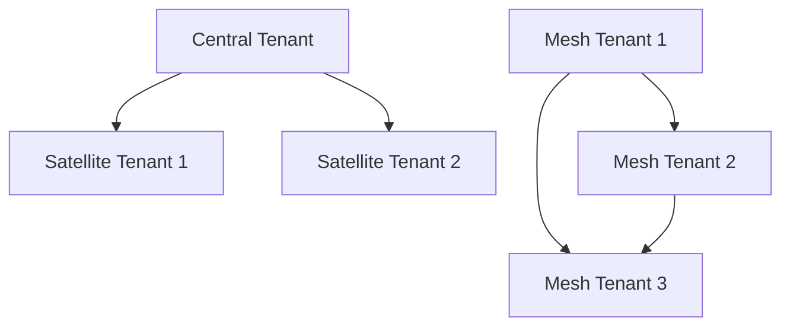

# Step 2: Enable cross-tenant synchronization in the target tenants

In the target tenant where users are created, navigate to the Cross-tenant access settings page. Here you enable cross-tenant synchronization and the B2B automatic redemption settings by selecting the respective check boxes. For more information, see Configure cross-tenant synchronization.

Diagram showing the "Target tenant" with settings for "Inbound access" that have "Allow users sync into this tenant" and "Automatically redeem invitations" checked.

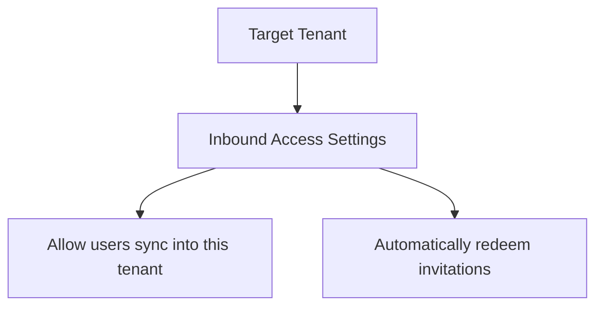

# Step 3: Enable cross-tenant synchronization in the source tenants

In any source tenant, navigate to the Cross-tenant access settings page and enable the B2B automatic redemption feature. Next, you use the Cross-tenant synchronization page to set up a cross-tenant synchronization job and specify:

* Which users you want to synchronize
* What attributes you want to include
* Any transformations

For anyone that has used Microsoft Entra ID to provision identities into a SaaS application, this experience will be familiar. Once you have synchronization configured,

you can start testing with a few users and make sure they're created with all the attributes that you need. When testing is complete, you can quickly add additional users to synchronize and roll out across your organization. For more information, see Configure cross-tenant synchronization.

Cross-tenant synchronization illustration showing the source tenant and target tenant with selected settings for allowing user sync and auto-redeeming invitations.

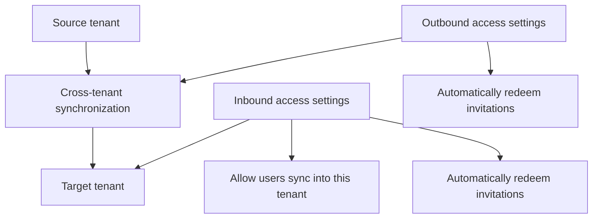

# License requirements

In the source tenant: Using this feature requires Microsoft Entra ID P1 licenses. Each user who is synchronized with cross-tenant synchronization must have a P1 license in their home/source tenant. To find the right license for your requirements, see Compare generally available features of Microsoft Entra ID.

In the target tenant: Cross-tenant sync relies on the Microsoft Entra External ID billing model. To understand the external identities licensing model, see MAU billing model for Microsoft Entra External ID. You will also need at least one Microsoft Entra ID P1 license in the target tenant to enable auto-redemption.

# Frequently asked questions

# Clouds

Which clouds can cross-tenant synchronization be used in?

- Cross-tenant synchronization is supported within the commercial cloud and Azure Government.
- Cross-tenant synchronization isn't supported within the Microsoft Azure operated by 21Vianet cloud.
- Synchronization is only supported between two tenants in the same cloud.
- Cross-cloud (such as public cloud to Azure Government) isn't currently supported.

# Existing B2B users

Will cross-tenant synchronization manage existing B2B users?

. Yes. Cross-tenant synchronization uses an internal attribute called the alternativeSecurityIdentifier to uniquely match an internal user in the source tenant with an external / B2B user in the target tenant. Cross-tenant synchronization can update existing B2B users, ensuring that each user has only one account.

· Cross-tenant synchronization cannot match an internal user in the source tenant with an internal user in the target tenant (both type member and type guest).

# Synchronization frequency

How often does cross-tenant synchronization run?

· The sync interval is currently fixed to start at 40-minute intervals. Sync duration varies based on the number of in-scope users. The initial sync cycle is likely to take significantly longer than the following incremental sync cycles.

# Scope

How do I control what is synchronized into the target tenant?

· In the source tenant, you can control which users are provisioned with the configuration or attribute-based filters. You can also control what attributes on the user object are synchronized. For more information, see Scoping users or groups to be provisioned with scoping filters.

If a user is removed from the scope of sync in a source tenant, will cross-tenant synchronization soft delete them in the target?

· Yes. If a user is removed from the scope of sync in a source tenant, cross-tenant synchronization will soft delete them in the target tenant.

# Object types

What object types can be synchronized?

· Microsoft Entra users can be synchronized between tenants. (Groups, devices, and contacts aren't currently supported.)

What user types can be synchronized?

· Internal members can be synchronized from source tenants. Internal guests can't be synchronized from source tenants.
 
· Users can be synchronized to target tenants as external members (default) or external guests.

**Figure 1:**
Diagram showing the synchronization process between tenants.

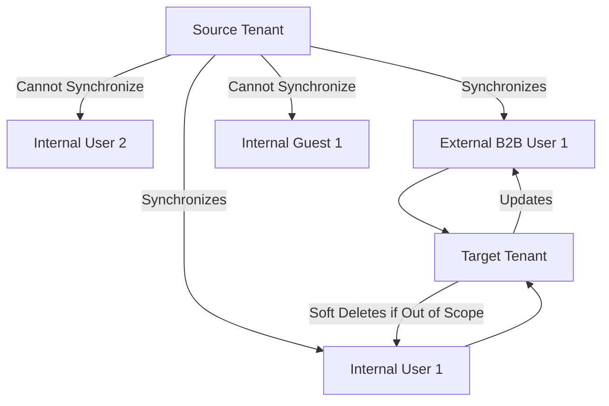

. For more information about the UserType definitions, see Properties of a Microsoft Entra B2B collaboration user.

I have existing B2B collaboration users. What will happen to them?

· Cross-tenant synchronization will match the user and make any necessary updates to the user, such as update the display name. By default, the UserType won't be updated from guest to member, but you can configure this in the attribute mappings.

# Attributes

What user attributes can be synchronized?

· Cross-tenant synchronization will sync commonly used attributes on the user object in Microsoft Entra ID, including (but not limited to) displayName, userPrincipalName, and directory extension attributes.

· Cross-tenant synchronization supports provisioning the manager attribute. Both the user and their manager must be in scope for provisioning.

o For cross-tenant synchronization configurations created before January 2024, with the default schema / attribute mappings:

o The manager attribute will automatically be added to the mappings.
 
o This does not trigger an initial sync cycle.
 
o Manager updates will apply on the incremental cycle for users that are undergoing changes (e.g. manager change). The sync engine doesn't automatically update all existing users that were provisioned previously.
 
o To update the manager for existing users that are in scope for provisioning, you can use on-demand provisioning for specific users or do a restart to provision the manager for all users.

o For cross-tenant synchronization configurations created before January 2024, with a custom schema / attribute mappings (e.g. you added an attribute to the mappings or changed the default mappings):

o You need to manually add the manager attribute to your attribute mappings. This will trigger a restart and update all users that are in scope for provisioning. This should be a direct mapping of the manager attribute in the source tenant to the manager in the target tenant.

o If the manager of a user is removed in the source tenant and no new manager is assigned in the source tenant, the manager attribute will not be updated in the target tenant.

What attributes can't be synchronized?

· Attributes including (but not limited to) photos, custom security attributes, and user attributes outside of the directory can't be synchronized by cross-tenant synchronization.

Can I control where user attributes are sourced/managed?

· Cross-tenant synchronization doesn't offer direct control over source of authority. The user and its attributes are deemed authoritative at the source tenant. There are parallel sources of authority workstreams that will evolve source of authority controls for users down to the attribute level and a user object at the source may ultimately reflect multiple underlying sources. For the tenant-to-tenant process, this is still treated as the source tenant's values being authoritative for the sync process (even if pieces actually originate elsewhere) into the target tenant. Currently, there's no support for reversing the sync process's source of authority.

· Cross-tenant synchronization only supports source of authority at the object level. That means all attributes of a user must come from the same source, including credentials. It isn't possible to reverse the source of authority or federation direction of a synchronized object.

What happens if attributes for a synced user are changed in the target tenant?

· Cross-tenant synchronization doesn't query for changes in the target. If no changes are made to the synced user in the source tenant, then user attribute changes made in the target tenant will persist. However, if changes are made to the user in the source tenant, then during the next synchronization cycle, the user in the target tenant will be updated to match the user in the source tenant.

Can the target tenant manually block sign-in for a specific home/source tenant user that is synced?

· If no changes are made to the synced user in the source tenant, then the block sign-in setting in the target tenant will persist. If a change is detected for the user in the source tenant, cross-tenant synchronization will re-enable that user blocked from sign-in in the target tenant.

# Structure

Can I sync a mesh between multiple tenants?

· Cross-tenant synchronization is configured as a single-direction peer-to-peer sync, meaning sync is configured between one source and one target tenant. Multiple instances of cross-tenant synchronization can be configured to sync from a single

source to multiple targets and from multiple sources into a single target. But only one sync instance can exist between a source and a target.

- Cross-tenant synchronization only synchronizes users that are internal to the home/source tenant, ensuring that you can't end up with a loop where a user is written back to the same tenant.
- Multiple topologies are supported. For more information, see Topologies for cross-tenant synchronization.

Can I use cross-tenant synchronization across organizations (outside my multitenant organization)?

- For privacy reasons, cross-tenant synchronization is intended for use within an organization. We recommend using entitlement management for inviting B2B collaboration users across organizations.

Can cross-tenant synchronization be used to migrate users from one tenant to another tenant?

- No. Cross-tenant synchronization isn't a migration tool because the source tenant is required for synchronized users to authenticate. In addition, tenant migrations would require migrating user data such as SharePoint and OneDrive.

# B2B collaboration

Does cross-tenant synchronization resolve any present B2B collaboration limitations?

- Since cross-tenant synchronization is built on existing B2B collaboration technology, existing limitations apply. Examples include (but aren't limited to):


| App or service           | Limitations                                                                                                                     |
|--------------------------|---------------------------------------------------------------------------------------------------------------------------------|
| Power BI                 | - Support for UserType Member in Power BI is currently in preview. For more information, see Distribute Power BI content to external guest users with Microsoft Entra B2B. |
| Azure Virtual Desktop    | - External member and external guest aren't supported in Azure Virtual Desktop.                                                  |


# B2B direct connect

How does cross-tenant synchronization relate to B2B direct connect?
 


- B2B direct connect is the underlying identity technology required for Teams Connect shared channels.

- We recommend B2B collaboration for all other cross-tenant application access scenarios, including both Microsoft and non-Microsoft applications.

- B2B direct connect and cross-tenant synchronization are designed to co-exist, and you can enable them both for broad coverage of cross-tenant scenarios.

We're trying to determine the extent to which we'll need to utilize cross-tenant synchronization in our multitenant organization. Do you plan to extend support for B2B direct connect beyond Teams Connect?

- There's no plan to extend support for B2B direct connect beyond Teams Connect shared channels.

# Microsoft 365

Does cross-tenant synchronization enhance any cross-tenant Microsoft 365 app access user experiences?

- Cross-tenant synchronization utilizes a feature that improves the user experience by suppressing the first-time B2B consent prompt and redemption process in each tenant.

- Synchronized users will have the same cross-tenant Microsoft 365 experiences available to any other B2B collaboration user.

Can cross-tenant synchronization enable people search scenarios where synchronized users appear in the global address list of the target tenant?

- Yes, but you must set the value for the `showInAddressList` attribute of synchronized users to True, which is not set by default. If you want to create a unified address list, you'll need to set up a mesh peer-to-peer topology. For more information, see Step 9: Review attribute mappings.

- Cross-tenant synchronization creates B2B collaboration users and doesn't create contacts.

# Teams

Does cross-tenant synchronization enhance any current Teams experiences?

- Synchronized users will have the same cross-tenant Microsoft 365 experiences available to any other B2B collaboration user.

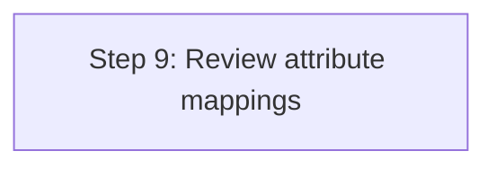

<!-- PageHeader="Integration" -->

What federation options are supported for users in the target tenant back to the source tenant?

· For each internal user in the source tenant, cross-tenant synchronization creates a federated external user (commonly used in B2B) in the target. It supports syncing internal users. This includes internal users federated to other identity systems using domain federation (such as Active Directory Federation Services). It doesn't support syncing external users.

Does cross-tenant synchronization use System for Cross-Domain Identity Management (SCIM)?

· No. Currently, Microsoft Entra ID supports a SCIM client, but not a SCIM server. For more information, see SCIM synchronization with Microsoft Entra ID.

# Deprovisioning

Does cross-tenant synchronization support deprovisioning users?

· Yes, when the below actions occur in the source tenant, the user will be soft deleted in the target tenant.

o Delete the user in the source tenant
o Unassign the user from the cross-tenant synchronization configuration
o Remove the user from a group that is assigned to the cross-tenant synchronization configuration
o An attribute on the user changes such that they do not meet the scoping filter conditions defined on the cross-tenant synchronization configuration anymore

· If the user is blocked from sign-in in the source tenant (accountEnabled = false) they will be blocked from sign-in in the target. This is not a deletion, but an updated to the accountEnabled property.

· Users are not soft deleted from the target tenant in this scenario:

1. Add a user to a group and assign it to the cross-tenant synchronization configuration in the source tenant.
2. Provision the user on-demand or through the incremental cycle.
3. Update the account enabled status to false on the user in the source tenant.
4. Provision the user on-demand or through the incremental cycle. The account enabled status is changed to false in the target tenant.
5. Remove the user from the group in the source tenant.

```mermaid
sequenceDiagram
    participant SourceTenant as Source Tenant
    participant TargetTenant as Target Tenant

    SourceTenant->>TargetTenant: Add user to group assigned to cross-tenant sync
    TargetTenant-->>SourceTenant: Provision user on-demand or through incremental cycle
    SourceTenant->>TargetTenant: Update account enabled status to false on user
    TargetTenant-->>SourceTenant: Provision user on-demand or through incremental cycle to update status
    SourceTenant->>TargetTenant: Remove user from group
```

Does cross-tenant synchronization support restoring users?

- If the user in the source tenant is restored, reassigned to the app, meets the scoping condition again within 30 days of soft deletion, it will be restored in the target tenant.
- IT admins can also manually restore the user directly in the target tenant.

How can I deprovision all the users that are currently in scope of cross-tenant synchronization?

- Unassign all users and / or groups from the cross-tenant synchronization configuration. This will trigger all the users that were unassigned, either directly or through group membership, to be deprovisioned in subsequent sync cycles. Please note that the target tenant will need to keep the inbound policy for sync enabled until deprovisioning is complete. If the scope is set to Sync all users and groups, you will also need to change it to Sync only assigned users and groups. The users will be automatically soft deleted by cross-tenant synchronization. The users will be automatically hard deleted after 30 days or you can choose to hard delete the users directly from the target tenant. You can choose to hard delete the users directly in the target tenant or wait 30 days for the users to be automatically hard deleted.

If the sync relationship is severed, are external users previously managed by cross-tenant synchronization deleted in the target tenant?

- No. No changes are made to the external users previously managed by cross-tenant synchronization if the relationship is severed (for example, if the cross-tenant synchronization policy is deleted).

# Next steps

- Topologies for cross-tenant synchronization
- Configure cross-tenant synchronization

Multitenant organization identity provisioning for Microsoft 365
===

Article · 04/24/2024

The multitenant organization capability is designed for organizations that own multiple Microsoft Entra tenants and want to streamline intra-organization cross-tenant collaboration in Microsoft 365. It's built on the premise of reciprocal provisioning of B2B member users across multitenant organization tenants.

# Microsoft 365 people search

Teams external access and Teams shared channels excluded, Microsoft 365 people search is typically scoped to within local tenant boundaries. In multitenant organizations with increased need for cross-tenant coworker collaboration, it's recommended to reciprocally provision users from their home tenants into the resource tenants of collaborating coworkers.

# New Microsoft Teams

The new Microsoft Teams experience improves upon Microsoft 365 people search and Teams external access for a unified seamless collaboration experience. For this improved experience to light up, the multitenant organization representation in Microsoft Entra ID is required and collaborating users shall be provisioned as B2B members. For more information, see Announcing more seamless collaboration in Microsoft Teams for multitenant organizations.

# Collaborating user set

Collaboration in Microsoft 365 is built on the premise of reciprocal provisioning of B2B identities across multitenant organization tenants.

For example, say Annie in tenant A, Bob and Barbara in tenant B, and Charlie in tenant C want to collaborate. Conceptually, these four users represent a collaborating user set of four internal identities across three tenants.


<figure>

"Diagram depicting tenants A, B, and C each containing internal and B2B identities: Tenant A has an internal user, Annie; Tenant B has internal users Bob and Barbara; Tenant C has an internal user, Charles."

```mermaid
graph TD;
    TenantA["Tenant A"] --> Annie_Internal["Internal: Annie"]
    TenantB["Tenant B"] --> Bob_Internal["Internal: Bob"]
    TenantB --> Barbara_Internal["Internal: Barbara"]
    TenantC["Tenant C"] --> Charles_Internal["Internal: Charles"]
```
</figure>

For people search to succeed, while scoped to local tenant boundaries, the entire collaborating user set must be represented within the scope of each multitenant organization tenant A, B, and C, in the form of either internal or B2B identities.

<figure>

"Diagram showing tenants A, B, and C with both internal and external users. Tenant A now has an internal user Annie and external users Bob, Barbara, and Charles. Tenant B has internal users Bob and Barbara and external users Annie and Charles. Tenant C has an internal user Charles and external users Annie, Bob, and Barbara."

```mermaid
graph TD;
    subgraph TenantA["Tenant A"]
        Annie_Internal_A["Internal: Annie"]
        Bob_External_A["External: Bob"]
        Barbara_External_A["External: Barbara"]
        Charles_External_A["External: Charles"]
    end

    subgraph TenantB["Tenant B"]
        Bob_Internal_B["Internal: Bob"]
        Barbara_Internal_B["Internal: Barbara"]
        Annie_External_B["External: Annie"]
        Charles_External_B["External: Charles"]
    end

    subgraph TenantC["Tenant C"]
        Charles_Internal_C["Internal: Charles"]
        Annie_External_C["External: Annie"]
        Bob_External_C["External: Bob"]
        Barbara_External_C["External: Barbara"]
    end
```

</figure>

Depending on your organization's needs, the collaborating user set may contain a subset of collaborating employees, or eventually all employees.

# Sharing your users

One of the simpler ways to achieve a collaborating user set in each multitenant organization tenant is for each tenant administrator to define their user contribution and synchronization outbound. Tenant administrators on the receiving end should accept the shared users inbound.

* Administrator A contributes or shares Annie
* Administrator B contributes or shares Bob and Barbara
* Administrator C contributes or shares Charles

<figure>

Diagram depicting the relationship and user synchronization across three tenants in a multitenant organization. The tenants are Tenant A, Tenant B, and Tenant C, with users classified as Internal or External.

```mermaid
graph TD;
    TenantB["Tenant B"]
    TenantA["Tenant A"]
    TenantC["Tenant C"]
    
    InternalBob["Internal Bob"] --> TenantB
    InternalBarbara["Internal Barbara"] --> TenantB
    ExternalAnnie_B["External Annie"] --> TenantB
    ExternalCharles_B["External Charles"] --> TenantB
    
    InternalAnnie_A["Internal Annie"] --> TenantA
    ExternalBob_A["External Bob"] --> TenantA
    ExternalBarbara_A["External Barbara"] --> TenantA
    ExternalCharles_A["External Charles"] --> TenantA
    
    InternalCharles_C["Internal Charles"] --> TenantC
    ExternalAnnie_C["External Annie"] --> TenantC
    ExternalBob_C["External Bob"] --> TenantC
    ExternalBarbara_C["External Barbara"] --> TenantC
    
    TenantB --> TenantA
    TenantA --> TenantB
    
    TenantB --> TenantC
    TenantC --> TenantB
    
    TenantA --> TenantC
    TenantC --> TenantA
    
    style InternalBob fill:#00f
    style InternalBarbara fill:#00f
    style ExternalAnnie_B fill:#f0f
    style ExternalCharles_B fill:#f0f
    style InternalAnnie_A fill:#00f
    style ExternalBob_A fill:#f0f
    style ExternalBarbara_A fill:#f0f
    style ExternalCharles_A fill:#f0f
    style InternalCharles_C fill:#00f
    style ExternalAnnie_C fill:#f0f
    style ExternalBob_C fill:#f0f
    style ExternalBarbara_C fill:#f0f
```

</figure>

Microsoft 365 admin center facilitates orchestration of such a collaborating user set across multitenant organization tenants. For more information, see Synchronize users in multitenant organizations in Microsoft 365.

Alternatively, pair-wise configuration of inbound and outbound cross-tenant synchronization can be used to orchestrate such collating user set across multitenant organization tenants. For more information, see What is a cross-tenant synchronization.

# B2B member users

To ensure a seamless collaboration experience across the multitenant organization in new Microsoft Teams, B2B identities are provisioned as B2B users of Member userType.

Expand table

| User synchronization method | Default userType property |
| - | - |
| Synchronize users in multitenant organizations in Microsoft 365 | Member Remains Guest, if the B2B identity already existed as Guest |
| Cross-tenant synchronization in Microsoft Entra ID | Member Remains Guest, if the B2B identity already existed as Guest |

From a security perspective, you should review the default permissions granted to B2B member users. For more information, see Compare member and guest default permissions.

To change the userType from Guest to Member (or vice versa), a source tenant administrator can amend the attribute mappings, or a target tenant administrator can change the userType if the property is not recurringly synchronized.

# Unsharing your users

To unshare users, you deprovision users by using the user deprovisioning capabilities available in Microsoft Entra cross-tenant synchronization. By default, when provisioning scope is reduced while a synchronization job is running, users fall out of scope and are soft deleted, unless Target Object Actions for Delete is disabled. For more information, see Deprovisioning and Define who is in scope for provisioning.

# Next steps

- Plan for multitenant organizations in Microsoft 365
- Set up a multitenant org in Microsoft 365

Multitenant organization optional policy templates
===

Article · 04/23/2024

Administrators staying in control of their resources is a guiding principle for multitenant organization collaboration. Cross-tenant access settings are required for each tenant-to-tenant relationship. Tenant administrators explicitly configure cross-tenant access partner configurations and identity synchronization settings for partner tenants inside the multitenant organization.

To help apply homogenous cross-tenant access settings to partner tenants in the multitenant organization, the administrator of each tenant can configure optional cross-tenant access settings templates dedicated to the multitenant organization. This article describes how to use templates to preconfigure cross-tenant access settings that are applied to any partner tenant newly joining the multitenant organization.

# Autogeneration of cross-tenant access settings

Within a multitenant organization, each pair of tenants must have bi-directional cross-tenant access settings, for both, partner configuration and identity synchronization. These settings provide the underlying policy framework for enabling trust and for sharing users and applications.

When your tenant joins a new multitenant organization, or when a partner tenant joins your existing multitenant organization, cross-tenant access settings to other partner tenants in the enlarged multitenant organization, if they don't already exist, are automatically generated in an unconfigured state. In an unconfigured state, these cross-tenant access settings pass through the default settings.

Default cross-tenant access settings apply to all external tenants for which you haven't created organization-specific customized settings. Typically, these settings are configured to be nontrusting. For example, cross-tenant trusts for multifactor authentication and compliant device claims might be disabled and user and group sharing in B2B direct connect or B2B collaboration might be disallowed.

In multitenant organizations, on the other hand, cross-tenant access settings are typically expected to be trusting. For example, cross-tenant trusts for multifactor authentication and compliant device claims might be enabled and user and group sharing in B2B direct connect or B2B collaboration might be allowed.


While the autogeneration of cross-tenant access settings for multitenant organization partner tenants in and of itself doesn't change any authentication or authorization policy behavior, it allows your organization to easily customize the cross-tenant access settings for partner tenants in the multitenant organization on a per-tenant basis.

# Policy templates at multitenant organization formation

As previously described, in multitenant organizations, cross-tenant access settings are typically expected to be trusting. For example, cross-tenant trusts for multifactor authentication and compliant device claims might be enabled and user and group sharing in B2B direct connect or B2B collaboration might be allowed.

While autogeneration of cross-tenant access settings, per previous section, guarantees the existence of cross-tenant access settings for every multitenant organization partner tenant, further maintenance of the cross-tenant access settings for multitenant organization partner tenants is conducted individually, on a per-tenant basis.

To reduce the workload for administrators at the time of multitenant organization formation, you can optionally use policy templates for preemptive configuration of cross-tenant access settings. These template settings are applied at the time of your tenant joins a multitenant organization to all external multitenant organization partner tenants as well as at the time of any partner tenant joins your existing multitenant organization to such new partner tenant.

Enablement or configuration of the optional policy templates, at the time of a partner tenant joins a multitenant organization, preemptively amend the corresponding cross-tenant access settings, for both partner configuration and identity synchronization.

As an example, consider the actions of the administrators for an anticipated multitenant organization with three tenants, A, B, and C.

- The administrators of all three tenants enable and configure their respective optional policy templates to enable cross-tenant trusts for multifactor authentication and compliant device claims and to allow user and group sharing in B2B direct connect and B2B collaboration.
- Administrator A creates the multitenant organization and adds tenants B and C as pending tenants to the multitenant organization.
- Administrator B joins the multitenant organization. Cross-tenant access settings in tenant A for partner tenant B are amended, according to tenant A policy template settings. Vice versa, cross-tenant access settings in tenant B for partner tenant A are amended, according to tenant B policy template settings.

```mermaid
graph TD;
    TenantA["Tenant A"] --> TenantB["Tenant B"]
    TenantA["Tenant A"] --> TenantC["Tenant C"]
    TenantB["Tenant B"] --> TenantC["Tenant C"]
```

If this generation is different from the information in the figures or illustrations in the original document being transcribed, ensure the mermaid code is re-evaluated and conforms accurately to the textual description.

- Administrator C joins the multitenant organization. Cross-tenant access settings in tenants A (and B) for partner tenant C are amended, according to tenant A (and B) policy template settings. Similarly, cross-tenant access settings in tenant C for partner tenants A and B are amended, according to tenant C policy template settings.
- Following the formation of this multitenant organization of three tenants, the cross-tenant access settings of all tenant pairs in the multitenant organization have preemptively been configured.

In summary, configuration of the optional policy templates enable you to homogeneously initialize cross-tenant access settings across your multitenant organization, while maintaining maximum flexibility to customize your cross-tenant access settings as needed on a per-tenant basis.

To stop using the policy templates, you can reset them to their default state. For more information, see Configure multitenant organization templates.

# Policy template scoping and additional properties

To provide administrators with further configurability, you can choose when cross-tenant access settings are to be amended according to the policy templates. For example, you can choose to apply the policy templates for the following tenants when a tenant joins a multitenant organization:

Expand table

| Tenant | Description |
| - | - |
| Only new partner tenants | Tenants whose cross-tenant access settings are autogenerated |
| Only existing partner tenants | Tenants who already have cross-tenant access settings |
| All partner tenants | Both new partner tenants and existing partner tenants |
| No partner tenants | Policy templates are effectively disabled |

In this context, new partners refer to tenants for which you haven't yet configured cross-tenant access settings, while existing partners refer to tenants for which you have already configured cross-tenant access settings. This scoping is specified with the `templateApplicationLevel` property on the cross-tenant access partner configuration template and the `templateApplicationLevel` property on the cross-tenant access identity synchronization template.

Finally, in terms of interpretation of template property values, any template property value of null has no effect on the corresponding property value in the targeted cross-tenant access settings, while a defined template property value causes the corresponding property value in the targeted cross-tenant access settings to be amended in accordance with the template. The following table illustrates how template property values are being applied to corresponding cross-tenant access setting values.

**Table**: Illustrates how template property values are applied to corresponding cross-tenant access setting values.

| Template Value | Initial Partner Settings Value (Before joining multitenant org) | Final Partner Settings Value (After joining multitenant org) |
| - | - | - |
| null | <Partner Settings Value> | <Partner Settings Value> |
| <Template Value> | <any value> | <Template Value> |

# Policy templates used by Microsoft 365 admin center

When a multitenant organization is formed in Microsoft 365 admin center, an administrator agrees to the following multitenant organization template settings:

· Identity synchronization is set to allow users to synchronize into this tenant

· Cross-tenant access is set to automatically redeem user invitations for both inbound and outbound

This is achieved by setting the corresponding three template property values to true:

· automaticUserConsentSettings.inboundAllowed

· automaticUserConsentSettings.outboundAllowed

· userSyncInbound

For more information, see Join or leave a multitenant organization in Microsoft 365.

```mermaid
graph TD;
    IdentitySynchronization["Identity synchronization is set to allow users to synchronize into this tenant"] --> automaticUserConsentSettings_inboundAllowed["automaticUserConsentSettings.inboundAllowed"]
    CrossTenantAccess["Cross-tenant access is set to automatically redeem user invitations for both inbound and outbound"] --> automaticUserConsentSettings_outboundAllowed["automaticUserConsentSettings.outboundAllowed"]
    CrossTenantAccess --> userSyncInbound["userSyncInbound"]
```

# Cross-tenant access settings at time of multitenant organization disassembly

Currently, there's no equivalent policy template feature supporting the disassembly of a multitenant organization. When a partner tenant leaves the multitenant organization, each tenant administrator must re-examine and amend accordingly the cross-tenant access settings for the partner tenant that left the multitenant organization.

The partner tenant that left the multitenant organization must re-examine and amend accordingly the cross-tenant access settings for all former multitenant organization partner tenants as well as consider resetting the two policy templates for cross-tenant access settings.

# Next steps

- [Configure multitenant organization templates using the Microsoft Graph API](https://learn.microsoft.com/graph/api/resources/organization)


# Limitations in multitenant organizations

Article · 04/24/2024

This article describes limitations to be aware of when you work with multitenant organization functionality across Microsoft Entra ID and Microsoft 365. To provide feedback about the multitenant organization functionality on UserVoice, see Microsoft Entra UserVoice. We watch UserVoice closely so that we can improve the service.

# Scope

The limitations described in this article have the following scope.


| Scope | Description |
| - | - |
| In scope | - Microsoft Entra administrator limitations related to multitenant organizations to support seamless collaboration experiences in new Teams, with reciprocally provisioned B2B members |
| Related scope | - Microsoft 365 admin center limitations related to multitenant organizations - Microsoft 365 multitenant organization people search experiences - Cross-tenant synchronization limitations related to Microsoft 365 |
| Out of scope | - Cross-tenant synchronization unrelated to Microsoft 365 - End user experiences in new Teams - End user experiences in Power BI - Tenant migration or consolidation |
| Unsupported scenarios | - Seamless collaboration experience across multitenant organizations in classic Teams - Self-service for multitenant organizations larger than 100 tenants - Multitenant organizations in Azure Government or Microsoft Azure operated by 21Vianet - Cross-cloud multitenant organizations |

# Microsoft 365 admin center versus cross-tenant synchronization

- Whether you use the Microsoft 365 admin center share users functionality or Microsoft Entra cross-tenant synchronization, the following items apply:
  - In the identity platform, both methods are represented as Microsoft Entra cross-tenant synchronization jobs.

· Synchronization jobs created with Microsoft Entra ID will not appear in the Microsoft 365 admin center.

· If you created your synchronization job in the Microsoft 365 admin center, do not modify the synchronization job name using Microsoft Entra ID, otherwise it will no longer appear in the admin center.

o You might adjust the attribute mappings to match your organizations' needs.

· By default, new B2B users are provisioned as B2B members, while existing B2B guests remain B2B guests.

o You can opt to convert B2B guests into B2B members by setting Apply this mapping to Always.

· If you're using Microsoft Entra cross-tenant synchronization to provision your users, rather than the Microsoft 365 admin center share users functionality, Microsoft 365 admin center indicates an Outbound sync status of Not configured. This is expected behavior. Currently, Microsoft 365 admin center only shows the status of Microsoft Entra cross-tenant synchronization jobs created and managed by Microsoft 365 admin center and doesn't display Microsoft Entra cross-tenant synchronizations created and managed in Microsoft Entra ID.

· If you view Microsoft Entra cross-tenant synchronization in Microsoft Entra admin center, after adding tenants to or after joining a multitenant organization in Microsoft 365 admin center, you'll see a cross-tenant synchronization configuration with the name MTO_Sync_<TenantID>. Refrain from editing or changing the name if you want Microsoft 365 admin center to recognize the configuration as created and managed by Microsoft 365 admin center.

· Microsoft Entra cross-tenant synchronization doesn't support establishing a cross- tenant synchronization configuration before the tenant in question allows inbound synchronization in their cross-tenant access settings for identity synchronization. Hence the usage of the cross-tenant access settings template for identity synchronization is encouraged, with userSyncInbound set to true, as facilitated by Microsoft 365 admin center.

· There's no established or supported pattern for Microsoft 365 admin center to take control of pre-existing Microsoft Entra cross-tenant synchronization configurations and jobs.

# Join requests

· There are multiple reasons why a join request might fail. If the Microsoft 365 admin center doesn't indicate why a join request isn't succeeding, try examining the join request response by using the Microsoft Graph APIs or Microsoft Graph Explorer.

* If you followed the correct sequence to create a multitenant organization and add a tenant to the multitenant organization, and the added tenant's join request keeps failing, submit a support request in the Microsoft Entra or Microsoft 365 admin center.

# Microsoft apps

* In SharePoint OneDrive, the promotion of B2B guests to B2B members might not happen automatically. If faced with a user type mismatch between Microsoft Entra ID and SharePoint OneDrive, try Set-SPUser [-SyncFromAD].

* In SharePoint OneDrive user interfaces, when sharing a file with People in Fabrikam, the current user interfaces might be counterintuitive, because B2B members in Fabrikam from Contoso count towards People in Fabrikam.

* In Microsoft Forms, B2B member users might not be able to access forms.

* In Microsoft Power BI, B2B member users are not yet supported. B2B guest users can continue to access Power BI dashboards.

* In Microsoft Power Apps, Microsoft Dynamics 365, and related workloads, B2B member users may have restricted functionality. For more information, see Invite users with Microsoft Entra B2B collaboration.

## B2B users or B2B members

* The promotion of B2B guests to B2B members represents a strategic decision by multitenant organizations to consider B2B members as trusted users of the organization. Review the default permissions for B2B members.

* To promote B2B guests to B2B members, a source tenant administrator can amend the attribute mappings, or a target tenant administrator can change the userType if the property is not recurringly synchronized.

* As your organization rolls out the multitenant organization functionality including provisioning of B2B users across multitenant organization tenants, you might want to provision some users as B2B guests, while provision others users as B2B members. To achieve this, you might want to establish two Microsoft Entra cross-tenant synchronization configurations in the source tenant, one with userType attribute mappings configured to B2B guest, and another with userType attribute mappings configured to B2B member, each with Apply this mapping set to

**Description of Illustration:** This section appears to display various toggle switches, each with either a 'selected' or 'unselected' state, suggesting different configuration options for synchronization settings.

```mermaid
graph TD;
    toggle1["Toggle 1: Selected"] --> toggle2["Toggle 2: Unselected"]
    toggle2 --> toggle3["Toggle 3: Unselected"]
    toggle3 --> toggle4["Toggle 4: Selected"]
    toggle4 --> toggle5["Toggle 5: Unselected"]
    toggle5 --> toggle6["Toggle 6: Unselected"]
    toggle6 --> toggle7["Toggle 7: Unselected"]
    toggle7 --> toggle8["Toggle 8: Unselected"]
    toggle8 --> toggle9["Toggle 9: Selected"]
    toggle9 --> toggle10["Toggle 10: Unselected"]
    toggle10 --> toggle11["Toggle 11: Unselected"]
    toggle11 --> toggle12["Toggle 12: Selected"]
    toggle12 --> toggle13["Toggle 13: Unselected"]
    toggle13 --> toggle14["Toggle 14: Unselected"]
    toggle14 --> toggle15["Toggle 15: Unselected"]
```

Always. By moving a user from one configuration's scope to the other, you can easily control who will be a B2B guest or a B2B member in the target tenant.

- As part of a multitenant organization, reset redemption for an already redeemed B2B user is currently disabled.
- The at-scale provisioning of B2B users might collide with contact objects. The handling or conversion of contact objects is currently not supported.
- Using Microsoft Entra cross-tenant synchronization to target hybrid identities that have been converted to B2B users has not been tested in source of authority conflicts and is not supported.

# Cross-tenant synchronization deprovisioning

- By default, when provisioning scope is reduced while a synchronization job is running, users fall out of scope and are soft deleted, unless Target Object Actions for Delete is disabled. For more information, see Deprovisioning and Define who is in scope for provisioning.
- Currently, SkipOutOfScopeDeletions works for application provisioning jobs, but not for Microsoft Entra cross-tenant synchronization. To avoid soft deletion of users taken out of scope of cross-tenant synchronization, set Target Object Actions for Delete to disabled.

# Next steps

- Known issues for provisioning in Microsoft Entra ID

Topologies for cross-tenant collaboration
===

Article · 11/03/2023

Organizations often find themselves managing multiple tenants due to mergers and acquisitions, regulatory requirements, or administrative boundaries. Regardless of your scenario, Microsoft Entra offers a flexible and ready-to-use solution for provisioning accounts across tenants and facilitating seamless collaboration. Microsoft Entra accommodates the following three models and can adapt to your evolving organizational needs.

✔ Hub and spoke

✔ Mesh

✔ Just-in-time


# Hub and spoke

The hub and spoke topology presents two common patterns:

- Option 1 (application hub): In this option, you can integrate commonly used applications into a central hub tenant that users from across the organization can access.

- Option 2 (user hub): Alternatively, option 2 centralizes all your users in a single tenant and provisions them into spoke tenants where resources are managed.

Let's examine a few real-world scenarios and see how they align with each of these models.


# Mergers and acquisitions (application hub)

During mergers and acquisitions, the ability to quickly enable collaboration is crucial, allowing businesses to function cohesively while complex IT decisions are being made. For instance, when a newly acquired company's employees need immediate access to applications such as the internal help desk ticketing system or benefits application, cross-tenant synchronization proves invaluable. This synchronization process allows users from the acquired company to be provisioned into the application hub from day one, granting them access to SaaS apps, on-premises applications, and other cloud resources. Within the target tenant, admins can set up access packages to grant time limited access to additional applications such as Salesforce and Amazon Web Services.

that contain business critical data. The following diagram shows recently acquired tenants on the left and their users being provisioned into the parent company's tenant, which grants users access to the necessary resources.


```mermaid
graph TD;
    RecentlyAcquiredTenants --> ParentCompanyTenant
    ParentCompanyTenant --> HR
    ParentCompanyTenant --> SaaSApps["SaaS apps"]
    ParentCompanyTenant --> MicrosoftApps["Microsoft apps"]
    ParentCompanyTenant --> SQL
    ParentCompanyTenant --> OnPremisesApps["On-premises apps"]
    ParentCompanyTenant --> ActiveDirectory["Active Directory"]
```

# Separate collaboration and resource tenants (user hub)

As organizations scale their usage of Azure, they often create dedicated tenants for managing critical Azure resources. Meanwhile, they rely on a central hub tenant for user provisioning. This model empowers administrators in the hub tenant to establish central security and governance policies while granting development teams greater autonomy and agility to deploy required Azure resources. Cross-tenant synchronization supports this topology by enabling administrators to provision a subset of users into the spoke tenants and manage the lifecycle of those users.

<figure>

A diagram illustrating a mesh integration within various systems. At the center, there is a primary geometric-shaped logo connected to several smaller instances of a similar logo, indicating multiple tenants. The central tenant integrates with HR systems, Salesforce, and Active Directory.

```mermaid
graph TD;
    CentralTenant["Central Tenant"] --> Tenant1["Tenant A"]
    CentralTenant["Central Tenant"] --> Tenant2["Tenant A"]
    CentralTenant["Central Tenant"] --> Tenant3["Tenant A"]
    CentralTenant["Central Tenant"] --> HR["HR"]
    CentralTenant["Central Tenant"] --> Salesforce["Salesforce"]
    CentralTenant["Central Tenant"] --> ActiveDirectory["Active Directory"]
```

</figure>

# Mesh

While some companies centralize their users within a single tenant, others have a more decentralized structure with applications, HR systems, and Active Directory domains integrated into each tenant. Cross-tenant synchronization offers the flexibility to choose which users are provisioned into each tenant.

# Collaborate within a portfolio company (partial-mesh)

In this scenario, each tenant represents a different company within the same parent organization. Administrators in each tenant choose a subset of users to provision into the target tenant. This solution provides flexibility for each tenant to operate independently, while facilitating collaboration when users need access to critical resources.

<figure>

Cross-tenant synchronization is one way. An internal member user can be synchronized into multiple tenants as an external user. When the topology shows a synchronization going in both directions, it's a distinct set of users in each direction and each arrow is a separate configuration.

</figure>

```mermaid
graph TD;
    Tenant1["Tenant with mixed logos (1)"] --> Tenant2["Tenant with AWS and Salesforce logos"]
    Tenant2["Tenant with AWS and Salesforce logos"] --> Tenant1["Tenant with mixed logos (1)"]
    Tenant1["Tenant with mixed logos (1)"] --> Tenant3["Tenant with Salesforce logo and mixed logos"]
    Tenant2["Tenant with AWS and Salesforce logos"] --> Tenant3["Tenant with Salesforce logo and mixed logos"]
```

# Collaborate across business units (full-mesh)

In this scenario, the organization has designated different tenants for each business unit. The business units work closely together, in particular using Microsoft Teams. As a result, each tenant has chosen to provision all users across the four tenants in the organization. As new users join the company or leave, the provisioning service takes care of creating and deleting users. The organization has also configured a multitenant organization that includes all four tenants. Now when users need to collaborate in Teams, they're able to easily find users across the company and start chats and meetings with those users.

<figure>
    Diagram showing three interconnected organizations, each represented by a stylized pyramid icon. The top left organization is associated with a purple-and-blue hexagonal icon, a blue flag icon, and a small cluster of squares icon. The top right organization is associated with the same purple-and-blue hexagonal icon, an "AWS" logo, and a "Salesforce" logo. The bottom center organization is associated with the same purple-and-blue hexagonal icon and the "Salesforce" logo. Solid arrows connect each organization to the others, indicating a bidirectional resource and access flow between them.
</figure>

```mermaid
graph TD;
    org1["Organization 1"] -- "Bidirectional Access" --> org2["Organization 2"]
    org2["Organization 2"] -- "Bidirectional Access" --> org3["Organization 3"]
    org3["Organization 3"] -- "Bidirectional Access" --> org1["Organization 1"]
```

# Just-in-time

While the scenarios discussed so far cover collaboration within an organization, there are cases where cross-organization collaboration is vital. This could be in the context of joint ventures or organizations of independent legal entities. By employing connected organizations and entitlement management, you can define policies for accessing resources across connected organizations and enable users to request access to the resources they need.

# Joint ventures

Consider Contoso and Litware, separate organizations engaged in a multi-year joint venture. They need to collaborate closely. Administrators at Contoso have defined access packages containing the resources required by Litware users. When a new Litware employee needs access to Contoso's resources, they can request access to the access package. Upon approval, they are provisioned with the necessary resources. Access can be time-limited and subject to periodic review to ensure compliance with Contoso's governance requirements.

The following diagram shows how two organizations can just-in-time collaborate by using connected organizations and entitlement management.

| | ||
| Litware | Litware | Litware |
| - | - | - |
| user 1 | user 2 | user 3 |

<figure>
"Contoso: The image depicts Contoso's organizational resources divided into two main catalogs: Marketing catalog and Sales catalog. The Marketing catalog includes a Marketing group and a Sales team group, which in turn includes a Sales team group, a Sales app, and a Sales site. Accessibility packages like Salesperson access package and Sales support access package are shown. Various roles and permissions such as group member, app contributor, and site member are denoted with tags like '✅' and '❌'. It also includes policies for access request, approval, review, lifecycle, and separation of duties (SOD). Users 1, 2, and 3 are shown to have different levels of access based on their roles. Outside sales reps can request access through predefined packages. Connected organization Litware shows Litware user 1, Litware user 2, and Litware user 3."

```mermaid
graph TD;
    Contoso["Contoso"] --> MarketingCatalog["Marketing catalog"];
    Contoso["Contoso"] --> SalesCatalog["Sales catalog"];
    MarketingCatalog --> MarketingGroup["Marketing group"];
    SalesCatalog --> SalesTeamGroup["Sales team group"];
    SalesCatalog --> SalesApp["Sales app"];
    SalesCatalog --> SalesSite["Sales site"];
    SalesTeamGroup --> SalespersonAccessPackage["Salesperson access package"];
    SalesTeamGroup --> SalesSupportAccessPackage["Sales support access package"];
    SalesTeamGroup --> SalesTeamGroupMember["Sales team group: member"];
    SalesTeamGroup --> SalesAppContributor["Sales app: contributor"];
    SalesTeamGroup --> SalesSiteMember["Sales site: member"];
    SalesSupportAccessPackage -.- Policies["Policies for access request, approval, review, lifecycle, separation of duties (SOD)"];
    Policies --> EmployeesRequest["Employees can request"];
    Policies --> OutsideSalesRepsRequest["Outside sales reps can request"];
    SalesTeamGroupMember --> User1["User 1"];
    SalesTeamGroupMember --> User2["User 2"];
    SalesTeamGroupMember --> User3["User 3"];
    Litware["Litware"] --> LitwareUser1["Litware user 1"];
    Litware["Litware"] --> LitwareUser2["Litware user 2"];
    Litware["Litware"] --> LitwareUser3["Litware user 3"];
```
</figure>

# Next steps

· What is cross-tenant synchronization? 

· Configure cross-tenant synchronization


# Feedback

Was this page helpful?

Yes

No

Provide product feedback | Get help at Microsoft Q&A

Governance and cross-tenant synchronization
===

Article · 03/21/2024

Cross-tenant synchronization is a flexible and ready-to-use solution to provision accounts and facilitate seamless collaboration across tenants in an organization. Cross-tenant synchronization automatically manages user identity lifecycle across tenants. It provisions, synchronizes, and deprovisions users in the scope of synchronization from source tenants.

This article describes how Microsoft Entra ID Governance customers can use cross-tenant synchronization to manage identity and access lifecycles across multitenant organizations.

# Deployment example

In this example, Contoso is a multitenant organization with three production Microsoft Entra tenants. Contoso is deploying cross-tenant synchronization and Microsoft Entra ID Governance features to address the following scenarios:

· Manage employee identity lifecycles across multiple tenants
· Use workflows to automate lifecycle processes for employees that originate in other tenants
· Assign resource access automatically to employees that originate in other tenants
· Allow employees to request access to resources in multiple tenants
· Review the access of synchronized users

From a cross-tenant synchronization perspective, Contoso Europe, Middle East, and Africa (Contoso EMEA) and Contoso United States (Contoso US) are source tenants and Contoso is a target tenant. The following diagram illustrates the topology.

Figure: Diagram illustrating the topology of cross-tenant synchronization between Contoso Europe (EMEA), Contoso United States (US), and Contoso (target tenant). Contoso EMEA and Contoso US are source tenants. Contoso is a target tenant, indicating synchronization from the source tenants to the target tenant.

```mermaid
graph TD;
    Contoso_EMEA["Contoso Europe (EMEA)"] --> Contoso["Contoso"]
    Contoso_US["Contoso United States (US)"] --> Contoso["Contoso"]
```

<figure>


<!-- No valid additional description possible with mermaidjs syntax for this figure content. -->

</figure>

This supported topology for cross-tenant synchronization is one of many in Microsoft Entra ID. Tenants can be a source tenant, a target tenant, or both. In the following sections, learn how cross-tenant synchronization and Microsoft Entra ID Governance features address several scenarios.

# Manage employee lifecycles across tenants

Cross-tenant synchronization in Microsoft Entra ID automates creating, updating, and deleting B2B collaboration users.

When organizations create, or provision, a B2B collaboration user in a tenant, user access depends partly on how the organization provisioned them: Guest or Member user type. When you select user type, consider the various properties of a Microsoft Entra B2B collaboration user. The Member user type is suitable if users are part of the larger multitenant organization and need member-level access to resources in the organizational tenants. Microsoft Teams requires the Member user type in multitenant organizations.

By default, cross-tenant synchronization includes commonly used attributes on the user object in Microsoft Entra ID. The following diagram illustrates this scenario.

<figure>


The illustration shows a flowchart with the following steps:
1. Cross-tenant Synchronization (syncs user attribute data) 
2. Application provisioning 
3. Automatic assignment policies for access packages

</figure>

Organizations use the attributes to help create dynamic membership of groups and access packages in the source and target tenant. Some Microsoft Entra ID features have user attributes to target, such as lifecycle workflow user scoping.

To remove, or deprovision, a B2B collaboration user from a tenant automatically stops access to resources in that tenant. This configuration is relevant when employees leave an organization.


# Automate lifecycle processes with workflows

Microsoft Entra ID lifecycle workflows are an identity governance feature to manage Microsoft Entra users. Organizations can automate joiner, mover, and leaver processes.

With cross-tenant synchronization, multitenant organizations can configure lifecycle workflows to run automatically for B2B collaboration users it manages. For example, configure a user onboarding workflow, triggered by the createdDateTime event user attribute, to request access package assignment for new B2B collaboration users. Use attributes such as userType and userPrincipalName to scope lifecycle workflows for users homed in other tenants the organization owns.


# Govern synchronized user access with access packages

Multitenant organizations can ensure B2B collaboration users have access to shared resources in a target tenant. Users can request access, where needed. In the following scenarios, see how the identity governance feature, entitlement management access packages govern resource access.

Automatically assign access in target tenants to employees from source tenants

The term birthright assignment refers to automatically granting resource access based on one or more user properties. To configure birthright assignment, create automatic assignment policies for access packages in entitlement management and configure resource roles to grant shared resource access.

Organizations manage cross-tenant synchronization configuration in the source tenant. Therefore, organizations can delegate resource access management to other source tenant administrators for synchronized B2B collaboration users:

- In the source tenant, administrators configure cross-tenant synchronization attribute mappings for the users that require cross-tenant resource access
- In the target tenant, administrators use attributes in automatic assignment policies to determine access package membership for synchronized B2B collaboration users

To drive automatic assignment policies in the target tenant, synchronize default attribute mappings, such as department or map directory extensions, in the source tenant.

# Enable source-tenant employees to request access to target-tenant shared resources

With identity governance access package policies, multitenant organizations can allow B2B collaboration users, created by cross-tenant synchronization, to request access to shared resources in a target tenant. This process is useful if employees need just-in-time (JIT) access to a resource that another tenant owns.

# Review synchronized-user access

Access reviews in Microsoft Entra ID enable organizations to manage group memberships, access to enterprise applications, and role assignments. Regularly review user access to ensure the right people have access.

When resource access configuration doesn't automatically assign access, such as with dynamic groups or access packages, configure access reviews to apply the results to resources upon completion. The following sections describe how multitenant organizations can configure access reviews for users across tenants in source and target tenants.

## Review source-tenant user access

Multitenant organizations can include internal users in access reviews. This action enables access recertification in source tenants that synchronizes users. Use this approach for regular review of security groups assigned to cross-tenant synchronization. Therefore, ongoing B2B collaboration access to other tenants has approval in the user home tenant.

Use access reviews of users in source tenants to avoid potential conflicts between cross-tenant synchronization and access reviews that remove denied users upon completion.

# Review target-tenant user access

Organizations can include B2B collaboration users in access reviews, including users provisioned by cross-tenant synchronization in target tenants. This option enables access recertification of resources in target tenants. Although organizations can target all users in access reviews, guest users can be explicitly targeted if necessary.

For organizations that synchronize B2B collaboration users, typically Microsoft doesn't recommend removing denied guest users automatically from access reviews. Cross-tenant synchronization reprovisions the users if they're in the synchronization scope.

# Next steps

- Multitenant organizations and Microsoft 365
- Multitenant organization templates
- Topologies for cross-tenant synchronization

# Govern access for security operations center (SOC) teams in a multitenant environment

Article · 05/02/2024

Managing multitenant environments can add another layer of complexity when it comes to keeping up with the ever-evolving security threats facing your enterprise. Navigating across multiple tenants can be time consuming and reduce the overall efficiency of security operation center (SOC) teams. Multitenant management in Microsoft Defender XDR provides security operation teams with a single, unified view of all the tenants they manage. This view enables teams to quickly investigate incidents and perform advanced hunting across data from multiple tenants, improving their security operations.

Microsoft Entra ID Governance enables you to govern the access and lifecycle of the users who are members of the SOC teams and threat hunter teams. This document explores:

- The controls you can put in place for SOC teams to securely access resources across tenants.
- Example topologies for how you can implement your lifecycle and access controls.
- Deployment considerations (roles, monitoring, APIs).

# Manage the lifecycle and access of a SOC user

Microsoft Entra provides the controls needed to govern the lifecycle of a SOC user and to securely provide access to the resources they need. In this document, the term source tenant refers to where the SOC users originate and authenticate against. Target tenant refers to the tenant that they're investigating when there's an incident. Organizations have multiple target tenants due to mergers and acquisitions, aligning tenants with business units, and aligning tenants with geos.

# Lifecycle control

Entitlement management, through access packages and connected organizations allows the target tenant administrator to define collections of resources (ex: app roles, directory roles, and groups) that users from the source tenant can request access to. If the user is approved for the resources they need, but don't yet have a B2B account, entitlement management will automatically create a B2B account for the user in the

target tenant. When they don't have any remaining entitlements in the target tenant, their B2B account will automatically be removed. Learn more

Cross-tenant synchronization allows the source tenant to automate creating, updating, and deleting B2B users across tenants in an organization.

Learn more

Comparing entitlement management and cross-tenant synchronization

Expand table

| Capability | Entitlement management | Cross-tenant synchronization |
| - | - | - |
| Create users in the target tenant | ● | ● |
| Update users in the target tenant when their attributes change in the source tenant | | ● |
| Delete users | ● | ● |
| Assign users to groups, directory roles, app roles | ● | |
| Attributes of the user in the target tenant | Minimal, supplied by user themself at request time | Synchronized from the source tenant |

# Access control

You can use entitlement management and cross-tenant access policies to control access to resources across tenants. Entitlement management will assign the right users to the right resources, while cross-tenant access policies and conditional access together perform the necessary run-time checks to ensure the right users are accessing the right resources.

## Entitlement management

Assigning Microsoft Entra roles through entitlement management access packages helps to efficiently manage role assignments at scale and improves the role assignment lifecycle. It provides a flexible request and approval process for gaining access to directory roles, app roles, and groups while also enabling automatic assignment to resources based on user attributes.


# Cross-tenant access policies

External identities cross-tenant access settings manage how you collaborate with other Microsoft Entra organizations through B2B collaboration. These settings determine both the level of inbound access users in external Microsoft Entra organizations have to your resources, and the level of outbound access your users have to external organizations.

Learn more

# Deployment topologies

This section describes how you can use tools such as cross-tenant synchronization, entitlement management, cross-tenant access policies, and conditional access together. In both topologies, the target tenant admin has full control over access to resources in the target tenant. They differ in who initiates provisioning and deprovisioning.

# Topology 1

In topology 1, the source tenant configures entitlement management and cross-tenant synchronization to provision users into the target tenant. Then, the administrator of the target tenant configures access packages to provide access to the necessary directory roles, group, and app roles in the target tenant. 

Steps to configure topology 1:

1. Source tenant (SoC users' governance): Users are added to the SoC security groups through access packages.
2. Target tenant (Guest accounts provisioning): Users are provisioned automatically through cross-tenant sync.
3. Target tenant (Access packages assignment): SoC users will be auto-assigned Security Reader access. 
   - SoC users will have eligible access for Security Operator and Security Admin roles.

```mermaid
graph TD;
    SourceTenant["Source tenant"]
    TargetTenant["Target tenant"]
    Start["SoC users' governance"] --> Provision["Guest accounts provisioning"]
    Provision --> AccessPackages["Access packages assignment"]
    SourceTenant -.-> TargetTenant
    Approvals["APPROVALS ADD Inject attributes to map to SoC access Packages"]
    AccessPackage1["Access Package 1"]
    AccessPackage2["Access Package 2"]
    AccessPackage3["Access Package 3"]
    SecReader["Security Reader"]
    SecOperator["Security Operator"]
    SecAdmin["Security Admin"]

    subgraph SourceTenant
        Start
        Approvals
        AccessPackage1
        AccessPackage2
        AccessPackage3
    end

    subgraph TargetTenant
        Provision
        AccessPackages
        SecReader
        SecOperator
        SecAdmin
    end

    Start --> Approvals
    Approvals --> Provision
    Provision --> AccessPackages
    AccessPackages --> AccessPackage1 --> SecReader
    AccessPackages --> AccessPackage2 --> SecOperator
    AccessPackages --> AccessPackage3 --> SecAdmin
```

1. In the source tenant, configure cross-tenant synchronization to provision internal accounts in the source tenant as external accounts in the target tenant.

As users are assigned to the cross-tenant synchronization service principal, they'll automatically be provisioned into the target tenant. As they're removed from the configuration, they'll automatically be deprovisioned. As part of your attribute mappings, you can add a new mapping of type constant to provision a directory extension attribute on the user to indicate that they're a SOC administrator. Alternatively, if you have an attribute such as department that you can rely on for this step, you can skip creating the extension. This attribute will be used in the target tenant to provide them with access to the necessary roles.

2. In the source tenant, create an access package that includes the cross-tenant synchronization service principal as a resource.

As users are granted access to the package, they'll be assigned to the cross-tenant synchronization service principal. Ensure that you set up periodic access reviews of the access package or time-limit the assignments to ensure that only the users that need access to the target tenant continue to have access.

3. In the target tenant, create access packages to provide the necessary roles for investigating an incident.

We recommend one autoassigned access package to provide the Security Reader role and one request based package for the Security Operator and Security Administrator roles.

Once you have completed the setup, SOC users can navigate to myaccess.microsoft.com to request time-limited access to the necessary access packages in the source tenant. Once approved, they'll automatically be provisioned into the target tenant(s) with the security reader role. They can then request additional access in any tenants where they need the Security Operator or Security Administrator roles. Once their access period is over or they're removed as part of an access review, they'll be deprovisioned from all the target tenants they don't need access to anymore.

# Topology 2

In topology 2 the target tenant administrator defines the access packages and resources that the source users can request access to. If the source tenant administrator would like to restrict which of their users can access the target tenant, you can use a cross-tenant access policy coupled with an access package to block all access to the target tenant, except for users that are part of a group that is included in an access package in the home tenant.


<figure>

Text description of the figure: 

In the provided image, there is an illustration describing the topology setup between a source tenant and a target tenant.

- The left side, labeled "Source tenant," shows "SoC users' governance" with a blue background labeled "1."
- The right side, labeled "Target tenant," is divided into two parts:
  - "Guest accounts provisioning": Labeled "2", showing the setup to establish a connected organization.
  - "Access packages assignment": Labeled "3", detailing that the users from the source tenant can request access packages, and they will be auto-assigned to specific roles (Security Reader, Security Operator, Security Admin).

MermaidJS diagram for the figure:

```mermaid
graph TD;
    SourceTenant["Source tenant"] --> Governance["SoC users' governance"]
    TargetTenant["Target tenant"] --> Provisioning["Guest accounts provisioning"]
    TargetTenant --> Assignment["Access packages assignment"]

    Governance -->|1| ConnectedOrg["Connected organization"]
    Provisioning -->|2| AccessPackages["Define access packages for necessary roles"]
    Assignment -->|3| RolesAssignment["Upon requesting access package, users auto-assigned roles"]

    RolesAssignment --> SecurityReader["Security Reader"]
    RolesAssignment --> SecurityOperator["Security Operator"]
    RolesAssignment --> SecurityAdmin["Security Admin"]
```

</figure>

Steps to configure topology 2

1. In the target tenant, add the source tenant as a connected organization.

This setting allows the target tenant administrator to make access packages available to the source tenant.

2. In the target tenant, create an access package that provides the Security Reader, Security Administrator, and Security Operator roles.

3. Users from the source tenant can now request access packages in the target tenant.

Once you have completed the setup, SOC users can navigate to myaccess.microsoft.com to request time-limited access to the necessary roles in each tenant.

# Topologies compared

In both topologies, the target tenant can control what resources users have access to. This can be accomplished using a mix of cross-tenant access policies, conditional access, and assignment of apps and roles to users. They differ in who configures and initiates provisioning. In topology 1, the source tenant configures provisioning and pushes users into the target tenants. In topology 2, the target tenant defines which users are eligible to access their tenant.

If a user needs access to several tenants at one time, topology 1 makes it easy for them to request access to an access package in one tenant and automatically get provisioned into several tenants. If the target tenant wants to ensure full control over who is

provisioned into their tenant and perform the necessary approvals in their tenant, topology 2 will best meet their needs.

Deployment considerations
===

Monitoring

Actions performed by a SOC analyst in Microsoft Entra are audited in the Microsoft Entra tenant that they're working in. Organizations can maintain an audit trail of actions performed, generate alerts when specific actions are performed, and analyze actions performed by pushing audit logs into Azure Monitor.

Learn more

Actions performed by a SOC analyst in Microsoft Defender are also audited.

Learn more

Scaling deployment with PowerShell / APIs

Every step that is configured through the user interface in Microsoft Entra has accompanying Microsoft Graph APIs and PowerShell commandlets, enabling you to deploy your desired policies/configuration across the tenants in your organization.

Expand table

| Capability | Microsoft Graph API | PowerShell |
| - | - | - |
| Cross-tenant synchronization | Link | Link |
| Entitlement management | Link | Link |
| Cross-tenant access policies | Link | Link |

Role-based access control

Configuring the capabilities described in topology 1 and topology 2 require the following roles:

- Configuring cross-tenant access settings - Security Administrator
- Configuring cross-tenant synchronization - Hybrid Identity Administrator
- Configuring entitlement management - Identity Governance Administrator
- Microsoft Defender supports both built-in roles such as Security Reader, Security Administrator, and Security Operator and custom roles.

    
Next steps
===

· What is cross-tenant synchronization?

· What is entitlement management?

· Multitenant management in Defender XDR

Known issues for provisioning in Microsoft Entra ID
===

Article · 02/14/2024

This article discusses known issues to be aware of when you work with app provisioning or cross-tenant synchronization. To provide feedback about the application provisioning service on UserVoice, see Microsoft Entra application provision UserVoice. We watch UserVoice closely so that we can improve the service.

# Note

This article isn't a comprehensive list of known issues. If you know of an issue that isn't listed, provide feedback at the bottom of the page.

# Authorization

## Unable to change provisioning mode back to manual

After you've configured provisioning for the first time, you'll notice that the provisioning mode has switched from manual to automatic. You can't change it back to manual. But you can turn off provisioning through the UI. Turning off provisioning in the UI effectively does the same as setting the dropdown to manual.

# Attribute mappings

## Attribute SamAccountName or userType not available as a source attribute

The attributes SamAccountName and userType aren't available as a source attribute by default. Extend your schema to add the attributes. You can add the attributes to the list of available source attributes by extending your schema. To learn more, see Missing source attribute.

## Source attribute dropdown missing for schema extension

Extensions to your schema can sometimes be missing from the source attribute dropdown in the UI. Go into the advanced settings of your attribute mappings and

<!-- PageHeader="manually add the attributes. To learn more, see Customize attribute mappings." -->

# Null attribute can't be provisioned

Microsoft Entra ID currently can't provision null attributes. If an attribute is null on the user object, it will be skipped.

# Maximum characters for attribute-mapping expressions

Attribute-mapping expressions can have a maximum of 10,000 characters.

## Unsupported scoping filters

The appRoleAssignments, userType, and accountExpires attributes aren't supported as scoping filters.

# Multivalue directory extensions

Multivalue directory extensions can't be used in attribute mappings or scoping filters.

# Service issues

Unsupported scenarios

· Provisioning passwords isn't supported.

· Provisioning nested groups isn't supported.

· Provisioning to B2C tenants isn't supported because of the size of the tenants.

· Not all provisioning apps are available in all clouds. For example, Atlassian isn't yet available in the Government cloud. We're working with app developers to onboard their apps to all clouds.

# Automatic provisioning isn't available on my OIDC-based application

If you create an app registration, the corresponding service principal in enterprise apps won't be enabled for automatic user provisioning. You'll need to either request the app be added to the gallery, if intended for use by multiple organizations, or create a second non-gallery app for provisioning.

# Manager isn't provisioned

If a user and their manager are both in scope for provisioning, the service provisions the user and then updates the manager. If on day one the user is in scope and the manager is out of scope, we'll provision the user without the manager reference. When the manager comes into scope, the manager reference won't be updated until you restart provisioning and cause the service to reevaluate all the users again.

# The provisioning interval is fixed

The time between provisioning cycles is currently not configurable.

# Changes not moving from target app to Microsoft Entra ID

The app provisioning service isn't aware of changes made in external apps. So, no action is taken to roll back. The app provisioning service relies on changes made in Microsoft Entra ID.

# Switching from Sync All to Sync Assigned not working

After you change scope from Sync All to Sync Assigned, make sure to also perform a restart to ensure that the change takes effect. You can do the restart from the UI.

## Provisioning cycle continues until completion

When you set provisioning to enabled = off or select Stop, the current provisioning cycle continues running until completion. The service stops executing any future cycles until you turn provisioning on again.

# Member of group not provisioned

When a group is in scope and a member is out of scope, the group will be provisioned. The out-of-scope user won't be provisioned. If the member comes back into scope, the service won't immediately detect the change. Restarting provisioning addresses the issue. Periodically restart the service to ensure that all users are properly provisioned.

# Global Reader

The Global Reader role is unable to read the provisioning configuration. Create a custom role with the microsoft.directory/applications/synchronization/standard/read

# Microsoft Azure Government Cloud

Credentials, including the secret token, notification email, and SSO certificate notification emails together have a 1KB limit in the Microsoft Azure Government Cloud.

# On-premises application provisioning

The following information is a current list of known limitations with the Microsoft Entra ECMA Connector Host and on-premises application provisioning.

# Application and directories

The following applications and directories aren't yet supported.

## Active Directory Domain Services (user or group writeback from Microsoft Entra ID by using the on-premises provisioning preview)

- When a user is managed by Microsoft Entra Connect, the source of authority is on-premises Active Directory Domain Services. So, user attributes can't be changed in Microsoft Entra ID. This preview doesn't change the source of authority for users managed by Microsoft Entra Connect.
- Attempting to use Microsoft Entra Connect and the on-premises provisioning to provision groups or users into Active Directory Domain Services can lead to creation of a loop, where Microsoft Entra Connect can overwrite a change that was made by the provisioning service in the cloud. Microsoft is working on a dedicated capability for group or user writeback. Upvote the UserVoice feedback on this website to track the status of the preview. Alternatively, you can use Microsoft Identity Manager for user or group writeback from Microsoft Entra ID to Active Directory.

## Microsoft Entra ID

By using on-premises provisioning, you can take a user already in Microsoft Entra ID and provision them into a third-party application. You can't bring a user into the directory from a third-party application. Customers will need to rely on our native HR integrations, Microsoft Entra Connect, Microsoft Identity Manager, or Microsoft Graph, to bring users into the directory.

Attributes and objects
===

The following attributes and objects aren't supported:

· Multivalued attributes.

· Reference attributes (for example, manager).

· Groups.

· Complex anchors (for example, ObjectTypeName+UserName).

· Attributes that have characters such as "." or "["

· Binary attributes.

· On-premises applications are sometimes not federated with Microsoft Entra ID and require local passwords. The on-premises provisioning preview doesn't support password synchronization. Provisioning initial one-time passwords is supported. Ensure that you're using the Redact function to redact the passwords from the logs. In the SQL and LDAP connectors, the passwords aren't exported on the initial call to the application, but rather a second call with set password.


SSL certificates
===

The Microsoft Entra ECMA Connector Host currently requires either an SSL certificate to be trusted by Azure or the provisioning agent to be used. The certificate subject must match the host name the Microsoft Entra ECMA Connector Host is installed on.


Anchor attributes
===

The Microsoft Entra ECMA Connector Host currently doesn't support anchor attribute changes (renames) or target systems, which require multiple attributes to form an anchor.


Attribute discovery and mapping
===

The attributes that the target application supports are discovered and surfaced in the Microsoft Entra admin center in Attribute Mappings. Newly added attributes will continue to be discovered. If an attribute type has changed, for example, string to Boolean, and the attribute is part of the mappings, the type won't change automatically in the Microsoft Entra admin center. Customers will need to go into advanced settings in mappings and manually update the attribute type.


Provisioning agent
===

· The agent doesn't currently support auto update for the on-premises application provisioning scenario. We're actively working to close this gap and ensure that auto update is enabled by default and required for all customers.

· The same provisioning agent can't be used for on-premises app provisioning and cloud sync / HR-driven provisioning.

# Next steps

How provisioning works

# Configure a multitenant organization using PowerShell or Microsoft Graph API

Article · 04/24/2024

This article describes the key steps to configure a multitenant organization using Microsoft Graph PowerShell or Microsoft Graph API. This article uses an example owner tenant named Cairo and two member tenants named Berlin and Athens.

If you instead want to use the Microsoft 365 admin center to configure a multitenant organization, see Set up a multitenant org in Microsoft 365 and Join or leave a multitenant organization in Microsoft 365. To learn how to configure Microsoft Teams for your multitenant organization, see The new Microsoft Teams desktop client.


```mermaid
graph TD;
    OwnerTenantC["Owner tenant (Cairo)"] --> MemberTenantA["Member tenant (Athens)"]
    OwnerTenantC["Owner tenant (Cairo)"] --> MemberTenantB["Member tenant (Berlin)"]
    MemberTenantA["Member tenant (Athens)"] --> MemberTenantB["Member tenant (Berlin)"]
```

# Prerequisites


## Owner tenant

· For license information, see License requirements.

· Security Administrator role to configure cross-tenant access settings and templates for the multitenant organization.

· Global Administrator role to consent to required permissions.


<figure>
Description: An icon and text labeled "Member tenant".

- For license information, see License requirements.
- Security Administrator role to configure cross-tenant access settings and templates for the multitenant organization.
- Global Administrator role to consent to required permissions.

</figure>

# Step 1: Sign in to the owner tenant

<figure>
Description: An icon and text labeled "Owner tenant".

PowerShell

1. Start PowerShell.

2. If necessary, install the Microsoft Graph PowerShell SDK.

3. Get the tenant ID of the owner and member tenants and initialize variables.

PowerShell

$OwnerTenantId = "<OwnerTenantId>" $MemberTenantIdB = "<MemberTenantIdB>" $MemberTenantIdA = "<MemberTenantIdA>"

4. Use the Connect-MgGraph command to sign in to the owner tenant and consent to the following required permissions.

- MultiTenantOrganization.ReadWrite.All
- Policy.Read.All
- Policy.ReadWrite.CrossTenantAccess
- Application.ReadWrite.All
- Directory.ReadWrite.All

PowerShell

Connect -MgGraph -TenantId $OwnerTenantId -Scopes "MultiTenantOrganization.ReadWrite.All", "Policy.Read.All", "Policy.ReadWrite.CrossTenantAccess", "Application.ReadWrite.All", "Directory.ReadWrite.All"

```mermaid
graph TD;
    OwnerTenant["Owner tenant"]
```


</figure>

eadWrite. CrossTenantAccess", "Application. ReadWrite. All", "Directory. ReadWrite.All"

Step 2: Create a multitenant organization
===

[Blue box with icon]

In the owner tenant, use the Update-MgBetaTenantRelationshipMultiTenantOrganization command to create your multitenant organization. This operation can take a few minutes.

PowerShell

```
Update-MgBetaTenantRelationshipMultiTenantOrganization -DisplayName "Cairo"
```

Use the Get-MgBetaTenantRelationshipMultiTenantOrganization command to check that the operation has completed before proceeding.

PowerShell

```
Get-MgBetaTenantRelationshipMultiTenantOrganization | Format-List
```

Output

CreatedDateTime : 1/8/2024 7:47:45 PM  
Description :   
DisplayName : Cairo  
Id : < MtoIdC>  
JoinRequest :  
Microsoft. Graph. Beta. PowerShell.Models.MicrosoftGraphMultiTenantOrganizationJoinRequestRecord  
State : active  
Tenants :   
AdditionalProperties : {[@odata.context, https://graph.microsoft.com/beta/$metadata#tenantRelationships/multiTenantOrganization/$entity]} 

Step 3: Add tenants
===

Description: Azure icon and header for the section.

Owner tenant

PowerShell

1. In the owner tenant, use the New-MgBetaTenantRelationshipMultiTenantOrganizationTenant command to add tenants to your multitenant organization.

PowerShell

```
New-MgBetaTenantRelationshipMultiTenantOrganizationTenant -TenantID $MemberTenantIdB -DisplayName "Berlin" | Format-List
```

PowerShell

```
New-MgBetaTenantRelationshipMultiTenantOrganizationTenant -TenantID $MemberTenantIdA -DisplayName "Athens" | Format-List
```

2. Use the Get-MgBetaTenantRelationshipMultiTenantOrganizationTenant command to verify that the operation has completed before proceeding.

PowerShell

```
Get-MgBetaTenantRelationshipMultiTenantOrganizationTenant | Format-List
```

Output

```
AddedByTenantId    : <OwnerTenantId>
AddedDateTime      : 1/8/2024 7:47:45 PM
DeletedDateTime    :
DisplayName        : Cairo
Id                 : <MtoIdC>
JoinedDateTime     :
Role               : owner
State              : active
TenantId           : <OwnerTenantId>
TransitionDetails  :
Microsoft.Graph.Beta.PowerShell.Models.MicrosoftGraphMultiTenantOrganizationMemberTransitionDetails
AdditionalProperties : {[multiTenantOrgLabelType, none]}
```

```mermaid
graph TD;
    OwnerTenant --> MemberTenantBerlin["Tenant ID: $MemberTenantIdB\nDisplayName: Berlin"]
    OwnerTenant --> MemberTenantAthens["Tenant ID: $MemberTenantIdA\nDisplayName: Athens"]
    OwnerTenant --> MemberTenantCairo["Tenant ID: <MtoIdC>\nDisplayName: Cairo\nRole: owner\nState: active\nTransitionDetails: [multiTenantOrgLabelType, none]"]
```

    
|||
| - | - |
| AddedByTenantId | : < OwnerTenantId> |
| AddedDateTime | : 1/8/2024 8:05:25 PM |
| DeletedDateTime | : |
| DisplayName | : Berlin |
| Id | : < MtoIdB> |
| JoinedDateTime | : |
| Role | : member |
| State | : pending |
| TenantId | : < MemberTenantIdB> |

TransitionDetails

:

Microsoft. Graph. Beta. PowerShell. Models. MicrosoftGraphMultiTenantOrg anizationMemberTransitionDetails AdditionalProperties : {[multiTenantOrgLabelType, none] }

AddedByTenantId

: < OwnerTenantId>

AddedDateTime

: 1/8/2024 8:08:47 PM

DeletedDateTime

:

DisplayName

: Athens

Id

: < MtoIdA>

JoinedDateTime

:

Role

: member

State

: pending

TenantId

: < MemberTenantIdA>

:

TransitionDetails

Microsoft. Graph. Beta. PowerShell.Models. MicrosoftGraphMultiTenantOrg

anizationMemberTransitionDetails

AdditionalProperties : {[multiTenantOrgLabelType, none]}

Step 4: (Optional) Change the role of a tenant
===

<figure>

Text Description: This section provides a PowerShell command to change a tenant's role within the multitenant organization. It demonstrates how to use the Update-MgBetaTenantRelationshipMultiTenantOrganizationTenant command in PowerShell.

MermaidJS Diagram: 

```mermaid
graph TD;
    OwnerTenantC["Owner tenant (C)"] --> MemberTenantA["Member tenant (A)"]
    OwnerTenantC["Owner tenant (C)"] --> MemberTenantB["Member tenant (B)"]
    MemberTenantA["Member tenant (A)"] --> MemberTenantB["Member tenant (B)"]
```

Owner tenant

By default, tenants added to the multitenant organization are member tenants. Optionally, you can change them to owner tenants, which allow them to add other tenants to the multitenant organization. You can also change an owner tenant to a member tenant.

PowerShell

1\. In the owner tenant, use the Update- MgBeta TenantRelationshipMultiTenantOrganization Tenant command to change a member tenant to an owner tenant.

PowerShell

Update-MgBetaTenantRelationshipMultiTenantOrganizationTenant - MultiTenantOrganizationMemberId $MemberTenantIdB -Role "Owner" | Format-List


# 2. Use the Get-MgBetaTenantRelationshipMultiTenantOrganizationTenant command to verify the change.

PowerShell

Get-MgBetaTenantRelationshipMultiTenantOrganizationTenant - MultiTenantOrganizationMemberId $MemberTenantIdB | Format-List


# Output

AddedByTenantId : <OwnerTenantId>

AddedDateTime : 1/8/2024 8:05:25 PM

DeletedDateTime :

DisplayName : Berlin

Id : <MtoIdB>

JoinedDateTime :

Role : owner

State : pending

TenantId : <MemberTenantIdB>

TransitionDetails : Microsoft.Graph.Beta.PowerShell.Models.MicrosoftGraphMultiTenantOrganizationMemberTransitionDetails AdditionalProperties : {[@odata.context, https://graph.microsoft.com/beta/$metadata#tenantRelationships/multiTenantOrganization/tenants/$entity], [multiTenantOrgLabelType, none]}


# Step 5: (Optional) Remove a member tenant

Description of Figure:
The figure likely represents a PowerShell command or script related to removing a member tenant from the multi-tenant organization.

```mermaid
graph TD;
    OwnerTenant --> MemberTenantA
    MemberTenantA --> MemberTenantB
    OwnerTenant --> MemberTenantC
```

Owner tenant

You can remove any member tenant, including your own. You can't remove owner tenants. Also, you can't remove the original creator tenant, even if it has been changed from owner to member.

PowerShell

1. In the owner tenant, use the Remove-MgBetaTenantRelationshipMultiTenantOrganizationTenant command to remove any member tenant. This operation takes a few minutes.

PowerShell

Remove-MgBetaTenantRelationshipMultiTenantOrganizationTenant -MultiTenantOrganizationMemberId <MemberTenantIdD>

2. Use the Get-MgBetaTenantRelationshipMultiTenantOrganizationTenant command to verify the change.

PowerShell

Get-MgBetaTenantRelationshipMultiTenantOrganizationTenant -MultiTenantOrganizationMemberId <MemberTenantIdD>

After the remove command completes, the output is similar to the following. This is an expected error message. It indicates that the tenant has been removed from the multitenant organization.

Output

Get-MgBetaTenantRelationshipMultiTenantOrganizationTenant_Get: Unable to read the company information from the directory.

Status: 404 (NotFound) ErrorCode: Directory_ObjectNotFound Date: 2024-01-08T20:35:11

...

# Step 6: Sign in to a member tenant

*Description of figure: The figure is an icon representing a tenant.*

Member tenant

The Cairo tenant created a multitenant organization and added the Berlin and Athens tenants. In these steps, you sign in to the Berlin tenant and join the multitenant organization created by Cairo.

```mermaid
graph TD;
    CairoTenant["Cairo tenant"] --> BerlinTenant["Berlin tenant"]
    CairoTenant["Cairo tenant"] --> AthensTenant["Athens tenant"]
```

1. Start PowerShell.

2. Use the Connect-MgGraph command to sign in to the member tenant and consent to the following required permissions.

- MultiTenantOrganization.ReadWrite.All
- Policy.Read.All
- Policy.ReadWrite.CrossTenantAccess
- Application.ReadWrite.All
- Directory.ReadWrite.All

PowerShell

    Connect-MgGraph -TenantId $MemberTenantIdB -Scopes "MultiTenantOrganization.ReadWrite.All","Policy.Read.All","Policy.ReadWrite.CrossTenantAccess","Application.ReadWrite.All","Directory.ReadWrite.All"

# Step 7: Join the multitenant organization


```mermaid
graph TD;
    MemberTenant["Member tenant"]
    MultiTenantOrganization["Multitenant organization"]
    MemberTenant --> MultiTenantOrganization;
```

Member tenant

PowerShell

1. In the member tenant, use the Update-MgBetaTenantRelationshipMultiTenantOrganizationJoinRequest command to join the multitenant organization.

PowerShell

    Update-MgBetaTenantRelationshipMultiTenantOrganizationJoinRequest -AddedByTenantId $OwnerTenantId | Format-List

2. Use the Get-MgBetaTenantRelationshipMultiTenantOrganizationJoinRequest command to verify the join.

<!-- PageHeader="PowerShell" -->

Get-MgBetaTenantRelationshipMultiTenantOrganizationJoinRequest | Format-List

|||
| - | - |
| Output | |
| AddedByTenantId | : < OwnerTenantId> |
| Id | : < MtoJoinRequestIdB> |
| MemberState | : active |
| Role | : member |
| TransitionDetails | : |
| Microsoft. Graph. Beta. PowerShell. Models. MicrosoftGraphMultiTenantOrg anizationJoinRequestTransitionDetails ||
| AdditionalProperties : {[@odata.context, ||
| https://graph.microsoft.com/beta/$metadata#tenantRelationships/mult iTenantOrganization/joinRequest/$entity]} ||

```mermaid
graph TD;
    subgraph Output
        A[AddedByTenantId: <OwnerTenantId>]
        B[Id: <MtoJoinRequestIdB>]
        C[MemberState: active]
        D[Role: member]
        E[TransitionDetails]
        F[Microsoft Graph Beta PowerShell Models MicrosoftGraphMultiTenantOrganizationJoinRequestTransitionDetails]
        G[AdditionalProperties: {{@odata.context, https://graph.microsoft.com/beta/$metadata#tenantRelationships/multiTenantOrganization/joinRequest/$entity}}]
    end
```

3. Use the Get-MgBetaTenantRelationshipMultiTenantOrganizationTenant

command to check the multitenant organization itself. It should reflect the

join operation.

PowerShell

Get-MgBetaTenantRelationshipMultiTenantOrganizationTenant | Format-

List

Output

AddedByTenantId

: < OwnerTenantId>

AddedDateTime

: 1/8/2024 8:05:25 PM

DeletedDateTime

:

DisplayName

: Berlin

Id

: < MtoJoinRequestIdB>

JoinedDateTime

: 1/8/2024 9:53:55 PM

Role

: member

State

: active

TenantId

: < MemberTenantIdB>

:

TransitionDetails

Microsoft. Graph. Beta. PowerShell. Models. MicrosoftGraphMultiTenantOrg

anizationMemberTransitionDetails

AdditionalProperties : {[multiTenantOrgLabelType, none]}


AddedByTenantId

: < OwnerTenantId>

AddedDateTime

: 1/8/2024 7:47:45 PM

DeletedDateTime

:

DisplayName

: Cairo

Id

: < Id>

JoinedDateTime

:

```mermaid
graph TD;
    subgraph Output1[Output for Berlin]
        A1[AddedByTenantId: <OwnerTenantId>]
        B1[AddedDateTime: 1/8/2024 8:05:25 PM]
        C1[DeletedDateTime]
        D1[DisplayName: Berlin]
        E1[Id: <MtoJoinRequestIdB>]
        F1[JoinedDateTime: 1/8/2024 9:53:55 PM]
        G1[Role: member]
        H1[State: active]
        I1[TenantId: <MemberTenantIdB>]
        J1[TransitionDetails: Microsoft Graph Beta PowerShell Models MicrosoftGraphMultiTenantOrganizationMemberTransitionDetails]
        K1[AdditionalProperties: {multiTenantOrgLabelType, none}]
    end

    subgraph Output2[Output for Cairo]
        A2[AddedByTenantId: <OwnerTenantId>]
        B2[AddedDateTime: 1/8/2024 7:47:45 PM]
        C2[DeletedDateTime]
        D2[DisplayName: Cairo]
        E2[Id: <Id>]
        F2[JoinedDateTime]
    end
```

Role

: owner

State

: active

TenantId

: <OwnerTenantId>

TransitionDetails

:

Microsoft.Graph.Beta.PowerShell.Models.MicrosoftGraphMultiTenantOrganizationMemberTransitionDetails

AdditionalProperties : {[multiTenantOrgLabelType, none]}

4. To allow for asynchronous processing, wait up to 2 hours before joining a multitenant organization is completed.

# Step 8: (Optional) Leave the multitenant organization

**Member tenant**

You can leave a multitenant organization that you have joined. The process for removing your own tenant from the multitenant organization is the same as the process for removing another tenant from the multitenant organization.

If your tenant is the only multitenant organization owner, you must designate a new tenant to be the multitenant organization owner. For steps, see Step 4: (Optional) Change the role of a tenant.

**PowerShell**

- In the tenant, use the Remove-MgBetaTenantRelationshipMultiTenantOrganizationTenant command to remove the tenant. This operation takes a few minutes.

**PowerShell**

Remove-MgBetaTenantRelationshipMultiTenantOrganizationTenant -MultiTenantOrganizationMemberId <MemberTenantId>

# Step 9: (Optional) Delete the multitenant organization

<figure>
Description: A logo of an organization is shown at the top of the document.
</figure>

Owner tenant
===

You delete a multitenant organization by removing all tenants. The process for removing the final owner tenant is the same as the process for removing all other member tenants.

PowerShell

- In the final owner tenant, use the Remove-MgBetaTenantRelationshipMultiTenantOrganizationTenant command to remove the tenant. This operation takes a few minutes.

PowerShell

Remove-MgBetaTenantRelationshipMultiTenantOrganizationTenant -MultiTenantOrganizationMemberId $OwnerTenantId

## Next steps

- Set up a multitenant org in Microsoft 365
- Synchronize users in multitenant organizations in Microsoft 365
- The new Microsoft Teams desktop client
- Configure multitenant organization templates using the Microsoft Graph API

Configure multitenant organization policy templates using the Microsoft Graph API
===

Article · 04/24/2024

This article describes how to configure a policy template for your multitenant organization.

# Prerequisites

· For license information, see License requirements.

· Security Administrator role to configure cross-tenant access settings and templates for the multitenant organization.

· Global Administrator role to consent to required permissions.

# Cross-tenant access policy partner template

The cross-tenant access partner configuration handles trust settings and automatic user consent settings between partner tenants. For example, you can use these settings to trust multifactor authentication claims for inbound users from the target partner tenant. With the template in an unconfigured state, partner configurations for partner tenants in the multitenant organization won't be amended, with all trust settings passed through from default settings. However, if you configure the template, then partner configurations will be amended corresponding to the policy template.

### Figure Description

The figure illustrates the flow of trust settings and automatic user consent settings between partner tenants within a multitenant organization, managed by the cross-tenant access partner configuration.

```mermaid
graph TD;
    PartnerTenantA["Partner Tenant (A)"] --> MultitenantOrganization["Multitenant Organization"]
    PartnerTenantB["Partner Tenant (B)"] --> MultitenantOrganization["Multitenant Organization"]
    MultitenantOrganization["Multitenant Organization"] --> PartnerTenantA["Partner Tenant (A)"]
    MultitenantOrganization["Multitenant Organization"] --> PartnerTenantB["Partner Tenant (B)"]
```

# Configure inbound and outbound automatic redemption

To specify which trust settings and automatic user consent settings to apply to your policy template, use the Update multiTenantOrganizationPartnerConfigurationTemplate API. If you create or join a multitenant organization using the Microsoft 365 admin center, this configuration is handled automatically.

Request

HTTP

PATCH

https://graph.microsoft.com/beta/policies/crossTenantAccessPolicy/templates/multiTenantOrganizationPartnerConfiguration

{
"inboundTrust": {
"isMfaAccepted": true,
"isCompliantDeviceAccepted": true,
"isHybridAzureADJoinedDeviceAccepted": true
},
"automaticUserConsentSettings": {
"inboundAllowed": true,
"outboundAllowed": true
},
"templateApplicationLevel": "newPartners,existingPartners"
}

# Disable the template for existing partners

To apply this template only to new multitenant organization members and exclude existing partners, set the templateApplicationLevel parameter to new partners only.

Request


*The HTTP PATCH request to disable the template for existing partners*

```mermaid
graph TD;
    Request["HTTP PATCH Request"] --> URL["https://graph.microsoft.com/beta/policies/crossTenantAccessPolicy/templates/multiTenantOrganizationPartnerConfiguration"]
    URL --> inboundTrust["inboundTrust: { isMfaAccepted: true, isCompliantDeviceAccepted: true, isHybridAzureADJoinedDeviceAccepted: true }"]
    URL --> automaticUserConsentSettings["automaticUserConsentSettings: { inboundAllowed: true, outboundAllowed: true }"]
    URL --> templateApplicationLevel["templateApplicationLevel: newPartners"]
```

# Disable the template completely

To disable the template completely, set the templateApplicationLevel parameter to null.

Request

HTTP

PATCH

https://graph.microsoft.com/beta/policies/crossTenantAccessPolicy/templates/multiTenantOrganizationPartnerConfiguration

{

"inboundTrust": {

"isMfaAccepted": true,

"isCompliantDeviceAccepted": true,

"isHybridAzureADJoinedDeviceAccepted": true },

"automaticUserConsentSettings": { "inboundAllowed": true,

"outboundAllowed": true },

"templateApplicationLevel": "" }


# Reset the template

To reset the template to its default state (decline all trust and automatic user consent), use the multiTenantOrganizationPartnerConfigurationTemplate: resetToDefaultSettings API.

HTTP

POST

https://graph.microsoft.com/beta/policies/crossTenantAccessPolicy/templates/multiTenantOrganizationPartnerConfiguration/resetToDefaultSettings


# Cross-tenant synchronization template

The identity synchronization policy governs cross-tenant synchronization, which allows you to share users and groups across tenants in your organization. You can use these settings to allow inbound user synchronization. With the template in an unconfigured state, the identity synchronization policy for partner tenants in the multitenant organization won't be amended. However, if you configure the template, then the identity synchronization policy will be amended corresponding to the policy template.


# Configure inbound user synchronization

To allow inbound user synchronization in the policy template, use the Update multiTenantOrganizationIdentitySyncPolicyTemplate API. If you create or join a

multitenant organization using the Microsoft 365 admin center, this configuration is handled automatically.

Request

<figure>

Figure: HTTP PATCH request to enable identity synchronization for both new and existing partners

```
PATCH https://graph.microsoft.com/beta/policies/crossTenantAccessPolicy/templates/ multiTenantOrganizationIdentitySynchronization
{
    "userSyncInbound": {
        "isSyncAllowed": true
    },
    "templateApplicationLevel": "newPartners,existingPartners"
}
```
</figure>


# Disable the template for existing partners

To apply this template only to new multitenant organization members and exclude existing partners, set the templateApplicationLevel parameter to new partners only.

Request

<figure>

Figure: HTTP PATCH request to enable identity synchronization for new partners only

```
PATCH https://graph.microsoft.com/beta/policies/crossTenantAccessPolicy/templates/ multiTenantOrganizationIdentitySynchronization
{
    "userSyncInbound": {
        "isSyncAllowed": true
    },
    "templateApplicationLevel": "newPartners"
}
```
</figure>


# Disable the template completely

To disable the template completely, set the templateApplicationLevel parameter to null.

Request

PATCH

https://graph.microsoft.com/beta/policies/crossTenantAccessPolicy/templates/ multiTenantOrganizationIdentitySynchronization

{ "userSyncInbound": { "isSyncAllowed": true }, "templateApplicationLevel": "" }

# Reset the template

To reset the template to its default state (decline inbound synchronization), use the multiTenantOrganizationIdentitySyncPolicyTemplate: resetToDefaultSettings API.

# Request

**[Figure: A table with HTTP request information]**

```mermaid
graph TD;
    HTTP --> POST["POST"]
    POST --> URL["https://graph.microsoft.com/beta/policies/crossTenantAccessPolicy/templates/multiTenantOrganizationIdentitySynchronization/resetToDefaultSettings"]
```

# Next steps

- Configure cross-tenant synchronization

Configure cross-tenant synchronization
===

Article · 03/11/2024

This article describes the steps to configure cross-tenant synchronization using the Microsoft Entra admin center. When configured, Microsoft Entra ID automatically provisions and de-provisions B2B users in your target tenant. For important details on what this service does, how it works, and frequently asked questions, see Automate user provisioning and deprovisioning to SaaS applications with Microsoft Entra ID.

[Diagram illustrating the cross-tenant synchronization process between the Source tenant and Target tenant. The Source tenant has internal users UserS1, UserS2, and UserS3 and is configured to automatically redeem invitations for outbound access settings. The Target tenant has internal users UserT1, UserT2, UserT3, and GroupT1, and external users UserS1 and UserS3 with inbound access settings allowing users to sync into this tenant and automatically redeem invitations. Scoping filters and attribute mappings between these entities are also shown.]

```mermaid
graph TD;
    source_tenant_A["Source tenant"];
    target_tenant_B["Target tenant"];
    source_config["Configuration"];
    
    source_internal_A["Internal UserS1\nUserS2\nUserS3"];
    source_outbound_access["Outbound access settings:\n Automatically redeem invitations"];
    source_tenant_A --> source_internal_A;
    source_tenant_A --> source_outbound_access;
    
    cross_tenant_sync["Cross-tenant synchronization"];
    source_tenant_A --> cross_tenant_sync;
    cross_tenant_sync --> target_tenant_B;

    target_internal_B["Internal UserT1\nUserT2\nUserT3\nGroupT1"];
    target_external_B["External UserS1\nUserS3"];
    target_inbound_access["Inbound access settings:\n Allow users sync into this tenant\n Automatically redeem invitations"];
    target_tenant_B --> target_internal_B;
    target_tenant_B --> target_external_B;
    target_tenant_B --> target_inbound_access;
    
    scoping_filters["Scope UserS1\nUserS3\nScoping filters department EQUALS Marketing"];
    attribute_mappings["Attribute mappings accountEnabled=accountEnabled\nemployeeld=employeeld\nuserPrincipalName=userPrincipalName\n+ extensionName=companyName"];
    source_config --> scoping_filters;
    source_config --> attribute_mappings;
    cross_tenant_sync --> source_config;
```

# Learning objectives

By the end of this article, you'll be able to:

- Create B2B users in your target tenant
- Remove B2B users in your target tenant
- Keep user attributes synchronized between your source and target tenants

Prerequisites

[Visual representation of the source tenant]

· Microsoft Entra ID P1 or P2 license. For more information, see License requirements.

· Security Administrator role to configure cross-tenant access settings.

· Hybrid Identity Administrator role to configure cross-tenant synchronization.

· Cloud Application Administrator or Application Administrator role to assign users to a configuration and to delete a configuration.

*There is an illustration of a communication path between two cloud structures, labeled as source tenant and target tenant, indicating how identity roles facilitate cross-tenant synchronization.*

```mermaid
graph TD;
    source_tenant["Source Tenant"] --> target_tenant["Target Tenant"]
    target_tenant --> security_admin["Security Administrator"]
    target_tenant --> hybrid_identity_admin["Hybrid Identity Administrator"]
    target_tenant --> cloud_app_admin["Cloud Application Administrator"]
    target_tenant --> app_admin["Application Administrator"]
    cloud_app_admin --> users["Users"]
```

Target tenant

· Microsoft Entra ID P1 or P2 license. For more information, see License requirements.

· Security Administrator role to configure cross-tenant access settings.

# Step 1: Plan your provisioning deployment

1. Define how you would like to structure the tenants in your organization.

2. Learn about how the provisioning service works.

3. Determine who will be in scope for provisioning.

4. Determine what data to map between tenants.

## Step 2: Enable user synchronization in the target tenant

Tip

Steps in this article might vary slightly based on the portal you start from.

### Target tenant

1. Sign in to the Microsoft Entra admin center of the target tenant.

2. Browse to Identity > External Identities > Cross-tenant access settings.

3. On the Organization settings tab, select Add organization.

4. Add the source tenant by typing the tenant ID or domain name and selecting Add.


X

Home > Inbound access settings - Contoso > External Identities

[Figure 1: Screenshot of the External Identities | Cross-tenant access settings page in Microsoft Entra ID for workforce. The page provides options to add an organization, configure cross-tenant settings, and search for tenant IDs or domain names.]

```mermaid
graph TD;
    AddOrganization["Add organization"] --> CrossTenantSettings["Cross tenant settings"]
    CrossTenantSettings --> ExternalMicrosoftEntraTenant["External Microsoft Entra tenant"]
    CrossTenantSettings --> Search["Search by domain name or tenant ID"]
    CrossTenantSettings --> UserFlows["User flows"]    
```

5. Under Inbound access of the added organization, select Inherited from default.

6. Select the Cross-tenant sync tab.

7. Check the Allow users sync into this tenant check box.

[Figure 2: Screenshot showing the Inbound access settings page for Fabrikam. The Cross-tenant sync tab is selected, and the option to Allow users sync into this tenant is enabled.]

```mermaid
graph TD;
    InboundAccessSettings["Inbound access settings - Fabrikam"] --> CrossTenantSync["Cross-tenant sync"]
    CrossTenantSync --> EnableSync["Allow users sync into this tenant"]
    EnableSync --> Save["Save"]
    EnableSync --> Discard["Discard"]
```

8. Select Save.

9. If you see an Enable cross-tenant sync and auto-redemption dialog box asking if you want to enable auto-redemption, select Yes.

Selecting Yes will automatically redeem invitations in the target tenant.


✅
X


Inbound access settings - Fabrikam ..
===

<figure>
Screenshot of the Inbound access settings page in Fabrikam tenant's External Identities. The "Cross-tenant sync" tab is selected, showing an "Enable cross-tenant sync and auto-redemption?" dialog box. The dialog box mentions that setting up cross-tenant synchronization also requires auto-redemption to be enabled. The options "Yes" and "No" are available at the bottom.

[](#)
</figure>


## Step 3: Automatically redeem invitations in the target tenant

<figure>
Icon representing a target tenant with an inbound arrow.

[](#)
</figure>


### Target tenant

In this step, you automatically redeem invitations so users from the source tenant don't have to accept the consent prompt. This setting must be checked in both the source tenant (outbound) and target tenant (inbound). For more information, see Automatic redemption setting.

1. In the target tenant, on the same Inbound access settings page, select the Trust settings tab.

2. Check the Automatically redeem invitations with the tenant <tenant> check box.

This box might already be checked if you previously selected Yes in the Enable cross-tenant sync and auto-redemption dialog box.

<figure>
Screenshot of the "Automatic redemption" section in the Inbound access settings. There's a checkbox for "Automatically redeem invitations with the tenant Fabrikam." The option to save or discard is shown at the bottom.

[](#)
</figure>

3. Select Save.

Step 4: Automatically redeem invitations in the source tenant
===

Source tenant

In this step, you automatically redeem invitations in the source tenant.

1. Sign in to the Microsoft Entra admin center of the source tenant.

2. Browse to Identity > External Identities > Cross-tenant access settings.

3. On the Organization settings tab, select Add organization.

4. Add the target tenant by typing the tenant ID or domain name and selecting Add.


```mermaid
graph TD;
    CrossTenantAccessSettings["Cross-tenant access settings page"] --> AddOrganization["Add organization"]
    AddOrganization --> TenantIDDomainName["Tenant ID or domain name"]
```

5. Under Outbound access for the target organization, select Inherited from default.

6. Select the Trust settings tab.

7. Check the Automatically redeem invitations with the tenant <tenant> check box.

Home > Fabrikam > External Identities | Cross-tenant access settings >

Outbound access settings - Contoso
===
✅
X

B2B collaboration ❌ B2B direct connect Trust settings

Automatic redemption

Check this setting if you want to automatically redeem invitations. If so, users from this tenant don't have to accept the consent prompt the first time they access the specified tenant using cross-tenant synchronization, B2B collaboration, or B2B direct connect. This setting will only suppress the consent prompt if the specified tenant checks this setting for inbound access as well. Learn more
✅ ✅
V Automatically redeem invitations with the tenant Contoso.

Save

Discard

8\. Select Save.


## Step 5: Create a configuration in the source tenant

---
Description: A screenshot of the "Outbound access settings - Contoso" page showing "Automatic redemption" checkbox selected. Below, there are two buttons, "Save" and "Discard".
---

Source tenant

1\. In the source tenant, browse to Identity > External Identities > Cross-tenant synchronization.

2\. Select Configurations.

3\. At the top of the page, select New configuration.

4\. Provide a name for the configuration and select Create.

It can take up to 15 seconds for the configuration that you just created to appear in the list.

---
Description: An icon indicative of a source tenant configuration screen capturing the process to create a new configuration.
---

## Step 6: Test the connection to the target tenant

---
Description: A screenshot of the configuration page in the source tenant.
---

Source tenant

1\. In the source tenant, you should see your new configuration. If not, in the configuration list, select your configuration.

\+
❌


\> Outbound access settings - Contoso > Cross-tenant synchronization | Configurations >

Description: A screenshot displaying the outbound access settings in a Microsoft Entra admin center, showing the navigation path and a dropdown menu with various settings categories.

```mermaid
graph TD;
    Outbound_Access_Settings["Outbound access settings - Contoso"] --> Cross_Tenant_Sync["Cross-tenant synchronization"]
    Cross_Tenant_Sync --> Configurations
    Configurations --> Fabrikam_to_Contoso["Fabrikam to Contoso"]
    Fabrikam_to_Contoso --> Overview
```

Fabrikam to Contoso Fabrikam - Microsoft Entra ID

Overview
 ✅
X

«

Got feedback?

Overview

Provision on demand

Manage

Users and groups

Provisioning

Expression builder

Activity

Audit logs

Provisioning logs

Insights

Troubleshooting + Support

New support request

Description: A pane from the Microsoft Entra admin center showing options for managing identity lifecycle, including user provisioning and audit logs. An illustration promotes automating identity lifecycle management.

```mermaid
graph TD;
    Manage["Manage"] --> Users_and_Groups["Users and groups"]
    Manage --> Provisioning
    Manage --> Expression_Builder["Expression builder"]
    Activity["Activity"] --> Audit_Logs["Audit logs"]
    Activity --> Provisioning_Logs["Provisioning logs"]
    Activity --> Insights
    Troubleshooting_Support["Troubleshooting + Support"] --> New_Support_Request["New support request"]
```

Automate identity lifecycle management with Microsoft Entra

Automatically create, update, and delete accounts when users join, leave, and move within your organization. Learn more.

Get started

What is provisioning? Plan an application deployment. +

Configure automatic provisioning.

Description: A screenshot showing provisioning instructions with a focus on setting the provisioning mode to automatic and configuring admin credentials for cross-tenant synchronization policy.

```mermaid
graph TD;
    Provisioning_Mode["Provisioning Mode"] --> Automatic
    Admin_Credentials["Admin Credentials"] --> Cross_Tenant_Sync_Policy["Cross Tenant Synchronization Policy"]
    Cross_Tenant_Sync_Policy --> Tenant_ID["Tenant Id"]
```

2. Select Get started.

3. Set the Provisioning Mode to Automatic.

4. Under the Admin Credentials section, change the Authentication Method to Cross Tenant Synchronization Policy.

Description: A screenshot of the provisioning configuration page in the Microsoft Entra admin center. The Provisioning Mode is set to Automatic, and the Authentication Method is set to Cross Tenant Synchronization Policy. There is a Tenant Id field and an option to Test Connection.

```mermaid
graph TD;
    Provisioning_Config["Provisioning Configuration"] --> Provisioning_Mode["Provisioning Mode: Automatic"]
    Provisioning_Config --> Admin_Credentials["Admin Credentials"]
    Admin_Credentials --> Auth_Method["Authentication Method: Cross Tenant Synchronization Policy"]
    Auth_Method --> Tenant_ID["Tenant Id"]
```

5. In the Tenant Id box, enter the tenant ID of the target tenant.

6. Select Test Connection to test the connection.

You should see a message that the supplied credentials are authorized to enable provisioning. If the test connection fails, see Troubleshooting tips later in this article.

**Figure 1: Notification screen showing a successful test connection. The message states "The supplied credentials are authorized to enable provisioning" and displays a timestamp of a few seconds ago.**

```mermaid
graph TD;
    A["Notifications Panel"]
    A -->|More events in the activity log| B["Dismiss all"]
    A -->|Testing connection to Fabrikam to Contoso| C["Success Message: The supplied credentials are authorized to enable provisioning"]
    C -->|Timestamp: a few seconds ago| D["Timestamp"]
```

7. Select Save.

Mappings and Settings sections appear.

8. Close the Provisioning page.

# Step 7: Define who is in scope for provisioning

**Figure 2: Microsoft Entra icon illustrating source tenant scope definition.**

Source tenant

The Microsoft Entra provisioning service allows you to define who will be provisioned in one or both of the following ways:

- Based on assignment to the configuration
- Based on attributes of the user

Start small. Test with a small set of users before rolling out to everyone. When the scope for provisioning is set to assigned users and groups, you can control it by assigning one or two users to the configuration. You can further refine who is in scope for provisioning by creating attribute-based scoping filters, described in the next step.

1. In the source tenant, select Provisioning and expand the Settings section.

<figure>

Outbound access settings - Contoso > Cross-tenant synchronization | Configurations > Fabrikam to Contoso Fabrikam to Contoso | Provisioning Fabrikam - Microsoft Entra ID

- Save
- Discard
- Overview
- Provision on demand
- Admin Credentials
- Mappings
- Users and groups
- Provisioning
- Expression builder
- Settings:
    - Send an email notification when a failure occurs: [Unselected]
    - Prevent accidental deletion: [Selected]
        - Accidental deletion threshold: 500
    - Scope: Sync only assigned users and groups
        - Sync all users and groups [Unselected]
- Activity:
    - Audit logs
    - Provisioning logs
    - Insights
- Troubleshooting + Support:
    - New support request
- Provisioning Status: Off

</figure>

2. In the Scope list, select whether to synchronize all users in the source tenant or only users assigned to the configuration.

It's recommended that you select Sync only assigned users and groups instead of Sync all users and groups. Reducing the number of users in scope improves performance.

3. If you made any changes, select Save.

4. On the configuration page, select Users and groups.

For cross-tenant synchronization to work, at least one internal user must be assigned to the configuration.

5. Select Add user/group.

6. On the Add Assignment page, under Users and groups, select None Selected.

7. On the Users and groups pane, search for and select one or more internal users or groups you want to assign to the configuration.

If you select a group to assign to the configuration, only users that are direct members in the group will be in scope for provisioning. You can select a static group or a dynamic group. The assignment doesn't cascade to nested groups.

8. Select Select.

<!-- PageHeader="9\. Select Assign." -->

<figure>
Description: The figure depicts the "Fabrikam to Contoso | Users and groups" screen in Microsoft Entra ID, displaying a list of users and groups with various provisioning options.

```mermaid
graph TD;
    Overview --> Users_and_groups;
    Overview --> Provisioning;
    Overview --> Expression_builder;
    Activity --> Audit_logs;
    Activity --> Provisioning_logs;
    Activity --> Insights;
    Troubleshooting_and_Support --> "New_support_request";
```
</figure>

| Display Name | Object Type | Role assigned |
| - | - | - |
| ❌ ✅  US User3| User | Default Access |
| ❌ ✅  US User1| User | Default Access |
| ❌ GR Group1 | Group | Default Access |

For more information, see Assign users and groups to an application.


# Step 8: (Optional) Define who is in scope for provisioning with scoping filters

## Source tenant

Regardless of the value you selected for Scope in the previous step, you can further limit which users are synchronized by creating attribute-based scoping filters.

1. In the source tenant, select Provisioning and expand the Mappings section.

Home > Cross-tenant synchronization | Configurations > Fabrikam to Contoso
===

Fabrikam to Contoso | Provisioning
===
 ✅
X

Fabrikam - Microsoft Entra ID

«

Save ✅ Discard

1 Overview

V Admin Credentials

Provision on demand

Manage

1 Mappings

Users and groups

Provisioning

Mappings Mappings allow you to define how data should flow between Microsoft Entra ID and Azure Active Directory (target tenant).

Expression builder

Activity - Audit logs

Provisioning logs ❌ Restore default mappings

Insights

Troubleshooting + Support v Settings

| Name | Enabled |
| - | - |
| Provision Microsoft Entra ID Users | Yes |

New support request

Provisioning Status
 ✅
+

On

Off


## 2\. Select Provision Microsoft Entra ID Users to open the Attribute Mapping page.

<figure>
Home > Cross-tenant synchronization | Configurations > Fabrikam to Contoso | Provisioning > Attribute Mapping .. > ✅ Save ✅ Discard Name Provision Microsoft Entra ID Users Enabled Yes No Source Object User Source Object Scope All records Source Object User Target Object Actions ✅ Create ✅ Update + ✅ Delete
</figure>

```mermaid
graph TD;
    Home["Home"]
    CrossTenant["Cross-tenant synchronization"]
    Configurations["Configurations"]
    FabrikamToContoso["Fabrikam to Contoso"]
    Provisioning["Provisioning"]
    AttributeMapping["Attribute Mapping"]

    Home --> CrossTenant
    CrossTenant --> Configurations
    Configurations --> FabrikamToContoso
    FabrikamToContoso --> Provisioning
    Provisioning --> AttributeMapping
```

## 3\. Under Source Object Scope, select All records.

<figure>
Home > Cross-tenant synchronization | Configurations > Fabrikam to Contoso | Provisioning > Attribute Mapping .. > ✅ Save ✅ Discard Name Provision Microsoft Entra ID Users Enabled Yes No Source Object User Source Object Scope All records Source Object User Target Object Actions ✅ Create ✅ Update + ✅ Delete
</figure>

```mermaid
graph TD;
    Home["Home"]
    CrossTenant["Cross-tenant synchronization"]
    Configurations["Configurations"]
    FabrikamToContoso["Fabrikam to Contoso"]
    Provisioning["Provisioning"]
    AttributeMappingScope["Source Object Scope"]
    AllRecords["All records"]

    Home --> CrossTenant
    CrossTenant --> Configurations
    Configurations --> FabrikamToContoso
    FabrikamToContoso --> Provisioning
    Provisioning --> AttributeMappingScope
    AttributeMappingScope --> AllRecords
```

4\. On the Source Object Scope page, select Add scoping filter.

5\. Add any scoping filters to define which users are in scope for provisioning.  
✅ ❌ ❌

To configure scoping filters, refer to the instructions provided in Scoping users or groups to be provisioned with scoping filters.

| Target Attribute | Operator | | Value | Add/Remove |
| - | - | - | - | - |
| No scoping filters found | | | | |
| department ✅ | EQUALS | ✅ | Marketing | Add New Scoping Clause |

6\. Select Ok and Save to save any changes.

If you added a filter, you'll see a message that saving your changes will result in all assigned users and groups being resynchronized. This may take a long time depending on the size of your directory.

7\. Select Yes and close the Attribute Mapping page.

# Step 9: Review attribute mappings

<figure>

*An image showing an interface for adding a scoping filter. There are fields for Target Attribute, Operator, Value, and Add/Remove. The "Marketing department filter" and "EQUALS" operator are selected.*

```mermaid
graph TD;
  NoScopingFilter["No scoping filters found"]
  Department["department: EQUALS"]
  Marketing["Marketing"]
  ScopingFilterTitle["Scoping Filter Title *"]
  FilterLogic["If multiple scoping clauses are present, they are evaluated using 'AND' logic."]
  NoScopingFilter --> Department
  Department --> Marketing
  Marketing --> ScopingFilterTitle
  ScopingFilterTitle --> FilterLogic
```

</figure>

## Source tenant

Attribute mappings allow you to define how data should flow between the source tenant and target tenant. For information on how to customize the default attribute mappings, see Tutorial - Customize user provisioning attribute-mappings for SaaS applications in Microsoft Entra ID.

1\. In the source tenant, select Provisioning and expand the Mappings section.

2\. Select Provision Microsoft Entra ID Users.

3\. On the Attribute Mapping page, scroll down to review the user attributes that are synchronized between tenants in the Attribute Mappings section.

<figure>

*An image showing the Cross-tenant Synchronization configurations from Fabrikam to Contoso under the Provisioning section. There's a section for adding scoping filters with the title "Marketing department filter".*

```mermaid
graph TD;
  CrossTenantSync["Cross-tenant synchronization | Configurations | Fabrikam to Contoso"]
  Provisioning["Provisioning | Add Scoping Filter"]
  DefineScope["Define which users are in scope for provisioning"]
  ScopingFilterTitle["Scoping Filter Title * Marketing department filter"]
  LogicInfo["If multiple scoping clauses are present, they are evaluated using 'AND' logic"]
  CrossTenantSync --> Provisioning
  Provisioning --> DefineScope
  DefineScope --> ScopingFilterTitle
  ScopingFilterTitle --> LogicInfo
```

</figure>

The first attribute, alternativeSecurityIdentifier, is an internal attribute used to uniquely identify the user across tenants, match users in the source tenant with existing users in the target tenant, and ensure that each user only has one account. The matching attribute cannot be changed. Attempting to change the matching attribute or adding additional matching attributes will result in a schemaInvalid error.

<figure>

Attribute Mapping

**Attribute mappings** define how attributes are synchronized between Azure Active Directory and Azure Active Directory (target tenant)

| Azure Active Directory Attribute           | Azure Active Directory (target tenant) Attribute | Matching precedence | Remove | |
|--------------------------------------------|-------------------------------------------------|---------------------|--------| - |
| AltSecldFromNetid([netid])                 | alternativeSecuritylds                          | 1                   | Delete | |
| IsSoftDeleted                              | IsSoftDeleted                                   |                     | Delete | |
| accountEnabled                             | accountEnabled                                  |                     | Delete | |
| streetAddress                              | streetAddress                                   |                     | Delete | |
| city                                       | city                                            |                     | Delete | |
| state                                      | state                                           |                     | Delete | |
| postalCode                                 | postalCode                                      |                     | Delete | |
| country                                    | country                                         |                     | Delete | |
| department                                 | department                                      |                     | Delete | |
| employeeld                                 | employeeld                                      |                     | Delete | + |
| displayName                                | displayName                                     |                     | Delete | |
| givenName                                  | givenName                                       |                     | Delete | |

</figure>

```mermaid
graph TD;
    AzureAD["Azure Active Directory Attribute"] -->|Matches with| AltSecldFromNetid["AltSecldFromNetid([netid])"]
    AzureAD["Azure Active Directory Attribute"] -->|Matches with| IsSoftDeleted["IsSoftDeleted"]
    AzureAD["Azure Active Directory Attribute"] -->|Matches with| accountEnabled["accountEnabled"]
    AzureAD["Azure Active Directory Attribute"] -->|Matches with| streetAddress["streetAddress"]
    AzureAD["Azure Active Directory Attribute"] -->|Matches with| city["city"]
    AzureAD["Azure Active Directory Attribute"] -->|Matches with| state["state"]
    AzureAD["Azure Active Directory Attribute"] -->|Matches with| postalCode["postalCode"]
    AzureAD["Azure Active Directory Attribute"] -->|Matches with| country["country"]
    AzureAD["Azure Active Directory Attribute"] -->|Matches with| department["department"]
    AzureAD["Azure Active Directory Attribute"] -->|Matches with| employeeld["employeeld"]
    AzureAD["Azure Active Directory Attribute"] -->|Matches with| displayName["displayName"]
    AzureAD["Azure Active Directory Attribute"] -->|Matches with| givenName["givenName"]
```

4. Select the Member (userType) attribute to open the Edit Attribute page.

5. Review the Constant Value setting for the userType attribute.

This setting defines the type of user that will be created in the target tenant and can be one of the values in the following table. By default, users will be created as external member (B2B collaboration users). For more information, see Properties of a Microsoft Entra B2B collaboration user.

  
| Constant Value | Description |
| - | - |
| Member | Default. Users will be created as external member (B2B collaboration users) in the target tenant. Users will be able to function as any internal member of the target tenant. |
| Guest | Users will be created as external guests (B2B collaboration users) in the target tenant. |
  

```mermaid
graph TD;
    userType[Member("Default. Users will be created as external member (B2B collaboration users) in the target tenant. Users will be able to function as any internal member of the target tenant.")]
    userType2("Guest")["Users will be created as external guests (B2B collaboration users) in the target tenant."]
```

1. Note

If the B2B user already exists in the target tenant then Member (userType) will not changed to Member, unless the Apply this mapping setting is set to Always.

The user type you choose has the following limitations for apps or services (but aren't limited to):

**(Table Description: The table outlines various applications or services and their limitations when working with different user types.)**

| App or service        | Limitations                                                                                                                                         |
|-----------------------|------------------------------------------------------------------------------------------------------------------------------------------------------|
| Power BI              | - Support for UserType Member in Power BI is currently in preview. For more information, see Distribute Power BI content to external guest users with Microsoft Entra B2B. |
| Azure Virtual Desktop | - External member and external guest aren't supported in Azure Virtual Desktop.                                                                      |

... > Cross-tenant synchronization | Configurations > Fabrikam to Contoso | Provisioning >

# Edit Attribute

*(Figure illustrating the interface for editing attribute mappings.)*

```
**MermaidJS Description: Diagram to represent the attribute mapping process.**

graph TD;
    A["Mapping Attributes"] --> B["Source Tenant Attributes"];
    B --> C["Target Tenant Attributes"];
    C --> D["Transform Attributes"];
    D --> E["Apply Mapping"];
```

A mapping lets you define how the attributes in one class of Microsoft Entra object (e.g. Users) should flow to and from this application.

Mapping type

**(Dropdown to select mapping type)**

| Constant | V |

**(Input fields and selection checkboxes for configuring the mapping)**

| Constant Value * | ❌ |
| Member | V |

**(More options for selecting attribute settings)**

Target attribute * ❌ userType

V

Match objects using this attribute No

V

Matching precedence
❌ 0

Apply this mapping 
Only during object creation

V

+

6. If you want to define any transformations, on the Attribute Mapping page, select the attribute you want to transform, such as displayName.

Ok
❌

7. Set the Mapping type to Expression.

8. In the Expression box, enter the transformation expression. For example with the display name, you can do the following:

· Flip the first name and last name and add a comma in between.

· Add the domain name in parentheses at the end of the display name.

For examples, see Reference for writing expressions for attribute mappings in Microsoft Entra ID.
 
<figure>
Text Description: "Edit Attribute" window in Microsoft Entra. It depicts configurations for cross-tenant synchronization from Fabrikam to Contoso. The Mapping type is set to Expression. The user enters a transformation expression in the Expression box. The "displayName" is used as a target attribute.
</figure>

```mermaid
graph TD;
    EditAttributeWindow["Edit Attribute Window"] --> MappingType["Mapping Type: Expression"]
    MappingType --> ExpressionBox["Expression: [displayName]"]
    ExpressionBox --> TargetAttribute["Target attribute: displayName"]
```

Tip

You can map directory extensions by updating the schema of the cross-tenant synchronization. For more information, see Map directory extensions in cross-tenant synchronization.

Step 10: Specify additional provisioning settings

<figure>
Text Description: Source tenant icon.
</figure>

1. In the source tenant, select Provisioning and expand the Settings section.

![Outbound access settings - Contoso > Cross-tenant synchronization | Configurations > Fabrikam to Contoso Fabrikam to Contoso | Provisioning Fabrikam - Microsoft Entra ID ✅ « ❌ Save ✅ Discard Overview v Admin Credentials Provision on demand Manage V Mappings Users and groups Provisioning Settings Expression builder Activity ❌ Send an email notification when a failure occurs Audit logs ✅ Prevent accidental deletion 0 Accidental deletion threshold \* Provisioning logs 500 Insights Scope ❌ Sync only assigned users and groups V Troubleshooting + Support New support request Provisioning Status O On Off +" ](figures/0)

```mermaid
graph TD;
    A["Outbound access settings - Contoso"] --> B["Cross-tenant synchronization"]
    B --> C["Configurations > Fabrikam to Contoso"]
    C --> D["Fabrikam to Contoso | Provisioning"]
    D --> E["Overview"]
    D --> F["Admin Credentials"]
    D --> G["Provision on demand"]
    D --> H["Mappings"]
    D --> I["Users and groups"]
    D --> J["Provisioning"]
    D --> K["Expression builder"]
    D --> L["Activity"]
    L --> M["Send an email notification when a failure occurs"]
    L --> N["Audit logs"]
    L --> O["Prevent accidental deletion"]
    L --> P["Accidental deletion threshold * Provisioning logs 500 Insights Scope"]
    P --> Q["Sync only assigned users and groups"]
    P --> R["Troubleshooting + Support"]
    R --> S["New support request"]
    P --> T["Provisioning Status On Off"]
```

2. Check the Send an email notification when a failure occurs check box.

3. In the Notification Email box, enter the email address of a person or group who should receive provisioning error notifications.

Email notifications are sent within 24 hours of the job entering quarantine state. For custom alerts, see Understand how provisioning integrates with Azure Monitor logs.

4. To prevent accidental deletion, select Prevent accidental deletion and specify a threshold value. By default, the threshold is set to 500.

For more information, see Enable accidental deletions prevention in the Microsoft Entra provisioning service.

5. Select Save to save any changes.

Step 11: Test provision on demand

 

Source tenant

Now that you have a configuration, you can test on-demand provisioning with one of your users.

1. In the source tenant, browse to Identity > External Identities > Cross-tenant synchronization.

2. Select Configurations and then select your configuration.

3. Select Provision on demand.

4. In the Select a user or group box, search for and select one of your test users.
     

    ```mermaid
    graph TD;
        Browse["Browse to Identity > External Identities > Cross-tenant synchronization"] --> Configurations["Select Configurations"]
        Configurations --> Provision_on_demand["Select Provision on demand"]
        Provision_on_demand --> SearchUser["Search for and select one of your test users"]
        SearchUser --> ProvisionButton["Select Provision"]
        ProvisionButton --> PerformAction["Perform action page appears with information about the provisioning of the test user in the target tenant"]
    ```

5. Select Provision.

After a few moments, the Perform action page appears with information about the provisioning of the test user in the target tenant.

<!-- PageNumber="X" -->

# Perform action

Modified attributes (successful) Data flow

User 'user1@fabrikam.com' was created in Azure Active Directory (target tenant)

Ma

Act

\-

Tro

| Target attribute name | Source attribute value | Expression | Original target attribute v ... | Modified target attribute value |
| - | - | - | - | - |
| IsSoftDeleted | False | [IsSoftDeleted] | | False |
| accountEnabled | True | [accountEnabled] | | True |
| displayName | User1 | [displayName] | | User1 |
| mailNickname | user1 | [mailNickname] | | user1 |
| alternativeSecuritylds | AltSecldFromNetid("1003 ... | AltSecldFromNetid([netid]) | | (1 values) |
| showInAddressList | "true" | "true" | | true |
| userType | "Member" | "Member" | | Member |
| preferredLanguage | undefined | [preferredLanguage] | | en-US |

\+

# If the user isn't in scope, you'll see a page with information about why test user was skipped.

*Image description: A screenshot of a user interface explaining that the user 'alice@fabrikam.com' will be skipped due to specific reasons such as the object not being assigned to the application and not having the required entitlement for provisioning.*

```mermaid
graph TD;
    scopeX[Determine if user is in scope] --> reason1["1) This object is not assigned to the application."]
    scopeX --> reason2["2) This object does not have required entitlement for provisioning."]
    reason1 --> action1["If you did not expect the object to be skipped, assign the object to the application or change the scoping filter."]
    reason2 --> action2["Update provisioning scope to 'Sync all users and groups' or assign the object to the application with entitlement of provisioning category."]
```

| Attribute name | Attribute value |
| - | - |
| SkipReason | NotEffectivelyEntitled |
| IsActive | True |
| Assigned to the application | False |
| IsInProvisioningScope | True |
| | + |

On the Provision on demand page, you can view details about the provision and have the option to retry.

✅
... > Fabrikam to Contoso | Provisioning > Cross-tenant synchronization | Configurations > Fabrikam to Contoso
===

<figure>

Figure 1: Fabrikam to Contoso | Provision on demand Fabrikam - Microsoft Entra ID

</figure>


X

<figure>

Figure 2: Learn More Technical details Got feedback? 1 Overview Ps Provision on demand User Manage US User1 user1@fabrikam.com Users and groups Provisioning Expression builder 1. Import user This step shows the user retrieved from the source system and the properties of the user in the source system. Activity ✅ Success | View details Audit logs Provisioning logs 2. Determine if user is in scope Insights This step shows the scoping conditions that were evaluated and which ones the user passed or failed. Troubleshooting + Support ✅ Success | View details New support request 3. Match user between source and target system This step shows whether the user was found in the target system as well as the properties of the user in the target system. ✅ Success | View details 4. Perform action This step shows the action that was performed in the target application, such as creating a user or updating a user. Success | View details ✅ + Retry Provision another object

</figure>

```mermaid
graph TD;
    ImportUser["Import user"] --> DetermineScope["Determine if user is in scope"]
    DetermineScope --> MatchUser["Match user between source and target system"]
    MatchUser --> PerformAction["Perform action"]
    
    ImportUser --> ImportUserResult["Success | View details"]
    DetermineScope --> DetermineScopeResult["Success | View details"]
    MatchUser --> MatchUserResult["Success | View details"]
    PerformAction --> PerformActionResult["Success | View details"]
```

## 6\. In the target tenant, verify that the test user was provisioned.

<figure>

Figure 3: Home > Contoso > Users ... × Contoso - Microsoft Entra ID Search « + New user V Download users Bulk operations V Refresh V Manage view Delete Per-user MFA .... All users O Azure Active Directory is now Microsoft Entra ID. 2 Audit logs user1 ✅ ✅ Add filter Sign-in logs 1 user found \* Diagnose and solve problems ❌ Display name 1l User principal name 1l User type On-premises ... Identities Company name Creation type Manage ❌ US User1 user1\_fabrikam.com#EXT#@ ... ✅ Member No ExternalAzureAD Invitation Deleted users Password reset User settings + % Bulk operation results Troubleshooting + Support

</figure>

```mermaid
graph TD;
    TargetTenant["Target Tenant"] --> TestUserProvisioned["Test user provisioned"]
    TestUserProvisioned --> UsersList["Users List"]
    
    UsersList --> DisplayNameMatched["Display name matched"]
    UsersList --> UserPrincipalNameMatched["User principal name matched"]
    UsersList --> UserTypeMatched["User type matched"]
    UsersList --> IdentitiesMatched["Identities matched"]
    
    DisplayNameMatched --> ResultSuccess["Success"]
    UserPrincipalNameMatched --> ResultSuccess
    UserTypeMatched --> ResultSuccess
    IdentitiesMatched --> ResultSuccess
```

7\. If all is working as expected, assign additional users to the configuration.

For more information, see On-demand provisioning in Microsoft Entra ID.

Step 12: Start the provisioning job
✅

Source tenant
===

The provisioning job starts the initial synchronization cycle of all users defined in Scope of the Settings section. The initial cycle takes longer to perform than subsequent cycles, which occur approximately every 40 minutes as long as the Microsoft Entra provisioning service is running.

1. In the source tenant, browse to Identity > External Identities > Cross-tenant synchronization.

2. Select Configurations and then select your configuration.

3. On the Overview page, review the provisioning details.

![Fabrikam to Contoso | Provisioning > Cross-tenant synchronization | Configurations > i Fabrikam to Contoso Fabrikam - Microsoft Entra ID Overview .. X ✅ « ✅ Start provisioning ❌ Stop provisioning Restart provisioning ... Overview % Provision on demand Current cycle status Manage Initial cycle not run. Users and groups 0% complete Provisioning Expression builder View provisioning logs Activity Statistics to date Audit logs ✅ v View provisioning details Provisioning logs ✅ V View technical information + Insights](figures/1)

```mermaid
graph TD;
    Overview["Overview"] --> StartProvisioning["Start provisioning"]
    Overview --> StopProvisioning["Stop provisioning"]
    Overview --> RestartProvisioning["Restart provisioning"]
    Overview --> 'ProvisionOnDemand["Provision on demand"]
    Overview --> 'CurrentCycleStatus["Current cycle status: Initial cycle not run. 0% complete"]
    Manage["Manage"] --> UsersAndGroups["Users and groups"]
    Manage --> ProvisioningExprBuilder["Provisioning Expression builder"]
    Activity["Activity"] --> AuditLogs["Audit logs"]
    Activity --> ProvisioningLogs["Provisioning logs"]
    Activity --> TechInfo["View technical information"]
    Activity --> Insights["Insights"]
```

4. Select Start provisioning to start the provisioning job.

## Step 13: Monitor provisioning

Source and target tenants

Once you've started a provisioning job, you can monitor the status.

1. In the source tenant, on the Overview page, check the progress bar to see the status of the provisioning cycle and how close it's to completion. For more information, see Check the status of user provisioning.


If provisioning seems to be in an unhealthy state, the configuration will go into quarantine. For more information, see Application provisioning in quarantine status.


```mermaid
graph TD;
    Overview --> Manage;
    Manage --> Users_and_groups;
    Manage --> Provisioning;
    Manage --> "Expression builder";
    Activity --> "Audit logs";
    Activity --> "Provisioning logs";
    Activity --> Insights;
    "Troubleshooting + Support" --> "View provisioning details";
    "Troubleshooting + Support" --> "View technical information";
    Statistics --> "Provisioning details";
    Statistics --> "Technical information";
```

2. Select Provisioning logs to determine which users have been provisioned successfully or unsuccessfully. By default, the logs are filtered by the service principal ID of the configuration. For more information, see Provisioning logs in Microsoft Entra ID.


```mermaid
graph TD;
    Configuration --> "Service principal ID";
    Logs --> Download;
    Logs --> Learn_more;
    Logs --> Refresh;
    Logs --> Columns;
    Logs --> Filters["Add filters"];
    Identity --> "Display Name User3";
    Action --> Update;
    "Source System" --> "Azure Active Directory";
    "Target System" --> "Azure Active Directory (target tenant)";
    Status --> Success;
```

| Users and groups Provisioning | Date | Identity | Action | Source System | Target System | Status |
| - | - | - | - | - | - | - |
| Expression builder Activity | 1/22/2024, 6:18:47 PM | Display Name User3 Source ID Target ID | Update | Azure Active Directory | Azure Active Directory (target tenant) | Success |
|| 1/22/2024, 6:18:47 PM | Display Name User3 Source ID Target ID | Create | Azure Active Directory | Azure Active Directory (target tenant) | Success |
| Audit logs |||||||
| Provisioning logs 0 Insights Troubleshooting + Support | 1/22/2024, 6:18:39 PM | Display Name User1 Source ID Target ID | Other | Azure Active Directory | Azure Active Directory (target tenant) | Skipped |
|| 1/22/2024, 6:07:48 PM | Display Name User1 Source ID Target ID ❌ | Update | Azure Active Directory | Azure Active Directory (target tenant) | Success + |
| New support request | 1/22/2024, 6:07:48 PM | Display Name User1 Source ID Target ID ❌ ❌ | Create | Azure Active Directory | Azure Active Directory (target tenant) | Success |

3. Select Audit logs to view all logged events in Microsoft Entra ID. For more information, see Audit logs in Microsoft Entra ID.


<figure>
    The first figure shows a detailed UI of audit logs within a provisioning management system. The header indicates this view is set for attributes mapping, cross-tenant synchronization from Fabrikam to Contoso. A table lists activities by date, service, category, and specific operations with their status. There are various columns like Users, Date, Service, Category, Activity, Status, and Target for fine-grained tracking of provisioning actions.

    ```mermaid
    graph TD;
        AuditLogs["Audit Logs"] -->|View Items| AttributesMapping["Attribute Mapping"]
        AuditLogs -->|Edit Attribute| CrossTenantSync["Cross-tenant synchronization"]
        CrossTenantSync --> Configurations["Configurations > Fabrikam to Contoso"]
        Configurations --> Provisioning["Provisioning"]
        Provisioning --> FabricamContoso["Configuration > Fabrikam to Contoso"]
        Provisioning --> AuditLogs
    ```
</figure>

| Manage | Date : Last 1 month || Show dates as : Local  Service : All ❌ ❌ | Category : All ❌ | Activity : All || ty Add filters | | Initiated by (acto ... |
| Users and groups | Date | Service | Category | Activity | | Stat ... | Status reason | Target(s) ||
| - | - | - | - | - | - | - | - | - | - |
| Provisioning || 1/22/2024, 6:18:47 PM | Account Provisioning | ProvisioningManagement | Export | | Success | User 'user3@fabrika ... | Fabrikam to Contoso, user3 ... | Azure AD Cloud Sync |
| Expression builder | 1/22/2024, 6:18:47 PM | Account Provisioning | ProvisioningManagement | Export | | Success | User 'user3@fabrika ... | Fabrikam to Contoso, user3 ... | Azure AD Cloud Sync |
| Activity || 1/22/2024, 6:18:39 PM | Account Provisioning | ProvisioningManagement | Synchronization rule action | Success | User 'user3@fabrika ... | Fabrikam to Contoso, user3 ... | Azure AD Cloud Sync |
| Audit logs || 1/22/2024, 6:18:39 PM | Account Provisioning | ProvisioningManagement | Synchronization rule action | Success | The state of the entr ... | Fabrikam to Contoso, user1 ... | Azure AD Cloud Sync |
| Provisioning logs || 1/22/2024, 6:18:39 PM | Account Provisioning | ProvisioningManagement | Synchronization rule action | Success | The state of the entr ... | Fabrikam to Contoso, user1 ... | Azure AD Cloud Sync |
| 0 Insights || 1/22/2024, 6:18:39 PM | Account Provisioning | ProvisioningManagement | Import | | Success | ❌| No User with 'alterna ... | Fabrikam to Contoso, [Type: ... | Azure AD Cloud Sync |
| Troubleshooting + Support || 1/22/2024, 6:18:39 PM | Account Provisioning | ProvisioningManagement | Import | | Success || Retrieved 'user1@fab ... | Fabrikam to Contoso, user1 ... | Azure AD Cloud Sync |
| New support request || 1/22/2024, 6:18:39 PM | Account Provisioning | ProvisioningManagement | Other | | Success || A target entry in Azu ... | Fabrikam to Contoso, user1 ... | Azure AD Cloud Sync |
|| + || 1/22/2024, 6:18:38 PM | Account Provisioning | ProvisioningManagement | Import | | Success || Received User 'user1 ... | Fabrikam to Contoso, user1 ... | Azure AD Cloud Sync |
| || 1/22/2024, 6:18:38 PM | Account Provisioning | ProvisioningManagement | Import | | Success | Received User 'user3 ... | Fabrikam to Contoso, user3 ... | Azure AD Cloud Sync |
| || 1/22/2024, 6:18:38 PM | Account Provisioning | ProvisioningManagement | Other | | Success | This app role assign ... | Fabrikam to Contoso | Azure AD Cloud Sync |

You can also view audit logs in the target tenant.

4\. In the target tenant, select Users > Audit logs to view logged events for user management.

<figure>
    The second figure details the audit logs page in the target tenant. The page shows user-related logs with several columns for dates, services, categories, activities, statuses, status reasons, targets, and who initiated the activities.

    ```mermaid
    graph TD;
        Home["Home > Contoso > Users"] --> UsersAuditLogs["Users > Audit Logs"]
        UsersAuditLogs --> AllUsers["All Users"]
        UsersAuditLogs --> SignInLogs["Sign-in Logs"]
        UsersAuditLogs --> DiagnoseAndSolve["Diagnose and solve problems"]
    ```
</figure>

| P Search « | ✅ Download Refresh | EE Columns | Or Got feedback?  | | | | | |
| - | - | - | - | - | - | - | - | - |
| All users | This view will be soon replaced with a view that includes infinite scrolling and column reordering. Try out our new audits preview. - > ||||||| |
| Audit logs | | | | | | || |
| Sign-in logs | Date : Last 1 month | Show dates as : Local | Service : All | Category : UserManagement | Activity : All ty Add filters ||| |
| Diagnose and solve problems | Date | Service | Category | Activity | Status | Status reason | Target(s) | Initiated by (actor) |
| Manage | 1/22/2024, 6:24:19 PM | Core Directory | UserManagement | Update user | Success | | user3_fabrikam.com ... | Microsoft Substrate Management |
| Deleted users | 1/22/2024, 6:18:47 PM | Core Directory | UserManagement | Update user | Success | | user3_fabrikam.com ... | Microsoft.Azure.SyncFabric |
| Password reset | 1/22/2024, 6:18:47 PM | Invited Users | UserManagement | Redeem external user invite | Success | | UPN: user3_fabrika ... | unknown |
| User settings | 1/22/2024, 6:18:47 PM | Invited Users | UserManagement | Redeem external user invite | Success | | | + |
| Bulk operation results | 1/22/2024, 6:18:47 PM | Core Directory | UserManagement | Update user | Success | | user3_fabrikam.com ... | Microsoft B2B Admin Worker |
| Troubleshooting + Support || 1/22/2024, 6:18:44 PM | Invited Users | UserManagement | Invite external user | Success | | user3 | Microsoft.Azure.SyncFabric |
| |1/22/2024, 6:18:44 PM | Core Directory | UserManagement | Add user | Success | | user3_fabrikam.com ... | Microsoft B2B Admin Worker |

# Step 14: Configure leave settings

<figure>
    The third figure describes the configuration process for leave settings in a target tenant's identity management system. The provided steps outline the navigation to the external collaboration settings in the tenant's identity section to adjust the leave permissions for external users.

    ```mermaid
    graph TD;
        TargetTenant["Target tenant"] --> IdentitySection["Identity > External Identities"]
        IdentitySection --> ExternalCollabSettings["External collaboration settings"]
    ```
</figure>

## Target tenant

Even though users are being provisioned in the target tenant, they still might be able to remove themselves. If users remove themselves and they are in scope, they'll be provisioned again during the next provisioning cycle. If you want to disallow the ability for users to remove themselves from your organization, you must configure the External user leave settings.

1. In the target tenant, browse to Identity > External Identities > External collaboration settings.
2. Under External user leave settings, choose whether to allow external users to leave your organization themselves.

This setting also applies to B2B collaboration and B2B direct connect, so if you set External user leave settings to No, B2B collaboration users and B2B direct connect users can't leave your organization themselves. For more information, see Leave an organization as an external user.

Troubleshooting tips
===


## Delete a configuration

Follows these steps to delete a configuration on the Configurations page.

1. In the source tenant, browse to Identity > External Identities > Cross-tenant synchronization.

2. On the Configurations page, add a check mark next to the configuration you want to delete.

3. Select Delete and then OK to delete the configuration.

[Figure: The Configurations page, showing options to create, refresh, and delete configurations. A list of configurations with names and tenant names is displayed, with one configuration selected.]

```mermaid
graph TD;
    Home --> Default2;
    Default2 --> CrossTenantSync1["Cross-tenant synchronization"];
    CrossTenantSync1 --> CrossTenantSync2["Cross-tenant synchronization"];
    CrossTenantSync2 --> Overview;
    CrossTenantSync2 --> Configurations;
    Configurations --> Action1["+ New configuration"];
    Configurations --> Action2[Refresh];
    Configurations --> Action3[Delete];
    Configurations --> Action4["Got feedback?"];
    CrossTenantSync2 --> List1[("Sync identities between Azure AD tenants. Learn more")];
    Configurations --> Table;
    Table --> Row1[("Name | Tenant Name")];
    Table --> Row2[("Fabrikam3 | Default Directory")];
    Table --> Row3[("Fabrikam4 | Default Directory")];
    Table --> Row4[("Fabrikam5 | Default Directory")];
```

Symptom - Test connection fails with AzureDirectoryB2BManagementPolicyCheckFailure

When configuring cross-tenant synchronization in the source tenant and you test the connection, it fails with the following error message:

You appear to have entered invalid credentials. Please confirm you are using the correct information for an administrative account.

<!-- PageHeader="Error code: AzureDirectoryB2BManagementPolicyCheckFailure Details: Policy permitting auto-redemption of invitations not configured." -->

Notifications
===

X
 ✅
More events in the activity log ->

Dismiss all

O Testing connection to Fabrikam X
 ✅
You appear to have entered invalid credentials. Please confirm you are using the correct information for an administrative account.

Error code: AzureDirectoryB2BManagementPolicyCheckFailure Details: Policy permitting auto-redemption of invitations not configured. Request-id:

This figure displays a sample error message shown in the notification panel indicating a failure in testing the connection to Fabrikam due to invalid credentials and a specific error code related to AzureDirectoryB2BManagementPolicyCheckFailure.

<figure>

Error message displayed in the notification panel. 
```
Notifications

Testing connection to Fabrikam

Error code: AzureDirectoryB2BManagementPolicyCheckFailure
Details: Policy permitting auto-redemption of invitations not configured.
Request-id:
16 minutes ago
```

</figure>

# Cause

This error indicates the policy to automatically redeem invitations in both the source and target tenants wasn't set up.


## Solution

Follow the steps in Step 3: Automatically redeem invitations in the target tenant and Step 4: Automatically redeem invitations in the source tenant.

Symptom - Automatic redemption check box is disabled

When configuring cross-tenant synchronization, the Automatic redemption check box is disabled.
 ✅ ✅


Home > Contoso | External Identities > External Identities | Cross-tenant access settings > Outbound access settings - Contoso

You need Azure AD Premium to configure trust settings and target select users, groups and applications in cross-tenant access settings.

B2B collaboration

B2B direct connect Trust settings

Automatic redemption

Check this setting if you want to automatically redeem invitations. If so, users from this tenant don't have to accept the consent prompt the first time they access the specified tenant using cross-tenant synchronization, B2B collaboration, or B2B direct connect. This setting will only suppress the consent prompt if the specified tenant checks this setting for inbound access as well. Learn more ❌ Automatically redeem invitations with the tenant aa5eaf5a-ecc3-49f6-aac8-e50a26e228de.

Save Discard

Cause

Your tenant doesn't have a Microsoft Entra ID P1 or P2 license.

Solution

You must have Microsoft Entra ID P1 or P2 to configure trust settings.

Symptom - Recently deleted user in the target tenant is not restored

After soft deleting a synchronized user in the target tenant, the user isn't restored during the next synchronization cycle. If you try to soft delete a user with on-demand provisioning and then restore the user, it can result in duplicate users.

Cause

Restoring a previously soft-deleted user in the target tenant isn't supported.

Solution

Manually restore the soft-deleted user in the target tenant. For more information, see Restore or remove a recently deleted user using Microsoft Entra ID.

Symptom - Users are skipped because SMS sign-in is enabled on the user

Users are skipped from synchronization. The scoping step includes the following filter with status false: "Filter external users.alternativeSecuritylds EQUALS 'None'"

Cause

If SMS sign-in is enabled for a user, they will be skipped by the provisioning service.

Solution

Disable SMS Sign-in for the users. The script below shows how you can disable SMS Sign-in using PowerShell.

PowerShell

##### Disable SMS Sign-in options for the users

#### Import module
Install-Module Microsoft.Graph.Users.Actions
Install-Module Microsoft.Graph.Identity.SignIns
Import-Module Microsoft.Graph.Users.Actions

Connect-MgGraph -Scopes "User.Read.All", "Group.ReadWrite.All", "UserAuthenticationMethod.Read.All", "UserAuthenticationMethod.ReadWrite", "UserAuthenticationMethod.ReadWrite.All"

##### The value for phoneAuthenticationMethodId is 3179e48a-750b-4051-897c-87b9720928f7

$phoneAuthenticationMethodId = "3179e48a-750b-4051-897c-87b9720928f7"

#### Get the User Details

$userId = "objectid_of_the_user_in_Azure_AD"

#### validate the value for SmsSignInState

$smssignin = Get-MgUserAuthenticationPhoneMethod -UserId $userId
{
    if($smssignin.SmsSignInState -eq "ready"){
        #### Disable Sms Sign-In for the user is set to ready
        Disable-MgUserAuthenticationPhoneMethodSmsSignIn -UserId $userId - PhoneAuthenticationMethodId $phoneAuthenticationMethodId
        Write-Host "SMS sign-in disabled for the user" -ForegroundColor Green
    }
    else{
        Write-Host "SMS sign-in status not set or found for the user " -ForegroundColor Yellow
    }
}

##### End the script

# Symptom - Users fail to provision with error "AzureActiveDirectoryForbidden"

Users in scope fail to provision. The provisioning logs details include the following error message:

[Text box with error message]
```
Guest invitations not allowed for your company. Contact your company administrator for more details.
```

# Cause

This error indicates the Guest invite settings in the target tenant are configured with the most restrictive setting: "No one in the organization can invite guest users including admins (most restrictive)".

# Solution

Change the Guest invite settings in the target tenant to a less restrictive setting. For more information, see Configure external collaboration settings.

# Next steps

- Tutorial: Reporting on automatic user account provisioning
- Managing user account provisioning for enterprise apps in the Azure portal
- What is single sign-on in Microsoft Entra ID?

# Configure cross-tenant synchronization using PowerShell or Microsoft Graph API

Article · 04/23/2024

This article describes the key steps to configure cross-tenant synchronization using Microsoft Graph PowerShell or Microsoft Graph API. When configured, Microsoft Entra ID automatically provisions and de-provisions B2B users in your target tenant. For detailed steps using the Microsoft Entra admin center, see Configure cross-tenant synchronization.


The diagram shows the following elements:

- **Source tenant**:
  - Internal Users: UserS1, UserS2, UserS3
  - Outbound access settings: Automatically redeem invitations
  - Configuration: 
    - Scope: UserS1, UserS3
    - Scoping filters: department EQUALS Marketing
    - Attribute mappings:
      - accountEnabled
      - employeeld
      - userPrincipalName
      - extensionName
- **Cross-tenant synchronization**

- **Target tenant**:
  - Internal Users: UserT1, UserT2, UserT3, GroupT1
  - External Users: UserS1, UserS3
  - Inbound access settings:
    - Allow users sync into this tenant
    - Automatically redeem invitations

```mermaid
graph TD;
    SourceTenant[Source tenant] -->|Cross-tenant synchronization| TargetTenant[Target tenant];
    SourceTenant --> InternalUsersS[Internal: UserS1, UserS2, UserS3];
    InternalUsersS --> OutboundAccessS[Outbound access settings: Automatically redeem invitations];
    SourceTenant --> Configuration[Configuration];
    Configuration --> Scope[Scope: UserS1, UserS3];
    Configuration --> ScopingFilters[Scoping filters: department EQUALS Marketing];
    Configuration --> AttributeMappings[Attribute mappings: accountEnabled, employeeld, userPrincipalName, extensionName];
    TargetTenant --> InternalUsersT[Internal: UserT1, UserT2, UserT3, GroupT1];
    TargetTenant --> ExternalUsersT[External: UserS1, UserS3];
    TargetTenant --> InboundAccessT[Inbound access settings: Allow users sync into this tenant, Automatically redeem invitations];
```

# Prerequisites


Source tenant

- Microsoft Entra ID P1 or P2 license. For more information, see License requirements.
- Security Administrator role to configure cross-tenant access settings.
- Hybrid Identity Administrator role to configure cross-tenant synchronization.

· Cloud Application Administrator or Application Administrator role to assign users to a configuration and to delete a configuration.

· Global Administrator role to consent to required permissions.

_Figure 1: Image showing target tenant permissions and administrator roles._

```mermaid
graph TD;
    CloudAppAdmin["Cloud Application Administrator role"] --> AssignUsers["assign users to a configuration"];
    AppAdmin["Application Administrator role"] --> AssignUsers;
    GlobalAdmin["Global Administrator role"] --> RequiredPermissions["consent to required permissions"];
```

Target tenant

· Microsoft Entra ID P1 or P2 license. For more information, see License requirements.

· Security Administrator role to configure cross-tenant access settings.

· Global Administrator role to consent to required permissions.

# Step 1: Sign in to the target tenant

_Figure 2: Illustration showing PowerShell steps to sign in to the target tenant._

```mermaid
graph TD;
    Step1["Step 1: Sign in to the target tenant"] --> StartPS["Start PowerShell"];
    Step1 --> InstallSDK["Install the Microsoft Graph PowerShell SDK, if necessary"];
    Step1 --> GetTenantID["Get tenant ID of source and target tenants and initialize variables"];
    GetTenantID --> InitializeVars["$SourceTenantId = '<SourceTenantId>' \n $TargetTenantId = '<TargetTenantId>'"];
    Step1 --> ConnectMgGraph["Use the Connect-MgGraph command to sign in to target tenant and consent to required permissions"];
    ConnectMgGraph --> ConsentPermissions["Policy.Read.All, Policy.ReadWrite.CrossTenantAccess"];
```

PowerShell

1. Start PowerShell.

2. If necessary, install the Microsoft Graph PowerShell SDK.

3. Get the tenant ID of the source and target tenants and initialize variables.

PowerShell

```powershell
$SourceTenantId = "<SourceTenantId>"
$TargetTenantId = "<TargetTenantId>"
```

4. Use the Connect-MgGraph command to sign in to the target tenant and consent to the following required permissions.

- Policy.Read.All
- Policy.ReadWrite.CrossTenantAccess

PowerShell

```powershell
Connect-MgGraph -TenantId $TargetTenantId -Scopes "Policy.Read.All","Policy.ReadWrite.CrossTenantAccess"
```

Step 2: Enable user synchronization in the target tenant
===


Target tenant

PowerShell

1. In the target tenant, use the New-MgPolicyCrossTenantAccessPolicyPartner command to create a new partner configuration in a cross-tenant access policy between the target tenant and the source tenant. Use the source tenant ID in the request.

If you get the error New-MgPolicyCrossTenantAccessPolicyPartner_Create: Another object with the same value for property tenantId already exists, you might already have an existing configuration. For more information, see Symptom - New-MgPolicyCrossTenantAccessPolicyPartner_Create error.

PowerShell

$Params = @{ 
TenantId = $SourceTenantId 
} 
New-MgPolicyCrossTenantAccessPolicyPartner -BodyParameter $Params | Format-List

Output

AutomaticUserConsentSettings: 
Microsoft.Graph.PowerShell.Models.MicrosoftGraphInboundOutboundPolicyConfiguration

B2BCollaborationInbound: 
Microsoft.Graph.PowerShell.Models.MicrosoftGraphCrossTenantAccessPolicyB2BSetting

B2BCollaborationOutbound:
Microsoft.Graph.PowerShell.Models.MicrosoftGraphCrossTenantAccessPolicyB2BSetting

B2BDirectConnectInbound:
Microsoft.Graph.PowerShell.Models.MicrosoftGraphCrossTenantAccessPolicyB2BSetting 

B2BDirectConnectOutbound:
Microsoft.Graph.PowerShell.Models.MicrosoftGraphCrossTenantAccessPolicyB2BSetting 

IdentitySynchronization:
Microsoft.Graph.PowerShell.Models.MicrosoftGraphCrossTenantIdentity

SyncPolicyPartner
InboundTrust :
Microsoft.Graph.PowerShell.Models.MicrosoftGraphCrossTenantAccessPolicyInboundTrust
IsServiceProvider :
TenantId : <SourceTenantId>
TenantRestrictions :
Microsoft.Graph.PowerShell.Models.MicrosoftGraphCrossTenantAccessPolicyTenantRestrictions
AdditionalProperties : {[@odata.context, https://graph.microsoft.com/v1.0/$metadata#policies/crossTenantAccessPolicy/partners/$entity],
[crossCloudMeetingConfiguration,
System.Collections.Generic.Dictionary`2[System.String,System.Object]],
[protectedContentSharing, System.Collections.Generic.Dictionary`2[System.String,System.Object]]}

2. Use the Invoke-MgGraphRequest command to enable user synchronization in the target tenant.

If you get an Request_MultipleObjectsWithSameKeyValue error, you might already have an existing policy. For more information, see Symptom - Request_MultipleObjectsWithSameKeyValue error.

```PowerShell
$Params = @{
    userSyncInbound = @{
        isSyncAllowed = $true
    }
}
Invoke-MgGraphRequest -Method PUT -Uri "https://graph.microsoft.com/v1.0/policies/crossTenantAccessPolicy/partners/$SourceTenantId/identitySynchronization" -Body $Params
```

3. Use the Get-MgPolicyCrossTenantAccessPolicyPartnerIdentitySynchronization command to verify IsSyncAllowed is set to True.

```PowerShell
(Get-MgPolicyCrossTenantAccessPolicyPartnerIdentitySynchronization -CrossTenantAccessPolicyConfigurationPartnerTenantId $SourceTenantId).UserSyncInbound
```

Output

<!-- PageHeader="IsSyncAllowed" -->

IsSyncAllowed
-------------
True

Step 3: Automatically redeem invitations in the target tenant
===


```mermaid
graph TD;
    TargetTenant["Target Tenant"] --> SetupProcess["Setup Process"]
```

Target tenant

PowerShell

1\. In the target tenant, use the Update-MgPolicyCrossTenantAccessPolicyPartner command to automatically redeem invitations and suppress consent prompts for inbound access.

PowerShell

$AutomaticUserConsentSettings = @{ "InboundAllowed"="True"

} Update-MgPolicyCrossTenantAccessPolicyPartner -CrossTenantAccessPolicyConfigurationPartnerTenantId $SourceTenantId -AutomaticUserConsentSettings $AutomaticUserConsentSettings

## Step 4: Sign in to the source tenant


```mermaid
graph TD;
    SourceTenant["Source Tenant"] --> SignInProcess["Sign-in Process"]
```

Source tenant

PowerShell

1\. Start an instance of PowerShell.

2\. Get the tenant ID of the source and target tenants and initialize variables.

$SourceTenantId = "<SourceTenantId>" 
$TargetTenantId = "<TargetTenantId>"

3. Use the Connect-MgGraph command to sign in to the source tenant and consent to the following required permissions.

- Policy.Read.All
- Policy.ReadWrite.CrossTenantAccess
- Application.ReadWrite.All
- Directory.ReadWrite.All
- AuditLog.Read.All

PowerShell

Connect-MgGraph -TenantId $SourceTenantId -Scopes "Policy.Read.All","Policy.ReadWrite.CrossTenantAccess","Application.ReadWrite.All","Directory.ReadWrite.All","AuditLog.Read.All"

# Step 5: Automatically redeem invitations in the source tenant

**Description**: A purple icon is next to the title "Source tenant".

PowerShell

1. In the source tenant, use the New-MgPolicyCrossTenantAccessPolicyPartner command to create a new partner configuration in a cross-tenant access policy between the source tenant and the target tenant. Use the target tenant ID in the request.

If you get the error New-MgPolicyCrossTenantAccessPolicyPartner_Create: Another object with the same value for property tenantId already exists you might already have an existing configuration. For more information, see Symptom - New-MgPolicyCrossTenantAccessPolicyPartner_Create error.

$Params = @{
    TenantId = $TargetTenantId
}
New-MgPolicyCrossTenantAccessPolicyPartner -BodyParameter $Params | Format-List

Output

AutomaticUserConsentSettings :
Microsoft.Graph.PowerShell.Models.MicrosoftGraphInboundOutboundPoli cyConfiguration

B2BCollaborationInbound :
Microsoft.Graph.PowerShell.Models.MicrosoftGraphCrossTenantAccessPo licyB2BSetting

B2BCollaborationOutbound :
Microsoft.Graph.PowerShell.Models.MicrosoftGraphCrossTenantAccessPo licyB2BSetting

B2BDirectConnectInbound :
Microsoft.Graph.PowerShell.Models.MicrosoftGraphCrossTenantAccessPo licyB2BSetting

B2BDirectConnectOutbound :
Microsoft.Graph.PowerShell.Models.MicrosoftGraphCrossTenantAccessPo licyB2BSetting

IdentitySynchronization :
Microsoft.Graph.PowerShell.Models.MicrosoftGraphCrossTenantIdentity SyncPolicyPartner

InboundTrust :
Microsoft.Graph.PowerShell.Models.MicrosoftGraphCrossTenantAccessPo licyInboundTrust

IsServiceProvider :
TenantId : <TargetTenantId>

TenantRestrictions :
Microsoft.Graph.PowerShell.Models.MicrosoftGraphCrossTenantAccessPo licyTenantRestrictions

AdditionalProperties : {[@odata.context, https://graph.microsoft.com/v1.0/$metadata#policies/crossTenantAcce ssPolicy/partners/$entity], [crossCloudMeetingConfiguration, System.Collections.Generic.Dictionary`2[System.String, System.Object]], [protectedContentSharing, System.Collections.Generic.Dictionary`2[System.String, System.Object]]}

2. Use the Update-MgPolicyCrossTenantAccessPolicyPartner command to automatically redeem invitations and suppress consent prompts for outbound access.

$AutomaticUserConsentSettings = @{ "OutboundAllowed"="True" } 
Update-MgPolicyCrossTenantAccessPolicyPartner -CrossTenantAccessPolicyConfigurationPartnerTenantId $TargetTenantId -AutomaticUserConsentSettings $AutomaticUserConsentSettings

# Step 6: Create a configuration application in the source tenant

Source tenant

1. In the source tenant, use the Invoke-MgInstantiateApplicationTemplate command to add an instance of a configuration application from the Microsoft Entra application gallery into your tenant.

   ```PowerShell
   Invoke-MgInstantiateApplicationTemplate -ApplicationTemplateId "518e5f48-1fc8-4c48-9387-9fdf28b0dfe7" -DisplayName "Fabrikam"
   ```

2. Use the Get-MgServicePrincipal command to get the service principal ID and app role ID.

   ```PowerShell
   Get-MgServicePrincipal -Filter "DisplayName eq 'Fabrikam'" | Format-List
   ```

   Output

   | - | - |
   | :--- | :--- |
   | AccountEnabled | : True |
   | AddIns | : {} |
   | AlternativeNames | : {} |
   | AppDescription | : |
   | AppDisplayName | : Fabrikam |

AppId

: <AppId>

AppManagementPolicies

:

AppOwnerOrganizationId

: <AppOwnerOrganizationId>

AppRoleAssignedTo

: 

AppRoleAssignmentRequired

: True

AppRoleAssignments

:

AppRoles

: {<AppRoleId> }

ApplicationTemplateId

: 518e5f48-1fc8-4c48-9387-9fdf28b0dfe7

ClaimsMappingPolicies

:

CreatedObjects

:

CustomSecurityAttributes

:

Microsoft.Graph.PowerShell.Models.MicrosoftGraphCustomSecurityAttributeValue

DelegatedPermissionClassifications

:

DeletedDateTime

:

Description

:

DisabledByMicrosoftStatus

:

DisplayName

: Fabrikam

Endpoints

:

ErrorUrl

:

FederatedIdentityCredentials

:

HomeRealmDiscoveryPolicies

:

Homepage

: https://account.activedirectory.windowsazure.com:444/applications/default.aspx?metadata=aad2aadsync | ISV9.1|primary|z

Id

: <ServicePrincipalId>

Info

:

Microsoft.Graph.PowerShell.Models.MicrosoftGraphInformationalUrl

KeyCredentials

: {}

LicenseDetails

:
    
...

3. Initialize a variable for the service principal ID.

Be sure to use the service principal ID instead of the application ID.

```powershell
$ServicePrincipalId = "<ServicePrincipalId>"
```

4. Initialize a variable for the app role ID.

```powershell
$AppRoleId= "<AppRoleId>"
```

Step 7: Test the connection to the target tenant
===

Source tenant

PowerShell

1. In the source tenant, use the Invoke-MgGraphRequest command to test the connection to the target tenant and validate the credentials.

**Description**: Screenshot of a PowerShell script validating credentials using the Invoke-MgGraphRequest command. Below is the depicted script:
```
$Params = @{
    "useSavedCredentials"= $false
    "templateId" = "Azure2Azure"
    "credentials" = @(
        @{
            "key" = "CompanyId"
            "value" = $TargetTenantId
        }
        @{
            "key" = "AuthenticationType"
            "value" = "SyncPolicy"
        }
    )
}
Invoke-MgGraphRequest -Method POST -Uri "https://graph.microsoft.com/v1.0/servicePrincipals/$ServicePrincipalId/synchronization/jobs/validateCredentials" -Body $Params
```

Step 8: Create a provisioning job in the source tenant
===

Source tenant

In the source tenant, to enable provisioning, create a provisioning job.

PowerShell

1. Determine the synchronization template to use, such as Azure2Azure.

**Description**: Screenshot of a PowerShell script instruction guiding the user to determine the synchronization template, such as Azure2Azure. 

```mermaid
graph TD;
    SourceTenant["Source Tenant"] --> Step7["Test the connection to the target tenant using Invoke-MgGraphRequest"]
    Step7 --> $Params["Parameters for Invoke-MgGraphRequest"]
    $Params --> useSavedCredentials["useSavedCredentials = $false"]
    $Params --> templateId["templateId = Azure2Azure"]
    $Params --> credentials["credentials"]
    credentials --> key1["key = CompanyId"]
    key1 --> value1["value = $TargetTenantId"]
    credentials --> key2["key = AuthenticationType"]
    key2 --> value2["value = SyncPolicy"]
    
    SourceTenant --> Step8["Create a provisioning job in the source tenant"]
    Step8 --> syncTemplate["Determine the synchronization template to use, such as Azure2Azure"]
```

A template has pre-configured synchronization settings.

2. In the source tenant, use the New-MgServicePrincipalSynchronizationJob command to create a provisioning job based on a template.

PowerShell

New-MgServicePrincipalSynchronizationJob -ServicePrincipalId $ServicePrincipalId -TemplateId "Azure2Azure" | Format-List


# Output

Id : < JobId> Schedule :

Microsoft. Graph. PowerShell.Models.MicrosoftGraphSynchronizationSche dule

Schema

Microsoft. Graph. PowerShell. Models. MicrosoftGraphSynchronizationSche ma

Status .. Microsoft. Graph. PowerShell.Models.MicrosoftGraphSynchronizationStat us SynchronizationJobSettings : {AzureIngestionAttributeOptimization, LookaheadQueryEnabled} TemplateId : Azure2Azure AdditionalProperties : {[@odata.context, https://graph.microsoft.com/v1.0/$metadata#servicePrincipals('<Serv icePrincipalId>')/synchro

nization/jobs/$entity]}

3. Initialize a variable for the job ID.

PowerShell

$JobId = "<JobId>"

# Step 9: Save your credentials


The figure shows a graphical illustration depicted under the Step 9 header with the title "Save your credentials". 

```mermaid
graph TD;
    A["Step 9: Save your credentials"] --> B["Graphical illustration showing a labeled figure"]
```

Source tenant

PowerShell

1. In the source tenant, use the Invoke-MgGraphRequest command to save your credentials.

*Description: A PowerShell snippet illustrating how to invoke the MgGraphRequest command with parameters to save credentials in the source tenant.* 

PowerShell

$Params = @{  
"value" = @(  
@{  
"key" = "AuthenticationType"  
"value" = "SyncPolicy"  
}  
@{  
"key" = "CompanyId"  
"value" = $TargetTenantId  
}  
)  
}  
Invoke-MgGraphRequest -Method PUT -Uri "https://graph.microsoft.com/v1.0/servicePrincipals/$ServicePrincipalId/synchronization/secrets" -Body $Params

Step 10: Assign a user to the configuration
===

*Description: An illustrative diagram or image representing the assignment of a user to the configuration.*

Source tenant

For cross-tenant synchronization to work, at least one internal user must be assigned to the configuration.

PowerShell

1. In the source tenant, use the New-MgServicePrincipalAppRoleAssignedTo command to assign an internal user to the configuration.

PowerShell

$Params = @{  
PrincipalId = "<PrincipalId>"  
ResourceId = $ServicePrincipalId  
AppRoleId = $AppRoleId  
}

```mermaid
graph TD;
    SourceTenant[Source Tenant] --> AssignUser[Assign User to Configuration]
    AssignUser --> InternalUser[Internal User]
```


New-MgServicePrincipalAppRoleAssignedTo -ServicePrincipalId $ServicePrincipalId -BodyParameter $Params | Format-List

# Output

AppRoleId

: < AppRoleId>

CreatedDateTime

: 7/31/2023 10:27:12 PM

DeletedDateTime

:

Id

: < Id>

PrincipalDisplayName : User1

PrincipalId

: < PrincipalId>

PrincipalType

: User

ResourceDisplayName

: Fabrikam

ResourceId

: < ServicePrincipalId>

AdditionalProperties : {[@odata.context,

https://graph.microsoft.com/v1.0/$metadata#appRoleAssignments/$enti

ty]}

# Step 11: Test provision on demand

Source tenant

Now that you have a configuration, you can test on-demand provisioning with one of your users.

PowerShell

1\. In the source tenant, use the Get- MgServicePrincipalSynchronizationJobSchema command to get the schema rule ID.

PowerShell

$SynchronizationSchema = Get- MgServicePrincipalSynchronizationJobSchema -ServicePrincipalId $ServicePrincipalId -SynchronizationJobId $JobId $SynchronizationSchema. SynchronizationRules | Format-List

Output

ContainerFilter

:

Microsoft. Graph. PowerShell. Models.MicrosoftGraphContainerFilter

Editable

: True

GroupFilter

:

Microsoft.Graph.PowerShell.Models.MicrosoftGraphGroupFilter

Id

: < RuleId>

Metadata

: {defaultSourceObjectMappings,

supportsProvisionOnDemand }

Name

: USER\_INBOUND\_USER

ObjectMappings

: {Provision Azure Active Directory Users, , ,

.. }

Priority

: 1

SourceDirectoryName

: Azure Active Directory

TargetDirectoryName

: Azure Active Directory (target tenant)

AdditionalProperties : {}

2\. Initialize a variable for the rule ID.

PowerShell

$RuleId = "<RuleId>"

3\. Use the New-MgServicePrincipalSynchronizationJobOnDemand command to provision a test user on demand.

PowerShell

$Params = @{ Parameters = @( @{ Subjects = @( @{ ObjectId = "<UserObjectId>" ObjectTypeName = "User" }

)

RuleId = $RuleId

}

\-

} New-MgServicePrincipalSynchronizationJobOnDemand - ServicePrincipalId $ServicePrincipalId -SynchronizationJobId $JobId -BodyParameter $Params | Format-List

Output

Key : Microsoft. Identity. Health . CPP. Common. DataContracts. SyncFabric. Statu sInfo

Value : [{"provisioningSteps": [{ "name" : "EntryImport", "type" : "Import", "status" : "Success", "descript ion": "Retrieved User

'user1@fabrikam.com' from Azure Active Directory", "timestamp" : "2023-07-31T22 : 31:15.9116590Z", "details" : {"objectId": = <UserObjectId>", "accountEnabled": "True", "displayName" : "User1", "mail Nickname" : "user1", "userPrincipalName" : "use AdditionalProperties : {[@odata.context, https://graph.microsoft.com/v1.0/$metadata#microsoft.graph.stringKe yStringValuePair]}

# Step 12: Start the provisioning job

This figure shows a command prompt executing a PowerShell command to start the synchronization job.

```mermaid
graph TD;
    PowerShell_Command["Start-MgServicePrincipalSynchronizationJob -ServicePrincipalId $ServicePrincipalId -SynchronizationJobId $JobId"]
```

## Source tenant

PowerShell

1. Now that the provisioning job is configured, in the source tenant, use the Start-MgServicePrincipalSynchronizationJob command to start the provisioning job.

PowerShell

Start-MgServicePrincipalSynchronizationJob -ServicePrincipalId $ServicePrincipalId -SynchronizationJobId $JobId

# Step 13: Monitor provisioning

This figure shows a command prompt executing a PowerShell command to monitor the progress of the synchronization job.

```mermaid
graph TD;
    PowerShell_Command_2["Get-MgServicePrincipalSynchronizationJob"]
```

## Source tenant

PowerShell

1. Now that the provisioning job is running, in the source tenant, use the Get-MgServicePrincipalSynchronizationJob command to monitor the progress of the current provisioning cycle as well as statistics to date such as the number of users and groups that have been created in the target system.

<!-- PowerShell -->

Get-MgServicePrincipalSynchronizationJob -ServicePrincipalId $ServicePrincipalId -SynchronizationJobId $JobId | Format-List

# Output

Id : < JobId> 
Schedule : Microsoft. Graph. PowerShell. Models.MicrosoftGraphSynchronizationSchedule 
Schema : Microsoft. Graph. PowerShell.Models.MicrosoftGraphSynchronizationSchema 
Status : Microsoft. Graph. PowerShell.Models.MicrosoftGraphSynchronizationStatus 
SynchronizationJobSettings : {AzureIngestionAttributeOptimization, LookaheadQueryEnabled} 
TemplateId : Azure2Azure 
AdditionalProperties : {[@odata.context, https://graph.microsoft.com/v1.0/$metadata#servicePrincipals('<ServicePrincipalId>')/synchronization/jobs/$entity]}

2. In addition to monitoring the status of the provisioning job, use the Get-MgAuditLogProvisioning command to retrieve the provisioning logs and get all the provisioning events that occur. For example, query for a particular user and determine if they were successfully provisioned.

PowerShell

Get-MgAuditLogDirectoryAudit | Select -First 10| Format-List

|||
| - | - |
| Output | |
| ActivityDateTime | : 7/31/2023 12:08:17 AM |
| ActivityDisplayName | : Export |
| AdditionalDetails | : {Details, ErrorCode, EventName, ipaddr. . . } |
| Category | : ProvisioningManagement |
| CorrelationId | : cc519f3b-fb72-4ea2-9b7b-8f9dc271c5ec |
| Id | : Sync\_cc519f3b-fb72-4ea2-9b7b- |
| 8f9dc271c5ec\_L5BFV\_161778479 | |
| InitiatedBy | : |
| Microsoft. Graph. PowerShell.Models.MicrosoftGraphAuditActivityInitiator1 | |
| LoggedByService | : Account Provisioning |
| OperationType | : |
| Result | : success |

ResultReason : User 'user2@fabrikam.com' was created in Azure Active Directory (target tenant)

TargetResources : {<ServicePrincipalId>, }

AdditionalProperties : {}

ActivityDateTime : 7/31/2023 12:08:17 AM

ActivityDisplayName : Export

AdditionalDetails : {Details, ErrorCode, EventName, ipaddr ... }

Category : ProvisioningManagement

CorrelationId : cc519f3b-fb72-4ea2-9b7b-8f9dc271c5ec

Id : Sync_cc519f3b-fb72-4ea2-9b7b-8f9dc271c5ec_L5BFV_161778264

InitiatedBy : Microsoft.Graph.PowerShell.Models.MicrosoftGraphAuditActivityInitiator1

LoggedByService : Account Provisioning

OperationType :

Result : success

ResultReason : User 'user2@fabrikam.com' was updated in Azure Active Directory (target tenant)

TargetResources : {<ServicePrincipalId>, }

AdditionalProperties : {}

ActivityDateTime : 7/31/2023 12:08:14 AM

ActivityDisplayName : Synchronization rule action

AdditionalDetails : {Details, ErrorCode, EventName, ipaddr ... }

Category : ProvisioningManagement

CorrelationId : cc519f3b-fb72-4ea2-9b7b-8f9dc271c5ec

Id : Sync_cc519f3b-fb72-4ea2-9b7b-8f9dc271c5ec_L5BFV_161778395

InitiatedBy : Microsoft.Graph.PowerShell.Models.MicrosoftGraphAuditActivityInitiator1

LoggedByService : Account Provisioning

OperationType :

Result : success

ResultReason : User 'user2@fabrikam.com' will be created in Azure Active Directory (target tenant) (User is active and assigned in Azure Active Directory, but no matching User was found in Azure Active Directory (target tenant))

TargetResources : {<ServicePrincipalId>, }

AdditionalProperties : {}

# Troubleshooting tips

PowerShell

Symptom - Insufficient privileges error
===

When you try to perform an action, you receive an error message similar to the following:

```
code: Authorization_RequestDenied
message: Insufficient privileges to complete the operation.
```

Cause

Either the signed-in user doesn't have sufficient privileges, or you need to consent to one of the required permissions.

Solution

1. Make sure you're assigned the required roles. See Prerequisites earlier in this article.

2. When you sign in with Connect-MgGraph, make sure you specify the required scopes. See Step 1: Sign in to the target tenant and Step 4: Sign in to the source tenant earlier in this article.

Symptom - New-MgPolicyCrossTenantAccessPolicyPartner_Create error

When you try to create a new partner configuration, you receive an error message similar to the following:

```
New-MgPolicyCrossTenantAccessPolicyPartner_Create: Another object with the same value for property tenantId already exists.
```

Cause

You are likely trying to create a configuration or object that already exists, possibly from a previous configuration.

Solution

1. Verify your syntax and that you are using the correct tenant ID.

2. Use the Get-MgPolicyCrossTenantAccessPolicyPartner command to list the existing object.

3. If you have an existing object, you might need to make an update using Update-MgPolicyCrossTenantAccessPolicyPartner

Symptom - Request_MultipleObjectsWithSameKeyValue Error
===

When you try to enable user synchronization, you receive an error message similar to the following:

```
[Figure: Error message received when enabling user synchronization]

Invoke-MgGraphRequest: PUT
https://graph.microsoft.com/v1.0/policies/crossTenantAccessPolicy/partners/<SourceTenantId>/identitySynchronization HTTP/1.1 409 Conflict
...
{"error": { "code": "Request_MultipleObjectsWithSameKeyValue", "message": "A conflicting object with one or more of the specified property values is present in the directory.", "details":
[{"code": "ConflictingObjects", "message":"A conflicting object with one or more of the specified property values is present in the directory.",
...

```

Cause

You are likely trying to create a policy that already exists, possibly from a previous configuration.

Solution

1. Verify your syntax and that you are using the correct tenant ID.

2. Use the Get-MgPolicyCrossTenantAccessPolicyPartnerIdentitySynchronization command to list the IsSyncAllowed setting.

    ```
    [Figure: PowerShell command to list IsSyncAllowed setting]

    PowerShell

    (Get-MgPolicyCrossTenantAccessPolicyPartnerIdentitySynchronization -CrossTenantAccessPolicyConfigurationPartnerTenantId $SourceTenantId).UserSyncInbound
    ```

    ```mermaid
    graph TD;
        PowerShell["PowerShell Command: Get-MgPolicyCrossTenantAccessPolicyPartnerIdentitySynchronization -CrossTenantAccessPolicyConfigurationPartnerTenantId $SourceTenantId"] --> IsSyncAllowed["IsSyncAllowed Setting"]
    ```

3. If you have an existing policy, you might need to make an update using Set-MgPolicyCrossTenantAccessPolicyPartnerIdentitySynchronization command to enable user synchronization.

<!-- PageHeader="PowerShell" -->

$Params = @{
    userSyncInbound = @{
        isSyncAllowed = $true
    }
}
Set-MgPolicyCrossTenantAccessPolicyPartnerIdentitySynchronization -CrossTenantAccessPolicyConfigurationPartnerTenantId $SourceTenantId -BodyParameter $Params

Next steps
===

- Microsoft Entra synchronization API overview
- Tutorial: Develop and plan provisioning for a SCIM endpoint in Microsoft Entra ID

Scoping users or groups to be provisioned with scoping filters
===

Article · 01/18/2024

Learn how to use scoping filters in the Microsoft Entra provisioning service to define attribute based rules. The rules are used to determine which users or groups are provisioned.


# Scoping filter use cases

You use scoping filters to prevent objects in applications that support automated user provisioning from being provisioned if an object doesn't satisfy your business requirements. A scoping filter allows you to include or exclude any users who have an attribute that matches a specific value. For example, when provisioning users from Microsoft Entra ID to a SaaS application used by a sales team, you can specify that only users with a "Department" attribute of "Sales" should be in scope for provisioning.

Scoping filters can be used differently depending on the type of provisioning connector:

- **Outbound provisioning from Microsoft Entra ID to SaaS applications.** When Microsoft Entra ID is the source system, user and group assignments are the most common method for determining which users are in scope for provisioning. These assignments also are used for enabling single sign-on and provide a single method to manage access and provisioning. Scoping filters can be used optionally, in addition to assignments or instead of them, to filter users based on attribute values.

- **Tip**

    The more users and groups in scope for provisioning, the longer the synchronization process can take. Setting the scope to sync assigned users and groups, limiting the number of groups assigned to the app, and limiting the size of the groups will reduce the time it takes to synchronize everyone that is in scope.

- **Inbound provisioning from HCM applications to Microsoft Entra ID and Active Directory.** When an HCM application such as Workday is the source system, scoping filters are the primary method for determining which users should be provisioned from the HCM application to Active Directory or Microsoft Entra ID.

By default, Microsoft Entra provisioning connectors don't have any attribute-based scoping filters configured.

Scoping filter construction
===

A scoping filter consists of one or more clauses. Clauses determine which users are allowed to pass through the scoping filter by evaluating each user's attributes. For example, you might have one clause that requires that a user's "State" attribute equals "New York", so only New York users are provisioned into the application.

A single clause defines a single condition for a single attribute value. If multiple clauses are created in a single scoping filter, they're evaluated together using "AND" logic. The "AND" logic means all clauses must evaluate to "true" in order for a user to be provisioned.

Finally, multiple scoping filters can be created for a single application. If multiple scoping filters are present, they're evaluated together by using "OR" logic. The "OR" logic means that if all the clauses in any of the configured scoping filters evaluate to "true", the user is provisioned.

Each user or group processed by the Microsoft Entra provisioning service is always evaluated individually against each scoping filter.

As an example, consider the following scoping filter:

Source Object Query: Define which users are in scope for provisioning. Only objects that meet the criteria below will be synchronized.
Add scoping filter:
- SCOPING FILTER GROUP: New York Engineering (Delete)

TARGET ATTRIBUTE | OPERATOR | VALUE | ACTION
---------------- | -------- | ----- | ------
city | EQUALS | New York | Delete
department | EQUALS | Engineering | Delete
employeeID (extension ...) | REGEX MATCH | (1[0-9][0-9][0-9][0-9][0 ... | Delete
jobTitle | IS NOT NULL | | Delete

If multiple scoping filters are present, they are evaluated using "OR" logic.
Add new scoping clause:
- Scoping Filter Title: New York Engineering

If multiple scoping clauses are present, they are evaluated using "AND" logic.

According to this scoping filter, users must satisfy the following criteria to be provisioned:

- They must be in New York.

```mermaid
graph TD;
    source_object_query["Source Object Query"] --> scoping_filter["Add Scoping Filter"]
    scoping_filter --> city_equals["TARGET ATTRIBUTE: city EQUALS New York"]
    scoping_filter --> department_equals["TARGET ATTRIBUTE: department EQUALS Engineering"]
    scoping_filter --> employeeID_regex["TARGET ATTRIBUTE: employeeID REGEX MATCH (1[0-9][0-9][0-9][0 ..."]
    scoping_filter --> jobTitle_not_null["TARGET ATTRIBUTE: jobTitle IS NOT NULL"]
    multiple_filters["If multiple scoping filters are present, they are evaluated using 'OR' logic."] --> scoping_filter
    multiple_clauses["If multiple scoping clauses are present, they are evaluated using 'AND' logic."] --> scoping_filter
```

· They must work in the Engineering department.
· Their company employee ID must be between 1,000,000 and 2,000,000.
· Their job title must not be null or empty.

# Create scoping filters

Scoping filters are configured as part of the attribute mappings for each Microsoft Entra user provisioning connector. The following procedure assumes that you already set up automatic provisioning for one of the supported applications and are adding a scoping filter to it.

## Create a scoping filter

![Tip icon] Tip
Steps in this article might vary slightly based on the portal you start from.

1. Sign in to the Microsoft Entra admin center as at least a Application Administrator.

2. Browse to Identity > Applications > Enterprise applications > All applications.

3. Select the application for which you have configured automatic provisioning: for example, "ServiceNow".

4. Select the Provisioning tab.

5. In the Mappings section, select the mapping that you want to configure a scoping filter for: for example, "Synchronize Microsoft Entra users to ServiceNow".

6. Select the Source object scope menu.

7. Select Add scoping filter.

8. Define a clause by selecting a source Attribute Name, an Operator, and an Attribute Value to match against. The following operators are supported:

    a. &. Clause returns "true" if the evaluated attribute exists in the input string value.
    
    b. !&. Clause returns "true" if the evaluated attribute does not exist in the input string value.

c. ENDS_WITH. Clause returns "true" if the evaluated attribute ends with the input string value.

d. EQUALS. Clause returns "true" if the evaluated attribute matches the input string value exactly (case sensitive).

e. Greater_Than. Clause returns "true" if the evaluated attribute is greater than the value. The value specified on the scoping filter must be an integer and the attribute on the user must be an integer [0,1,2, ... ].

f. Greater_Than_OR_EQUALS. Clause returns "true" if the evaluated attribute is greater than or equal to the value. The value specified on the scoping filter must be an integer and the attribute on the user must be an integer [0,1,2, ... ].

g. Includes. Clause returns "true" if the evaluated attribute contains the string value (case sensitive) as described here.

h. IS FALSE. Clause returns "true" if the evaluated attribute contains a Boolean value of false.

i. IS NOT NULL. Clause returns "true" if the evaluated attribute isn't empty.

j. IS NULL. Clause returns "true" if the evaluated attribute is empty.

k. IS TRUE. Clause returns "true" if the evaluated attribute contains a Boolean value of true.

l. NOT EQUALS. Clause returns "true" if the evaluated attribute doesn't match the input string value (case sensitive).

m. NOT REGEX MATCH. Clause returns "true" if the evaluated attribute doesn't match a regular expression pattern. It returns "false" if the attribute is null / empty.

n. REGEX MATCH. Clause returns "true" if the evaluated attribute matches a regular expression pattern. For example: ([1-9][0-9]) matches any number between 10 and 99 (case sensitive).

**Figure Description:** An information box highlights several important notes: 
- The IsMemberOf filter is not supported currently.
- The members attribute on a group is not supported currently.
- Filtering is not supported for multi-valued attributes.
- Scoping filters will return "false" if the value is null / empty.

```mermaid
rect InfoBox
    NoteA["The IsMemberOf filter is not supported currently."]
    NoteB["The members attribute on a group is not supported currently."]
    NoteC["Filtering is not supported for multi-valued attributes."]
    NoteD["Scoping filters will return 'false' if the value is null / empty."]
end
```

9. Optionally, repeat steps 7-8 to add more scoping clauses.

10. In Scoping Filter Title, add a name for your scoping filter.

11. Select OK.

12. Select OK again on the Scoping Filters screen. Optionally, repeat steps 6-11 to add another scoping filter.

13. Select Save on the Attribute Mapping screen.

# Important

Saving a new scoping filter triggers a new full sync for the application, where all users in the source system are evaluated again against the new scoping filter. If a user in the application was previously in scope for provisioning, but falls out of scope, their account is disabled or deprovisioned in the application. To override this default behavior, refer to Skip deletion for user accounts that go out of scope.

# Common scoping filters

( Expand table

| Target Attribute   | Operator        | Value                           | Description                                                                                      |
| ------------------ | --------------- | ------------------------------- | ------------------------------------------------------------------------------------------------ |
| userPrincipalName  | REGEX MATCH     | .*\@domain.com                  | All users with userPrincipal that have the domain @domain.com are in scope for provisioning.     |
| userPrincipalName  | NOT REGEX MATCH | .*\@domain.com                  | All users with userPrincipal that has the domain @domain.com are out of scope for provisioning.   |
| department         | EQUALS          | sales                           | All users from the sales department are in scope for provisioning                                |
| workerID           | REGEX MATCH     | (1[0-9][0-9][0-9][0-9][0-9][0-9])| All employees with workerID between 1000000 and 2000000 are in scope for provisioning.            |

# Related articles

- Automate user provisioning and deprovisioning to SaaS applications

· Customize attribute mappings for user provisioning

· Write expressions for attribute mappings

· Account provisioning notifications

· Use SCIM to enable automatic provisioning of users and groups from Microsoft Entra ID to applications

· List of tutorials on how to integrate SaaS apps

# Enable accidental deletions prevention in the Microsoft Entra provisioning service

Article · 10/23/2023

The Microsoft Entra provisioning service includes a feature to help avoid accidental deletions. This feature ensures that users aren't disabled or deleted in an application unexpectedly.

You use accidental deletions to specify a deletion threshold. Anything above the threshold that you set requires an admin to explicitly allow the processing of the deletions.

# Configure accidental deletion prevention

To enable accidental deletion prevention:

1. Sign in to the Microsoft Entra admin center as at least a Application Administrator.
2. Browse to Identity > Applications > Enterprise applications.
3. Select your application.
4. Select Provisioning and then on the provisioning page select Edit provisioning.
5. Under Settings, select the Prevent accidental deletions check box and specify a deletion threshold.
6. Ensure the Notification Email address is completed. If the deletion threshold is met, an email is sent.
7. Select Save to save the changes.

When the deletion threshold is met, the job goes into quarantine, and a notification email is sent. The quarantined job can then be allowed or rejected. 

To learn more about quarantine behavior, see Application provisioning in quarantine status.

# Recovering from an accidental deletion

When you encounter an accidental deletion, you see it on the provisioning status page. It says Provisioning has been quarantined. See quarantine details for more information.

You can click either Allow deletes or View provisioning logs.

# Allowing deletions

The Allow deletes action deletes the objects that triggered the accidental delete threshold. Use the procedure to accept the deletions.

1\. Select Allow deletes.

2\. Click Yes on the confirmation to allow the deletions.

3\. View the confirmation that the deletions were accepted. The status returns to healthy with the next cycle.

# Rejecting deletions

Investigate and reject deletions as necessary:

- Investigate the source of the deletions. You can use the provisioning logs for details.
- Prevent the deletion by assigning the user / group to the application (or configuration) again, restoring the user / group, or updating your provisioning configuration.
- Once you've made the necessary changes to prevent the user / group from being deleted, restart provisioning. Don't restart provisioning until you've made the necessary changes to prevent the users / groups from being deleted.

## Test deletion prevention

You can test the feature by triggering disable / deletion events by setting the threshold to a low number, for example 3, and then changing scoping filters, unassigning users, and deleting users from the directory (see common scenarios in next section).

Let the provisioning job run (20 - 40 mins) and navigate back to the provisioning page. Check the provisioning job in quarantine and choose to allow the deletions or review the provisioning logs to understand why the deletions occurred.

# Common deprovisioning scenarios to test

- Delete a user / put them into the recycle bin.
- Block sign in for a user.
- Unassign a user or group from the application (or configuration).

· Remove a user from a group that's provides them access to the application (or configuration).

To learn more about deprovisioning scenarios, see How Application Provisioning Works.


# Frequently Asked Questions


## What scenarios count toward the deletion threshold?

When a user is set for removal from the target application (or target tenant), it's counted against the deletion threshold. Scenarios that could lead to a user being removed from the target application (or target tenant) could include: unassigning the user from the application (or configuration) and soft / hard deleting a user in the directory. Groups evaluated for deletion count towards the deletion threshold. In addition to deletions, the same functionality also works for disables.


## What is the interval that the deletion threshold is evaluated on?

It's evaluated each cycle. If the number of deletions doesn't exceed the threshold during a single cycle, the "circuit breaker" isn't triggered. If multiple cycles are needed to reach a steady state, the deletion threshold is evaluated per cycle.


# How are these deletion events logged?

You can find users that should be disabled / deleted but haven’t due to the deletion threshold. Navigation to Provisioning logs and then filter Action with StagedAction or StagedDelete.


# Next steps

· How application provisioning works

· Plan an application provisioning deployment


# Feedback

Was this page helpful?

3 Yes

No

Provide product feedback   |  Get help at Microsoft Q&A

On-demand provisioning in Microsoft Entra ID
===

Article · 10/23/2023

Use on-demand provisioning to provision a user or group in seconds. Among other things, you can use this capability to:

- Troubleshoot configuration issues quickly.
- Validate expressions that you've defined.
- Test scoping filters.

# How to use on-demand provisioning


1. Sign in to the Microsoft Entra admin center as at least a Application Administrator.
2. Browse to Identity > Applications > Enterprise applications > select your application.
3. Select Provisioning.
4. Configure provisioning by providing your admin credentials.
5. Select Provision on demand.
6. Search for a user by first name, last name, display name, user principal name, or email address. Alternatively, you can search for a group and pick up to five users.


7. Select Provision at the bottom of the page.

<figure>

Description: The image shows a screenshot of the Microsoft Azure portal, specifically the "Provision on demand" section. It shows options for provisioning users or groups on-demand. Two users, Alex Wilber and Nestor Wilke, are selected for provisioning. There are also options to search resources, services, and documentation.

</figure>

Understand the provisioning steps
===

The on-demand provisioning process attempts to show the steps that the provisioning service takes when provisioning a user. There are typically five steps to provision a user. One or more of those steps, explained in the following sections, are shown during the on-demand provisioning experience.

## Step 1: Test connection

The provisioning service attempts to authorize access to the target system by making a request for a "test user". The provisioning service expects a response that indicates that the service is authorized to continue with the provisioning steps. This step is shown only when it fails. It's not shown during the on-demand provisioning experience when the step is successful.

## Troubleshooting tips

- Ensure that you've provided valid credentials, such as the secret token and tenant URL, to the target system. The required credentials vary by application. For detailed configuration tutorials, see the tutorial list.
- Make sure that the target system supports filtering on the matching attributes defined in the Attribute mappings pane. You might need to check the API documentation provided by the application developer to understand the supported filters.
- For System for Cross-domain Identity Management (SCIM) applications, you can use a tool like Postman. Such tools help you ensure that the application responds

to authorization requests in the way that the Microsoft Entra provisioning service expects. Have a look at an example request.

# Step 2: Import user

Next, the provisioning service retrieves the user from the source system. The user attributes that the service retrieves are used later to:

· Evaluate whether the user is in scope for provisioning.

· Check the target system for an existing user.

· Determine what user attributes to export to the target system.

# View details

The View details section shows the properties of the user that were imported from the source system (for example, Microsoft Entra ID).

# Troubleshooting tips

· Importing the user can fail when the matching attribute is missing on the user object in the source system. To resolve this failure, try one of these approaches:

  o Update the user object with a value for the matching attribute.

  o Change the matching attribute in your provisioning configuration.

· If an attribute that you expected is missing from the imported list, ensure that the attribute has a value on the user object in the source system. The provisioning service currently doesn't support provisioning null attributes.

· Make sure that the Attribute mapping page of your provisioning configuration contains the attribute that you expect.

## Step 3: Determine if user is in scope

Next, the provisioning service determines whether the user is in scope for provisioning. The service considers aspects such as:

· Whether the user is assigned to the application.

· Whether scope is set to Sync assigned or Sync all.

· The scoping filters defined in your provisioning configuration.

<!-- Description of potential diagram: A decision flow illustrating the steps of determining user scope for provisioning, including assignment checks, scope settings, and scoping filters. -->

```mermaid
graph TD;
    UserAssignedToApp["User assigned to the application?"] --> ScopeSetting["Scope set to 'Sync assigned' or 'Sync all'?"]
    ScopeSetting --> ScopingFilters["Scoping filters defined in provisioning configuration"]
    ScopingFilters --> UserInScope["Determine if user is in scope for provisioning"]
```

# View details

The View details section shows the properties of the user that were imported from the source system (for example, Microsoft Entra ID).

The View details section shows the scoping conditions that were evaluated. You might see one or more of the following properties:

- Active in source system indicates that the user has the property IsActive set to true in Microsoft Entra ID.

- Assigned to application indicates that the user is assigned to the application in Microsoft Entra ID.

- Scope sync all indicates that the scope setting allows all users and groups in the tenant.

- User has required role indicates that the user has the necessary roles to be provisioned into the application.

- Scoping filters are also shown if you have defined scoping filters for your application. The filter is displayed with the following format: {scoping filter title} {scoping filter attribute} {scoping filter operator} {scoping filter value}.

Figure description: A list of possible scoping conditions for users in Microsoft Entra ID, indicating their statuses like activeness, application assignment, scope setting, role requirement, and scoping filters.

# Troubleshooting tips

- Make sure that you've defined a valid scoping role. For example, avoid using the Greater_Than operator with a noninteger value.

- If the user doesn't have the necessary role, review the tips for provisioning users assigned to the default access role.

Figure description: Tips for troubleshooting issues related to scoping roles and required user roles.

# Step 4: Match user between source and target

In this step, the service attempts to match the user that was retrieved in the import step with a user in the target system.

# View details

The View details page shows the properties of the users that were matched in the target system. The context pane changes as follows:

- If no users are matched in the target system, no properties are shown.

- If one user matches in the target system, the properties of that user are shown.

- If multiple users match, the properties of both users are shown.

- If multiple matching attributes are part of your attribute mappings, each matching attribute is evaluated sequentially and the matched users for that attribute are shown.

Figure description: An explanation of how the View details page displays user properties depending on the number of matches in the target system.

```mermaid
graph TD;
    NoMatch["If no users are matched in the target system, no properties are shown."]
    OneMatch["If one user matches in the target system, the properties of that user are shown."]
    MultipleMatch["If multiple users match, the properties of both users are shown."]
    MultipleAttributes["If multiple matching attributes are part of your attribute mappings, each matching attribute is evaluated sequentially and the matched users for that attribute are shown."]
    ViewDetails["View details page"]
    ViewDetails --> NoMatch
    ViewDetails --> OneMatch
    ViewDetails --> MultipleMatch
    ViewDetails --> MultipleAttributes
```

· The provisioning service might not be able to match a user in the source system uniquely with a user in the target. Resolve this problem by ensuring that the matching attribute is unique.

· Make sure that the target system supports filtering on the attribute that's defined as the matching attribute.

# Step 5: Perform action

Finally, the provisioning service takes an action, such as creating, updating, deleting, or skipping the user.

Here's an example of what you might see after the successful on-demand provisioning of a user:

The illustration shows a Microsoft Azure portal screen displaying the "Perform action" page. The page shows group details and user operations with updated membership statuses for two users, Alex Wilber and Nestor Wilke, who have been successfully added as members.

```mermaid
graph TD;
    A[Perform action] --> B["Group Members"]
    B --> C[Alex Wilber]
    C --> D["Add member: Success"]
    B --> E[Nestor Wilke]
    E --> F["Add member: Success"]
```

# View details

The View details section displays the attributes that were modified in the target system. This display represents the final output of the provisioning service activity and the attributes that were exported. If this step fails, the attributes displayed represent the attributes that the provisioning service attempted to modify.

# Troubleshooting tips

· Failures for exporting changes can vary greatly. Check the documentation for provisioning logs for common failures.

· On-demand provisioning says the group or user can't be provisioned because they're not assigned to the application. There's a replication delay of up to a few

minutes between when an object is assigned to an application and when that assignment is honored in on-demand provisioning. You may need to wait a few minutes and try again.

# Frequently asked questions

. Do you need to turn provisioning off to use on-demand provisioning? For applications that use a long-lived bearer token or a user name and password for authorization, no more steps are required. Applications that use OAuth for authorization currently require the provisioning job to be stopped before using on-demand provisioning. Applications such as G Suite, Box, Workplace by Facebook, and Slack fall into this category. Work is in progress to support on-demand provisioning for all applications without having to stop provisioning jobs.

. How long does on-demand provisioning take? On-demand provisioning typically takes less than 30 seconds.

# Known limitations

There are currently a few known limitations to on-demand provisioning. Post your suggestions and feedback 2 so we can better determine what improvements to make next.

# Note

The following limitations are specific to the on-demand provisioning capability. For information about whether an application supports provisioning groups, deletions, or other capabilities, check the tutorial for that application.

· On-demand provisioning of groups supports updating up to five members at a time. Connectors for cross-tenant synchronization, Workday, etc. do not support group provisioning and as a result do not support on-demand provisioning of groups.

· On-demand provisioning supports provisioning one user at a time through the Microsoft Entra admin center.

· Restoring a previously soft-deleted user in the target tenant with on-demand provisioning isn't supported. If you try to soft-delete a user with on-demand provisioning and then restore the user, it can result in duplicate users.

· On-demand provisioning of roles isn't supported.
❌ ❌ ❌ ❌ ❌ ❌ ❌ ✅ ❌ ❌ ✅

· On-demand provisioning supports disabling users that have been unassigned from the application. However, it doesn't support disabling or deleting users that have been disabled or deleted from Microsoft Entra ID. Those users don't appear when you search for a user.

· On-demand provisioning doesn't support nested groups that aren't directly assigned to the application.

· The on-demand provisioning request API can only accept a single group with up to 5 members at a time.


# Next steps

· Troubleshooting provisioning


# Feedback

Was this page helpful? Yes 5 No

Provide product feedback 4 | Get help at Microsoft Q&A
❌ ❌ ✅ ❌ ❌

What are the Microsoft Entra user provisioning logs?
===

Article · 01/25/2024

Microsoft Entra ID integrates with several third party services to provision users into your tenant. If you need to troubleshoot an issue with a provisioned user, you can use the information captured in the Microsoft Entra provisioning logs to help find a solution.

Two other activity logs are also available to help monitor the health of your tenant:

- Sign-ins - Information about sign-ins and how your resources are used by your users.

- Audit - Information about changes applied to your tenant such as users and group management or updates applied to your tenant's resources.

This article gives you an overview of the user provisioning logs.

# License and role requirements

The required roles and licenses might vary based on the report. Global Administrator can access all reports, but we recommend using a role with least privilege access to align with the Zero Trust guidance.

| Log / Report | Roles | Licenses |
| - | - | - |
| Audit | Report Reader | All editions of |
| | Security Reader | Microsoft Entra ID |
| | Security Administrator | |
| | Global Reader | |
| | A custom role with `AuditLogsRead` or `CustomSecAuditLogsRead` permission | |
| Sign-ins | Report Reader | All editions of |
| | Security Reader | Microsoft Entra ID |
| | Security Administrator | |
| | Global Reader | |
| | A custom role with `SignInLogsRead` permission | |
| Provisioning | Same as audit and sign-ins, plus | Microsoft Entra ID P1/P2 |
| | Security Operator | |
| | Application Administrator | |
| | Cloud App Administrator | |


| Log / Report | Roles | Licenses |
| - | - | - |
| | A custom role with ProvisioningLogsRead permission | |
| Usage and insights | Security Reader | Microsoft Entra ID P1/P2 |
|| Reports Reader ||
|| Security Administrator ||
| Identity Protection\* | Security Administrator | Microsoft Entra ID Free |
|| Security Operator ||
|| Security Reader | Microsoft 365 Apps |
|| Global Reader | Microsoft Entra ID |
|| A custom role with IdentityRiskEventReadWrite permission | P1/P2 |
| Microsoft Graph activity logs | Security Administrator | Microsoft Entra ID |
|| A custom role with ListKeys permission | P1/P2 |

*The level of access and capabilities for Identity Protection varies with the role and license. For more information, see the license requirements for Identity Protection.

# What can you do with the provisioning logs?

You can use the provisioning logs to find answers to questions like:

· What groups were successfully created in ServiceNow?

· What users were successfully removed from Adobe?

· What users from Workday were successfully created in Active Directory?

![Icon Note]

Entries in the provisioning logs are system generated and can't be changed or deleted.

# What do the logs show?

When you select an item in the provisioning list view, you get more details about this item, such as the steps taken to provision the user and tips for troubleshooting issues. The details are grouped into four tabs.

· Steps: This tab outlines the steps taken to provision an object. Provisioning an object can include the following steps, but not all steps are applicable to all provisioning events.

o Import the object.
 ❌
o Match the object between source and target.
 ❌
o Determine if the object is in scope.
 ❌
o Evaluate the object before synchronization.
 ❌
o Provision the object (create, update, delete, or disable).
 ❌

**Figure 1**: Steps for importing, matching, determining the scope, evaluating, and provisioning an object. This figure includes the following steps:
1. Import User from Azure Active Directory 
2. Determine if User is in scope 
3. Match User between Azure Active Directory and Box
4. Provision User in Box

```mermaid
graph TD;
    Step1["Import User from Azure Active Directory"] --> Step2["Determine if User is in scope"]
    Step2 --> Step3["Match User between Azure Active Directory and Box"]
    Step3 --> Step4["Provision User in Box"]
```

EntryExportAdd Result: Success Description: User "cheryl@f128.info" was created in Box ReportableIdentifier: "cheryl@f128.info"

- Troubleshooting & Recommendations: If there was an error, this tab provides the error code and reason.

- Modified Properties: If there were changes, this tab shows the old value and the new value.

- Summary: Provides an overview of what happened and identifiers for the object in the source and target systems.

Map directory extensions in cross-tenant synchronization
===

Article · 01/30/2024

Directory extensions enable you to extend the schema in Microsoft Entra ID with your own attributes. You can map these directory extensions when provisioning users in cross-tenant synchronization. Custom security attributes are different and aren't supported in cross-tenant synchronization.

This article describes how to map directory extensions in cross-tenant synchronization.

# Prerequisites

· Hybrid Identity Administrator role to configure cross-tenant synchronization.

· Cloud Application Administrator or Application Administrator role to assign users to a configuration and to delete a configuration.

# Create directory extensions

If you don't already have directory extensions, you must create one or more directory extensions in the source or target tenant. You can create extensions using Microsoft Entra Connect or Microsoft Graph API. For information on how to create directory extensions, see Syncing extension attributes for Microsoft Entra Application Provisioning.

# Map directory extensions

*An illustration depicting the steps involved in mapping directory extensions in the source tenant.*

## Source tenant

Once you have one or more directory extensions, you can use them when mapping attributes in cross-tenant synchronization.

1. Sign in to the Microsoft Entra admin center of the source tenant.

2. Browse to Identity > External Identities > Cross-tenant synchronization.

3. Select Configurations and then select your configuration.

4. Select Provisioning and expand the Mappings section.

```mermaid
graph TD;
    Microsoft_Entra_Admin_Center["Microsoft Entra admin center"] --> Identity
    Identity --> External_Identities["External Identities"]
    External_Identities --> Cross_tenant_Synchronization["Cross-tenant synchronization"]
    Cross_tenant_Synchronization --> Configurations
    Configurations --> Provisioning
    Provisioning --> Mappings
```

Home > Cross-tenant synchronization | Configurations > Fabrikam to Contoso
===

Fabrikam to Contoso | Provisioning
===

X
 ✅
Fabrikam - Microsoft Entra ID

«

Save ✅ Discard

1 Overview

V Admin Credentials

Provision on demand

Manage

1 Mappings

Users and groups

Provisioning

Expression builder

Mappings

Mappings allow you to define how data should flow between Microsoft Entra ID and Azure Active Directory (target tenant).

| Name | Enabled |
| - | - |
| Provision Microsoft Entra ID Users | Yes |
 ❌
Restore default mappings

Provisioning logs

Insights

Troubleshooting + Support

v Settings

Activity - Audit logs

New support request

Provisioning Status
 ✅
+

On Off


## 5\. Select Provision Microsoft Entra ID Users to open the Attribute Mapping page.

6\. Scroll to the bottom of the page and select Add new mapping.

<figure>

Description: Screenshot of the Attribute Mapping configuration page, showing various mappings between attributes of Microsoft Entra ID and Azure Active Directory. There is a highlighted "Add New Mapping" button at the bottom left.

```mermaid
graph TD;
    preferredLanguage["preferredLanguage"] --> preferredLanguage["preferredLanguage"]
    surname["surname"] --> surname["surname"]
    telephoneNumber["telephoneNumber"] --> telephoneNumber["telephoneNumber"]
    userPrincipalName["userPrincipalName"] --> userPrincipalName["userPrincipalName"]
    true["true"] --> showInAddressList["showInAddressList"]
    mail["mail"] --> mail["mail"]
    Member["Member"] --> userType["userType"]
```

</figure>


7\. In the Source attribute drop-down list, select a source attribute.
    
If you created a directory extension in the source tenant, select the directory extension.

| preferredLanguage | preferredLanguage | Delete |
| - | - | - |
| surname | surname | Delete |
| telephoneNumber | telephoneNumber | Delete |
| userPrincipalName | userPrincipalName | Delete |
| true | showInAddressList | Delete |
| mail | mail | Delete |
| Member | userType | Delete |
✅ ❌ ❌

<!-- PageHeader="Home > Cross-tenant synchronization | Configurations > Fabrikam to Contoso | Provisioning >" -->

# Edit Attribute ..

A mapping lets you define how the attributes in one class of Microsoft Entra object (e.g. Users) should flow to and from this application.

Mapping type 0

Direct

V

X

Source attribute \*

V

employeeHireDate

employeeld

employeeLeaveDateTime

employeeOrgData.costCenter

V

employeeOrgData.division

employeeType

V

testExtension (extension\_c44d2adc1ddd43f29f29248e8de53937\_testExtension)

extensionAttribute1

extensionAttribute10

\+

If the directory extension isn't listed, make sure that the directory extension was created successfully. You can also try to manually add the directory extension to the attribute list as described in the next section.

8\. In the Target attribute drop-down list, select a target attribute.

If you created a directory extension in the target tenant, select the directory extension.

9\. Select Ok to save the mapping.

# Manually add directory extensions to the attribute list


## Source tenant

If your directory extension wasn't automatically discovered, you can try the following steps to manually add the directory extension to the attribute list.

1\. Sign in to the Microsoft Entra admin center of the source tenant using the following link:

<!-- PageHeader="https://entra.microsoft.com/?" -->

Microsoft\_AAD\_Connect\_Provisioning\_forceSchemaEditorEnabled=true

2\. Browse to Identity > External Identities > Cross-tenant synchronization.

3\. Select Configurations and then select your configuration.

4\. Select Provisioning and expand the Mappings section.

5\. Select Provision Microsoft Entra ID Users to open the Attribute Mapping page.

6\. Scroll to the bottom and select the Show advanced settings check box.

Home > Cross-tenant synchronization | Configurations > Fabrikam to Contoso | Provisioning >

# Attribute Mapping

..
 ✅
X

| userPrincipalName | userPrincipalName | Delete | |
| - | - | - | - |
| true | showInAddressList | Delete | |
| mail | mail | Delete | |
| Member | userType | Delete | |

Add New Mapping
 ✅

***Screenshot of the Attribute Mapping page in Microsoft's admin center interface. It shows user attributes and their corresponding actions.***

```mermaid
graph TD;
    ShowAdvancedOptions["Show advanced options"] --> |Checkbox| AdvancedSettingsShown["Advanced settings shown"]
    AttributeMapping["Attribute Mapping"] --> userPrincipalName["userPrincipalName"]
    AttributeMapping --> showInAddressList["showInAddressList"]
    AttributeMapping --> mail["mail"]
    AttributeMapping --> userType["userType"]
```

Supported Attributes

View and edit the list of attributes that appear in the source and target attribute lists for this application.

Edit attribute list for Microsoft Entra ID

Edit attribute list for Azure Active Directory (target tenant)

Use the expression builder

***Screenshot showing buttons for editing the attribute list for Microsoft Entra ID and Azure Active Directory (target tenant)***

```mermaid
graph TD;
    EditAttributeListMicrosoftEntraID["Edit attribute list for Microsoft Entra ID"] --> |Link| MicrosoftEntraIDAttributes["Microsoft Entra ID Attributes"]
    EditAttributeListAzureAD["Edit attribute list for Azure Active Directory (target tenant)"] --> |Link| AzureADAttributes["Azure AD Attributes"]
    UseExpressionBuilder["Use the expression builder"] --> |Link| ExpressionBuilder["Expression Builder"]
```

In addition to configuring your attribute mappings through the user interface, you can review, download, and edit the JSON of your schema. Review your schema here.

Tip

If you don't see the Edit attribute list links, be sure that you are signed in to the Microsoft Entra admin center using the link in Step 1.

7\. If you created a directory extension in the source tenant, select the Edit attribute list for Microsoft Entra ID link.

8\. If you created an extension in the target tenant, select the Edit attribute list for Azure Active Directory (target tenant) link.

9\. Add the directory extension and select the appropriate options.

Save ✅ Discard
❌ ❌

<figure>

Description: Screenshot showing the "Edit Attribute List" page in the Fabrikam to Contoso | Provisioning | Attribute Mapping interface. Various attributes like "alternativeSecurityIds", "showInAddressList", "mail", "userState", "userType", and "extension_c44d2adc1ddd4..." are listed with corresponding data types (String, Boolean) and options to select or unselect these attributes. Tips for editing the attribute list are provided at the bottom.

<figcaption>Fabrikam to Contoso | Provisioning | Attribute Mapping | Edit Attribute List</figcaption>

</figure>

```mermaid
graph TD;
    A["alternativeSecurityIds (String)"] --> | "Unselected" | B;
    C["showInAddressList (Boolean)"] --> | "Unselected" | D;
    E["mail (String)"] --> | "Unselected" | F;
    G["userState (String)"] --> | "Unselected" | H;
    I["userType (String)"] --> | "Unselected" | J;
    K["extension_c44d2adc1ddd4... (String)"] --> | "Selected" | L;
    M["Another (String)"] --> | "Unselected" | N;
```

| alternativeSecuritylds | String || ❌ | ❌ | ✅ |
| - | - | - | - | - | - |
| showInAddressList | Boolean || ❌ | ❌ | ❌ |
| mail | String | | ❌ | ❌ | ❌ |
| userState | String | | ❌ | ❌ | ❌ |
| userType | String | | ❌ | ❌ | ❌ |
| extension\_c44d2adc1ddd4 ... | String | V | ❌ | ✅ | ❌ |
| | String | 1 | ❌ | ❌ | ❌ |

10. Select Save.

11. Refresh the browser.

12. Browse to the Attribute mappings page and try to map the directory extension as described earlier in this article.

# Manually add directory extensions by editing the schema

## Source tenant

Follow these steps to manually add directory extensions to the schema by using the schema editor.

1. Sign in to the Microsoft Entra admin center of the source tenant.

2. Browse to Identity > External Identities > Cross-tenant synchronization.

3. Select Configurations and then select your configuration.

4. Select Provisioning and expand the Mappings section.

5. Select Provision Microsoft Entra ID Users to open the Attribute Mapping page.

# 6. Scroll to the bottom and select the Show advanced settings check box.

Home > Cross-tenant synchronization | Configurations > Fabrikam to Contoso | Provisioning > Attribute Mapping

Save Discard

| userPrincipalName | userPrincipalName | Delete |
| - | - | - |
| true | showInAddressList | Delete |
| mail | mail | Delete |
| Member | userType | Delete |

Add New Mapping

Show advanced options

Supported Attributes

View and edit the list of attributes that appear in the source and target attribute lists for this application.

Edit attribute list for Microsoft Entra ID

Edit attribute list for Azure Active Directory (target tenant)

Use the expression builder

In addition to configuring your attribute mappings through the user interface, you can review, download, and edit the JSON representation of your schema. Review your schema here.

# 7. Select the Review your schema here link to open the Schema editor page.

Fabrikam to Contoso | Provisioning Attribute Mapping >

Schema editor

The schema below is a JSON representation of your provisioning configuration. You can use it to define what objects you want to provision, map objects between your source and target system, and specify who should be provisioned. We recommend making these changes directly through our configuration experience. The schema below is only used for saving your configuration and making changes in it.

We recommend downloading and saving the current configuration prior to making changes. A backup copy can be used to roll back to a known good state.

| - |
| 1 | | | |
| - | - | - | - | - | - |
| 2 | "@odata.context": "https://graph.microsoft.com/beta/$metadata#servicePril || | | |
| 3 | "id": "Azure2Azure. 1f58d1c91f90427abd849f967e96fb42.6a0b230b-3a8d-455d-9: || | | |
| 4 | "version": "v1.2", || | | |
| 5 | "synchronizationRules": [ || | | |
| 6 | { || | | |
| 7 | "containerFilter": null, || | |
| 8 | "editable": true, || | | |
| 9 | "groupFilter": null, || | |
| 10 | "id": "df8df8d1-9e6e-40d3-b8df-09bbb402db7e", || | | |
| 11 | "name": "USER_INBOUND_USER", || +
| 12 | "priority": 1, || | |
| 13 | "sourceDirectoryName": "Microsoft Entra ID", || 1

8. Download an original copy of the schema as a backup.

9. Modify the schema following your required configuration.

10. Select Save.

Save Discard

Download Got feedback?

```mermaid
graph TD;
    Step1["Scroll to the bottom and select the Show advanced settings check box."]
    Step2["Select the Review your schema here link to open the Schema editor page."]
    Step3["Download an original copy of the schema as a backup."]
    Step4["Modify the schema following your required configuration."]
    Step5["Select Save."]

    Step1 --> Step2
    Step2 --> Step3
    Step3 --> Step4
    Step4 --> Step5
```


11. Refresh the browser.

12. Browse to the Attribute mappings page and try to map the directory extension as described earlier in this article.

# Next steps

· Syncing extension attributes for Microsoft Entra Application Provisioning

· Configure cross-tenant synchronization

Reference for writing expressions for attribute mappings in Microsoft Entra ID
===

Article · 01/26/2024

When you configure provisioning to a SaaS application, one of the types of attribute mappings that you can specify is an expression mapping. For these mappings, you must write a script-like expression that allows you to transform your users' data into formats that are more acceptable for the SaaS application.

# Syntax overview

The syntax for Expressions for Attribute Mappings is reminiscent of Visual Basic for Applications (VBA) functions.

- The entire expression must be defined in terms of functions, which consist of a name followed by arguments in parentheses: FunctionName( << argument 1>>, << argument N>>)
- You can nest functions within each other. For example: FunctionOne(FunctionTwo( << argument1>>))
- You can pass three different types of arguments into functions:
  1. Attributes, which must be enclosed in square brackets. For example: [attributeName]
  2. String constants, which must be enclosed in double quotes. For example: "United States"
  3. Other Functions. For example: FunctionOne( << argument1>> , FunctionTwo( << argument2>>))
- For string constants, if you need a backslash (\\) or quotation mark (") in the string, it must be escaped with the backslash (\\) symbol. For example: "Company name: \\"Contoso\\""
- The syntax is case-sensitive, which must be considered while typing them as strings in a function vs copy pasting them directly from here.

List of Functions

Append AppRoleAssignmentsComplex BitAnd CBool CDate Coalesce ConvertToBase64 ConvertToUTF8Hex Count CStr DateAdd DateDiff DateFromNum FormatDateTime Guid IgnoreFlowlfNullOrEmpty

IIF InStr IsNull IsNullOrEmpty IsPresent IsString Item Join Left Mid NormalizeDiacritics Not Now NumFromDate PCase RandomString Redact RemoveDuplicates Replace SelectUniqueValue

SingleAppRoleAssignment Split StripSpaces Switch ToLower ToUpper Word

# Append

Function: Append(source, suffix)

Description: Takes a source string value and appends the suffix to the end of it.

Parameters:

| Name   | Required/Repeating | Type   | Notes                                            |
|--------|---------------------|--------|--------------------------------------------------|
| source | Required            | String | Usually name of the attribute from the source object. |
| suffix | Required            | String | The string that you want to append to the end of the source value.          |

Append constant suffix to user name

Example: If you're using a Salesforce Sandbox, you might need to append another suffix to all your user names before synchronizing them.

Expression: Append([userPrincipalName], ".test")

Sample input/output:

- INPUT: (userPrincipalName): "John.Doe@contoso.com"

- OUTPUT: "John.Doe@contoso.com.test"

AppRoleAssignmentsComplex

Function: AppRoleAssignmentsComplex([appRoleAssignments])


Description: Used to configure multiple roles for a user. For detailed usage, see Tutorial - Customize user provisioning attribute-mappings for SaaS applications in Microsoft Entra ID.

Parameters:

![A table that lists parameters for configuring multiple roles for a user. The columns include Name, Required/Repeating, Type, and Notes.]

| Name | Required/ Repeating | Type | Notes |
| - | - | - | - |
| [appRoleAssignments] | Required | String | [appRoleAssignments] object. |


# BitAnd

Function: BitAnd(value1, value2)

Description: This function converts both parameters to the binary representation and sets a bit to:

· 0 - if one or both of the corresponding bits in value1 and value2 are 0

· 1 - if both of the corresponding bits are 1.

In other words, it returns 0 in all cases except when the corresponding bits of both parameters are 1.

Parameters:

![A table listing parameters for the BitAnd function. The columns include Name, Required/Repeating, Type, and Notes.]

| Name | Required/ Repeating | Type | Notes |
| - | - | - | - |
| value1 | Required | Num | Numeric value that should be AND'ed with value2 |
| value2 | Required | Num | Numeric value that should be AND'ed with value1 |

Example: BitAnd(&HF, &HF7)

11110111 AND 00000111 = 00000111 so BitAnd returns 7, the binary value of 00000111.

CBool

Function: CBool(Expression)

Description: CBool returns a boolean based on the evaluated expression. If the expression evaluates to a non-zero value, then CBool returns True, else it returns False.

Parameters:

**Description of the figure**: This figure is a table listing the parameters for the CBool function.

| Name       | Required/ Repeating | Type       | Notes                |
|------------|---------------------|------------|----------------------|
| Expression | Required            | expression | Any valid expression |

**MermaidJS Diagram Not Applicable for Table Representation**

Example: CBool([attribute1] = [attribute2])

Returns True if both attributes have the same value.

# CDate

Function:

CDate(expression)

Description: The CDate function returns a UTC DateTime from a string. DateTime isn't a native attribute type but it can be used within date functions such as FormatDateTime and DateAdd.

Parameters:

**Description of the figure**: This figure is a table listing the parameters for the CDate function.

| Name       | Required/ Repeating | Type       | Notes                                                                                              |
|------------|---------------------|------------|----------------------------------------------------------------------------------------------------|
| Expression | Required            | Expression | Any valid string that represents a date/time. For supported formats, refer to .NET custom date and time format strings.|

**MermaidJS Diagram Not Applicable for Table Representation**

Remarks: The returned string is always in UTC and follows the format M/d/yyyy h:mm:ss tt.

Example 1: CDate([StatusHireDate])
Sample input/output:

- INPUT (StatusHireDate): "2020-03-16-07:00"

· OUTPUT: "3/16/2020 7:00:00 AM" <-- Note the UTC equivalent of the above DateTime is returned

Example 2: CDate("2021-06-30+08:00")

Sample input/output:

· INPUT: "2021-06-30+08:00"

· OUTPUT: "6/29/2021 4:00:00 PM" <-- Note the UTC equivalent of the above DateTime is returned

Example 3:

CDate("2009-06-15T01:45:30-07:00")

Sample input/output:

· INPUT: "2009-06-15T01:45:30-07:00"

· OUTPUT: "6/15/2009 8:45:30 AM" <-- Note the UTC equivalent of the above DateTime is returned


# Coalesce

Function: Coalesce(source1, source2, ... , defaultValue)

Description: Returns the first source value that isn't NULL. If all arguments are NULL and defaultValue is present, the defaultValue is returned. If all arguments are NULL and defaultValue isn't present, Coalesce returns NULL.

Parameters:

| Name         | Required/ Repeating | Type   | Notes                                                                 |
|--------------|---------------------|--------|-----------------------------------------------------------------------|
| source1 ... sourceN | Required             | String | Required, variable-number of times. Usually name of the attribute from the source object. |
| defaultValue | Optional              | String | Default value to be used when all source values are NULL. Can be empty string ("").       |

Flow mail value if not NULL, otherwise flow userPrincipalName

Example: You wish to flow the mail attribute if it is present. If it isn't, you wish to flow the value of userPrincipalName instead.

Expression: `Coalesce([mail], [userPrincipalName])`

Sample input/output:

- INPUT (mail): NULL
- INPUT (userPrincipalName): "John.Doe@contoso.com"
- OUTPUT: "John.Doe@contoso.com"

# ConvertToBase64

Function: ConvertToBase64(source)

Description: The ConvertToBase64 function converts a string to a Unicode base64 string. 

Parameters:

| Name   | Required/ Repeating | Type   | Notes                         |
|--------|----------------------|--------|-------------------------------|
| source | Required             | String | String to be converted to base 64 |

Example: `ConvertToBase64("Hello world!")`

Returns "SABIAGwAbABvACAAdwBvAHIAbABkACEA"

# ConvertToUTF8Hex

Function: ConvertToUTF8Hex(source)

Description: The ConvertToUTF8Hex function converts a string to a UTF8 Hex encoded value.

Parameters:

| Name   | Required/ Repeating | Type   | Notes                           |
|--------|----------------------|--------|---------------------------------|
| source | Required             | String | String to be converted to UTF8 Hex | 


Example: `ConvertToUTF8Hex("Hello world!")`

Returns 48656C6C6F20776F726C6421

# Count

Function: Count(attribute)

Description: The Count function returns the number of elements in a multi-valued attribute

Parameters:

| Name | Required/ Repeating | Type | Notes |
| - | - | - | - |
| attribute | Required | attribute | Multi-valued attribute that will have elements counted |

# CStr

Function: CStr(value)

Description: The CStr function converts a value to a string data type.

Parameters:

| Name | Required/ Repeating | Type | Notes |
| - | - | - | - |
| value | Required | numeric, reference, or boolean | Can be a numeric value, reference attribute, or Boolean. |

Example: `CStr([dn])`

Returns "cn=Joe,dc=contoso,dc=com"

# DateAdd

<!-- PageHeader="Function: DateAdd(interval, value, dateTime)" -->

Function: `DateAdd(interval, value, dateTime)`

Description:

Returns a date/time string representing a date to which a specified time interval has been added. The returned date is in the format: M/d/yyyy h:mm:ss tt.

Parameters:

**Table Describing Parameters:**
| Name     | Required/Repeating | Type     | Notes                                                                 |
|----------|---------------------|----------|-----------------------------------------------------------------------|
| interval | Required            | String   | Interval of time you want to add. See accepted values below this table.|
| value    | Required            | Number   | The number of units you want to add. It can be positive (to get dates in the future) or negative (to get dates in the past).|
| dateTime | Required            | DateTime | DateTime representing date to which the interval is added.             |

**Table Schema Visualization:**
```mermaid
graph TD;
    parameter_table["Table Describing Parameters"] 
    interval["Name: interval\nRequired/Repeating: Required\nType: String\nNotes: Interval of time you want to add. See accepted values below this table."] 
    value["Name: value\nRequired/Repeating: Required\nType: Number\nNotes: The number of units you want to add. It can be positive (to get dates in the future) or negative (to get dates in the past)."] 
    dateTime["Name: dateTime\nRequired/Repeating: Required\nType: DateTime\nNotes: DateTime representing date to which the interval is added."] 
    
    parameter_table --> interval
    parameter_table --> value
    parameter_table --> dateTime
```

When passing a date string as input, use `CDate` function to wrap the datetime string. To get system time in UTC, use the `Now` function.

The interval string must have one of the following values:

- yyyy Year
- m Month
- d Day
- ww Week
- h Hour
- n Minute
- s Second

Example 1: Generate a date value based on incoming StatusHireDate from Workday
```text
DateAdd("d", 7, CDate([StatusHireDate]))
```

<!-- PageFooter="Expand table" -->

| Example                            | interval | value | dateTime (value of variable StatusHireDate) | output         |
|------------------------------------|---------|-------|---------------------------------------------|---------------|
| Add 7 days to hire date            | "d"     | 7     | 2012-03-16-07:00                            | 3/23/2012     |
|                                    |         |       |                                             | 7:00:00 AM    |
| Get a date ten days                | "d"     | -10   | 2012-03-16-07:00                            | 3/6/2012      |
| prior to hire date                 |         |       |                                             | 7:00:00 AM    |
| Add two weeks to hire              | "ww"    | 2     | 2012-03-16-07:00                            | 3/30/2012     |
| date                               |         |       |                                             | 7:00:00 AM    |
| Add ten months to hire             | "m"     | 10    | 2012-03-16-07:00                            | 1/16/2013     |
| date                               |         |       |                                             | 7:00:00 AM    |
| Add two years to hire              | "yyyy"  | 2     | 2012-03-16-07:00                            | 3/16/2014     |
| date                               |         |       |                                             | 7:00:00 AM    |

# DateDiff

Function:

`DateDiff(interval, date1, date2)`

Description:

This function uses the interval parameter to return a number that indicates the difference between the two input dates. It returns

- a positive number if date2 > date1,
- a negative number if date2 < date1,
- 0 if date2 == date1

Parameters:

| Name     | Required/Optional | Type     | Notes                                      |
|----------|-------------------|----------|--------------------------------------------|
| interval | Required          | String   | Interval of time to use for calculating the difference. |
| date1    | Required          | DateTime | DateTime representing a valid date.        |
| date2    | Required          | DateTime | DateTime representing a valid date.        |

When passing a date string as input, use `CDate` function to wrap the datetime string. To get system time in UTC, use the `Now` function.

The interval string must have one of the following values:

· yyyy Year

· m Month

· d Day

· ww Week

· h Hour

· n Minute

· s Second

Example 1: Compare current date with hire date from Workday with different intervals
DateDiff("d", Now(), CDate([StatusHireDate]))

Expand table

| Example | interval | date1  | date2 | output |
| - | - | - | - | - |
| Positive difference in days between two dates | d | 2021-08-18+08:00 | 2021-08-31+08:00 | 13 |
| Negative difference in days between two dates | d | 8/25/2021 5:41:18 PM | 2012-03-16- 07:00 | -3449 |
| Difference in weeks between two dates | ww | 8/25/2021 5:41:18 PM | 2012-03-16- 07:00 | -493 |
| Difference in months between two dates | m | 8/25/2021 5:41:18 PM | 2012-03-16- 07:00 | -113 |
| Difference in years between two dates | yyyy | 8/25/2021 5:41:18 PM | 2012-03-16- 07:00 | -9 |
| Difference when both dates are same | d  | 2021-08-31+08:00 | 2021-08-31+08:00 | 0 |
| Difference in hours between two dates | h | 2021-08-24 | 2021-08-25 | 24 |
| Difference in minutes between two dates | n | 2021-08-24 | 2021-08-25 | 1440 |
| Difference in seconds between two dates | s | 2021-08-24 | 2021-08-25 | 86400 |

Example 2: Combine DateDiff with IIF function to set attribute value
If an account is Active in Workday, set the accountEnabled attribute of the user to True only if hire date is within the next five days.

Switch ([Active], , "1", IIF(DateDiff("d", Now(), CDate([StatusHireDate])) > 5, "False", "True"), "0", "False")

# DateFromNum

Function: DateFromNum(value)

Description: The DateFromNum function converts a value in AD's date format to a DateTime type.

Parameters:


| Name | Required/ Repeating | Type | Notes |
| - | - | - | - |
| value | Required | Date | AD Date to be converted to DateTime type |

```mermaid
graph TD;
    Name --> value;
    Required_Repeating --> "Required";
    Type --> Date;
    Notes --> "AD Date to be converted to DateTime type";
```

Example: DateFromNum([lastLogonTimestamp])

DateFromNum(129699324000000000)

Returns a DateTime representing January 1, 2012 at 11:00PM.

# FormatDateTime

Function: FormatDateTime(source, dateTimeStyles, inputFormat, outputFormat)

Description: Takes a date string from one format and converts it into a different format.

Parameters:


| Name | Required/ Repeating | Type | Notes |
| - | - | - | - |
| source | Required | String | Usually name of the attribute from the source object. |
| dateTimeStyles | Optional | String | Use this parameter to specify the formatting options that customize string parsing for some date and time parsing methods. For supported values, see DateTimeStyles doc. If left empty, the default value used is |

```mermaid
graph TD;
    Name --> source;
    Required_Repeating --> "Required";
    Type --> String;
    Notes_1 --> "Usually name of the attribute from the source object";
    dateTimeStyles --> dateTimeStyles;
    Optional --> "Optional";
    Type_2 --> "String";
    Notes_2 --> "Use this parameter to specify the formatting options that customize string parsing for some date and time parsing methods. For supported values, see DateTimeStyles doc. If left empty, the default value used is";
```

| Name | Required/ Repeating | Type | Notes |
| - | - | - | - |
| | | | DateTimeStyles.RoundtripKind, DateTimeStyles.AllowLeadingWhite, DateTimeStyles.AllowTrailingWhite |
| inputFormat | Required | String | Expected format of the source value. For supported formats, see .NET custom date and time format strings. |
| outputFormat | Required | String | Format of the output date. |


# Output date as a string in a certain format

Example: You want to send dates to a SaaS application like ServiceNow in a certain format. You can consider using the following expression.

Expression:

```
FormatDateTime([extensionAttribute1], , "yyyyMMddHHmmss.fZ", "yyyy-MM-dd")
```

Sample input/output:

- INPUT (extensionAttribute1): "20150123105347.1Z"
- OUTPUT: "2015-01-23"


# Guid

Function: Guid()

Description: The function Guid generates a new random GUID

Example:

```
Guid()
```

Sample output: "1088051a-cd4b-4288-84f8-e02042ca72bc"


# IgnoreFlowIfNullOrEmpty

Function: IgnoreFlowIfNullOrEmpty(expression)

Description: The IgnoreFlowIfNullOrEmpty function instructs the provisioning service to ignore the attribute and drop it from the flow if the enclosed function or attribute is NULL or empty.

Parameters:

| Name | Required/ Repeating | Type | Notes |
| - | - | - | - |
| Expression | Required | Expression | Expression to be evaluated |

Example 1: Don't flow an attribute if it is null
IgnoreFlowIfNullOrEmpty([department])

The above expression will drop the department attribute from the provisioning flow if it is null or empty.

Example 2: Don't flow an attribute if the expression mapping evaluates to empty string or null

Let's say the SuccessFactors attribute prefix is mapped to the on-premises Active Directory attribute personalTitle using the following expression mapping:
IgnoreFlowIfNullOrEmpty(Switch([prefix], "", "3443", "Dr.", "3444", "Prof.", "3445", "Prof. Dr."))

The above expression first evaluates the Switch function. If the prefix attribute doesn't have any of the values listed within the Switch function, then Switch will return an empty string and the attribute personalTitle will not be included in the provisioning flow to on-premises Active Directory.

IIF

Function: IIF(condition,valuelfTrue,valuelfFalse)

Description: The IIF function returns one of a set of possible values based on a specified condition.

Parameters:

| Name | Required/ Repeating | Type | Notes |
| - | - | - | - |
| condition | Required | Variable or Expression | Any value or expression that can be evaluated to true or false. |
| valuelfTrue | Required | Variable or String | If the condition evaluates to true, the returned value. |


| Name           | Required/ Repeating | Type             | Notes                                                   |
| -------------- | ------------------- | ---------------- | ------------------------------------------------------- |
| valuelfFalse   | Required            | Variable or String | If the condition evaluates to false, the returned value. |

The following comparison operators can be used in the condition:

· Equal to (=) and not equal to (<>)

· Greater than (>) and greater than equal to (>=)

· Less than (<) and less than equal to (<=)

Example: Set the target attribute value to source country attribute if country="USA", else set target attribute value to source department attribute. IIF([country]="USA", [country] , [department])

# Known limitations

This section includes limitations and workarounds for the IIF function. For information about troubleshooting user creation issues, see Creation fails due to null / empty values.

. The IIF function currently doesn't support AND and OR logical operators.

. To implement AND logic, use nested IIF statement chained along the trueValue path. Example: If country="USA" and state="CA", return value "True", else return "False". IIF([country]="USA", IIF([state]="CA","True", "False"), "False")

· To implement OR logic, use nested IIF statement chained along the falseValue path. Example: If country="USA" or state="CA", return value "True", else return "False". IIF([country]="USA", "True", IIF([state]="CA","True", "False"))

. If the source attribute used within the IIF function is empty or null, the condition check fails.

o Unsupported IIF expression examples:
  o IIF([country]="", "Other", [country])
  o IIF(IsNullOrEmpty([country]), "Other", [country])
  o IIF (IsPresent([country]), [country], "Other")

o Recommended workaround: Use the Switch function to check for empty/null values. Example: If country attribute is empty, set value "Other". If it is present, pass the country attribute value to target attribute.

  o Switch([country], [country], "", "Other")

```mermaid
graph TD;
    valuelfFalse --> String["Variable or String"]
    condition --> comparison_operators["==, !=, >, >=, <, <="]
    examples --> IIF_example["IIF([country]=USA, [country], [department])"]
    limitations --> IIF_limitations
    IIF_limitations --> logic_operators["AND, OR not supported"]
    logic_operators --> nested_IIF_TRUE["If country=USA and state=CA, IIF([country]=USA, IIF([state]=CA, True, False), False)"]
    logic_operators --> nested_IIF_FALSE["If country=USA or state=CA, IIF([country]=USA, True, IIF([state]=CA, True, False))"]
    IIF_limitations --> empty_null_check_failed
    empty_null_check_failed --> unsupported_examples["IIF([country]=, Other, [country]) IIF(IsNullOrEmpty([country]), Other, [country]) IIF(IsPresent([country]), [country], Other)"]
    empty_null_check_failed --> switch_function["Switch([country], [country], , Other)"]
```

Function: InStr(value1, value2, start, compareType)

Description: The InStr function finds the first occurrence of a substring in a string

Parameters:


| Name       | Required/ Repeating | Type      | Notes                               |
|------------|---------------------|-----------|-------------------------------------|
| value1     | Required            | String    | String to be searched               |
| value2     | Required            | String    | String to be found                  |
| start      | Optional            | Integer   | Starting position to find the substring |
| compareType| Optional            | Enum      | Can be vbTextCompare or vbBinaryCompare |

Example: InStr("The quick brown fox","quick")

Evaluates to 5

InStr("repEated","e",3,vbBinaryCompare)

Evaluates to 7

IsNull

Function: IsNull(Expression)

Description: If the expression evaluates to Null, then the IsNull function returns true. For an attribute, a Null is expressed by the absence of the attribute.

Parameters:


| Name       | Required/ Repeating | Type       | Notes                       |
|------------|---------------------|------------|-----------------------------|
| Expression | Required            | Expression | Expression to be evaluated  |

Example: IsNull([displayName])

Returns True if the attribute isn't present.

<!-- PageHeader="Function: IsNullOrEmpty(Expression)" -->

Description: If the expression is null or an empty string, then the IsNullOrEmpty function returns true. For an attribute, this would evaluate to True if the attribute is absent or is present but is an empty string. The inverse of this function is named IsPresent.

Parameters:


*Figure description: A table with four columns: "Name," "Required/Repeating," "Type," and "Notes." The only row contains:*
- *Name: "Expression"*
- *Required/Repeating: "Required"*
- *Type: "Expression"*
- *Notes: "Expression to be evaluated"*

```mermaid
graph TD;
    Expression["Expression"]
```

Example: IsNullOrEmpty([displayName])

Returns True if the attribute isn't present or is an empty string.

# IsPresent

Function: IsPresent(Expression)

Description: If the expression evaluates to a string that isn't Null and isn't empty, then the IsPresent function returns true. The inverse of this function is named IsNullOrEmpty.

Parameters:


*Figure description: A table with four columns: "Name," "Required/Repeating," "Type," and "Notes." The only row contains:*
- *Name: "Expression"*
- *Required/Repeating: "Required"*
- *Type: "Expression"*
- *Notes: "Expression to be evaluated"*

```mermaid
graph TD;
    Expression["Expression"]
```

Example: Switch (IsPresent([directManager]), [directManager], IsPresent([skiplevelManager]), [skiplevelManager], IsPresent([director]), [director])

## IsString

Function: IsString(Expression)

Description: If the expression can be evaluated to a string type, then the IsString function evaluates to True.

Parameters:

| Name       | Required/ Repeating | Type       | Notes                        |
|------------|---------------------|------------|------------------------------|
| Expression | Required            | Expression | Expression to be evaluated   |

# Item

Function: Item(attribute, index)

Description: The Item function returns one item from a multi-valued string/attribute. 

Parameters:

| Name      | Required/ Repeating | Type      | Notes                                      |
|-----------|---------------------|-----------|--------------------------------------------|
| attribute | Required            | Attribute | Multi-valued attribute to be searched      |
| index     | Required            | Integer   | Index to an item in the multi-valued string|

Example: `Item([proxyAddresses], 1)` returns the first item in the multi-valued attribute. Index 0 shouldn't be used.

# Join

Function: Join(separator, source1, source2, ...)

Description: Join() is similar to Append(), except that it can combine multiple source string values into a single string, and each value will be separated by a separator string.

If one of the source values is a multi-value attribute, then every value in that attribute will be joined together, separated by the separator value.

Parameters:

| Name      | Required/ Repeating | Type   | Notes                                                                                    |
|-----------|---------------------|--------|------------------------------------------------------------------------------------------|
| separator | Required            | String | String used to separate source values when they are concatenated into one string. Can be "" if no separator is required. |

| Name | Required/ Repeating | Type | Notes |
| - | - | - | - |
| source1 ... sourceN | Required, variable- number of times | String | String values to be joined together. |

# Left

Function: Left(String, NumChars)

Description: The Left function returns a specified number of characters from the left of a string. If numChars = 0, return empty string. If numChars < 0, return input string. If string is null, return empty string. If string contains fewer characters than the number specified in numChars, a string identical to string (that is, containing all characters in parameter 1) is returned.

Parameters:

**Figure 1: Parameters table for the Left function**


```mermaid
graph TD;
    String["String"] --> NumChars["NumChars"];
    NumChars["NumChars"] --> Notes1["A number identifying the number of characters to return from the beginning (left) of string"];
```

| Name | Required/ Repeating | Type | Notes |
| - | - | - | - |
| String | Required | Attribute | The string to return characters from |
| NumChars | Required | Integer | A number identifying the number of characters to return from the beginning (left) of string |

Example: Left("John Doe", 3)

Returns "Joh".

# Mid

Function: Mid(source, start, length)

Description: Returns a substring of the source value. A substring is a string that contains only some of the characters from the source string.

Parameters:

**Figure 2: Parameters table for the Mid function**


```mermaid
graph TD;
    Source["source"] --> Start["start"];
    Start["start"] --> Length["length"];
    Length["length"] --> Notes2["Number of characters to include in the substring"];
```


| Name Required/ Repeating | Type | Notes |
| - | - | - |
| source Required | String | Usually name of the attribute. |
| start Required | Integer | Index in the source string where substring should start. First character in the string has an index of 1, second character has an index 2, and so on. |
| length Required | Integer | Length of the substring. If length ends outside the source string, function returns substring from start index until end of source string. |

# NormalizeDiacritics

Function: NormalizeDiacritics(source)

Description: Requires one string argument. Returns the string, but with any diacritical characters replaced with equivalent nondiacritical characters. Typically used to convert first names and last names containing diacritical characters (accent marks) into legal values that can be used in various user identifiers such as user principal names, SAM account names, and email addresses.

Parameters:

| Name | Required/ Repeating | Type | Notes |
| - | - | - | - |
| source | Required | String | Usually a first name or last name attribute. |

| Character with Diacritic | Normalized character | Character with Diacritic | Normalized character |
| - | - | - | - |
| ä, à, â, ã, å, á, ą, ă, ā, á, à, â, ã, ã, ä, å, a, å | a | Ä, À, Â, Ã, Å, Á, Ą, Ă, Ā, Á, À, Â, Ã, Ã, Ä, Ã, A, Å | A |
| æ, æ | ae | Æ, Ā | AE |
| ç, č, ć, č, c | c | Ç, č, Ć, Č, C | C |
| ď, d, d | d | Ď, D, D | D |
| ë, è, é, ê, ę, ě, ė, ē, é, è, ê, ẽ, ē, e̱, ē, é | e | Ë, È, É, Ê, Ę, Ě, Ė, Ē, É, È, Ê, Ẽ, È, E | E

```mermaid
graph TD;
    source["source (String)"] --> |Usually name of the attribute| Start
    start["start (Integer)"] --> |Index in the source string where substring should start. First character in the string has an index of 1, second character has an index 2, and so on| Length
    length["length (Integer)"] --> |Length of the substring. If length ends outside the source string, function returns substring from start index until end of source string| End
```

```mermaid
graph TD;
    source["source (String)"] --> |Usually name of the attribute| Attribute
```

```mermaid
graph TD;
    a["ä, à, â, ã, å, á, ą, ă, ā, á, à, â, ã, ã, ä, å, a, å"] --> A["a"]
    A2["Ä, À, Â, Ã, Å, Á, Ą, Ă, Ā, Á, À, Â, Ã, Ã, Ä, Ã, A, Å"] --> A["A"]

    ae["æ, æ"] --> AE["ae"]
    AE2["Æ, Ā"] --> AE["AE"]

    c["ç, č, ć, č, c"] --> C["c"]
    C2["Ç, č, Ć, Č, C"] --> C["C"]

    d["ď, d, d"] --> D["d"]
    D2["Ď, D, D"] --> D["D"]

    e["ë, è, é, ê, ę, ě, ė, ē, é, è, ê, ẽ, ē, e̱, ē, é"] --> E["e"]
    E2["Ë, È, É, Ê, Ę, Ě, Ė, Ē, É, È, Ê, Ẽ, È, E"] --> E["E"]
```

| Character with Diacritic | Normalized character | Character with Diacritic | Normalized character |
| - | - | - | - |
| ğ, ğ, g | g | Ğ, Ġ, G | G |
| ï, î, ì, í, ı, ī, Í, ì, î, ĩ, į | i | Ī, Į, I | I |
| [', ł, I, [, ] | l | Ł, Ľ, L, Ļ | L |
| ñ, ń, ň, n̄, ṋ | n | Ñ, Ń, Ň, N̄, Ņ | N |
| ö, ò, ő, õ, ô, ó, ō, ố, ồ, ô, õ, ô, ö, ọ, õ, ỏ, o | o | Ö, Ò, Ő, Õ, Ô, Ó, ô, Ô, Ò, ô, Ổ, Ō, Ọ, Õ, Ỏ, Ò | O |
| Ø,ø, œ | oe | Ø, Ø, Œ | OE |
| ř, r, r, r | r | Ř, Ř, R, Ř | R |
| ß | SS | | |
| š, Ś, ș, ș, š, S | s | Š, Ś, Ș, Ș, Š, S | S |
| ť, ț, t, t | t | Ť, Ț, Ī, Ţ | T |
| ü, ù, û, ú, ů, ű, ū, ú, ù, û, ũ, ū, ū, ũ, u̱, u̱ | u | Ü, Ù, Û, Ú, Ů, Ű, Ū, Ú, Ù, Û, Õ, U | Ú, Ü, Ü, Ų, U |
| ÿ, ý, ÿ, ý, ỳ, ỹ, y | y | Ÿ, Ý, Y, Ý, Ỳ, Ý, Y | Y |
| ź, ž, ż, ž, z | z | Ź, Ž, Ż, Ż, Z | Z |

# Remove diacritics from a string

Example: Replace characters containing accent marks with equivalent characters that don't contain accent marks.

Expression: NormalizeDiacritics([givenName])

Sample input/output:

- INPUT (givenName): "Zoë"
- OUTPUT: "Zoe"

Not

Function: Not(source)

Description: Flips the boolean value of the source. If source value is True, returns False. Otherwise, returns True.

Parameters:

| Name   | Required/ Repeating | Type           | Notes                                |
|--------|---------------------|----------------|--------------------------------------|
| source | Required            | Boolean String | Expected source values are "True" or "False". |

Now

Function: Now()

Description: The Now function returns a string representing the current UTC DateTime in the format M/d/yyyy h:mm:ss tt.

Example: Now() Example value returned 7/2/2021 3:33:38 PM

NumFromDate

Function: NumFromDate(value)

Description: The NumFromDate function converts a DateTime value to Active Directory format that is required to set attributes like accountExpires. Use this function to convert DateTime values received from cloud HR apps like Workday and SuccessFactors to their equivalent AD representation.

Parameters:

| Name  | Required/ Repeating | Type   | Notes                                                                                     |
|-------|---------------------|--------|-------------------------------------------------------------------------------------------|
| value | Required            | String | Date time string in ISO 8601 format. If the date variable is in a different format, use FormatDateTime function to convert the date to ISO 8601 format. |

Example:

- Workday example Assuming you want to map the attribute ContractEndDate from Workday, which is in the format 2020-12-31-08:00 to accountExpires field in AD, here's how you can use this function and change the timezone offset to match your locale. `NumFromDate(Join("", FormatDateTime([ContractEndDate], ,"yyyy-MM-ddzzz", "yyyy-MM-dd"), " 23:59:59-08:00"))`

- SuccessFactors example Assuming you want to map the attribute endDate from SuccessFactors, which is in the format M/d/yyyy hh:mm:ss tt to accountExpires field in AD, here's how you can use this function and change the time zone offset to match your locale. `NumFromDate (Join("", FormatDateTime([endDate], ,"M/d/yyyy hh:mm:ss tt", "yyyy-MM-dd"), " 23:59:59-08:00"))`

# PCase

**Function:** PCase(source, wordSeparators)

**Description:** The PCase function converts the first character of each word in a string to upper case, and all other characters are converted to lower case.

**Parameters:**

| Name | Required/Optional | Type | Notes |
| - | - | - | - |
| source | Required | String | source value to convert to proper case. |
| wordSeparators | Optional | String | Specify a set of characters that is used as word separators (example: " ,-'") |

## Remarks:

- If the wordSeparators parameter isn't specified, then PCase internally invokes the .NET function `ToTitleCase` to convert the source string to proper case. The .NET function `ToTitleCase` supports a comprehensive set of the Unicode character categories as word separators.

    - Space character
    - New line character
    - Control characters like CRLF
    - Format control characters
    - ConnectorPunctuation characters like underscore
    - DashPunctuation characters like dash and hyphen (including characters such as En Dash, Em Dash, double hyphen, etc.)

o OpenPunctuation and ClosePunctuation characters that occur in pairs like parenthesis, curly bracket, angle bracket, etc.

o InitialQuotePunctuation and FinalQuotePunctuation characters like single quotes, double quotes and angular quotes.

o OtherPunctuation characters like exclamation mark, number sign, percent sign, ampersand, asterisk, comma, full stop, colon, semi-colon, etc.

o MathSymbol characters like plus sign, less-than and greater-than sign, vertical line, tilde, equals sign, etc.

o CurrencySymbol characters like dollar sign, cent sign, pound sign, euro sign, etc.

o ModifierSymbol characters like macron, accents, arrow heads, etc.

o OtherSymbol characters like copyright sign, degree sign, registered sign, etc.

If the wordSeparators parameter is specified, then PCase only uses the characters specified as word separators.

# Example:

Let's say you're sourcing the attributes firstName and lastName from SAP SuccessFactors and in HR both these attributes are in upper-case. Using the PCase function, you can convert the name to proper case as shown below.

![Expand table]

| Expression                          | Input                             | Output                  | Notes                                                                                             |
|-------------------------------------|-----------------------------------|-------------------------|---------------------------------------------------------------------------------------------------|
| PCase([firstName])                  | firstName = "PABLO GONSALVES (SECOND)"          | "Pablo Gonsalves (Second)"       | As the wordSeparators parameter isn't specified, the PCase function uses the default word separators character set. |
| PCase([lastName]," '-")             | lastName = "PINTO-DE'SILVA"        | "Pinto-De'Silva"        | The PCase function uses characters in the wordSeparators parameter to identify words and transform them to proper case. |
| PCase(Join(" ", [firstName],[lastName])) | firstName = GREGORY, lastName = "JAMES"    | "Gregory James"         | You can nest the Join function within PCase. As the wordSeparators parameter isn't specified, the PCase function uses the default word separators character set. |

# RandomString

Function: RandomString(Length, MinimumNumbers, MinimumSpecialCharacters, MinimumCapital, MinimumLowerCase, CharactersToAvoid)


Description: The RandomString function generates a random string based on the conditions specified. Characters allowed can be identified here.

Parameters:


| Name | Required/ Repeating | Type | Notes |
| - | - | - | - |
| Length | Required | Number | Total length of the random string. This should be greater than or equal to the sum of MinimumNumbers, MinimumSpecialCharacters, and MinimumCapital. 256 characters max. |
| MinimumNumbers | Required | Number | Minimum numbers in the random string. |
| MinimumSpecialCharacters | Required | Number | Minimum number of special characters. |
| MinimumCapital | Required | Number | Minimum number of capital letters in the random string. |
| MinimumLowerCase | Required | Number | Minimum number of lower case letters in the random string. |
| CharactersToAvoid | Optional | String | Characters to be excluded when generating the random string. |

Example 1: - Generate a random string without special character restrictions: RandomString(6,3,0,0,3) Generates a random string with 6 characters. The string contains 3 numbers and 3 lower case characters (1a73qt).

Example 2: - Generate a random string with special character restrictions: RandomString(10,2,2,2,1,"?,") Generates a random string with 10 characters. The string contains at least 2 numbers, 2 special characters, 2 capital letters, 1 lower case letter and excludes the characters "?" and "," (1@!2BaRg53).

Redact

Function: Redact()

Description: The Redact function replaces the attribute value with the string literal " [Redact]" in the provisioning logs.

Parameters:

```mermaid
graph TD;
    ExpandTable["Expandable table element representation"]
```

<!-- PageHeader="[] Expand table" -->

| Name | Required/ Repeating | Type | Notes |
| - | - | - | - |
| attribute/value | Required | String | Specify the attribute or constant / string to redact from the logs. |

Example 1: Redact an attribute: Redact([userPrincipalName]) Removes the userPrincipalName from the provisioning logs.

Example 2: Redact a string: Redact("StringToBeRedacted") Removes a constant string from the provisioning logs.

Example 3: Redact a random string: Redact(RandomString(6,3,0,0,3)) Removes the random string from the provisioning logs.

# RemoveDuplicates

Function: RemoveDuplicates(attribute)

Description: The RemoveDuplicates function takes a multi-valued string and make sure each value is unique.

Parameters:

<!-- PageHeader="[] Expand table" -->

| Name | Required/ Repeating | Type | Notes |
| - | - | - | - |
| attribute | Required | Multi-valued Attribute | Multi-valued attribute that has duplicates removed |

Example: RemoveDuplicates([proxyAddresses]) Returns a sanitized proxyAddress attribute where all duplicate values are removed.

## Replace

Function: Replace(source, oldValue, regexPattern, regexGroupName, replacementValue, replacementAttributeName, template)

Description: Replaces values within a string in a case-sensitive manner. The function behaves differently depending on the parameters provided:

· When oldValue and replacementValue are provided:

  o Replaces all occurrences of oldValue in the source with replacementValue

· When oldValue and template are provided:

  o Replaces all occurrences of the oldValue in the template with the source value

· When regexPattern and replacementValue are provided:

  o The function applies the regexPattern to the source string and you can use the regex group names to construct the string for replacementValue

![Graphic of Note: To learn more about regex grouping constructs and named sub-expressions, see Grouping Constructs in Regular Expressions.]

```mermaid
graph TD;
    Note["Note: To learn more about regex grouping constructs and named sub-expressions...\nSee Grouping Constructs in Regular Expressions."]
```

· When regexPattern, regexGroupName, replacementValue are provided:

  o The function applies the regexPattern to the source string and replaces all values matching regexGroupName with replacementValue

· When regexPattern, regexGroupName, replacementAttributeName are provided:

  o If source has a value, source is returned
  o If source has no value, the function applies the regexPattern to the replacementAttributeName and returns the value matching regexGroupName

Parameters:

| Name              | Required/ Repeating | Type   | Notes                                                                                                           |
|-------------------|---------------------|--------|-----------------------------------------------------------------------------------------------------------------|
| source            | Required            | String | Usually name of the attribute from the source object.                                                           |
| oldValue          | Optional            | String | Value to be replaced in source or template.                                                                     |
| regexPattern      | Optional            | String | Regex pattern for the value to be replaced in source. When replacementAttributeName is used, the regexPattern is applied to extract a value from replacementAttributeName. |
| regexGroupName    | Optional            | String | Name of the group inside regexPattern. When named replacementAttributeName is used, we'll extract the value of the named regex group from the replacementAttributeName. |

| Name | Required/ Repeating | Type | Notes |
| - | - | - | - |
| | | | replacementAttributeName and return it as the replacement value. |
| replacementValue | Optional | String | New value to replace old one with. |
| replacementAttributeName | Optional | String | Name of the attribute to be used for replacement value |
| template | Optional | String | When template value is provided, we'll look for oldValue inside the template and replace it with source value. |

# Replace characters using a regular expression

Example 1: Using oldValue and replacementValue to replace the entire source string with another string.

Let's say your HR system has an attribute BusinessTitle. As part of recent job title changes, your company wants to update anyone with the business title "Product Developer" to "Software Engineer". Then in this case, you can use the following expression in your attribute mapping.

```
Replace([BusinessTitle],"Product Developer", , , "Software Engineer", , )
```

- source: [BusinessTitle]
- oldValue: "Product Developer"
- replacementValue: "Software Engineer"
- Expression output: Software Engineer

Example 2: Using oldValue and template to insert the source string into another templatized string.

The parameter oldValue is a misnomer in this scenario. It's actually the value that gets replaced.

Let's say you want to always generate login ID in the format <username>@contoso.com. There is a source attribute called UserID and you want that value to be used for the <username> portion of the login ID. Then in this case, you can use the following expression in your attribute mapping.

```
Replace([UserID],"<username>", , , , , "<username>@contoso.com")
```

- source: [UserID] = "jsmith"

· oldValue: "<username>"

· template: "<username>@contoso.com"

· Expression output: "jsmith@contoso.com"

Example 3: Using regexPattern and replacementValue to extract a portion of the source string and replace it with an empty string or a custom value built using regex patterns or regex group names.

Let's say you have a source attribute `telephoneNumber` that has components `country code` and `phone number` separated by a space character. For example, +91 9998887777 Then in this case, you can use the following expression in your attribute mapping to extract the 10 digit phone number.

Replace([telephoneNumber], , "\\+(?<isdCode>\d*) (?<phoneNumber>\d{10})", , "${phoneNumber}", , )

· source: [telephoneNumber] = "+91 9998887777"

· regexPattern: "\\+(?<isdCode>\d*) (?<phoneNumber>\d{10})"

· replacementValue: "${phoneNumber}"

· Expression output: 9998887777

You can also use this pattern to remove characters and collapse a string. For example, the expression below removes parenthesis, dashes and space characters in the mobile number string and returns only digits.

Replace([mobile], , "[()\-\\s]+", , "", , )

· source: [mobile] = "+1 (999) 888-7777"

· regexPattern: "[()\-\\s]+"

· replacementValue: "" (empty string)

· Expression output: 19998887777

Example 4: Using regexPattern, regexGroupName and replacementValue to extract a portion of the source string and replace it with another literal value or empty string.

Let's say your source system has an attribute AddressLineData with two components street number and street name. As part of a recent move, let's say the street number of the address changed, and you want to update only the street number portion of the address line. Then in this case, you can use the following expression in your attribute mapping to extract the street number.

Replace([AddressLineData], , "(?<streetNumber>^\d*)", "streetNumber", "888", , )

· source: [AddressLineData] = "545 Tremont Street"

· regexPattern: "( ?< streetNumber>^\\\\d\*) "

· regexGroupName: "streetNumber"

· replacementValue: "888"

· Expression output: 888 Tremont Street

[Figure: Text description of how to replace a street number via regex pattern]

```mermaid
graph LR;
    A[regexPattern] --> B[streetNumber];
    B --> C[replacementValue = 888];
    C --> D{Expression output};
    D --> E[888 Tremont Street];
```

Here is another example where the domain suffix from a UPN is replaced with an empty string to generate login ID without domain suffix.

Replace([userPrincipalName], , "( ?< Suffix>@(.)\*)", "Suffix", "", , )

· source: [userPrincipalName] ="jsmith@contoso.com"

· regexPattern: " (?‹Suffix>@(.)\*) "

· regexGroupName: "Suffix"

· replacementValue: "" (empty string)

· Expression output: jsmith

[Figure: Text description of how to replace domain suffix from UPN via regex pattern]

```mermaid
graph TD;
    F[source] --> G[jsmith@contoso.com];
    H[regexPattern] --> I[Suffix];
    I --> J[replacementValue = ""];
    J --> K{Expression output};
    K --> L[jsmith];
```

Example 5: Using regexPattern, regexGroupName and replacementAttributeName to handle scenarios when the source attribute is empty or doesn't have a value.

Let's say your source system has an attribute telephoneNumber. If telephoneNumber is empty, you want to extract the 10 digits of the mobile number attribute. Then in this case, you can use the following expression in your attribute mapping.

Replace([telephoneNumber], , "\\\\+( ?< isdCode>\\\\d\* )( ?< phoneNumber>\\\\d{10})", "phoneNumber" , , [mobile], )

· source: [telephoneNumber] = "" (empty string)

· regexPattern: "\\\\+( ?< isdCode>\\\\d\* )( ?< phoneNumber>\\\\d{10})"

· regexGroupName: "phoneNumber"

· replacementAttributeName: [mobile] = "+91 8887779999"

· Expression output: 8887779999

[Figure: Text description of how to replace telephone number via regex pattern]

```mermaid
graph TB;
    M[source] --> N[empty string];
    O[regexPattern] --> P[phoneNumber];
    P --> Q[replacementAttributeName = "+91 8887779999"];
    Q --> R{Expression output};
    R --> S[8887779999];
```

Example 6: You need to find characters that match a regular expression value and remove them.

Replace([mailNickname], , "[a-zA-Z\_]\*" و , , )

· source [mailNickname]

· oldValue: "john\_doe72"

· replaceValue: ""

· Expression output: 72

[Figure: Text description of how to remove characters matching regular expression]

```mermaid
graph TB;
    T[source] --> U[oldValue john_doe72];
    V[replaceValue] --> W[""];
    W --> X{Expression output};
    X --> Y[72];
```

SelectUniqueValue
===

Function: SelectUniqueValue(uniqueValueRule1, uniqueValueRule2, uniqueValueRule3, ... )

Description: Requires a minimum of two arguments, which are unique value generation rules defined using expressions. The function evaluates each rule and then checks the value generated for uniqueness in the target app/directory. The first unique value found will be the one returned. If all of the values already exist in the target, the entry will get escrowed, and the reason gets logged in the audit logs. There is no upper bound to the number of arguments that can be provided.

- This function must be at the top-level and cannot be nested.
- This function cannot be applied to attributes that have a matching precedence.
- This function is only meant to be used for entry creations. When using it with an attribute, set the Apply Mapping property to Only during object creation.
- This function is currently only supported for "Workday to Active Directory User Provisioning" and "SuccessFactors to Active Directory User Provisioning". It cannot be used with other provisioning applications.
- The LDAP search that SelectUniqueValue function performs in on-premises Active Directory doesn't escape special characters like diacritics. If you pass a string like "Jéssica Smith" that contains a special character, you will encounter processing errors. Nest the NormalizeDiacritics function as shown in the example below to normalize special characters.

Parameters:

| Name                | Required/ Repeating | Type   | Notes                                        |
|---------------------|---------------------|--------|----------------------------------------------|
| uniqueValueRule1 ...| At least 2 are required, no upper bound | String | List of unique value generation rules to evaluate. |

Generate unique value for userPrincipalName (UPN) attribute

Example: Based on the user's first name, middle name and last name, you need to generate a value for the UPN attribute and check for its uniqueness in the target AD directory before assigning the value to the UPN attribute.

Expression:

ad-attr-mapping-expr

SelectUniqueValue(

Join ("@", NormalizeDiacritics(StripSpaces(Join(".",

[PreferredFirstName], [PreferredLastName]))), "contoso.com"),

Join ("@", NormalizeDiacritics(StripSpaces(Join(".", Mid([PreferredFirstName], 1, 1), [PreferredLastName]))), "contoso.com"), Join("@", NormalizeDiacritics(StripSpaces(Join(".", Mid([PreferredFirstName], 1, 2), [PreferredLastName]))), "contoso.com") )


# Sample input/output:

- **INPUT (PreferredFirstName):** "John"
- **INPUT (PreferredLastName):** "Smith"
- **OUTPUT:** "John.Smith@contoso.com" if UPN value of John.Smith@contoso.com doesn't already exist in the directory
- **OUTPUT:** "J.Smith@contoso.com" if UPN value of John.Smith@contoso.com already exists in the directory
- **OUTPUT:** "Jo.Smith@contoso.com" if the above two UPN values already exist in the directory


# SingleAppRoleAssignment

Function: SingleAppRoleAssignment([appRoleAssignments])

Description: Returns a single appRoleAssignment from the list of all appRoleAssignments assigned to a user for a given application. This function is required to convert the appRoleAssignments object into a single role name string. The best practice is to ensure only one appRoleAssignment is assigned to one user at a time. This function isn't supported in scenarios where users have multiple app role assignments.

Parameters:

| Name | Required/ Repeating | Type | Notes |
| - | - | - | - |
| [appRoleAssignments] | Required | String | [appRoleAssignments] object. |


# Split

Function: Split(source, delimiter)

Description: Splits a string into a multi-valued array, using the specified delimiter character.

Parameters:

![Figure: Expand table icon]

| Name      | Required/ Repeating | Type   | Notes                                |
|-----------|---------------------|--------|--------------------------------------|
| source    | Required            | String | source value to update.              |
| delimiter | Required            | String | Specifies the character that will be used to split the string (example: ",") |

```mermaid
graph LR;
    expand_table_icon["Expand table icon"]
```

# Split a string into a multi-valued array

Example: You need to take a comma-delimited list of strings, and split them into an array that can be plugged into a multi-value attribute like Salesforce's PermissionSets attribute. In this example, a list of permission sets has been populated in extensionAttribute5 in Microsoft Entra ID.

Expression: Split([extensionAttribute5], ",")

Sample input/output:

- INPUT (extensionAttribute5): "PermissionSetOne, PermissionSetTwo"
- OUTPUT: ["PermissionSetOne", "PermissionSetTwo"]

# StripSpaces

Function: StripSpaces(source)

Description: Removes all space (" ") characters from the source string.

Parameters:

![Figure: Expand table icon]

| Name   | Required/ Repeating | Type   | Notes                   |
|--------|---------------------|--------|-------------------------|
| source | Required            | String | source value to update. |

```mermaid
graph LR;
    expand_table_icon["Expand table icon"]
```


# Switch

Function: Switch(source, defaultValue, key1, value1, key2, value2, ... )

Description: When source value matches a key, returns value for that key. If source value doesn't match any keys, returns defaultValue. Key and value parameters must always come in pairs. The function always expects an even number of parameters. The function shouldn't be used for referential attributes such as manager.

### Note
Switch function performs a case-sensitive string comparison of the source and key values. If you'd like to perform a case-insensitive comparison, normalize the source string before comparison using a nested ToLower function and ensure that all key strings use lowercase. Example: Switch(ToLower([statusFlag]), "0", "true", "1", "false", "0") . In this example, the source attribute statusFlag may have values ("True" / "true" / "TRUE"). However, the Switch function will always convert it to lowercase string "true" before comparison with key parameters.

### Caution
For the source parameter, do not use the nested functions IsPresent, IsNull or IsNullOrEmpty. Instead use a literal empty string as one of the key values. Example: Switch([statusFlag], "Default Value", "true", "1", "", "0") . In this example, if the source attribute statusFlag is empty, the Switch function will return the value 0.

# Parameters:

| Name         | Required/ Repeating | Type   | Notes                                                            |
|--------------|---------------------|--------|------------------------------------------------------------------|
| source       | Required            | String | Source value to update.                                          |
| defaultValue | Optional            | String | Default value to be used when source doesn't match any keys. Can be empty string (""). |
| key          | Required            | String | Key to compare source value with.                                |
| value        | Required            | String | Replacement value for the source matching the key.               |

Replace a value based on predefined set of options
===

Example: Define the time zone of the user based on the state code stored in Microsoft Entra ID. If the state code doesn't match any of the predefined options, use default value of "Australia/Sydney".

Expression: Switch([state], "Australia/Sydney", "NSW", "Australia/Sydney", "QLD", "Australia/Brisbane", "SA", "Australia/Adelaide")

Sample input/output:

- INPUT (state): "QLD"
- OUTPUT: "Australia/Brisbane"

ToLower
===

Function: ToLower(source, culture)

Description: Takes a source string value and converts it to lower case using the culture rules that are specified. If there is no culture info specified, then it will use Invariant culture.

If you would like to set existing values in the target system to lower case, update the schema for your target application and set the property caseExact to 'true' for the attribute that you're interested in.

Parameters:

| Name   | Required/ Repeating | Type   | Notes                                                                                                                                                                                                                                                                       |
|--------|----------------------|--------|-----------------------------------------------------------------------------------------------------------------------------------------------------------------------------------------------------------------------------------------------------------------------------|
| source | Required             | String | Usually name of the attribute from the source object                                                                                                                                                                                                                         |
| culture| Optional             | String | The format for the culture name based on RFC 4646 is languagecode2-country/regioncode2, where languagecode2 is the two-letter language code and country/regioncode2 is the two-letter subculture code. Examples include ja-JP for Japanese (Japan) and en-US for English (United States). In cases where a two-letter language code isn't available, a three-letter code derived from ISO 639-2 is used. |

Convert generated userPrincipalName (UPN) value to lower case

Example: You would like to generate the UPN value by concatenating the PreferredFirstName and PreferredLastName source fields and converting all characters to lower case.

ToLower(Join("@", NormalizeDiacritics(StripSpaces(Join(".", [PreferredFirstName], [PreferredLastName]))), "contoso.com"))

Sample input/output:

- INPUT (PreferredFirstName): "John"
- INPUT (PreferredLastName): "Smith"
- OUTPUT: "john.smith@contoso.com"

# ToUpper

Function: ToUpper(source, culture)

Description: Takes a source string value and converts it to upper case using the culture rules that are specified. If there is no culture info specified, then it will use Invariant culture.

If you would like to set existing values in the target system to upper case, update the schema for your target application and set the property caseExact to 'true' for the attribute that you're interested in.

Parameters:

| Name | Required/ Repeating | Type | Notes |
| ---- | ------------------- | ---- | ----- |
| source | Required | String | Usually name of the attribute from the source object. |
| culture | Optional  | String | The format for the culture name based on RFC 4646 is languagecode2-country/regioncode2, where languagecode2 is the two-letter language code and country/regioncode2 is the two-letter subculture code. Examples include ja-JP for Japanese (Japan) and en-US for English (United States). In cases where a two-letter language code isn't available, a three-letter code derived from ISO 639-2 is used. |

Word

Function: Word(String,WordNumber,Delimiters)

Description: The Word function returns a word contained within a string, based on parameters describing the delimiters to use and the word number to return. Each string of characters in string separated by the one of the characters in delimiters are identified as words:

If number < 1, returns empty string. If string is null, returns empty string. If string contains less than number words, or string doesn't contain any words identified by delimiters, an empty string is returned.

Parameters:

| Name       | Required/ Repeating | Type                    | Notes                                                    |
|------------|---------------------|-------------------------|----------------------------------------------------------|
| String     | Required            | Multi-valued Attribute  | String to return a word from.                            |
| WordNumber | Required            | Integer                 | Number identifying which word number should return       |
| delimiters | Required            | String                  | A string representing the delimiter(s) that should be used to identify words |


Example: Word("The quick brown fox", 3," ")

Returns "brown".

Word("This, string!has&many separators", 3, ", ! &#")

Returns "has".


# Examples

This section provides more expression function usage examples.


# Strip known domain name

Strip a known domain name from a user's email to obtain a user name. For example, if the domain is "contoso.com", then you could use the following expression:

Expression: Replace([mail], "@contoso.com", , ,"", ,)

Sample input / output:

- INPUT (mail): "john.doe@contoso.com"
- OUTPUT: "john.doe"

Generate user alias by concatenating parts of first and last name
===

Generate a user alias by taking first three letters of user's first name and first five letters of user's last name.

Expression: `Append(Mid([givenName], 1, 3), Mid([surname], 1, 5))`

Sample input/output:

- INPUT (givenName): "John"
- INPUT (surname): "Doe"
- OUTPUT: "JohDoe"

Add a comma between last name and first name
===

Add a comma between last name and first name.

Expression: `Join(", ", "", [surname], [givenName])`

Sample input/output:

- INPUT (givenName): "John"
- INPUT (surname): "Doe"
- OUTPUT: "Doe, John"

Generate an ID for a user based on their Microsoft Entra ID object ID. Remove any letters from the ID and add 1000 at the beginning
===

This expression allows you to generate an identifier for a user that starts with 1000 and is likely to be unique.

Expression: `Join("", 1000, Replace(ConvertToUTF8Hex([objectId]), "[a-zA-Z_]*", ""))`

Sample input/output:

- INPUT: "d05e47b1-3909-445a-ba5e-ca60cbc0e4b4"

· OUTPUT: "100064303565343762312333930392343435612626135652636136306362633065346234"

Related Articles
===

· Automate User Provisioning/Deprovisioning to SaaS Apps

· Customizing Attribute Mappings for User Provisioning

· Scoping Filters for User Provisioning

· Using SCIM to enable automatic provisioning of users and groups from Microsoft Entra ID to applications

· Account Provisioning Notifications

· List of Tutorials on How to Integrate SaaS Apps

