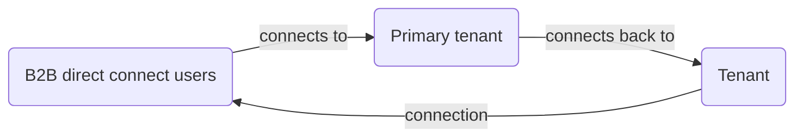
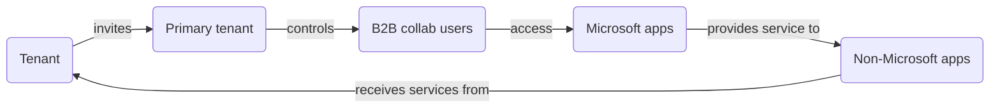

## B2B Direct Connect Constraint

Currently, B2B direct connect works only with Teams Connect shared channels.

For more information, see [B2B direct connect overview](https://example.com).

## B2B Collaboration

To enable users across tenants to collaborate, you can use [Microsoft Entra B2B collaboration](https://example.com). B2B collaboration is a feature within External Identities that lets you invite guest users to collaborate with your organization. Once the external user has redeemed their invitation or completed sign-up, they're represented in your tenant as a user object. With B2B collaboration, you can securely share your company's applications and services with external users, while maintaining control over your own corporate data.

### Primary Constraints with B2B Collaboration

- Administrators must invite users using the B2B invitation process or build an onboarding experience using the [B2B collaboration invitation manager](https://example.com).
- Administrators might have to synchronize users using custom scripts.
- Depending on automatic redemption settings, users might need to accept a consent prompt and follow a redemption process in each tenant.
- By default, users are of type external guest, which has different permissions than external member and might not be the desired user experience.

