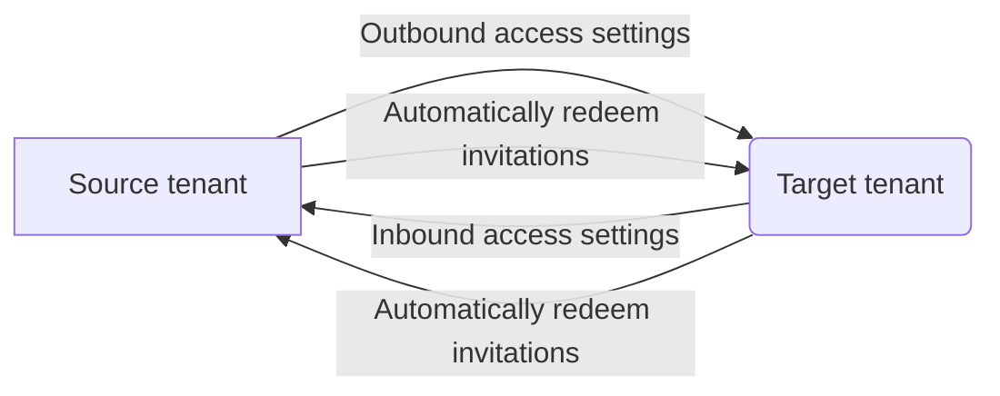

## Contextual Settings Overview

- When users are created in a target tenant using cross-tenant synchronization.
- When users are added to a resource tenant using B2B collaboration.
- When users access resources in a resource tenant using B2B direct connect.

The following table shows how this setting compares when enabled for these scenarios:

| Item                              | Cross-tenant synchronization | B2B collaboration | B2B direct connect |
|-----------------------------------|------------------------------|-------------------|---------------------|
| Automatic redemption setting      | Required                     | Optional          | Optional            |
| Users receive a B2B collaboration invitation email | No                           | No                | N/A                 |
| Users must accept a consent prompt | No                           | No                | No                  |
| Users receive a B2B collaboration notification email | No                           | Yes               | N/A                 |

This setting doesn't impact application consent experiences. For more information, see [Consent experience for applications in Microsoft Entra ID](https://microsoft.com). This setting isn't supported for organizations across different Microsoft cloud environments, such as Azure commercial and Azure Government.

### When is consent prompt suppressed?

The automatic redemption setting will only suppress the consent prompt and invitation email if both the home/source tenant (outbound) and resource/target tenant (inbound) checks this setting.

#### Process Flow

The following table shows the consent prompt behavior for source tenant users when the automatic redemption setting is checked for different cross-tenant access setting combinations.