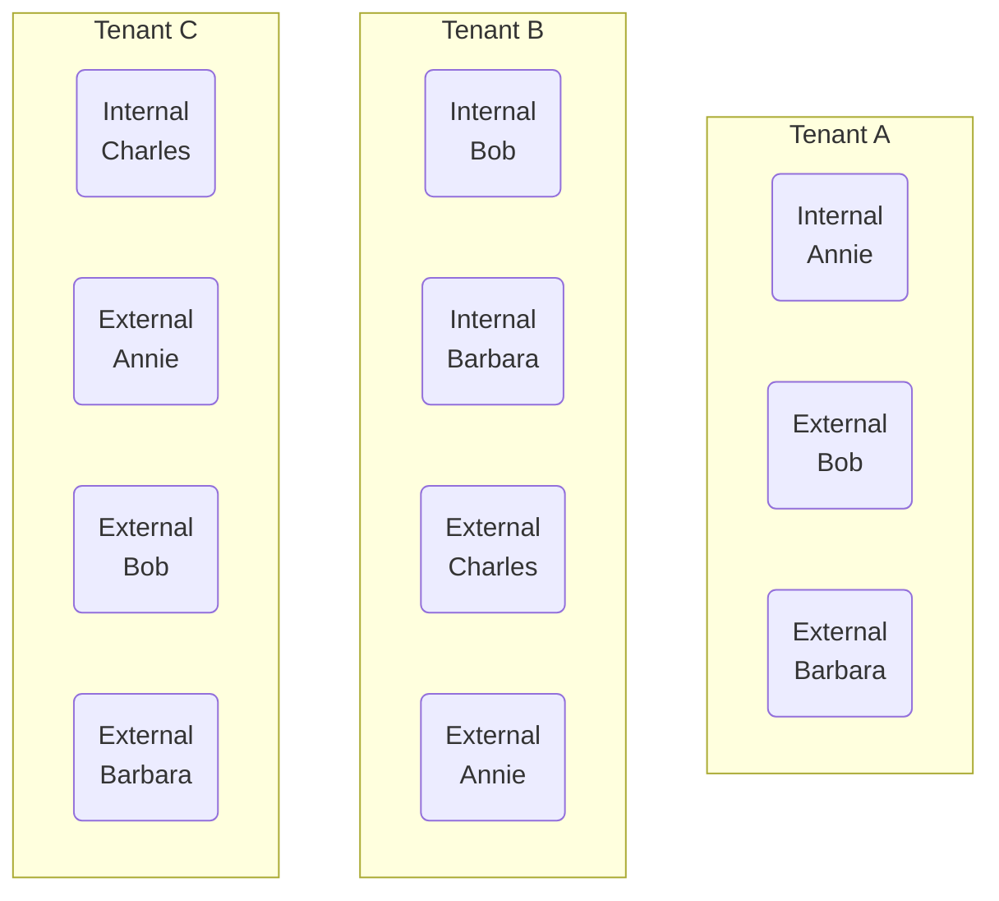

## Collaborating Across Multiple Tenants

For people search to succeed, while scoped to local tenant boundaries, the entire collaborating user set must be represented within the scope of each multitenant organization tenant A, B, and C, in the form of either internal or B2B identities.

### Example of Individual Users in Each Tenant
Depending on your organization’s needs, the collaborating user set may contain a subset of collaborating employees, or eventually all employees.

## Sharing your users

One of the simpler ways to achieve a collaborating user set in each multitenant organization tenant is for each tenant administrator to define their user contribution and synchronization them outbound. Tenant administrators on the receiving end should accept the shared users inbound.

- Administrator A contributes or shares Annie
- Administrator B contributes or shares Bob and Barbara
- Administrator C contributes or shares Charles