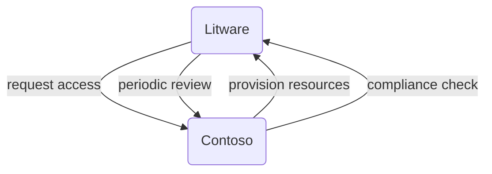

## Just-in-time

While the scenarios discussed so far cover collaboration within an organization, there are cases where cross-organization collaboration is vital. This could be in the context of joint ventures or organizations of independent legal entities. By employing connected organizations and entitlement management, you can define policies for accessing resources across connected organizations and enable users to request access to the resources they need.

## Joint ventures

Consider Contoso and Litware, separate organizations engaged in a multi-year joint venture. They need to collaborate closely. Administrators at Contoso have defined access packages containing the resources required by Litware users. When a new Litware employee needs access to Contoso's resources, they can request access to the access package. Upon approval, they are provisioned with the necessary resources. Access can be time-limited and subject to periodic review to ensure compliance with Contoso's governance requirements.

The diagram above shows how two organizations can collaborate in a just-in-time manner using connected organizations and entitlement management.