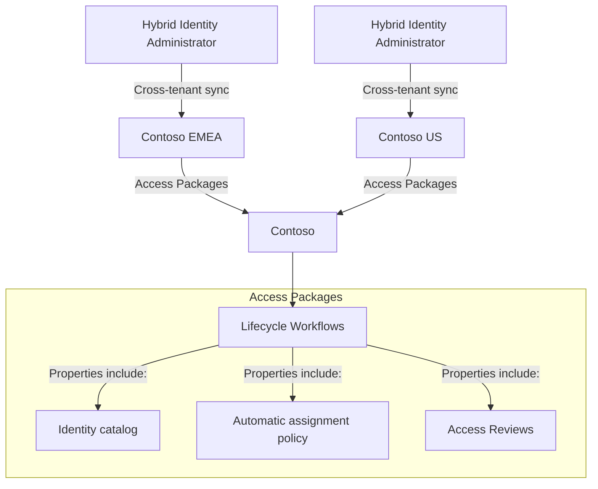

## Cross-Tenant Synchronization

### Overview

This supported topology for cross-tenant synchronization is one of many in Microsoft Entra ID. Tenants can be a source tenant, a target tenant, or both. In the following sections, learn how cross-tenant synchronization and Microsoft Entra ID Governance features address several scenarios.

### Diagram Explanation

### Manage Employee Lifecycles Across Tenants

**Cross-tenant synchronization in Microsoft Entra ID** automates creating, updating, and deleting B2B collaboration users.

When organizations create, or provision, a B2B collaboration user in a tenant, user access depends partly on how the organization provisioned them: Guest or Member user type. When you select user type, consider the various [properties of a Microsoft Entra B2B collaboration user](#). The Member user type is suitable if users are part of the larger multitenant organization and need member-level access to resources in the organizational tenants. Microsoft Teams requires the Member user type in [multitenant organizations](#).

By default, cross-tenant synchronization includes commonly used attributes on the user object in Microsoft Entra ID. The following diagram illustrates this scenario.