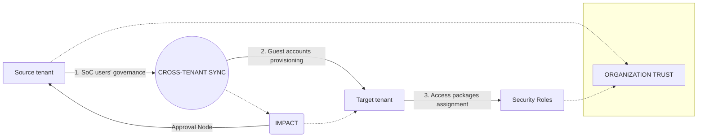

## Cross-tenant access policies

External identities cross-tenant access settings manage how you collaborate with other Microsoft Entra organizations through B2B collaboration. These settings determine both the level of inbound access users in external Microsoft Entra organizations have to your resources, and the level of outbound access your users have to external organizations.

## Deployment topologies

This section describes how you can use tools such as cross-tenant synchronization, entitlement management, cross-tenant access policies, and conditional access together. In both topologies, the target tenant admin has full control over access to resources in the target tenant. They differ in who initiates provisioning and deprovisioning.

### Topology 1

In topology 1, the source tenant configures entitlement management and cross-tenant synchronization to provision users into the target tenant. Then, the administrator of the target tenant configures access packages to provide access to the necessary directory roles, group, and app roles in the target tenant.

#### Steps to configure topology 1
Step 1: Source tenant admin configures entitlement management and sync settings.
Step 2: Synchronize user accounts to the target tenant.
Step 3: Target tenant admin assigns access packages to provisioned users.