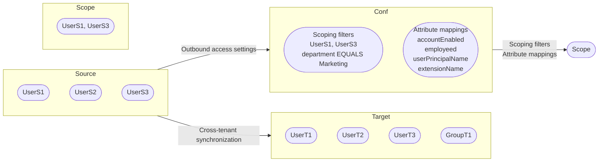

## Configure cross-tenant synchronization

Article • 03/11/2024

This article describes the steps to configure cross-tenant synchronization using the Microsoft Entra admin center. When configured, Microsoft Entra ID automatically provisions and de-provisions B2B users in your target tenant. For important details on what this service does, how it works, and frequently asked questions, see Automate user provisioning and deprovisioning to SaaS applications with Microsoft Entra ID.

### Learning objectives

By the end of this article, you'll be able to:

- Create B2B users in your target tenant
- Remove B2B users in your target tenant
- Keep user attributes synchronized between your source and target tenants

### Prerequisites

Source tenant