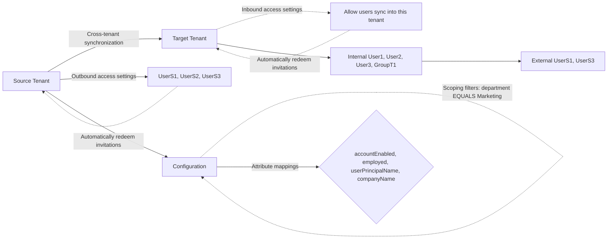

## Configure cross-tenant synchronization using PowerShell or Microsoft Graph API

Article • 04/23/2024

This article describes the key steps to configure cross-tenant synchronization using Microsoft Graph PowerShell or Microsoft Graph API. When configured, Microsoft Entra ID automatically provisions and de-provisions B2B users in your target tenant. For detailed steps using the Microsoft Entra admin center, see [Configure cross-tenant synchronization](#).

### Diagram Overview

### Prerequisites

Source tenant

- Microsoft Entra ID P1 or P2 license. For more information, see [License](#)
- Security Administrator role to configure cross-tenant access settings.
- Hybrid Identity Administrator role to configure cross-tenant synchronization.