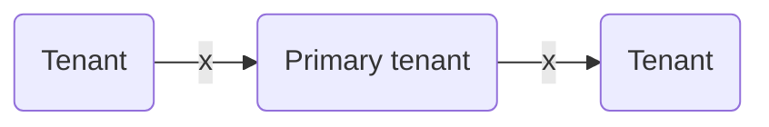

## Multitenant challenges

Your organization may have recently acquired a new company, merged with another company, or restructured based on newly formed business units. If you have disparate identity management systems, it might be challenging for users in different tenants to access resources and collaborate.

The following diagram shows how users in other tenants might not be able to access applications across tenants in your organization.

As your organization evolves, your IT team must adapt to meet the changing needs. This often includes integrating with an existing tenant or forming a new one. Regardless of how the identity infrastructure is managed, it's critical that users have a seamless experience accessing resources and collaborating. Today, you may be using custom scripts or on-premises solutions to bring the tenants together to provide a seamless experience across tenants.

## B2B direct connect

To enable users across tenants to collaborate in Teams Connect shared channels, you can use Microsoft Entra B2B direct connect. B2B direct connect is a feature of External Identities that lets you set up a mutual trust relationship with another Microsoft Entra organization for seamless collaboration in Teams. When the trust is established, the B2B direct connect user has single sign-on access using credentials from their home tenant.