2024 Qualified Default Investment Alternative (QDIA) Notice
===

Important information about the QDIA for the Enterprise 401(k) Plan (the "Plan")
===

You are receiving this notice because you have the opportunity to participate in the Plan. You have the right under the Plan to direct the investment of your contributions to any of the Plan's available investment options. Any contributions for which you do not provide investment direction will be invested in the Plan's designated default option (the "Plan Designated Fund") based upon your date of birth.

The Vanguard Target Retirement Trusts I are currently the Plan Designated Fund and are described in more detail below. Upon participation in the Plan, you have the right under the Plan to direct the investment of your account, including the right to transfer out of the Plan Designated Fund to any of the Plan's available investment options. Unless you provide alternative direction, your contributions and/or the portion of your account that is currently invested in the Plan Designated Fund will continue to be invested in this option.

It is important to keep in mind that the Vanguard Target Retirement Trusts I are designed to become more conservative as they near their target retirement date. The investment risk of each target date trust changes over time as its asset allocation changes. The trusts are subject to the volatility of the financial markets, including that of equity and fixed-income investments in the U.S. and abroad, and may be subject to risks associated with investing in high- yield, small-cap, and foreign securities. Principal invested is not guaranteed at any time, including at or after the target dates.

The Vanguard Target Retirement Trusts I used as the Plan Designated Fund are based on the assumption that the participant will retire at age 65. This retirement date has been selected by Vanguard. The following table indicates into which trust your contributions are being directed, based on your date of birth.

| Vanguard Target Retirement Trusts I: Potential Investment Option | Date of Birth (DOB) Range | Asset Mix\* |
| - | - | - |
| Vanguard Target Retirement Income Trust \| \*\* | Before 1953 or missing or invalid date of birth | 30% stocks, 70% bonds |
| Vanguard Target Retirement 2020 Trust \| | 1953-1957 | 40% stocks, 60% bonds |
| Vanguard Target Retirement 2025 Trust \| | 1958-1962 | 54% stocks, 46% bonds |
| Vanguard Target Retirement 2030 Trust \| | 1963-1967 | 63% stocks, 37% bonds |
| Vanguard Target Retirement 2035 Trust \| | 1968-1972 | 70% stocks, 30% bonds |
| Vanguard Target Retirement 2040 Trust I | 1973-1977 | 78% stocks, 22% bonds |
| Vanguard Target Retirement 2045 Trust I | 1978-1982 | 85% stocks, 15% bonds |
| Vanguard Target Retirement 2050 Trust \| \*\*\* | 1983-1987 | 90% stocks, 10% bonds |
| Vanguard Target Retirement 2055 Trust \| \*\*\* | 1988-1992 | 90% stocks, 10% bonds |
| Vanguard Target Retirement 2060 Trust \| \*\*\* | 1993-1997 | 90% stocks, 10% bonds |
| Vanguard Target Retirement 2065 Trust \| \*\*\* | 1998-2002 | 90% stocks, 10% bonds |
| Vanguard Target Retirement 2070 Trust \| \*\*\* | 2003 and later | 90% stocks, 10% bonds |

Trust DOB range and asset mix provided by Vanguard.

\* Allocation targets for each trust. Allocations for the date-specific trusts will shift their emphasis (from stocks to bonds) over time based on an assumed retirement age of 65.

\*\* The Income Trust is designed for retirees who will be making withdrawals.

\*\*\* The target allocations of the trusts dated 2050 through 2070 are currently identical; however, as time passes, each trust will gradually shift its emphasis toward a more conservative allocation, depending on the maturity date of the trust.

```mermaid
graph TD;
    A("Vanguard Target Retirement Income Trust") --> B("Date of Birth: Before 1953 or missing or invalid date of birth");
    A --> C("Asset Mix: 30% stocks, 70% bonds");
    
    D("Vanguard Target Retirement 2020 Trust") --> E("Date of Birth: 1953-1957");
    D --> F("Asset Mix: 40% stocks, 60% bonds");
    
    G("Vanguard Target Retirement 2025 Trust") --> H("Date of Birth: 1958-1962");
    G --> I("Asset Mix: 54% stocks, 46% bonds");
    
    J("Vanguard Target Retirement 2030 Trust") --> K("Date of Birth: 1963-1967");
    J --> L("Asset Mix: 63% stocks, 37% bonds");
    
    M("Vanguard Target Retirement 2035 Trust") --> N("Date of Birth: 1968-1972");
    M --> O("Asset Mix: 70% stocks, 30% bonds");
    
    P("Vanguard Target Retirement 2040 Trust I") --> Q("Date of Birth: 1973-1977");
    P --> R("Asset Mix: 78% stocks, 22% bonds");
    
    S("Vanguard Target Retirement 2045 Trust I") --> T("Date of Birth: 1978-1982");
    S --> U("Asset Mix: 85% stocks, 15% bonds");
    
    V("Vanguard Target Retirement 2050 Trust") --> W("Date of Birth: 1983-1987");
    V --> X("Asset Mix: 90% stocks, 10% bonds");
    
    Y("Vanguard Target Retirement 2055 Trust") --> Z("Date of Birth: 1988-1992");
    Y --> AA("Asset Mix: 90% stocks, 10% bonds");
    
    BB("Vanguard Target Retirement 2060 Trust") --> CC("Date of Birth: 1993-1997");
    BB --> DD("Asset Mix: 90% stocks, 10% bonds");
    
    EE("Vanguard Target Retirement 2065 Trust") --> FF("Date of Birth: 1998-2002");
    EE --> GG("Asset Mix: 90% stocks, 10% bonds");
    
    HH("Vanguard Target Retirement 2070 Trust") --> II("Date of Birth: 2003 and later");
    HH --> JJ("Asset Mix: 90% stocks, 10% bonds");
```

