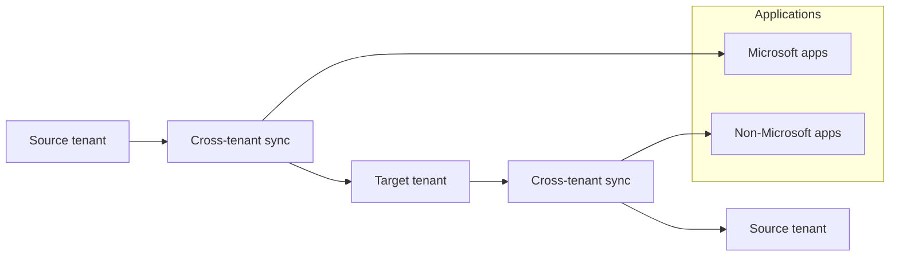

For more information, see [B2B collaboration overview](#).

Cross-tenant synchronization
===

If you want users to have a more seamless collaboration experience across tenants, you can use cross-tenant synchronization. Cross-tenant synchronization is a one-way synchronization service in Microsoft Entra ID that automates creating, updating, and deleting B2B collaboration users across tenants in an organization. Cross-tenant synchronization builds on the B2B collaboration functionality and utilizes existing B2B cross-tenant access settings. Users are represented in the target tenant as a B2B collaboration user object.

Here are the primary benefits with using cross-tenant synchronization:

· Automatically create B2B collaboration users within your organization and provide them access to the applications they need, without creating and maintaining custom scripts.

· Improve the user experience and ensure that users can access resources, without receiving an invitation email and having to accept a consent prompt in each tenant.

· Automatically update users and remove them when they leave the organization.

Here are the primary constraints with using cross-tenant synchronization across multiple tenants:

· Doesn't enhance the current Teams or Microsoft 365 experiences. Synchronized users will have the same cross-tenant Teams and Microsoft 365 experiences available to any other B2B collaboration user.

· Doesn't synchronize groups, devices, or contacts.

For more information, see [What is cross-tenant synchronization](#).