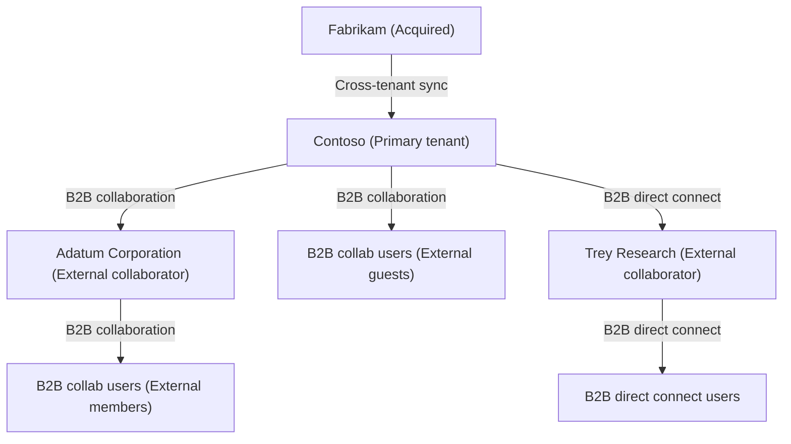

<!-- PageHeader="Org-to-org external" -->

<figure>
Org internal B2B collaboration Adatum Corporation (External collaborator) B2B collab users (External members) B2B collab users (External guests) Fabrikam (Acquired) Cross-tenant sync Contoso (Primary tenant) B2B direct connect B2B direct connect users Trey Research + (External collaborator)
</figure>

# Terminology

To better understand multitenant organization scenario related Microsoft Entra capabilities, you can refer back to the following list of terms.

[] Expand table

| Term | Definition |
| - | - |
| tenant | An instance of Microsoft Entra ID. |
| organization | The top level of a business hierarchy. |
| multitenant organization | An organization that has more than one instance of Microsoft Entra ID, as well as a capability to group those instances in Microsoft Entra ID. |
| creator tenant | The tenant that created the multitenant organization. |
| owner tenant | A tenant with the owner role. Initially, the creator tenant. |
| added tenant | A tenant that was added by an owner tenant. |
| joiner tenant | A tenant that is joining the multitenant organization. |
| join request | A joiner or added tenant submits a join request to join the multitenant organization. |
| pending tenant | A tenant that was added by an owner but that hasn't yet joined. |
| active tenant | A tenant that created or joined the multitenant organization. |