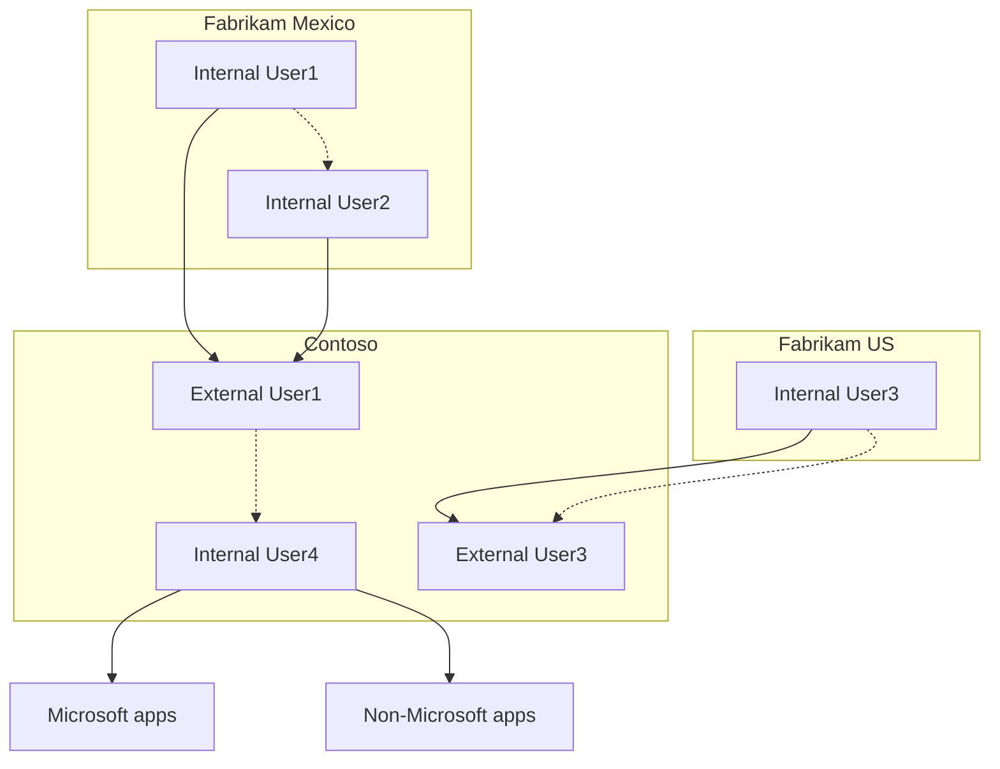

<figure>

The illustration depicts the cross-tenant synchronization process among multiple Microsoft Entra tenants. It includes the following tenants: Fabrikam Mexico, Fabrikam US, Contoso. The illustration shows internal and external users, as well as the integration with Microsoft and non-Microsoft apps.

</figure>

# Who should use?

- Organizations that own multiple Microsoft Entra tenants and want to streamline intra-organization cross-tenant application access.
- Cross-tenant synchronization is not currently suitable for use across organizational boundaries.

# Benefits

With cross-tenant synchronization, you can do the following:

- Automatically create B2B collaboration users within your organization and provide them access to the applications they need, without creating and maintaining custom scripts.
- Improve the user experience and ensure that users can access resources, without receiving an invitation email and having to accept a consent prompt in each tenant.
- Automatically update users and remove them when they leave the organization.

# Teams and Microsoft 365

Users created by cross-tenant synchronization will have the same experience when accessing Microsoft Teams and other Microsoft 365 services as B2B collaboration users created through a manual invitation. If your organization uses shared channels, please see the known issues document for additional details. Over time, the member userType will be used by the various Microsoft 365 services to provide differentiated end user experiences for users in a multitenant organization.