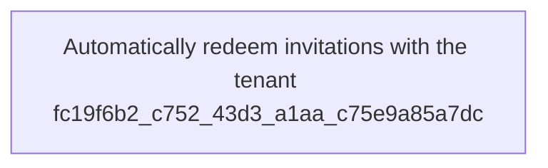

Home > Contoso | External Identities > External Identities | Cross-tenant access settings > Inbound access settings - Contoso ===

X ✅ B2B collaboration B2B direct connect Trust settings Cross-tenant sync

Enabling this will allow the admin of the specified (source) tenant to sync objects into this (target) tenant.

Disabling this will block admins of the source tenant from syncing objects into the target tenant but will not remove currently synced objects. We recommend that this setting should only be used between tenants that are part of the same organization. ✅ V Allow users sync into this tenant

Save

Discard

To configure this setting using Microsoft Graph, see the Update crossTenantIdentitySyncPolicyPartner API. For more information, see Configure cross- tenant synchronization.

## Automatic redemption setting

The automatic redemption setting is an inbound and outbound organizational trust setting to automatically redeem invitations so users don't have to accept the consent prompt the first time they access the resource/target tenant. This setting is a check box with the following name:

- Automatically redeem invitations with the tenant <tenant>

<figure>
[Figure depicting the automatic redemption setting. A checkbox is used to enable or disable the automatic redemption of invitations. The checkbox is labeled "Automatically redeem invitations with the tenant fc19f6b2-c752-43d3-a1aa-c75e9a85a7dc."]
</figure>

### Compare setting for different scenarios

The automatic redemption setting applies to cross-tenant synchronization, B2B collaboration, and B2B direct connect in the following situations:

\+ ❌