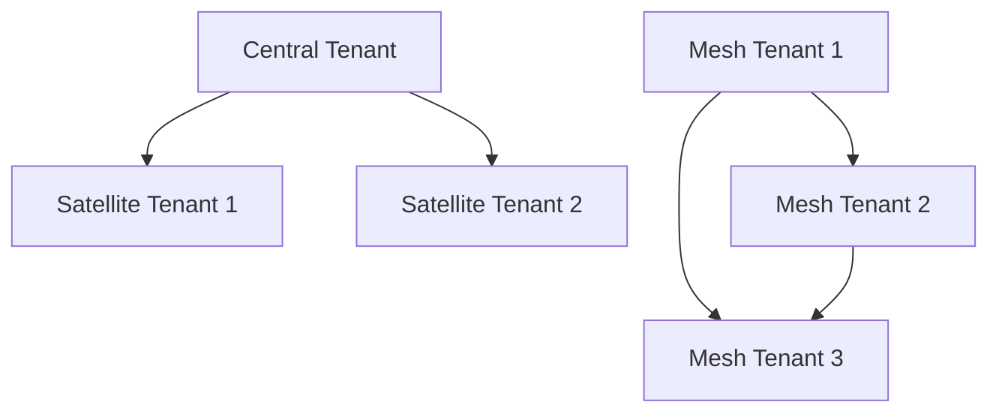
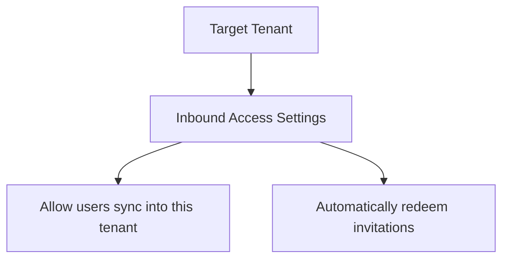

# Step 1: Define how to structure the tenants in your organization

Cross-tenant synchronization provides a flexible solution to enable collaboration, but every organization is different. For example, you might have a central tenant, satellite tenants, or sort of a mesh of tenants. Cross-tenant synchronization supports any of these topologies. For more information, see Topologies for cross-tenant synchronization.

A diagram illustrating possible tenant structures.

# Step 2: Enable cross-tenant synchronization in the target tenants

In the target tenant where users are created, navigate to the Cross-tenant access settings page. Here you enable cross-tenant synchronization and the B2B automatic redemption settings by selecting the respective check boxes. For more information, see Configure cross-tenant synchronization.

Diagram showing the "Target tenant" with settings for "Inbound access" that have "Allow users sync into this tenant" and "Automatically redeem invitations" checked.

# Step 3: Enable cross-tenant synchronization in the source tenants

In any source tenant, navigate to the Cross-tenant access settings page and enable the B2B automatic redemption feature. Next, you use the Cross-tenant synchronization page to set up a cross-tenant synchronization job and specify:

* Which users you want to synchronize
* What attributes you want to include
* Any transformations

For anyone that has used Microsoft Entra ID to provision identities into a SaaS application, this experience will be familiar. Once you have synchronization configured,