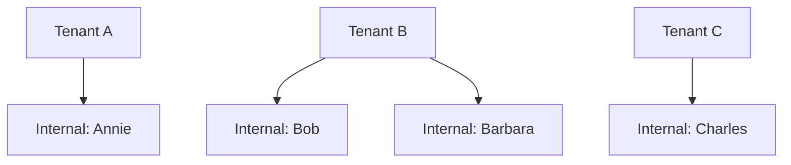
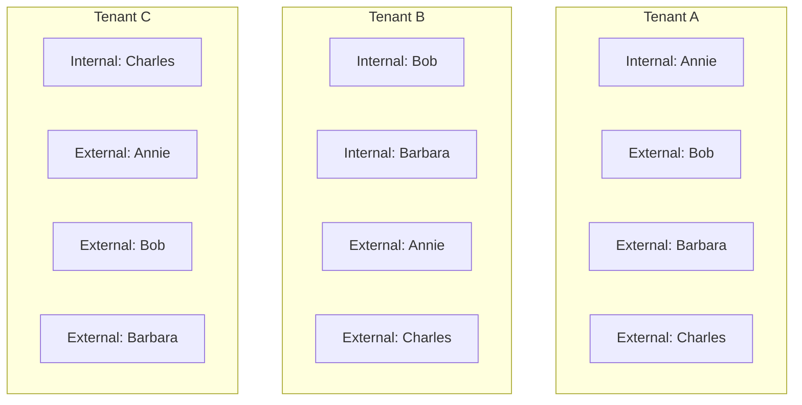

<figure>

"Diagram depicting tenants A, B, and C each containing internal and B2B identities: Tenant A has an internal user, Annie; Tenant B has internal users Bob and Barbara; Tenant C has an internal user, Charles."

</figure>

For people search to succeed, while scoped to local tenant boundaries, the entire collaborating user set must be represented within the scope of each multitenant organization tenant A, B, and C, in the form of either internal or B2B identities.

<figure>

"Diagram showing tenants A, B, and C with both internal and external users. Tenant A now has an internal user Annie and external users Bob, Barbara, and Charles. Tenant B has internal users Bob and Barbara and external users Annie and Charles. Tenant C has an internal user Charles and external users Annie, Bob, and Barbara."

</figure>

Depending on your organization's needs, the collaborating user set may contain a subset of collaborating employees, or eventually all employees.

# Sharing your users

One of the simpler ways to achieve a collaborating user set in each multitenant organization tenant is for each tenant administrator to define their user contribution and synchronization outbound. Tenant administrators on the receiving end should accept the shared users inbound.

* Administrator A contributes or shares Annie
* Administrator B contributes or shares Bob and Barbara
* Administrator C contributes or shares Charles