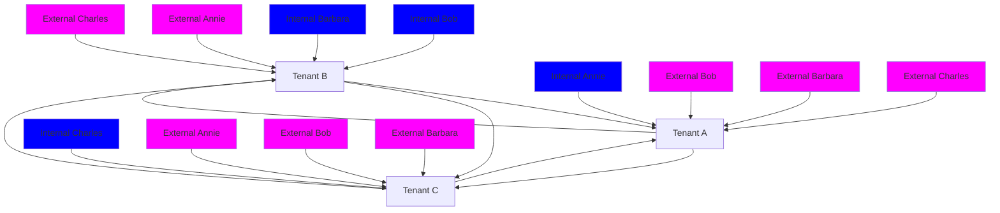

<figure>

Diagram depicting the relationship and user synchronization across three tenants in a multitenant organization. The tenants are Tenant A, Tenant B, and Tenant C, with users classified as Internal or External.

</figure>

Microsoft 365 admin center facilitates orchestration of such a collaborating user set across multitenant organization tenants. For more information, see Synchronize users in multitenant organizations in Microsoft 365.

Alternatively, pair-wise configuration of inbound and outbound cross-tenant synchronization can be used to orchestrate such collating user set across multitenant organization tenants. For more information, see What is a cross-tenant synchronization.

# B2B member users

To ensure a seamless collaboration experience across the multitenant organization in new Microsoft Teams, B2B identities are provisioned as B2B users of Member userType.

Expand table

| User synchronization method | Default userType property |
| - | - |
| Synchronize users in multitenant organizations in Microsoft 365 | Member Remains Guest, if the B2B identity already existed as Guest |
| Cross-tenant synchronization in Microsoft Entra ID | Member Remains Guest, if the B2B identity already existed as Guest |