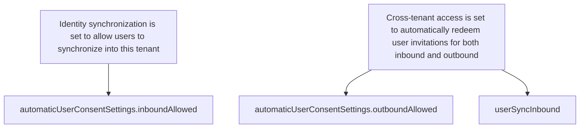

Finally, in terms of interpretation of template property values, any template property value of null has no effect on the corresponding property value in the targeted cross-tenant access settings, while a defined template property value causes the corresponding property value in the targeted cross-tenant access settings to be amended in accordance with the template. The following table illustrates how template property values are being applied to corresponding cross-tenant access setting values.

**Table**: Illustrates how template property values are applied to corresponding cross-tenant access setting values.

| Template Value | Initial Partner Settings Value (Before joining multitenant org) | Final Partner Settings Value (After joining multitenant org) |
| - | - | - |
| null | <Partner Settings Value> | <Partner Settings Value> |
| <Template Value> | <any value> | <Template Value> |

# Policy templates used by Microsoft 365 admin center

When a multitenant organization is formed in Microsoft 365 admin center, an administrator agrees to the following multitenant organization template settings:

· Identity synchronization is set to allow users to synchronize into this tenant

· Cross-tenant access is set to automatically redeem user invitations for both inbound and outbound

This is achieved by setting the corresponding three template property values to true:

· automaticUserConsentSettings.inboundAllowed

· automaticUserConsentSettings.outboundAllowed

· userSyncInbound

For more information, see Join or leave a multitenant organization in Microsoft 365.

# Cross-tenant access settings at time of multitenant organization disassembly

Currently, there's no equivalent policy template feature supporting the disassembly of a multitenant organization. When a partner tenant leaves the multitenant organization, each tenant administrator must re-examine and amend accordingly the cross-tenant access settings for the partner tenant that left the multitenant organization.